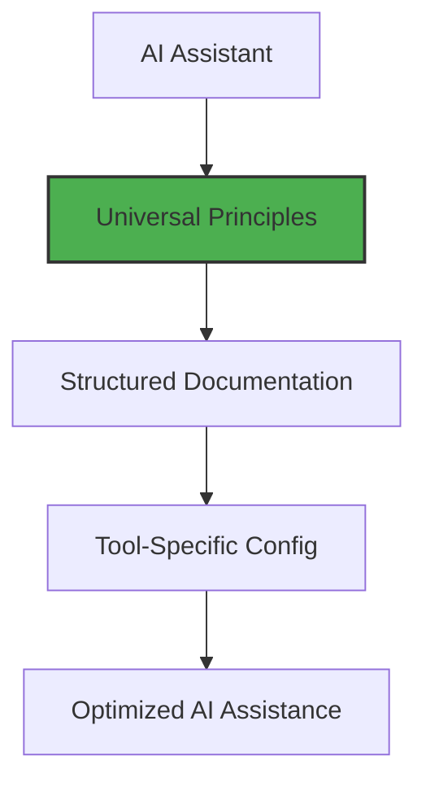

# AI Assistants Integration

<!-- AI-METADATA:
category: reference
stack: general
complexity: basic
dependencies: [universal-principles.md]
-->

## 🎯 Quick Summary

Universal context engineering principles and tool-specific setup guides for AI-assisted development in the Kodix monorepo.

## 📋 Overview

This directory establishes **universal principles** for AI-assisted development that work across all AI tools, while providing minimal tool-specific configuration differences.

### 🚨 Critical First Step

Before implementing any AI assistant, ensure it loads **[Priority Policies](../rules/PRIORITY-POLICIES.md)** first. These time-stamped policies override all other rules and must be followed by all AI assistants. Use the **[Validation Checklist](./VALIDATION-CHECKLIST.md)** to verify proper policy loading.

### Core Philosophy

> **Universal Context Engineering**: Core knowledge lives in structured `/docs` files - tool-specific differences are minimal configuration only.

This approach ensures:

- **Tool Independence**: Not locked into specific AI assistants
- **Knowledge Preservation**: Context survives tool changes and updates
- **Team Consistency**: Same knowledge base for all team members
- **Future-Proofing**: Ready for new AI tools as they emerge

## 🧠 Universal Principles

### **[Universal AI Assistant Principles](./universal-principles.md)** ⭐ **READ FIRST**

Core principles that apply to ALL AI assistants:

- **Documentation-First Context**: Structured `.md` files provide superior context
- **Context Hierarchy**: How all AI tools prioritize information
- **Progressive Disclosure**: Layered information architecture
- **Cross-Tool Compatibility**: Patterns that work everywhere

### **[Universal Setup Patterns](./setup-patterns.md)** 🔧 **IMPLEMENTATION GUIDE**

Standard setup and integration patterns:

- **Universal Setup Pattern**: Step-by-step integration process
- **Configuration Templates**: Standard config for any AI tool
- **[Rules Integration Guide](./rules-integration-guide.md)**: How to sync universal rules with a new assistant.
- **Cross-Tool Migration**: Moving between AI assistants
- **Quality Validation**: Ensuring consistent performance

### Key Universal Concepts

1. **Memory & Context**: All AI assistants work better with structured documentation
2. **Reference Resolution**: Universal `@file` syntax for linking documents
3. **Semantic Markers**: Consistent markers for AI comprehension
4. **Context Engineering**: Strategies that transcend specific tools

## 🔧 Tool-Specific Configurations

Each AI assistant requires minimal tool-specific setup:

### Currently Supported

- **[Cursor](./cursor/)** - Memory prioritization and `.mdc` configuration
- **[Claude Code](./claude-code/)** - Terminal-based AI with `CLAUDE.md` optimization
- **[Gemini CLI](./gemini-cli/)** - Google's development assistant

### Planned Support

- **Copilot** - GitHub's AI assistant
- **Windsurf** - Alternative AI coding assistant

## 🎯 What Goes Where

### Universal Documentation (`/docs/`)

**All core knowledge belongs here:**

- Architecture decisions and patterns
- Feature specifications and implementation guides
- Code examples and best practices
- Business logic and project knowledge
- Development workflows and standards

### Tool-Specific (`/docs/ai-assistants/[tool]/`)

**Only minimal differences:**

- Installation and setup instructions
- Tool-specific configuration files
- Unique features or limitations
- Integration validation steps

## 📊 Integration Pattern

Every AI assistant follows this universal pattern:

### Standard Setup Process

1. **Read Universal Principles**: Understand core concepts
2. **Reference Universal Docs**: Point AI to `/docs` directory
3. **Apply Tool-Specific Config**: Minimal customization
4. **Validate Integration**: Ensure proper context loading

## 🚀 Quick Start

### For New AI Tools

1. **Study Universal Principles**: Read `universal-principles.md`
2. **Create Tool Directory**: `docs/ai-assistants/[tool-name]/`
3. **Follow Integration Pattern**: Use standard setup template
4. **Document Only Differences**: Avoid duplicating universal knowledge

### For Existing Tools

1. **Validate Universal Compliance**: Check against principles
2. **Remove Duplicated Knowledge**: Keep only tool-specific content
3. **Update References**: Point to universal documentation
4. **Test Cross-Tool Consistency**: Ensure same quality

## 📚 Key Resources

### Universal Documentation

- **[Universal Principles](./universal-principles.md)** - Core concepts for all AI tools
- **[Rules Integration Guide](./rules-integration-guide.md)** - How to sync universal rules with a new assistant
- **[VALIDATION CHECKLIST](./VALIDATION-CHECKLIST.md)** - Ensure policies are loaded
- **[Context Engineering](../context-engineering/)** - Advanced strategies
- **[Documentation Patterns](../context-engineering/standards/)** - Writing standards

### Kodix-Specific Context

- **[Project Overview](../README.md)** - Complete project documentation
- **[Architecture](../architecture/)** - Technical implementation guides
- **[SubApps](../subapps/)** - Feature-specific documentation

## 🎯 Best Practices

### For Tool Integration

- **Minimize Tool-Specific Content**: Keep universal knowledge in `/docs`
- **Reference Don't Duplicate**: Link to universal docs instead of copying
- **Focus on Setup**: Emphasize configuration and integration
- **Validate Consistency**: Ensure same quality across tools

### For Universal Documentation

- **Write Tool-Agnostic**: Don't assume specific AI features
- **Structure for AI**: Use semantic markers and clear hierarchy
- **Provide Rich Context**: Include examples and cross-references
- **Maintain Standards**: Follow established patterns

<!-- AI-RELATED: [universal-principles.md, context-engineering/README.md] -->
<!-- DEPENDS-ON: [universal-principles.md] -->
<!-- REQUIRED-BY: [all-ai-assistant-tools] -->
<!-- SEE-ALSO: [docs/README.md] -->
