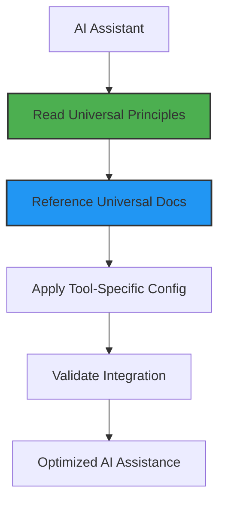

# Universal AI Assistant Setup Patterns

<!-- AI-METADATA:
category: guide
stack: general
complexity: basic
dependencies: [universal-principles.md]
-->

## 🎯 Quick Summary

Standard setup patterns and integration strategies that apply to all AI assistants when working with the Kodix monorepo.

## 📋 Overview

This document provides universal setup patterns that work across all AI assistants. These patterns ensure consistent, effective AI assistance regardless of which tool you're using.

### Core Setup Philosophy

> **Universal Configuration**: Use the same documentation and patterns across all AI tools, with minimal tool-specific customization.

## 🔧 Universal Setup Pattern

Every AI assistant follows this standard integration pattern:



### 1. Universal Documentation Reference

All AI assistants should reference the same core documentation:

```markdown
# Primary Documentation References

- **Project Overview**: @docs/README.md
- **Architecture**: @docs/architecture/
- **SubApps**: @docs/subapps/
- **Context Engineering**: @docs/context-engineering/
- **Development Workflow**: @docs/architecture/development-workflow.md
```

### 2. Standard Configuration Template

```markdown
# [AI Assistant Name] Configuration

## Universal Documentation Reference

- Primary: @docs/README.md
- Architecture: @docs/architecture/
- Context Engineering: @docs/context-engineering/
- Universal Principles: @docs/ai-assistants/universal-principles.md

## Tool-Specific Features

[Only unique capabilities here]

## Integration Validation

[How to verify proper setup]

## Optimization Tips

[Tool-specific performance enhancements]
```

## 🎯 Setup Checklist

For any AI assistant integration:

- [ ] **Read Universal Principles**: Understand core concepts
- [ ] **Reference Universal Docs**: Point AI to `/docs` directory
- [ ] **Minimal Tool Config**: Only configure unique features
- [ ] **Validate Context Loading**: Ensure docs are being used
- [ ] **Test Consistency**: Verify same quality across tools
- [ ] **Document Differences**: Record only tool-specific variations

## 🚀 Integration Strategies

### For Documentation-Based AI Tools

Tools that use structured documentation (Claude Code, etc.):

```markdown
# Configuration Pattern

## Primary Context

- Use centralized documentation reference
- Point to /docs/CLAUDE.md or equivalent
- Leverage universal documentation structure

## Tool-Specific Setup

- Configure file discovery patterns
- Set up reference resolution
- Enable context persistence
```

### For Memory-Based AI Tools

Tools that use memory systems (Cursor, etc.):

```markdown
# Configuration Pattern

## Memory Configuration

- Reference universal documentation
- Use structured memory patterns
- Maintain cross-session context

## Tool-Specific Setup

- Configure memory prioritization
- Set up workspace integration
- Enable persistent context
```

### For API-Based AI Tools

Tools that use API integration:

```markdown
# Configuration Pattern

## API Configuration

- Set up authentication
- Configure endpoints
- Enable tool permissions

## Documentation Integration

- Reference universal docs in prompts
- Use structured query patterns
- Maintain consistent context
```

## 📊 Universal vs Tool-Specific Features

| Aspect            | Universal                  | Tool-Specific             |
| ----------------- | -------------------------- | ------------------------- |
| **Documentation** | ✅ All tools use same docs | Configuration format only |
| **Context**       | ✅ Same knowledge base     | Loading mechanism varies  |
| **Patterns**      | ✅ Universal principles    | Implementation details    |
| **Setup**         | ✅ Standard checklist      | Installation steps        |
| **Validation**    | ✅ Same quality metrics    | Testing methods           |

## 🔄 Cross-Tool Migration

### Exporting Context

When switching between AI tools:

1. **Documentation Remains**: All context stays in `/docs`
2. **Export Tool Config**: Save tool-specific settings
3. **Map Capabilities**: Identify equivalent features
4. **Validate Quality**: Ensure same assistance level

### Import Process

1. **Study Universal Principles**: Understand core concepts
2. **Reference Same Docs**: Point to universal documentation
3. **Configure Tool Features**: Set up unique capabilities
4. **Validate Integration**: Test context loading
5. **Optimize Performance**: Fine-tune for specific tool

## 🎯 Quality Validation

### Universal Quality Metrics

All AI assistants should provide:

- **Consistent Responses**: Same quality across tools
- **Accurate Context**: Proper documentation understanding
- **Relevant Suggestions**: Appropriate to current task
- **Pattern Compliance**: Following established conventions

### Validation Tests

```markdown
# Standard Validation Prompts

## Context Understanding

"Please summarize the Kodix project architecture"

## Pattern Recognition

"What are the established tRPC patterns in this project?"

## Documentation Access

"Show me the SubApp development guidelines"

## Code Quality

"Review this code against project standards"
```

## 🚀 Best Practices

### For Setup

1. **Start with Universal**: Read universal principles first
2. **Reference Don't Duplicate**: Link to universal docs
3. **Minimize Tool Config**: Only configure unique features
4. **Validate Thoroughly**: Test all integration points
5. **Document Differences**: Record tool-specific variations

### For Maintenance

1. **Keep Universal Updated**: Maintain single source of truth
2. **Sync Tool Configs**: Update when universal docs change
3. **Test Regularly**: Validate integration quality
4. **Share Learnings**: Document new patterns discovered
5. **Optimize Continuously**: Improve based on usage

## 📚 Related Resources

- **[Universal AI Assistant Principles](./universal-principles.md)** - Core concepts
- **[Context Engineering](../context-engineering/)** - Advanced strategies
- **[Documentation Patterns](../context-engineering/standards/)** - Writing standards
- **[Kodix Architecture](../architecture/)** - Project patterns

<!-- AI-RELATED: [universal-principles.md, ../context-engineering/README.md] -->
<!-- DEPENDS-ON: [universal-principles.md] -->
<!-- REQUIRED-BY: [all-ai-assistant-integrations] -->
<!-- SEE-ALSO: [../README.md] -->
