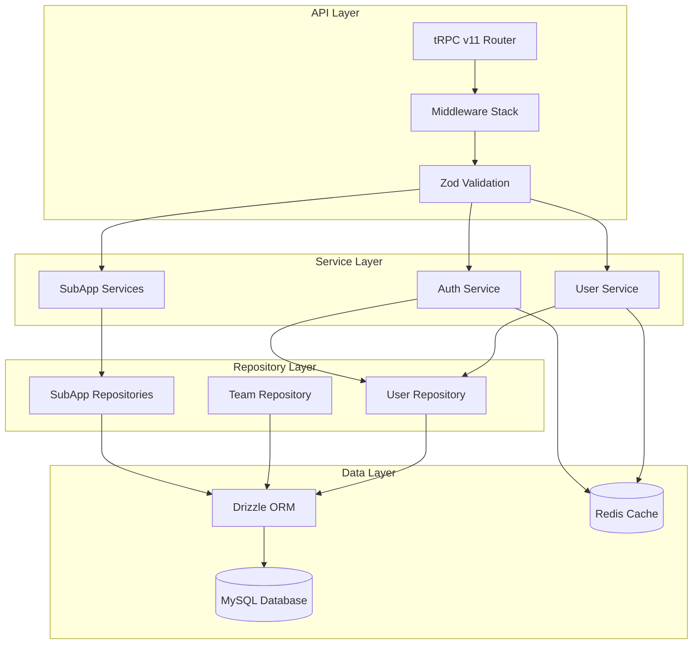

<!-- AI-METADATA:
<!-- AI-CONTEXT-PRIORITY: always-include="true" summary-threshold="low" -->category: architecture

complexity: basic
updated: 2025-07-12
claude-ready: true
phase: 4
priority: medium
token-optimized: true
audience: backend
ai-context-weight: important
last-ai-review: 2025-07-12
-->

# Backend Architecture

This section contains comprehensive backend architecture documentation, including API design patterns, service layer architecture, and data management strategies.

## 📁 Backend Documentation

### Backend Guide

<!-- AI-LINK: type="related" importance="medium" -->
<!-- AI-CONTEXT-REF: importance="medium" type="guide" -->

[Backend Guide](./../../../architecture/backend/../../../architecture/backend/backend-guide.md)

<!-- /AI-CONTEXT-REF -->
<!-- /AI-LINK -->

Comprehensive guide to backend development patterns and practices.

### [Service Layer Patterns](./service-layer-patterns.md)

Service layer architecture patterns and implementation guidelines.

### [Data Contracts and Boundaries](./data-contracts-and-boundaries.md)

Data modeling, API contracts, and service boundary definitions.

### <!-- AI-LINK: type="related" importance="medium" -->

<!-- AI-CONTEXT-REF: importance="medium" type="guide" -->

[tRPC Migration Guide](./trpc-migration-guide.md)

<!-- /AI-CONTEXT-REF -->
<!-- /AI-LINK -->

Guide for migrating to tRPC v11 and modern API patterns.

### [tRPC Patterns](./trpc-patterns.md)

Comprehensive patterns and best practices for tRPC v11 implementation.

## 🏗️ 🔍 🎯 Backend Architecture Overview

<!-- AI-COMPRESS: strategy="summary" max-tokens="150" -->

**Quick Summary**: Key points for rapid AI context understanding.

<!-- /AI-COMPRESS -->

### Core Principles

- **Type-Safe APIs**: tRPC v11 for end-to-end type safety
- **Service Layer Pattern**: Clear separation of concerns
- **Data Integrity**: Strong validation and error handling
- **Performance**: Optimized queries and caching strategies

### Technology Stack

- **API Framework**: tRPC v11 with TypeScript
- **ORM**: Drizzle ORM for type-safe database operations
- **Database**: MySQL for primary data storage
- **Caching**: Redis for session and query caching
- **Validation**: Zod schemas for runtime type validation

### Architecture Layers

## 🚀 Development Guidelines

### API Development

- Use tRPC v11 patterns for all API endpoints
- Implement proper authentication and authorization
- Follow service layer patterns for business logic
- Use Zod schemas for input validation

### Database Operations

- Use Drizzle ORM for all database interactions
- Implement proper error handling and transactions
- Follow repository pattern for data access
- Optimize queries for performance

### Service Architecture

- Maintain clear service boundaries
- Implement proper dependency injection
- Use repository pattern for data access
- Follow SOLID principles

## 📋 Best Practices

### Code Quality

- 100% TypeScript coverage
- Zero tolerance for `any` types
- Comprehensive error handling
- Unit and integration testing

### Performance

- Implement query optimization
- Use Redis caching effectively
- Monitor database performance
- Optimize API response times

### Security

- Validate all inputs with Zod
- Implement proper authentication
- Use parameterized queries
- Follow security best practices

---

**Maintained By**: Backend Development Team  
**Last Updated**: 2025-07-12  
**Review Cycle**: Monthly
