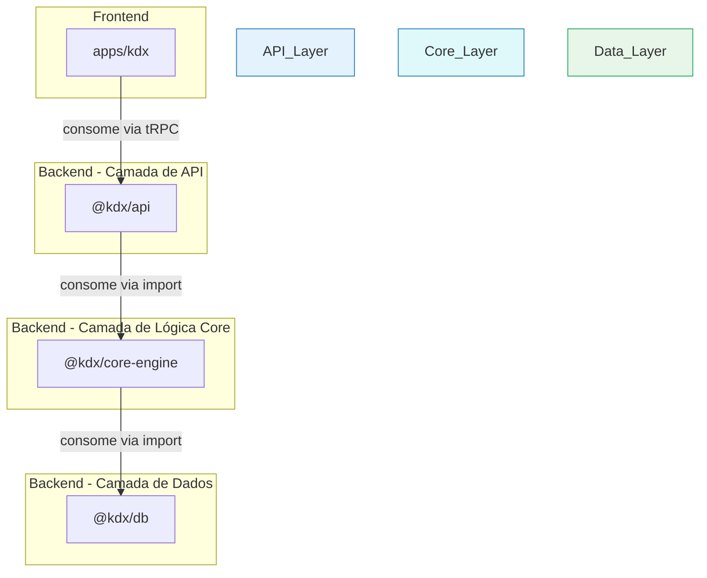

# Decisão Arquitetural: Estrutura de Pacote para o Core Engine

**Data:** 2025-07-01  
**Autor:** KodixAgent  
**Status:** ✅ Decidido

---

## 1. Contexto

Durante a implementação do `ConfigurationService`, uma peça central da lógica de negócio da plataforma, surgiu uma questão arquitetural fundamental:

**Onde este novo serviço deveria residir?**

Esta decisão impacta não apenas a organização do código atual, mas define o padrão para a evolução futura do backend do Kodix.

## 2. A Questão Central: Pacote Dedicado vs. Serviço em `@kdx/api`

Duas abordagens principais foram consideradas:

1.  **Opção A (Serviço em API):** Manter o padrão atual de adicionar novos serviços de negócio dentro do pacote `@kdx/api`, tratando-o como o "pacote de backend" monolítico.
2.  **Opção B (Pacote Dedicado):** Criar um novo pacote, `@kdx/core-engine`, para abrigar o `ConfigurationService` e futuras lógicas de negócio centrais, estabelecendo uma separação clara entre a lógica de negócio e a camada de API.

## 3. A Decisão

**Foi decidido seguir a Opção B: Criar o pacote dedicado `@kdx/core-engine`.**

## 4. Análise e Racional da Decisão

A decisão foi baseada em uma análise aprofundada que considerou os seguintes questionamentos e contrapontos.

### Questionamento 1: "O pacote `@kdx/api` não é, na prática, o nosso backend inteiro?"

**Resposta:** Sim, historicamente, `@kdx/api` tem funcionado como nosso principal "pacote de backend". No entanto, reconhecemos que este é um **problema arquitetural a ser corrigido**, e não um padrão a ser perpetuado. Continuar adicionando toda a lógica de negócio a ele levaria à criação de um **"God Package"**: um pacote monolítico, com baixa coesão e alta complexidade, dificultando a manutenção e a compreensão do sistema.

A criação do `@kdx/core-engine` é o **primeiro passo deliberado para desmembrar o "backend inteiro" em domínios lógicos e coesos**, melhorando a organização e a clareza.

### Questionamento 2: "Com os bundlers modernos e tree-shaking, a preocupação de depender de um pacote inteiro para usar apenas uma função não é mais relevante?"

**Resposta:** Este ponto é tecnicamente correto no que tange ao _tamanho do bundle de produção_. O tree-shaking otimizaria o código final. Contudo, a preocupação aqui não é sobre o _runtime_, mas sim sobre o **ambiente de desenvolvimento, a disciplina arquitetural e o custo cognitivo para os desenvolvedores.**

O problema principal é o **grafo de dependências do código-fonte** e as restrições que ele impõe:

1.  **Acoplamento Indesejado:** Se o `ConfigurationService` vivesse em `@kdx/api`, ele poderia facilmente (e talvez acidentalmente) importar um `TRPCError` ou qualquer outro utilitário específico da camada de API. Isso **contaminaria a lógica de negócio pura** com detalhes de implementação do protocolo de transporte.
2.  **Contrato de Dependência Explícito:** Ao isolar a lógica no `@kdx/core-engine`, que **não tem e não terá** dependências de servidor web (como `@trpc/server`), nós **forçamos** uma separação limpa. É uma salvaguarda arquitetural. Qualquer tentativa de importar algo da camada de API no `core-engine` resultará em um erro de compilação, prevenindo o acoplamento.
3.  **Clareza e Intenção:** A estrutura de pacotes agora comunica a arquitetura.
    - `@kdx/core-engine`: É o cérebro. Contém a lógica de negócio agnóstica a protocolos.
    - `@kdx/api`: É o adaptador. Sua única responsabilidade é expor a lógica do `core-engine` para o mundo exterior via tRPC.

## 5. Arquitetura Resultante

A nova arquitetura estabelece uma separação de responsabilidades muito mais clara:

## 6. Consequências e Próximos Passos

Esta decisão define o seguinte padrão para o futuro:

- **Toda nova lógica de negócio fundamental e reutilizável** (ex: sistema de permissões, motor de notificações) deve ser implementada como um serviço dentro do pacote `@kdx/core-engine`.
- **O pacote `@kdx/api`** evoluirá para se tornar uma camada de adaptação (Adapter/Façade) mais enxuta. Sua função primária é criar endpoints tRPC que chamam os serviços do `core-engine`.
- **Ferramentas futuras** (ex: CLIs, cron jobs) poderão consumir a lógica de negócio diretamente do `@kdx/core-engine` sem depender da complexidade do pacote `@kdx/api`.

Este documento deve ser referenciado em futuras discussões de arquitetura e serve como a base para a evolução contínua da estrutura do nosso backend.
