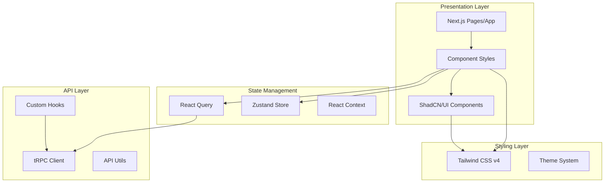

<!-- AI-METADATA:
<!-- AI-CONTEXT-PRIORITY: always-include="true" summary-threshold="low" -->category: architecture
complexity: basic
updated: 2025-07-12
claude-ready: true
phase: 4
priority: medium
token-optimized: true
audience: frontend
ai-context-weight: important
last-ai-review: 2025-07-12
-->

# Frontend Architecture

This section contains comprehensive frontend architecture documentation, including React patterns, Next.js implementation, and UI/UX design principles.

## 📁 Frontend Documentation

### <!-- AI-LINK: type="related" importance="medium" -->
<!-- AI-CONTEXT-REF: importance="medium" type="guide" -->
[Frontend Guide](./../../../architecture/frontend/../../../architecture/frontend/frontend-guide.md)
<!-- /AI-CONTEXT-REF -->
<!-- /AI-LINK -->
Comprehensive guide to frontend development patterns and practices.

## 🏗️ 🔍 🎯 Frontend Architecture Overview

<!-- AI-COMPRESS: strategy="summary" max-tokens="150" -->
**Quick Summary**: Key points for rapid AI context understanding.
<!-- /AI-COMPRESS -->
### Core Principles
- **Component-Based**: Reusable React components with TypeScript
- **Type Safety**: End-to-end type safety with tRPC integration
- **Performance**: Optimized rendering and bundle management
- **User Experience**: Responsive design and accessibility

### Technology Stack
- **Framework**: React 19 with Next.js 15 App Router
- **Language**: TypeScript with strict mode
- **Styling**: Tailwind CSS v4 + ShadCN/UI components
- **State Management**: React Query + Zustand for complex state
- **API Integration**: tRPC v11 client with React Query

### Architecture Layers

## 🚀 Development Guidelines

### Component Development
- Use functional components with hooks
- Implement proper TypeScript typing
- Follow composition over inheritance
- Create reusable component patterns

### State Management
- Use React Query for server state
- Use Zustand for complex client state
- Use React Context for app-wide settings
- Minimize state complexity

### Styling Patterns
- Use Tailwind CSS v4 utility classes
- Leverage ShadCN/UI component system
- Implement responsive design patterns
- Follow accessibility guidelines

### Performance Optimization
- Implement proper code splitting
- Use React.memo for expensive components
- Optimize re-renders with proper dependencies
- Leverage Next.js optimization features

## 📋 Best Practices

### Code Quality
- 100% TypeScript coverage
- Comprehensive component testing
- ESLint compliance with Kodix rules
- Proper error boundary implementation

### User Experience
- Responsive design for all screen sizes
- Accessibility compliance (WCAG 2.1)
- Loading states and error handling
- Smooth animations and transitions

### Performance
- Bundle size optimization
- Image optimization with Next.js
- Lazy loading for non-critical components
- Efficient API data fetching

### Testing
- Component unit testing with React Testing Library
- Integration testing for user flows
- Visual regression testing
- Performance testing

## 🔧 Development Workflow

### Component Creation
1. Define component interface with TypeScript
2. Implement component with proper hooks
3. Add styling with Tailwind CSS
4. Write comprehensive tests
5. Document component usage

### API Integration
1. Define tRPC procedures
2. Create custom hooks for data fetching
3. Implement proper error handling
4. Add loading and error states
5. Optimize for performance

---

**Maintained By**: Frontend Development Team  
**Last Updated**: 2025-07-12  
**Review Cycle**: Monthly
