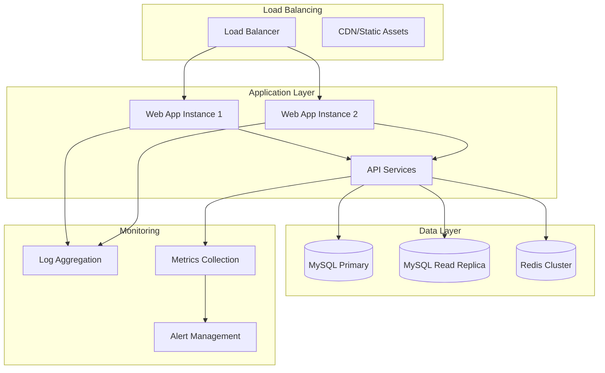

<!-- AI-METADATA:
<!-- AI-CONTEXT-PRIORITY: always-include="true" summary-threshold="low" -->category: architecture
complexity: intermediate
updated: 2025-07-12
claude-ready: true
phase: 4
priority: medium
token-optimized: true
audience: fullstack
ai-context-weight: important
last-ai-review: 2025-07-12
-->

# Infrastructure Architecture

This section contains infrastructure architecture documentation, including deployment patterns, database design, caching strategies, and monitoring approaches.

## 📁 Infrastructure Documentation

*Note: This section is being developed as part of Phase 2 enhancement. Content will be migrated from the main infrastructure section and enhanced with architectural perspectives.*

## 🏗️ 🔍 🎯 Infrastructure Architecture Overview

<!-- AI-COMPRESS: strategy="summary" max-tokens="150" -->
**Quick Summary**: Key points for rapid AI context understanding.
<!-- /AI-COMPRESS -->
### Core Principles
- **Scalability**: Designed for horizontal and vertical scaling
- **Reliability**: High availability and fault tolerance
- **Performance**: Optimized for speed and efficiency
- **Security**: Defense in depth and zero-trust principles

### Technology Stack
- **Runtime**: Node.js 22 with TypeScript
- **Database**: MySQL with connection pooling
- **Caching**: Redis for session and query caching
- **Containerization**: Docker for consistent deployments
- **Orchestration**: Docker Compose for local development

### Infrastructure Layers



## 🏗️ 🏗️ Architecture Components

### Application Infrastructure
- **Web Application**: Next.js application with SSR/SSG
- **API Services**: tRPC v11 with service layer architecture
- **Background Jobs**: Queue-based processing for async tasks
- **File Storage**: Optimized storage for static assets

### Data Infrastructure
- **Primary Database**: MySQL for transactional data
- **Read Replicas**: MySQL read replicas for query optimization
- **Cache Layer**: Redis for session management and query caching
- **Search**: Full-text search capabilities for content

### Deployment Infrastructure
- **Containerization**: Docker containers for all services
- **Orchestration**: Container orchestration for scaling
- **CI/CD**: Automated testing and deployment pipelines
- **Environment Management**: Dev, staging, and production environments

## 🚀 Development Guidelines

### Local Development
- Use Docker Compose for consistent local environment
- Implement hot reloading for development efficiency
- Provide easy setup scripts and documentation
- Mirror production configuration where possible

### Database Architecture
- Design for multi-tenancy with team isolation
- Implement proper indexing strategies
- Use migrations for schema management
- Plan for horizontal scaling needs

### Caching Strategy
- Implement multi-level caching (browser, CDN, application, database)
- Use Redis for session management and query caching
- Design cache invalidation strategies
- Monitor cache hit rates and performance

### Monitoring & Observability
- Implement comprehensive logging strategies
- Monitor application and infrastructure metrics
- Set up alerting for critical issues
- Provide debugging and troubleshooting tools

## 📋 Best Practices

### Performance
- Optimize database queries and indexing
- Implement efficient caching strategies
- Use connection pooling for database access
- Monitor and optimize resource usage

### Security
- Implement network security and isolation
- Use secure configuration management
- Regular security updates and patches
- Monitor for security threats and vulnerabilities

### Reliability
- Design for high availability and fault tolerance
- Implement backup and disaster recovery procedures
- Use health checks and auto-recovery mechanisms
- Plan for capacity and load management

### Scalability
- Design for horizontal scaling
- Use stateless application architecture
- Implement proper load balancing
- Plan for database scaling strategies

## 🔧 Implementation Patterns

### Database Connection Pattern
<!-- AI-CODE-BLOCK: typescript-example -->
<!-- AI-CODE-OPTIMIZATION: language="typescript" context="kodix-patterns" -->
```typescript
// AI-CONTEXT: TypeScript implementation following Kodix patterns
// Database connection with pooling
export const createDatabaseConnection = () => {
  return drizzle(mysql({
    host: process.env.DB_HOST,
    user: process.env.DB_USER,
    password: process.env.DB_PASSWORD,
    database: process.env.DB_NAME,
    connectionLimit: 10,
    acquireTimeout: 60000,
    timeout: 60000
  }));
};
```
<!-- /AI-CODE-OPTIMIZATION -->
<!-- /AI-CODE-BLOCK -->

### Caching Pattern
<!-- AI-CODE-BLOCK: typescript-example -->
<!-- AI-CODE-OPTIMIZATION: language="typescript" context="kodix-patterns" -->
```typescript
// AI-CONTEXT: TypeScript implementation following Kodix patterns
// Redis caching pattern
export const cacheService = {
  async get<T>(key: string): Promise<T | null> {
    const cached = await redis.get(key);
    return cached ? JSON.parse(cached) : null;
  },
  
  async set(key: string, value: any, ttl = 3600): Promise<void> {
    await redis.setex(key, ttl, JSON.stringify(value));
  }
};
```
<!-- /AI-CODE-OPTIMIZATION -->
<!-- /AI-CODE-BLOCK -->

---

**Maintained By**: Infrastructure Architecture Team  
**Last Updated**: 2025-07-12  
**Review Cycle**: Monthly  
**Status**: Under Development
