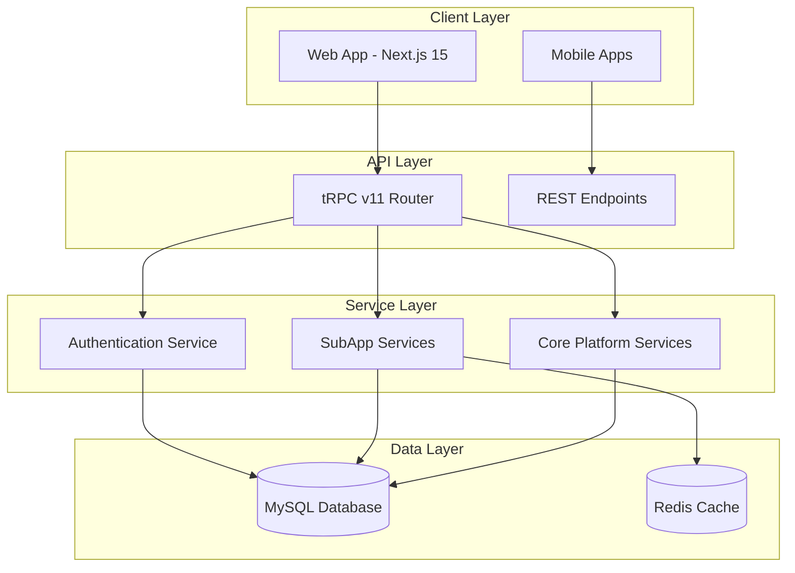

<!-- AI-METADATA:
<!-- AI-CONTEXT-PRIORITY: always-include="true" summary-threshold="low" -->category: architecture
complexity: basic
updated: 2025-07-12
claude-ready: true
phase: 4
priority: medium
token-optimized: true
audience: fullstack
ai-context-weight: important
last-ai-review: 2025-07-12
-->

# Platform Architecture

This section contains high-level platform architecture documentation, including system overview, technology stack decisions, and platform-wide design patterns.

## 📁 Platform Documentation

### [Configuration Model](./configuration-model.md)
Platform configuration architecture and management patterns.

### [Internationalization (i18n)](./internationalization-i18n.md)
Multi-language support architecture and implementation patterns.

## 🔍 🎯 Platform Overview

<!-- AI-COMPRESS: strategy="summary" max-tokens="150" -->
**Quick Summary**: Key points for rapid AI context understanding.
<!-- /AI-COMPRESS -->
### Core Architecture Principles
- **Modular Design**: SubApp-based feature isolation
- **Type-Safe APIs**: tRPC v11 with full TypeScript integration
- **Modern Stack**: React 19, Next.js 15, and latest ecosystem tools
- **Performance-First**: Optimized for scale and user experience

### Technology Stack
- **Frontend**: React 19 + Next.js 15 + TypeScript
- **Backend**: tRPC v11 + Drizzle ORM + MySQL
- **Styling**: Tailwind CSS v4 + ShadCN/UI
- **Infrastructure**: Docker + Redis + Node.js 22

### System Components
- **Web Application**: Main Next.js application with SubApps
- **Mobile Applications**: Independent React Native applications
- **API Layer**: tRPC v11 for type-safe API communication
- **Data Layer**: MySQL with Redis caching
- **Authentication**: Centralized auth with multi-tenancy

## 🏗️ Platform Structure

## 🚀 Getting Started

### For Architects
1. Review platform architecture principles
2. Understand technology stack decisions
3. Study configuration and i18n patterns
4. Review SubApp integration patterns

### For Developers
1. Understand platform structure and components
2. Review API integration patterns
3. Follow configuration management guidelines
4. Implement i18n requirements

---

**Maintained By**: Platform Architecture Team  
**Last Updated**: 2025-07-12  
**Review Cycle**: Quarterly
