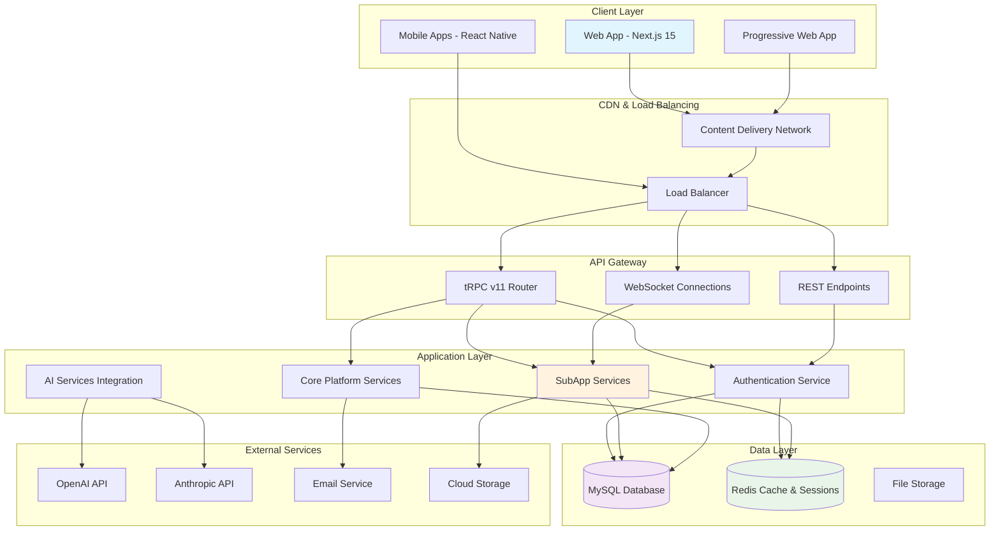
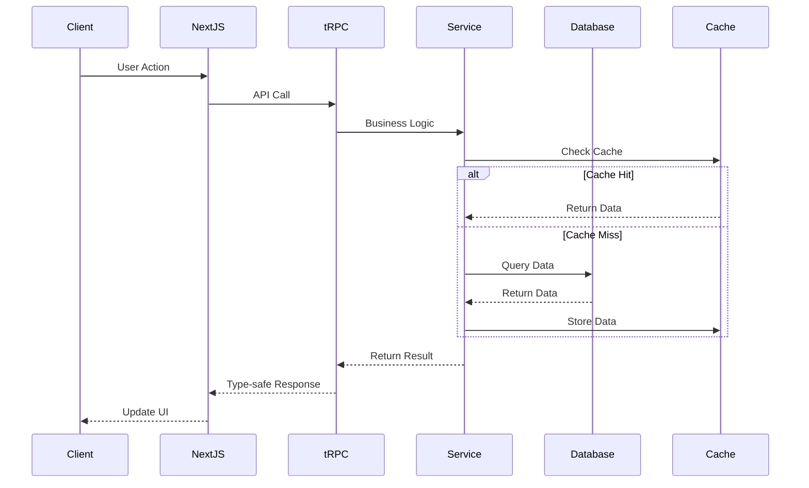
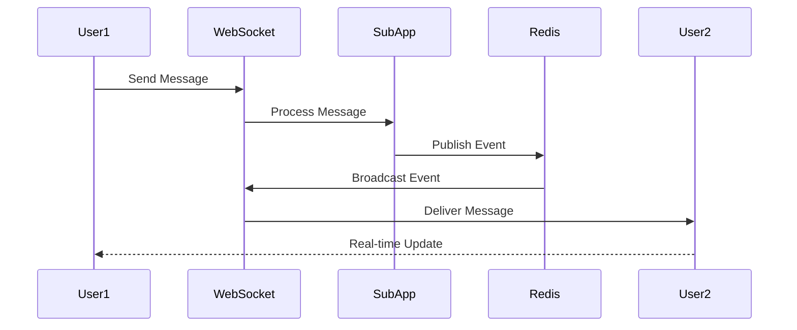

<!-- AI-METADATA:
<!-- AI-CONTEXT-PRIORITY: always-include="true" summary-threshold="low" -->category: architecture
complexity: intermediate
updated: 2025-07-12
claude-ready: true
phase: 4
priority: medium
token-optimized: true
audience: fullstack
ai-context-weight: important
last-ai-review: 2025-07-12
-->

# Kodix Platform System Architecture

## 🏗️ 📋 High-Level Architecture

The Kodix platform is designed as a modern, scalable SaaS platform with modular SubApp architecture, supporting multi-tenancy, real-time features, and AI integration.



## 🏗️ System Components

### Client Layer

#### Web Application (Next.js 15)
- **Technology**: React 19 + Next.js 15 with App Router
- **Features**: Server-side rendering, static generation, client-side routing
- **SubApps**: AI Studio, Chat, Calendar, Todo, Cupom, Kodix Care
- **Authentication**: Session-based authentication with JWT tokens
- **State Management**: React Query + Zustand for complex state

#### Mobile Applications
- **Technology**: React Native for iOS and Android
- **API Integration**: RESTful APIs generated from tRPC procedures
- **Features**: Native platform integration, offline capabilities
- **Synchronization**: Real-time sync with web platform

### API Layer

#### tRPC v11 Router
- **Purpose**: Type-safe API layer for web applications
- **Features**: End-to-end type safety, automatic validation, optimistic updates
- **Architecture**: Procedure-based routing with middleware support
- **Integration**: React Query for client-side caching and state management

#### REST Endpoints
- **Purpose**: Mobile API and third-party integrations
- **Generation**: Automatically generated from tRPC procedures
- **Authentication**: JWT token-based authentication
- **Documentation**: OpenAPI specification for external consumers

#### WebSocket Connections
- **Purpose**: Real-time features (chat, notifications, live updates)
- **Technology**: Socket.io for reliable real-time communication
- **Features**: Room-based messaging, presence indicators, typing indicators
- **Scaling**: Redis adapter for multi-instance scaling

### Application Layer

#### Authentication Service
<!-- AI-CODE-BLOCK: typescript-example -->
<!-- AI-CODE-OPTIMIZATION: language="typescript" context="kodix-patterns" -->
```typescript
// AI-CONTEXT: TypeScript implementation following Kodix patterns
interface AuthService {
  // User authentication
  signIn(credentials: LoginCredentials): Promise<AuthResult>;
  signOut(sessionId: string): Promise<void>;
  
  // Session management
  validateSession(token: string): Promise<User | null>;
  refreshToken(refreshToken: string): Promise<AuthResult>;
  
  // Multi-tenancy
  getUserTeams(userId: string): Promise<Team[]>;
  switchTeam(userId: string, teamId: string): Promise<void>;
}
```
<!-- /AI-CODE-OPTIMIZATION -->
<!-- /AI-CODE-BLOCK -->

#### Core Platform Services
<!-- AI-CODE-BLOCK: typescript-example -->
<!-- AI-CODE-OPTIMIZATION: language="typescript" context="kodix-patterns" -->
```typescript
// AI-CONTEXT: TypeScript implementation following Kodix patterns
interface CoreServices {
  userService: UserManagementService;
  teamService: TeamManagementService;
  permissionService: PermissionService;
  notificationService: NotificationService;
  configurationService: ConfigurationService;
}
```
<!-- /AI-CODE-OPTIMIZATION -->
<!-- /AI-CODE-BLOCK -->

#### SubApp Services
Each SubApp has its own service layer with defined interfaces:

<!-- AI-CODE-BLOCK: typescript-example -->
<!-- AI-CODE-OPTIMIZATION: language="typescript" context="kodix-patterns" -->
```typescript
// AI-CONTEXT: TypeScript implementation following Kodix patterns
interface SubAppService {
  // Service identification
  name: string;
  version: string;
  
  // Core methods
  initialize(config: SubAppConfig): Promise<void>;
  getRoutes(): RouteDefinition[];
  getPermissions(): Permission[];
  
  // Inter-SubApp communication
  sendMessage(targetSubApp: string, message: any): Promise<void>;
  handleMessage(message: SubAppMessage): Promise<void>;
}
```
<!-- /AI-CODE-OPTIMIZATION -->
<!-- /AI-CODE-BLOCK -->

### Data Layer

#### MySQL Database
- **Purpose**: Primary data storage with ACID compliance
- **Schema**: Multi-tenant schema with team-based isolation
- **ORM**: Drizzle ORM for type-safe database operations
- **Features**: Transactions, foreign keys, indexing, migrations

#### Redis Cache & Sessions
- **Session Storage**: User sessions and authentication tokens
- **Caching**: Query results, computed data, temporary storage
- **Real-time**: Pub/sub for WebSocket scaling and real-time features
- **Features**: Expiration, persistence, clustering support

#### File Storage
- **Static Assets**: Images, documents, user uploads
- **CDN Integration**: Content delivery network for global distribution
- **Security**: Access control and signed URLs
- **Optimization**: Image processing and compression

## 🔄 Data Flow Patterns

### Request Flow (Web Application)


### Real-time Communication Flow


## 🏗️ 🧩 SubApp Architecture

### SubApp Structure
```
SubApp/
├── frontend/
│   ├── components/     # React components
│   ├── hooks/         # Custom hooks
│   ├── pages/         # Next.js pages
│   └── types/         # TypeScript types
├── backend/
│   ├── routers/       # tRPC routers
│   ├── services/      # Business logic
│   ├── repositories/ # Data access
│   └── schemas/       # Zod schemas
└── shared/
    ├── types/         # Shared types
    ├── utils/         # Utilities
    └── config/        # Configuration
```

### SubApp Communication
<!-- AI-CODE-BLOCK: typescript-example -->
<!-- AI-CODE-OPTIMIZATION: language="typescript" context="kodix-patterns" -->
```typescript
// AI-CONTEXT: TypeScript implementation following Kodix patterns
// Inter-SubApp messaging
interface SubAppMessage {
  from: string;
  to: string;
  type: string;
  payload: any;
  timestamp: Date;
}

// Event-driven architecture
export const subAppEventBus = {
  emit(event: SubAppMessage): void;
  subscribe(eventType: string, handler: Function): void;
  unsubscribe(eventType: string, handler: Function): void;
};
```
<!-- /AI-CODE-OPTIMIZATION -->
<!-- /AI-CODE-BLOCK -->

## 🏗️ 🔐 Security Architecture

### Authentication & Authorization
- **Multi-factor Authentication**: TOTP and SMS-based 2FA
- **Session Management**: Secure session handling with Redis
- **Permission System**: Role-based access control (RBAC)
- **API Security**: Rate limiting, input validation, CORS protection

### Data Security
- **Encryption**: Data encryption at rest and in transit
- **Multi-tenancy**: Strict data isolation between teams
- **Audit Logging**: Comprehensive audit trail for compliance
- **Backup & Recovery**: Automated backups with point-in-time recovery

## 🏗️ 📊 Performance Architecture

### Caching Strategy
<!-- AI-CODE-BLOCK: typescript-example -->
<!-- AI-CODE-OPTIMIZATION: language="typescript" context="kodix-patterns" -->
```typescript
// AI-CONTEXT: TypeScript implementation following Kodix patterns
// Multi-level caching
interface CacheStrategy {
  browser: BrowserCache;     // Client-side caching
  cdn: CDNCache;            // Edge caching
  application: RedisCache;   // Application-level caching
  database: QueryCache;      // Database query caching
}
```
<!-- /AI-CODE-OPTIMIZATION -->
<!-- /AI-CODE-BLOCK -->

### Optimization Techniques
- **Code Splitting**: Route-based and component-based splitting
- **Image Optimization**: Next.js Image component with WebP support
- **Bundle Optimization**: Tree shaking and minification
- **Database Optimization**: Query optimization and indexing

## 🚀 Scalability Considerations

### Horizontal Scaling
- **Stateless Services**: All services designed to be stateless
- **Load Balancing**: Request distribution across multiple instances
- **Database Scaling**: Read replicas and connection pooling
- **Cache Scaling**: Redis clustering for distributed caching

### Monitoring & Observability
<!-- AI-CODE-BLOCK: typescript-example -->
<!-- AI-CODE-OPTIMIZATION: language="typescript" context="kodix-patterns" -->
```typescript
// AI-CONTEXT: TypeScript implementation following Kodix patterns
interface MonitoringStack {
  metrics: ApplicationMetrics;
  logging: StructuredLogging;
  tracing: DistributedTracing;
  alerting: AlertManagement;
  dashboards: MetricsDashboards;
}
```
<!-- /AI-CODE-OPTIMIZATION -->
<!-- /AI-CODE-BLOCK -->

## 🔧 Development & Deployment

### Development Environment
- **Docker Compose**: Local development environment
- **Hot Reloading**: Fast development feedback
- **Type Checking**: Real-time TypeScript validation
- **Testing**: Unit, integration, and E2E testing

### Production Deployment
- **Containerization**: Docker containers for all services
- **Orchestration**: Container orchestration for scaling
- **CI/CD**: Automated testing and deployment
- **Blue-Green Deployment**: Zero-downtime deployments

---

**System Architecture Version**: 2.0  
**Last Updated**: 2025-07-12  
**Review Cycle**: Monthly  
**Next Review**: 2025-08-12
