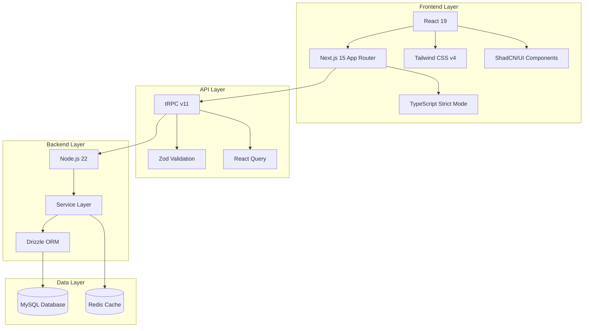

<!-- AI-METADATA:
<!-- AI-CONTEXT-PRIORITY: always-include="true" summary-threshold="low" -->category: architecture
complexity: intermediate
updated: 2025-07-12
claude-ready: true
phase: 4
priority: medium
token-optimized: true
audience: fullstack
ai-context-weight: important
last-ai-review: 2025-07-12
-->

# Kodix Technology Stack Architecture

## 🔍 📋 Stack Overview

<!-- AI-COMPRESS: strategy="summary" max-tokens="150" -->
**Quick Summary**: Key points for rapid AI context understanding.
<!-- /AI-COMPRESS -->
The Kodix platform is built on a modern, type-safe technology stack designed for scalability, developer productivity, and maintainability.

### Core Technologies
- **Frontend**: React 19 + Next.js 15 + TypeScript
- **Backend**: tRPC v11 + Drizzle ORM + MySQL
- **Styling**: Tailwind CSS v4 + ShadCN/UI
- **Infrastructure**: Docker + Redis + Node.js 22
- **Development**: pnpm + ESLint + Zod validation

## 🏗️ 🏗️ Architecture Layers



## 🛠️ Technology Decisions & Rationale

### Frontend Stack

#### React 19
**Why React 19:**
- **Server Components**: Improved performance with RSC
- **Concurrent Features**: Better user experience with concurrent rendering
- **Type Safety**: Excellent TypeScript integration
- **Ecosystem**: Largest ecosystem with proven enterprise adoption
- **Team Expertise**: Strong team knowledge and experience

**Key Features Used:**
- Server Components for performance optimization
- Concurrent rendering for smooth user interactions
- Suspense for data loading and code splitting
- New hooks for state management and side effects

#### Next.js 15 App Router
**Why Next.js 15:**
- **App Router**: Modern routing with layouts and nested routes
- **SSR/SSG**: Server-side rendering and static site generation
- **Performance**: Built-in optimizations for images, fonts, and scripts
- **Developer Experience**: Excellent development experience with hot reloading
- **Production Ready**: Battle-tested for large-scale applications

**Key Features Used:**
- App Router for modern routing patterns
- Server Actions for form handling and mutations
- Middleware for authentication and request processing
- Image optimization for performance
- Built-in SEO and meta tag management

#### TypeScript Strict Mode
**Why TypeScript:**
- **Type Safety**: Catch errors at compile time
- **Developer Experience**: Excellent IDE support and autocompletion
- **Refactoring**: Safe refactoring with confidence
- **Documentation**: Types serve as documentation
- **Team Productivity**: Reduces runtime errors and debugging time

**Configuration:**
```json
{
  "compilerOptions": {
    "strict": true,
    "noUncheckedIndexedAccess": true,
    "exactOptionalPropertyTypes": true
  }
}
```

#### Tailwind CSS v4 + ShadCN/UI
**Why Tailwind CSS:**
- **Utility-First**: Rapid UI development
- **Performance**: Small bundle size with purging
- **Consistency**: Design system constraints
- **Developer Experience**: Great IDE support and documentation

**Why ShadCN/UI:**
- **Accessibility**: Built on Radix UI for accessibility
- **Customization**: Fully customizable components
- **TypeScript**: First-class TypeScript support
- **Quality**: High-quality, production-ready components

### Backend Stack

#### tRPC v11
**Why tRPC:**
- **Type Safety**: End-to-end type safety from API to UI
- **Developer Experience**: No code generation required
- **Performance**: Efficient serialization and small bundle size
- **Integration**: Excellent React Query integration
- **Modern**: Built for modern TypeScript applications

**Key Features Used:**
<!-- AI-CODE-BLOCK: typescript-example -->
<!-- AI-CODE-OPTIMIZATION: language="typescript" context="kodix-patterns" -->
```typescript
// AI-CONTEXT: TypeScript implementation following Kodix patterns
// Type-safe API calls
const { data } = trpc.user.getAll.useQuery({
  teamId: user.teamId
});

// Type-safe mutations
const createUser = trpc.user.create.useMutation();
```
<!-- /AI-CODE-OPTIMIZATION -->
<!-- /AI-CODE-BLOCK -->

#### Drizzle ORM
**Why Drizzle:**
- **Type Safety**: Full TypeScript integration with excellent inference
- **Performance**: Lightweight with minimal runtime overhead
- **SQL-Like**: Close to SQL syntax for complex queries
- **Migration System**: Robust migration system
- **Developer Experience**: Excellent TypeScript support

**Key Features Used:**
<!-- AI-CODE-BLOCK: typescript-example -->
<!-- AI-CODE-OPTIMIZATION: language="typescript" context="kodix-patterns" -->
```typescript
// AI-CONTEXT: TypeScript implementation following Kodix patterns
// Type-safe database queries
const users = await db
  .select()
  .from(userTable)
  .where(eq(userTable.teamId, teamId));
```
<!-- /AI-CODE-OPTIMIZATION -->
<!-- /AI-CODE-BLOCK -->

#### MySQL + Redis
**Why MySQL:**
- **Reliability**: Proven reliability for ACID transactions
- **Performance**: Excellent performance for relational data
- **Ecosystem**: Rich ecosystem and tooling
- **Team Expertise**: Strong team knowledge
- **Scaling**: Well-understood scaling patterns

**Why Redis:**
- **Performance**: In-memory caching for fast data access
- **Session Management**: Reliable session storage
- **Pub/Sub**: Real-time features with publish/subscribe
- **Data Structures**: Rich data structures for complex use cases

### Development & Infrastructure

#### Node.js 22
**Why Node.js 22:**
- **Performance**: Improved V8 engine and performance optimizations
- **Modern Features**: Latest JavaScript features and APIs
- **Ecosystem**: Vast npm ecosystem
- **TypeScript**: Excellent TypeScript support
- **Unified Stack**: Same language for frontend and backend

#### Docker
**Why Docker:**
- **Consistency**: Consistent development and production environments
- **Isolation**: Service isolation and dependency management
- **Scalability**: Easy horizontal scaling
- **Deployment**: Simplified deployment and CI/CD

#### pnpm
**Why pnpm:**
- **Performance**: Faster installation and less disk space
- **Workspace Support**: Excellent monorepo support
- **Reliability**: Strict dependency resolution
- **Developer Experience**: Compatible with npm with better performance

## 🔄 Integration Patterns

### Frontend to Backend
<!-- AI-CODE-BLOCK: typescript-example -->
<!-- AI-CODE-OPTIMIZATION: language="typescript" context="kodix-patterns" -->
```typescript
// AI-CONTEXT: TypeScript implementation following Kodix patterns
// Type-safe API integration
function UserList() {
  const trpc = useTRPC();
  
  const { data: users, isLoading } = useQuery(
    trpc.user.getAll.queryOptions({
      teamId: currentTeam.id
    })
  );
  
  if (isLoading) return <UserListSkeleton />;
  
  return (
    <div className="space-y-4">
      {users?.map(user => (
        <UserCard key={user.id} user={user} />
      ))}
    </div>
  );
}
```
<!-- /AI-CODE-OPTIMIZATION -->
<!-- /AI-CODE-BLOCK -->

### Database to API
<!-- AI-CODE-BLOCK: typescript-example -->
<!-- AI-CODE-OPTIMIZATION: language="typescript" context="kodix-patterns" -->
```typescript
// AI-CONTEXT: TypeScript implementation following Kodix patterns
// Service layer with type safety
export const userService = {
  async getAllUsers(teamId: string) {
    return await db
      .select()
      .from(userTable)
      .where(eq(userTable.teamId, teamId));
  },
  
  async createUser(data: CreateUserInput) {
    return await db
      .insert(userTable)
      .values(data)
      .returning();
  }
};
```
<!-- /AI-CODE-OPTIMIZATION -->
<!-- /AI-CODE-BLOCK -->

### Caching Strategy
<!-- AI-CODE-BLOCK: typescript-example -->
<!-- AI-CODE-OPTIMIZATION: language="typescript" context="kodix-patterns" -->
```typescript
// AI-CONTEXT: TypeScript implementation following Kodix patterns
// Redis integration
export const cacheService = {
  async getUserCache(userId: string) {
    const cached = await redis.get(`user:${userId}`);
    return cached ? JSON.parse(cached) : null;
  },
  
  async setUserCache(userId: string, user: User) {
    await redis.setex(`user:${userId}`, 3600, JSON.stringify(user));
  }
};
```
<!-- /AI-CODE-OPTIMIZATION -->
<!-- /AI-CODE-BLOCK -->

## 📊 Performance Considerations

### Bundle Size Optimization
- Tree shaking with ES modules
- Code splitting at route level
- Dynamic imports for large components
- Tailwind CSS purging for production

### Database Performance
- Proper indexing strategy
- Connection pooling with Drizzle
- Query optimization with explain plans
- Redis caching for frequent queries

### API Performance
- tRPC batching for multiple requests
- React Query caching and background refetching
- Optimistic updates for better UX
- Server-side caching with Redis

## 🔧 Development Workflow

### Local Development
<!-- AI-CODE-BLOCK: shell-command -->
<!-- AI-CODE-OPTIMIZATION: language="bash" context="kodix-development" -->
```bash
# AI-CONTEXT: Shell command for Kodix development
# Install dependencies
pnpm install

# Start development server
pnpm dev:kdx

# Run type checking
pnpm typecheck

# Run linting
pnpm lint

# Run tests
pnpm test
```
<!-- /AI-CODE-OPTIMIZATION -->
<!-- /AI-CODE-BLOCK -->

### Code Quality
- ESLint for code quality and consistency
- TypeScript strict mode for type safety
- Prettier for code formatting
- Husky for pre-commit hooks
- Conventional commits for clear history

## 🚀 Deployment Strategy

### Production Environment
- Docker containers for all services
- Container orchestration for scaling
- Environment-based configuration
- Health checks and monitoring
- Automated CI/CD pipeline

### Monitoring & Observability
- Application performance monitoring
- Error tracking and logging
- Database query monitoring
- Cache hit rate monitoring
- User experience metrics

## 📚 Migration Considerations

### Technology Updates
- Regular updates to maintain security and performance
- Gradual migration strategy for major version updates
- Compatibility testing for all integrations
- Rollback plans for problematic updates

### Future Technologies
- Evaluation criteria for new technologies
- Proof of concept process for adoption
- Migration planning for existing codebase
- Team training and knowledge transfer

---

**Technology Stack Version**: 2.0  
**Last Updated**: 2025-07-12  
**Review Cycle**: Quarterly  
**Next Review**: 2025-10-12
