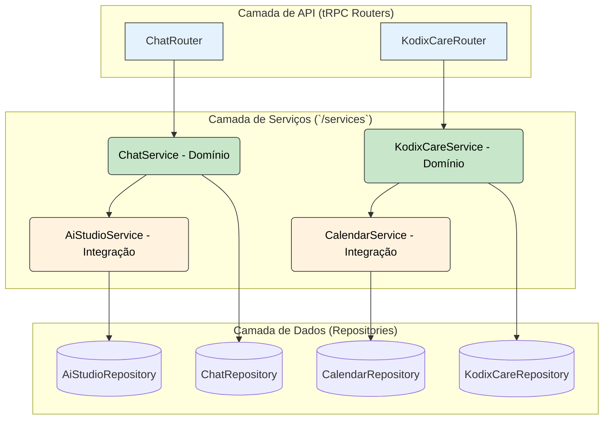

# Padrões de Arquitetura: Service Layer

**Autor:** @KodixAgent & @User
**Data:** 2025-07-01
**Status:** 📖 Documento Arquitetural Ativo
**Contexto:** Este documento define os padrões para a implementação e o consumo da camada de serviço (`Service Layer`) no backend do Kodix.

---

## 1. 🎯 Propósito do Service Layer

O **Service Layer**, localizado em `packages/api/src/internal/services/`, é o coração da lógica de negócio do backend. Sua função principal é atuar como uma **fachada (facade)** que orquestra as operações de um domínio específico.

**Regras Fundamentais:**

1.  **Lógica de Negócio Centralizada:** Toda a lógica de negócio complexa (validações, orquestração de múltiplas fontes de dados, etc.) deve residir em um serviço, não diretamente nos handlers tRPC.
2.  **"Thin" Routers:** Os routers e handlers tRPC devem ser o mais "magros" possível, delegando a maior parte do trabalho para a camada de serviço.
3.  **Contrato de API:** Os serviços definem o contrato de como um domínio pode ser acessado, tanto internamente quanto por outros SubApps.

---

## 2. 🏗️ Os Dois Padrões de Serviços

A arquitetura do Kodix reconhece dois tipos distintos de serviços, cada um com um propósito claro. A escolha do padrão correto é crucial para a manutenibilidade.

### **Padrão 1: Serviço de Domínio (Intra-App)**

- **Propósito:** Encapsular a lógica de negócio de **um único domínio ou SubApp**.
- **Exemplos:** `ChatService`, `PermissionsService`.
- **Consumidor Principal:** O router tRPC do seu próprio domínio (ex: `chatRouter` consome `ChatService`).
- **Regra de Ouro:** **Não é projetado** para ser consumido diretamente por outros SubApps. Sua API pode ser instável e focada nas necessidades internas do seu domínio.

### **Padrão 2: Serviço de Integração (Cross-App)**

- **Propósito:** Expor funcionalidades de forma **segura e estável** para serem consumidas por **outros SubApps**.
- **Exemplos:** `AiStudioService`, `CalendarService`.
- **Consumidor Principal:** Outros serviços de domínio (ex: `ChatService` consome `AiStudioService`).
- **Regras de Ouro:**
  - Sua API deve ser tratada como **pública e estável**.
  - **OBRIGATÓRIO** incluir validação de contexto rigorosa (`teamId`, `requestingApp`, etc.) para garantir o isolamento e a segurança entre os times.
  - Deve ter uma documentação clara de seus métodos públicos.

---

## 3. 📝 Boas Práticas de Implementação

1.  **Injeção de Dependência Implícita:** Os serviços não devem instanciar outros serviços. Eles devem ser estáticos ou singleton e chamar os métodos estáticos de outros serviços.
2.  **Tratamento de Erros:** Serviços devem lançar erros de domínio específicos (`EntityNotFoundError`, `PermissionError`). A camada de tRPC é responsável por mapear esses erros para `TRPCError`.
3.  **Agnosticismo de ORM:** Um serviço nunca deve expor ou esperar tipos de dados diretamente do Drizzle. Ele deve operar com DTOs (Data Transfer Objects) ou tipos de domínio definidos. O mapeamento de/para os tipos do ORM é responsabilidade da camada de repositório.

---

## 4. 🔗 Referências

- **[Backend Development Guide](./backend-guide.md)**
- **[SubApp Architecture](./subapp-architecture.md)**
- **[tRPC Patterns](./trpc-patterns.md)**

Este documento é a fonte única de verdade para os padrões do Service Layer. Todas as novas implementações de serviços devem segui-lo.
