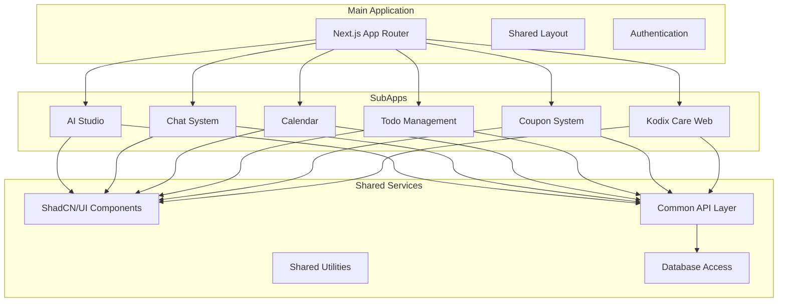

<!-- AI-METADATA:
<!-- AI-CONTEXT-PRIORITY: always-include="true" summary-threshold="low" -->category: architecture
complexity: intermediate
updated: 2025-07-12
claude-ready: true
phase: 4
priority: medium
token-optimized: true
audience: fullstack
ai-context-weight: important
last-ai-review: 2025-07-12
-->

# SubApp Architecture

This section contains comprehensive documentation for the SubApp architecture pattern, including design principles, communication patterns, and implementation guidelines.

## 📁 SubApp Documentation

### <!-- AI-LINK: type="dependency" importance="high" -->
<!-- AI-CONTEXT-REF: importance="high" type="architecture" -->
[SubApp Architecture](./subapp-architecture.md)
<!-- /AI-CONTEXT-REF -->
<!-- /AI-LINK -->
Core SubApp architecture patterns and design principles.

### [SubApp Inter-Dependencies](./subapp-inter-dependencies.md)
Communication patterns and dependency management between SubApps.

### [SubApp Configurations System](./subapp-configurations-system.md)
Configuration management and system architecture for SubApps.

### <!-- AI-LINK: type="related" importance="medium" -->
<!-- AI-CONTEXT-REF: importance="medium" type="guide" -->
[SubApp Documentation Guide](./subapp-documentation-guide.md)
<!-- /AI-CONTEXT-REF -->
<!-- /AI-LINK -->
Standards and guidelines for documenting SubApp features and APIs.

## 🏗️ 🔍 🎯 SubApp Architecture Overview

<!-- AI-COMPRESS: strategy="summary" max-tokens="150" -->
**Quick Summary**: Key points for rapid AI context understanding.
<!-- /AI-COMPRESS -->
### Core Principles
- **Modular Isolation**: Each SubApp operates independently
- **Shared Infrastructure**: Common services and components
- **Type-Safe Communication**: tRPC for inter-SubApp communication
- **Team Ownership**: Clear boundaries for development teams

### SubApp Structure



## 🏗️ SubApp Development Model

### Team-Based Isolation
- Each SubApp is owned by a specific feature team
- Independent development and deployment cycles
- Shared core platform services and components
- Clear interfaces for inter-SubApp communication

### Technical Architecture
- **Frontend**: React components within Next.js app structure
- **Backend**: tRPC routers with service layer patterns
- **Database**: Isolated schemas with shared core tables
- **Routing**: Next.js App Router with dynamic SubApp routes

### Configuration System
- Environment-specific configurations
- Feature flags for SubApp functionality
- Team-specific settings and permissions
- Runtime configuration management

## 🚀 Development Guidelines

### SubApp Creation
1. Define SubApp scope and boundaries
2. Create folder structure following patterns
3. Implement tRPC router for API endpoints
4. Build React components for UI
5. Configure routing and navigation

### Inter-SubApp Communication
- Use tRPC procedures for data exchange
- Implement event-driven communication where needed
- Share common utilities and components
- Maintain loose coupling between SubApps

### Configuration Management
- Use environment-based configuration
- Implement feature flags for gradual rollouts
- Configure team-specific settings
- Manage runtime configuration updates

## 📋 Best Practices

### Architecture Patterns
- Follow single responsibility principle
- Implement proper error boundaries
- Use shared components and utilities
- Maintain clear API contracts

### Code Organization
- Organize code by feature/domain
- Implement proper TypeScript typing
- Follow established naming conventions
- Document public APIs and interfaces

### Testing Strategy
- Unit tests for business logic
- Integration tests for SubApp features
- End-to-end tests for user workflows
- Performance testing for critical paths

### Deployment Strategy
- Independent feature deployment
- Gradual rollout with feature flags
- Monitoring and observability
- Rollback capabilities

## 🔧 Implementation Patterns

### SubApp Registration
<!-- AI-CODE-BLOCK: typescript-example -->
<!-- AI-CODE-OPTIMIZATION: language="typescript" context="kodix-patterns" -->
```typescript
// AI-CONTEXT: TypeScript implementation following Kodix patterns
// SubApp registration pattern
export const subAppConfig = {
  name: 'ai-studio',
  routes: ['/apps/ai-studio'],
  permissions: ['ai_studio_access'],
  features: ['model_management', 'cost_tracking']
} as const;
```
<!-- /AI-CODE-OPTIMIZATION -->
<!-- /AI-CODE-BLOCK -->

### API Pattern
<!-- AI-CODE-BLOCK: typescript-example -->
<!-- AI-CODE-OPTIMIZATION: language="typescript" context="kodix-patterns" -->
```typescript
// AI-CONTEXT: TypeScript implementation following Kodix patterns
// tRPC router pattern for SubApps
export const aiStudioRouter = router({
  getModels: protectedProcedure
    .query(async ({ ctx }) => {
      return await ctx.services.aiStudio.getModels(ctx.user.teamId);
    }),
  
  createModel: protectedProcedure
    .input(createModelSchema)
    .mutation(async ({ ctx, input }) => {
      return await ctx.services.aiStudio.createModel(ctx.user.teamId, input);
    })
});
```
<!-- /AI-CODE-OPTIMIZATION -->
<!-- /AI-CODE-BLOCK -->

---

**Maintained By**: SubApp Architecture Team  
**Last Updated**: 2025-07-12  
**Review Cycle**: Monthly
