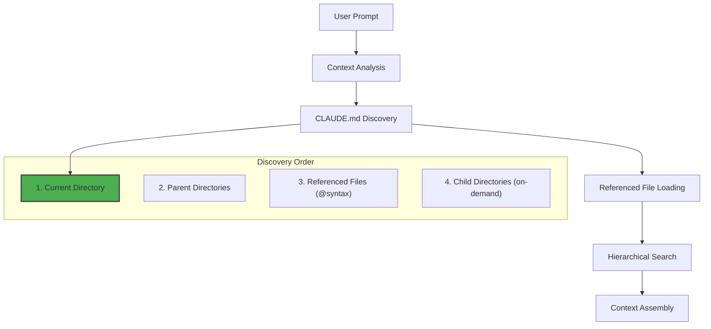

# Claude Code Documentation Ingestion

<!-- AI-METADATA:
category: guide
stack: general
complexity: intermediate
dependencies: [README.md, ../universal-principles.md]
assistant: claude-code
-->

## 🎯 Quick Summary

How Claude Code's specific documentation ingestion system works, including `CLAUDE.md` discovery, `@file` reference resolution, and hierarchical context loading.

## 📋 Overview

Claude Code has a sophisticated documentation ingestion system that automatically discovers and processes structured markdown files. This guide covers **only** the Claude Code-specific features. For universal AI assistant principles, see **[Universal AI Assistant Principles](../universal-principles.md)**.

### Claude Code-Specific Features

1. **Automatic `CLAUDE.md` Discovery**: Searches project hierarchy for `CLAUDE.md` files
2. **`@file` Reference Resolution**: Automatically loads referenced documentation
3. **Hierarchical Context Loading**: Inherits context from parent directories
4. **Session Persistence**: Documentation context persists across conversation turns

## 🧠 How Claude Code Processes Documentation

### Documentation Discovery Hierarchy

Claude Code searches for documentation in this order:



### CLAUDE.md Processing

Claude Code treats `CLAUDE.md` files as **always-loaded context**:

1. **Automatic Loading**: Every session starts by loading all discoverable `CLAUDE.md` files
2. **Hierarchical Inheritance**: Child directory contexts inherit from parent directories
3. **Reference Resolution**: `@file` syntax triggers immediate file loading
4. **Context Prioritization**: More specific (closer) `CLAUDE.md` files take precedence

### File Reference System

Claude Code's `@file` syntax enables precise documentation linking:

```markdown
# In CLAUDE.md

## Essential Documentation

- **Architecture**: @docs/README.md - Complete project overview
- **SubApps**: @docs/subapps/chat/chat-architecture.md - Chat implementation
- **API Patterns**: @docs/architecture/backend-guide.md - Backend development
```

**How it works:**

- **Immediate Loading**: Referenced files are loaded when `CLAUDE.md` is processed
- **Relative Paths**: Paths are resolved relative to the `CLAUDE.md` location
- **Conditional Loading**: Files are only loaded if they exist (no errors for missing files)
- **Content Integration**: Referenced content becomes part of the session context

## 📄 Optimization for Kodix

### Centralized CLAUDE.md Strategy

For Kodix, we use a **single centralized** `CLAUDE.md` in `/docs/`:

```markdown
# /docs/CLAUDE.md

## Core Documentation References

- **Complete Overview**: @docs/README.md
- **Architecture Standards**: @docs/architecture/Architecture_Standards.md
- **SubApp Documentation**: @docs/subapps/chat/chat-architecture.md
- **Development Tools**: @docs/database/development-workflow.md
```

**Benefits:**

- Single source of truth
- No duplicate context files
- Easier maintenance
- Consistent references

### Reference Resolution Patterns

**Effective for Claude Code:**

```markdown
# ✅ Good: Specific, contextual references

- **API Development**: @docs/architecture/backend-guide.md
- **Testing**: @docs/tests/testing-guide.md
- **Database**: @docs/database/development-workflow.md

# ❌ Avoid: Generic or overly broad references

- **Everything**: @docs/ - Too broad, causes context overflow
- **Random**: @README.md - Unclear purpose or relevance
```

## ⚡ Performance Optimization

### Context Window Management

Claude Code-specific optimization techniques:

1. **Selective Loading**: Only reference documentation relevant to current task
2. **Centralized References**: Use single `CLAUDE.md` instead of multiple files
3. **Content Summarization**: Keep referenced docs concise and focused
4. **Regular Cleanup**: Remove outdated references from `CLAUDE.md`

### Best Practices for Kodix

```markdown
# Optimized CLAUDE.md for Kodix

## Project Overview

[Brief description]

## Essential Commands

[Core development commands]

## Documentation Navigation

- **Architecture**: @docs/architecture/README.md
- **SubApps**: Navigate to specific directories for detailed context
- **Context Engineering**: @docs/context-engineering/README.md
```

## 🔄 Dynamic Context Loading

### On-Demand Documentation Access

Claude Code can dynamically load documentation during conversations:

```bash
# User request triggers documentation loading
"Please read the chat architecture documentation and help me implement presence indicators"

# Claude Code automatically:
# 1. Searches for chat-related documentation
# 2. Loads @docs/subapps/chat/chat-architecture.md
# 3. Processes content for relevant patterns
# 4. Applies knowledge to implementation
```

### Intelligent Reference Resolution

Claude Code understands context and loads relevant documentation:

```markdown
# When user mentions "database schema changes"

# Claude automatically references:

- @docs/database/development-workflow.md
- @docs/architecture/backend-guide.md

# When user mentions "UI components"

# Claude automatically references:

- @docs/ui-catalog/component-examples.md
- @packages/ui component definitions
```

## 🎯 Claude Code vs Universal Features

| Feature               | Universal        | Claude Code-Specific      |
| --------------------- | ---------------- | ------------------------- |
| Documentation Context | ✅ All tools     | `CLAUDE.md` discovery     |
| Reference Resolution  | ✅ All tools     | `@file` syntax processing |
| Context Assembly      | ✅ All tools     | Hierarchical loading      |
| Session Persistence   | ✅ All tools     | Conversation memory       |
| Dynamic Loading       | ❌ Tool-specific | On-demand file access     |

## 📊 Monitoring and Debugging

### Context Loading Verification

Check what documentation Claude Code has loaded:

```bash
# In Claude Code session
/context

# Shows:
# - Loaded CLAUDE.md files
# - Referenced documentation
# - Current context size
# - Available commands and tools
```

### Performance Monitoring

```bash
# Monitor context usage
/usage

# Shows:
# - Token consumption
# - Context window utilization
# - Documentation loading times
# - Memory usage patterns
```

## 📚 Related Resources

- **[Universal AI Assistant Principles](../universal-principles.md)** - Core philosophy
- **[Claude Code Setup](./README.md)** - Installation and configuration
- **[Context Engineering](../../context-engineering/)** - Advanced strategies
- **[Anthropic Claude Code Docs](https://claude.ai/code)** - Official documentation

<!-- AI-RELATED: [../universal-principles.md, ./README.md] -->
<!-- DEPENDS-ON: [README.md, ../universal-principles.md] -->
<!-- REQUIRED-BY: [claude-code-workflows] -->
<!-- SEE-ALSO: [../../context-engineering/README.md] -->
