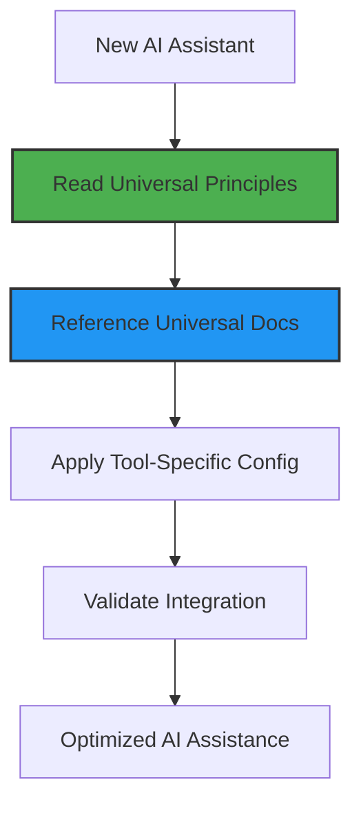

<!-- AI-METADATA:
category: guide
stack: universal
complexity: intermediate
dependencies: [universal-principles.md, sync-rules-manually.md]
-->

# New AI Assistant Integration Guide

## 🎯 Quick Summary

This document provides the standard procedure for integrating a new, previously unsupported AI assistant with the Kodix repository's universal rules and documentation system.

## 📋 Universal Setup Pattern

Every AI assistant integration follows this standard pattern. The goal is to leverage our universal documentation with minimal tool-specific configuration.



## 🚀 How to Integrate a New Assistant

### Step 1: Identify the Assistant's Rules File

First, determine where the new assistant looks for its system prompt or context rules. This might be a specific file in a `.config` directory, a file in the project root, or a setting within the tool itself.

- **Cursor**: Uses `.cursor/rules/README.md`.
- **Gemini CLI**: Can use a `GEMINI.md` file at the project root.
- **Claude Code**: Can use `docs/CLAUDE.md`.

### Step 2: Manually Sync the Universal Rules

Our core principle is to have a **single source of truth for rules**. You must manually synchronize the rules from this source file to the assistant's specific configuration file.

For a detailed, step-by-step guide on this procedure, refer to the official documentation:

- **[Manually Synchronizing AI Assistant Rules](./sync-rules-manually.md)**

This is a critical step to ensure the new assistant operates under the same guidelines as all others.

### Step 3: Create Tool-Specific Documentation

Create a new directory for the assistant under `docs/ai-assistants/[tool-name]/`. Inside, create a `README.md` file using the template below.

#### Configuration Template

````markdown
# [AI Assistant Name] Setup for Kodix

## 🎯 Quick Summary

Step-by-step setup guide for integrating [AI Assistant Name] with the Kodix monorepo.

## 📋 Prerequisites

- [List any necessary installations or accounts]

## 🚀 Installation and Setup Steps

1.  **Install the Tool**:
    ```bash
    # Command to install the tool
    ```
2.  **Configure Authentication**:
    ```bash
    # Steps for API keys or login
    ```
3.  **Initialize in Kodix**:
    ```bash
    # Any init commands to run in the project root
    ```

## 🔧 [AI Assistant Name]-Specific Configuration

- Document **only the unique features or configuration needs** of this assistant here.
- For example, if it uses a unique file name for rules or has a special permissions system.

## 📚 Related Resources

- **[Universal AI Assistant Principles](../universal-principles.md)** - The core philosophy that this setup builds upon.
- **[New Assistant Integration Guide](./new-assistant-integration.md)** - The guide you are reading now.
````

### Step 4: Validate the Integration

Use the **[Validation Checklist](./VALIDATION-CHECKLIST.md)** to ensure the new assistant is correctly loading and interpreting the project's rules and context.

## 🚨 What to Avoid

- **Do not duplicate universal principles**. The tool-specific documentation should only contain information that is unique to that tool.
- **Do not create separate rule files** in `docs/rules/`. All rules are in `docs/rules/README.md`.
- **Always prefer referencing universal docs** over creating new, tool-specific versions.

<!-- AI-RELATED: [universal-principles.md, sync-rules-manually.md] -->
<!-- DEPENDS-ON: [universal-principles.md] -->
<!-- REQUIRED-BY: [all-ai-assistant-integrations] -->
<!-- SEE-ALSO: [../README.md] -->
