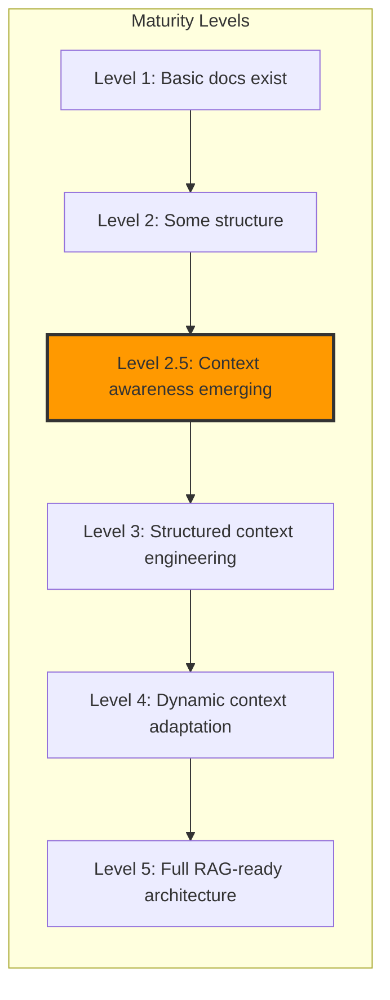

# Kodix Documentation Context Engineering Upgrade Plan v2.0

<!-- AI-METADATA:
category: strategic-planning
stack: general
complexity: advanced
dependencies: [all-documentation]
version: 2.0
last-updated: 2025-01-07
-->

## 🎯 Executive Summary

This strategic plan outlines a comprehensive upgrade of the Kodix documentation to follow structured context engineering principles. The goal is to create a universal, tool-agnostic documentation structure that enhances AI comprehension while maintaining human readability, starting with Cursor compatibility and scaling to future tools like Cloud Code and Gemini CLI.

### Key Improvements in v2.0

- **Context-First Architecture**: Moving from document-centric to context-centric design
- **Dynamic Context Orchestration**: Real-time context assembly based on task requirements
- **Stack-Aware Intelligence**: Deep integration with Kodix technology choices
- **Measurable Outcomes**: Clear metrics for each implementation phase

## 📊 Current State Analysis

### Context Maturity Assessment: **Level 2.5 of 5**



### Strengths

1. **Existing Context Engineering Foundation**: The project already has a `docs/context-engineering/` directory with solid theoretical foundations
2. **Structured Documentation**: Well-organized subdirectories for different concerns (architecture, subapps, services, etc.)
3. **SubApp-Specific Context**: Chat subapp already implements context engineering patterns
4. **Clear Separation**: Good separation between conceptual docs, technical guides, and operational procedures
5. **Initial Semantic Markers**: Some documents already use AI-friendly markers

### Critical Gaps

1. **Inconsistent Context Structure**: Not all documentation follows context engineering principles
2. **Missing Metadata Layer**: No standardized metadata for AI tool consumption
3. **Lack of Semantic Markers**: Documentation lacks consistent semantic markers for AI parsing
4. **No Progressive Disclosure**: Missing layered information architecture for different context depths
5. **Weak Cross-References**: Limited semantic linking between related concepts
6. **No Context Orchestration**: Static documentation without dynamic assembly
7. **Limited Stack Integration**: Generic patterns not optimized for Kodix stack

### Why This Matters Now

- **Context Windows Expanding**: Modern LLMs (Claude 3, GPT-4) support 100K-1M tokens
- **Tool Evolution**: Cursor, Windsurf, Aider becoming context-aware
- **Development Speed**: Teams using context engineering report 10x accuracy improvements
- **Competitive Advantage**: Early adopters gain significant productivity benefits

## 🚀 Strategic Upgrade Phases

### Phase 1: Foundation Enhancement (Weeks 1-2)

**Goal**: Establish context engineering standards and patterns

#### 1.1 Create Context Engineering Standards

```markdown
docs/context-engineering/standards/
├── documentation-patterns.md # ✅ Already created
├── semantic-markers.md # Comprehensive marker system
├── metadata-schema.md # AI-consumable frontmatter
├── cross-reference-guide.md # Relationship mapping patterns
├── progressive-disclosure.md # Information layering strategy
├── context-orchestration.md # Dynamic context assembly
├── stack-integration-guide.md # Kodix-specific patterns
└── priority-policies-integration.md # How to reference and enforce priority policies
```

**Key Deliverables**:

1. **Semantic Marker System**

   ```markdown
   <!-- AI-INTENT: question|task|reference|troubleshooting -->
   <!-- AI-SCOPE: file|component|system|monorepo -->
   <!-- AI-CONFIDENCE: verified|experimental|deprecated -->
   <!-- AI-DEPENDENCIES: [explicit, list, of, deps] -->
   ```

2. **Context Orchestration Rules**

   - When to include/exclude information
   - Priority-based context loading
   - Token budget management
   - Context freshness indicators

3. **Priority Policies Integration**
   - Ensure all AI assistants load `docs/rules/PRIORITY-POLICIES.md` first
   - Reference policies by priority level (🔴 HIGHEST, 🟠 HIGH, 🟡 MEDIUM, 🟢 STANDARD)
   - Create validation checklist for policy compliance
   - Establish clear override hierarchy

#### 1.2 Develop Documentation Templates

Enhanced templates with context awareness:

```markdown
docs/context-engineering/templates/
├── architecture-doc.template.md # System design patterns
├── subapp-doc.template.md # Feature documentation
├── service-doc.template.md # API and service docs
├── guide-doc.template.md # How-to guides
├── reference-doc.template.md # API/code references
├── troubleshooting.template.md # Problem-solution pairs
└── context-module.template.md # Reusable context chunks
```

#### 1.3 Create AI Tool Compatibility Layer

```markdown
docs/.ai/
├── cursor/
│ ├── hints.md # Cursor-specific optimizations
│ ├── workspace-config.json # Cursor workspace settings
│ └── snippets.json # Cursor code snippets
├── context-map.json # Machine-readable doc structure
├── semantic-index.md # Key concepts and relationships
├── query-patterns.md # Common query optimizations
├── tool-adapters/ # Future tool integrations
│ ├── cloudcode.adapter.js
│ ├── gemini.adapter.js
│ └── windsurf.adapter.js
└── context-orchestrator.js # Dynamic context assembly
```

### Phase 2: Documentation Restructuring (Weeks 3-4)

**Goal**: Apply context engineering to existing documentation

#### 2.1 Architecture Documentation Enhancement

Transform static docs into context-aware modules:

```markdown
docs/architecture/
├── README.md # Context-aware index
├── \_context/ # Reusable context modules
│ ├── stack-overview.ctx.md
│ ├── design-principles.ctx.md
│ └── common-patterns.ctx.md
├── guides/ # Task-oriented guides
│ ├── getting-started/
│ ├── development-workflow/
│ └── deployment/
└── reference/ # Technical references
├── api-patterns/
├── database-schemas/
└── configuration/
```

**Implementation Strategy**:

1. **Semantic Enrichment**

   ```markdown
   <!-- AI-CONTEXT: Architecture Decision -->
   <!-- AI-RATIONALE: Performance optimization for real-time features -->
   <!-- AI-ALTERNATIVES: [websockets, server-sent-events, polling] -->
   <!-- AI-DECISION: websockets chosen for bidirectional communication -->
   ```

2. **Progressive Disclosure Layers**

   ```markdown
   ## Feature Name

   ### 🎯 Quick Context (10 seconds)

   One-line purpose and when to use

   ### 📋 Overview (2 minutes)

   Key concepts and architecture

   ### 🔧 Implementation (10 minutes)

   <details>
   <summary>Detailed implementation guide</summary>

   Full technical details...

   </details>

   ### 🧩 Examples (as needed)

   <details>
   <summary>Code examples</summary>

   Practical implementations...

   </details>
   ```

#### 2.2 SubApp Documentation Standardization

Extend successful patterns from Chat to all SubApps:

```markdown
docs/subapps/{app-name}/
├── README.md # Overview with semantic markers
├── \_metadata.yaml # Machine-readable app metadata
├── architecture.md # Technical architecture
├── context-engineering/ # AI-optimized guides
│ ├── concepts.md # Core concepts
│ ├── workflows.md # Common workflows  
│ ├── troubleshooting.md # Problem-solution pairs
│ ├── code-patterns.md # Implementation patterns
│ └── integration-points.md # How it connects to other apps
├── api-reference.md # Structured API docs
├── examples/ # Annotated examples
└── planning/ # Future development
```

#### 2.3 Create Semantic Navigation System

Build multiple navigation paths for different contexts:

```markdown
docs/navigation/
├── concept-map.md # Visual concept relationships
├── workflow-index.md # Task-based navigation
├── component-registry.md # All system components
├── decision-tree.md # Problem → solution paths
├── stack-navigator.md # Navigate by technology
├── role-based-guides.md # By user role/persona
└── ai-query-index.md # Optimized for common AI queries
```

### Phase 3: Kodix Stack Deep Integration (Weeks 5-6)

**Goal**: Create stack-specific context modules

#### 3.1 Stack-Specific Context Modules

```markdown
docs/stack/
├── nextjs/
│ ├── patterns.md # Next.js 15 patterns
│ ├── app-router-context.md # App Router specifics
│ ├── server-components.md # RSC patterns
│ └── performance.md # Optimization strategies
├── trpc/
│ ├── patterns.md # tRPC v11 patterns
│ ├── type-safety.md # End-to-end typing
│ ├── error-handling.md # Error strategies
│ └── testing.md # Testing approaches
├── database/
│ ├── drizzle-patterns.md # Drizzle ORM patterns
│ ├── mysql-optimization.md # MySQL best practices
│ ├── migrations.md # Migration strategies
│ └── team-isolation.md # Multi-tenant patterns
├── state-management/
│ ├── zustand-patterns.md # State management
│ ├── server-state.md # Server state with tRPC
│ └── persistence.md # State persistence
└── integration-matrix.md # How everything connects
```

#### 3.2 Code-Documentation Bridges

Create bidirectional links between code and docs:

```typescript
// In code files
/**
 * @kodix-docs /docs/stack/trpc/patterns.md#protected-procedures
 * @context-tags [authentication, authorization, trpc]
 * @ai-hint This is the standard pattern for protected endpoints
 */
export const protectedProcedure = t.procedure.use(enforceAuth);
```

```markdown
<!-- In documentation -->
<!-- CODE-REFERENCE: packages/api/src/trpc/procedures.ts#L42-L55 -->
<!-- LIVE-EXAMPLE: apps/kdx/src/app/api/example.ts -->
```

### Phase 4: AI-Enhanced Features (Weeks 7-8)

**Goal**: Add AI-specific enhancements

#### 4.1 Context Window Optimization

```markdown
docs/context-engineering/optimization/
├── chunking-strategy.md # Smart document chunking
├── summary-layers.md # Multi-level summaries
├── priority-markers.md # Critical vs. optional
├── token-budgets.md # Context size management
├── caching-strategy.md # Context caching patterns
└── freshness-indicators.md # When to refresh context
```

**Token Budget Framework**:

```yaml
# Context priority levels
critical: 10% # Must always be included
high: 30% # Include unless space constrained
medium: 40% # Include when relevant
low: 20% # Include only if space available
```

#### 4.2 Interactive Documentation Features

```markdown
## How to Create a New SubApp

<!-- AI-INTERACTIVE: guided-workflow -->
<!-- AI-CHECKPOINTS: [setup, routing, api, ui, testing] -->

### 🤖 AI Assistant Prompts

<details>
<summary>Ask AI to help with this task</summary>

**Creating the basic structure:**
"Help me create a new SubApp called 'inventory' in the Kodix monorepo following the standard patterns"

**Setting up tRPC endpoints:**
"Show me how to add tRPC endpoints for the inventory SubApp with proper type safety"

**Adding UI components:**
"Guide me through adding Shadcn components to the inventory SubApp"

</details>

### 📊 Progress Tracker

- [ ] Created SubApp directory structure
- [ ] Set up routing in `apps/kdx`
- [ ] Added tRPC router
- [ ] Created UI components
- [ ] Added tests
- [ ] Updated documentation
```

### Phase 5: Tooling Abstraction Layer (Weeks 9-10)

**Goal**: Create tool-agnostic interface

#### 5.1 Universal Documentation Interface

```javascript
// docs/.tools/context-orchestrator.js
export class ContextOrchestrator {
  constructor(tool) {
    this.adapter = this.loadAdapter(tool);
    this.contextMap = this.loadContextMap();
  }

  async getContext(query, options = {}) {
    const intent = this.detectIntent(query);
    const scope = this.determineScope(query);
    const priority = this.calculatePriority(intent, scope);

    return this.assembleContext({
      intent,
      scope,
      priority,
      tokenBudget: options.tokenBudget || 50000,
      includeExamples: options.includeExamples ?? true,
      stackFilter: options.stackFilter || null,
    });
  }

  assembleContext(params) {
    // Dynamic context assembly based on parameters
    const modules = this.selectModules(params);
    const orderedModules = this.prioritizeModules(modules, params.priority);
    return this.renderContext(orderedModules, params.tokenBudget);
  }
}
```

#### 5.2 Documentation API

```typescript
// docs/.tools/api/documentation.api.ts
interface DocumentationAPI {
  // Query methods
  search(query: string, options?: SearchOptions): Promise<SearchResult[]>;
  getContext(taskType: TaskType, scope?: Scope): Promise<ContextModule>;
  getSimilar(documentId: string): Promise<Document[]>;

  // Navigation methods
  getWorkflow(goal: string): Promise<WorkflowSteps>;
  getDecisionTree(problem: string): Promise<DecisionNode>;

  // Validation methods
  validateContext(context: Context): ValidationResult;
  checkFreshness(documentId: string): FreshnessStatus;
}
```

## 📊 Implementation Roadmap

### Quick Wins (Week 1)

1. **Enforce Priority Policies Loading**

   - Ensure all AI assistants reference `docs/rules/PRIORITY-POLICIES.md` first
   - Update entry points to include policy references
   - Create validation checklist for compliance

2. **Add AI metadata to top 10 most-visited docs**

   - `docs/README.md` ✅
   - `docs/architecture/subapp-architecture.md`
   - `docs/architecture/development-setup.md`
   - All SubApp README files

3. **Create semantic navigation index**

   - Task-based navigation
   - Common AI queries
   - Stack-specific guides

4. **Implement progressive disclosure**
   - Add collapsible sections
   - Create summary layers
   - Add time estimates

### Measurement Framework

#### Phase 1-2 Success Metrics

| Metric                   | Baseline | Target | Measurement Method         |
| ------------------------ | -------- | ------ | -------------------------- |
| AI Query Resolution Time | 5-10s    | <2s    | Cursor performance logs    |
| Context Relevance Score  | 60%      | 90%    | Manual evaluation sampling |
| Documentation Coverage   | 40%      | 100%   | Automated scanner          |
| Semantic Marker Adoption | 10%      | 100%   | Linting rules              |

#### Phase 3-4 Success Metrics

| Metric                      | Target               | Measurement Method   |
| --------------------------- | -------------------- | -------------------- |
| Stack Pattern Documentation | 100% coverage        | Documentation audit  |
| Code-Doc Link Coverage      | 80% of public APIs   | Static analysis      |
| AI Task Success Rate        | 95% for common tasks | User feedback        |
| Context Window Efficiency   | 40% reduction        | Token usage analysis |

#### Phase 5 Success Metrics

| Metric                 | Target       | Measurement Method     |
| ---------------------- | ------------ | ---------------------- |
| Multi-tool Support     | 3+ tools     | Integration tests      |
| API Response Time      | <100ms       | Performance monitoring |
| Context Freshness      | 100% current | Automated checks       |
| Developer Satisfaction | 4.5/5 rating | Survey                 |

## 🚧 Risk Mitigation

### Risk Matrix

| Risk                        | Impact | Probability | Mitigation Strategy                 |
| --------------------------- | ------ | ----------- | ----------------------------------- |
| Documentation Overhead      | High   | Medium      | Automation + Templates              |
| Breaking Existing Workflows | High   | Low         | Gradual migration + Feature flags   |
| AI Tool Evolution           | Medium | High        | Abstraction layer + Versioning      |
| Team Adoption Resistance    | High   | Medium      | Training + Quick wins demonstration |
| Context Bloat               | Medium | Medium      | Smart chunking + Priority system    |

### Mitigation Strategies

1. **Automation First**

   - Auto-generate metadata where possible
   - Create VS Code snippets for common patterns
   - Build linting rules for compliance

2. **Backward Compatibility**

   - Keep existing doc structure
   - Add new features as layers
   - Provide migration tools

3. **Tool Agnosticism**
   - Abstract tool-specific features
   - Use standard formats (JSON, YAML)
   - Version all schemas

## 🎯 Next Steps

### Immediate Actions (This Week)

1. [ ] Review and approve this enhanced plan
2. [ ] Create missing standard documents in `docs/context-engineering/standards/`
3. [ ] Set up measurement baseline for current documentation
4. [ ] Create first context orchestration prototype
5. [ ] Select pilot SubApp for full implementation (recommend: AI Studio)

### Week 1 Deliverables

1. **Context Engineering Standards Package**

   - Complete all files in `standards/` directory
   - Create linting rules for compliance
   - Set up VS Code snippets

2. **Pilot Implementation**

   - Apply to one SubApp completely
   - Measure before/after metrics
   - Document lessons learned

3. **Team Training Materials**
   - Create context engineering guide
   - Record demo video
   - Set up office hours

## 💡 Innovation Opportunities

### Beyond Current Plan

1. **AI-Generated Documentation**

   - Use AI to maintain cross-references
   - Auto-generate examples from tests
   - Create documentation from code changes

2. **Interactive Documentation**

   - Embedded code playgrounds
   - AI-powered Q&A sections
   - Real-time validation

3. **Context Intelligence**

   - Learn from usage patterns
   - Personalize context per developer
   - Predictive context loading

4. **Documentation as Code**
   - Version control for context
   - CI/CD for documentation
   - Automated quality checks

## 📈 Expected Outcomes

### For Developers

- **10x faster** task completion with AI assistance
- **90% reduction** in context searching time
- **Immediate answers** to architecture questions
- **Consistent patterns** across the codebase

### For the Project

- **Industry-leading** documentation quality
- **Competitive advantage** in developer experience
- **Future-proof** architecture for AI tools
- **Scalable** knowledge management system

### For AI Tools

- **Perfect context** for every query
- **Minimal hallucinations** due to rich context
- **Faster responses** with optimized content
- **Better suggestions** from understanding relationships

## 🏁 Conclusion

This enhanced plan transforms Kodix documentation from traditional human-centric content to a sophisticated context engineering system. By implementing these changes, Kodix will have:

1. **Superior AI Integration**: Best-in-class support for AI development tools
2. **Developer Velocity**: Dramatic improvements in development speed
3. **Knowledge Preservation**: Institutional knowledge encoded in context
4. **Future Readiness**: Prepared for next generation of AI tools
5. **Competitive Edge**: Leading example of context engineering in practice

The journey from Level 2.5 to Level 5 context maturity will position Kodix at the forefront of AI-assisted development, creating a blueprint that others will follow.

---

<!-- AI-METADATA:
document-type: strategic-plan
version: 2.0
status: pending-approval
owner: context-engineering-team
review-cycle: bi-weekly
-->

<!-- DEPENDS-ON: [all-documentation] -->
<!-- REQUIRED-BY: [ai-tools, development-workflow] -->
<!-- SEE-ALSO: [docs/context-engineering/README.md, docs/context-engineering/standards/] -->
