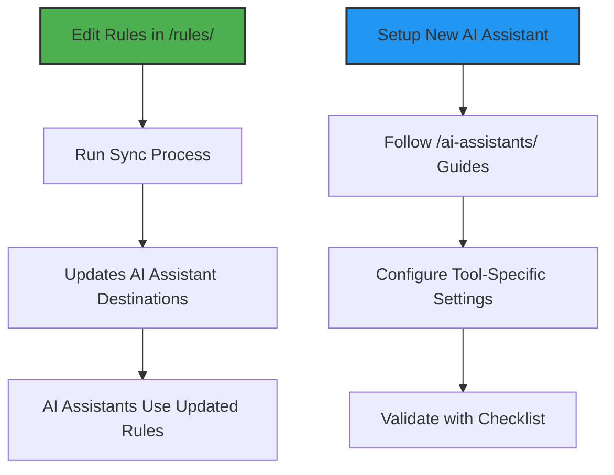

<!-- AI-METADATA:
category: overview
complexity: basic
updated: 2025-07-12
claude-ready: true
-->

# Rules for AI Assistants

Complete AI assistant configuration and behavior system for the Kodix project.

## 🎯 Quick Summary

This directory contains everything related to AI assistant configuration, behavior, and integration in the Kodix monorepo. It provides a centralized location for both AI behavioral rules and human setup documentation.

## 📁 Structure

### `/rules/` - AI Behavioral Rules

- **Purpose**: Source of truth for AI behavior and decision-making
- **Audience**: AI assistants (consumed via sync process)
- **Content**: What the AI should do and how it should behave
- **Files**: `universal-ai-rules.md`, `cursor-rules.md`, `claude-rules.md`, `gemini-rules.md`

### `/ai-assistants/` - Setup & Integration

- **Purpose**: Human-facing documentation for setup and management
- **Audience**: Developers and system administrators
- **Content**: How to install, configure, and troubleshoot AI assistants
- **Subdirectories**: `cursor/`, `claude-code/`, `gemini-cli/`

## 🚀 Quick Start

### For New Users

1. **Start here**: Read this overview to understand the system
2. **For AI Setup**: Go to `/ai-assistants/README.md`
3. **For Rule Customization**: Check `/rules/README.md`
4. **For Sync Process**: See `/ai-assistants/sync-rules.md`

### For Existing Users

- **Updating Rules**: Edit files in `/rules/` then sync to destinations
- **Adding New AI Assistant**: Follow `/ai-assistants/new-assistant-integration.md`
- **Troubleshooting**: Use `/ai-assistants/VALIDATION-CHECKLIST.md`

## 🔄 How It Works

### The Sync Process

1. **Source**: Rules are authored in `/rules/` directory
2. **Sync**: Using process documented in `/ai-assistants/sync-rules.md`
3. **Destination**: AI assistant configuration files (`.cursor/rules/README.md`, `GEMINI.md`, `CLAUDE.md`)
4. **Usage**: AI assistants load and follow these rules

## 🛠️ Core Components

### Universal System

- **Universal AI Rules**: Core behavioral principles for all AI assistants
- **Universal Principles**: Context engineering and documentation patterns
- **Sync System**: Automated rule distribution to AI assistants

### Tool-Specific Support

- **Cursor**: IDE-integrated AI assistant with MCP browser tools
- **Claude Code**: VibeCoding workflow with context engineering
- **Gemini CLI**: Google's command-line AI assistant
- **Extensible**: Framework supports additional AI assistants

## 📋 Key Features

### For AI Assistants

- **Consistent Behavior**: All AI assistants follow the same core principles
- **Tool-Specific Optimization**: Each AI assistant gets optimized rules
- **Quality Assurance**: Validation and testing procedures
- **Cross-Tool Compatibility**: Universal patterns work everywhere

### For Developers

- **Single Source of Truth**: All AI rules in one location
- **Easy Integration**: Step-by-step guides for new AI assistants
- **Flexible Configuration**: Customize behavior for specific needs
- **Comprehensive Documentation**: Setup, troubleshooting, and best practices

## 🔗 Navigation

### Essential Files

- **[Universal AI Rules](./rules/universal-ai-rules.md)** - Core behavioral rules
- **[Cursor Rules](./rules/cursor-rules.md)** - Cursor-specific implementation
- **[Claude Rules](./rules/claude-rules.md)** - Claude Code-specific implementation
- **[Gemini Rules](./rules/gemini-rules.md)** - Gemini CLI-specific implementation

### Integration Guides

- **[AI Assistants Overview](./ai-assistants/README.md)** - Complete integration guide
- **[Sync Rules Process](./ai-assistants/sync-rules.md)** - How to sync rules
- **[Validation Checklist](./ai-assistants/VALIDATION-CHECKLIST.md)** - Ensure proper setup
- **[New Assistant Integration](./ai-assistants/new-assistant-integration.md)** - Add new AI tools

### Tool-Specific Setup

- **[Cursor Setup](./ai-assistants/cursor/README.md)** - Cursor IDE integration
- **[Claude Code Setup](./ai-assistants/claude-code/README.md)** - Claude Code integration
- **[Gemini CLI Setup](./ai-assistants/gemini-cli/README.md)** - Gemini CLI integration

## 🚨 Important Notes

### For Rule Editing

- ✅ **DO**: Edit source files in `/rules/` directory
- ❌ **DON'T**: Edit destination files directly (they get overwritten)
- ✅ **DO**: Use the sync process to update destinations
- ❌ **DON'T**: Skip validation after making changes

### For New AI Assistants

- ✅ **DO**: Follow the integration guide in `/ai-assistants/`
- ✅ **DO**: Create tool-specific rules in `/rules/`
- ✅ **DO**: Document setup procedures in `/ai-assistants/`
- ✅ **DO**: Validate integration with checklist

## 📊 Quality Assurance

### Validation Process

1. **Pre-Sync**: Validate source files for content purity
2. **Sync**: Apply rules to AI assistant destinations
3. **Post-Sync**: Verify rules are loaded correctly
4. **Testing**: Use validation checklist to ensure proper operation

### Success Metrics

- **Content Purity**: 100% (no cross-contamination between AI tools)
- **Universal Compliance**: All AI assistants follow core principles
- **Tool Optimization**: Each AI assistant gets optimized experience
- **Quality Assurance**: Comprehensive validation and testing

---

**Last Updated**: 2025-01-06  
**Maintained By**: Development Team  
**Version**: 2.0 (Restructured with parent folder organization)  
**Status**: ✅ Production Ready
