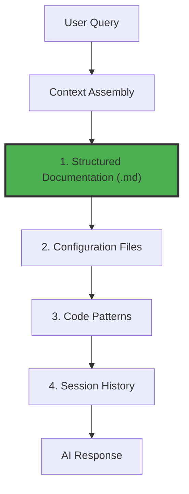

# Universal AI Assistant Principles
<!-- AI-CONTEXT-PRIORITY: always-include="false" summary-threshold="medium" -->
<!-- AI-METADATA:
category: standard
stack: general
complexity: intermediate
dependencies: []
-->

## 🎯 Quick Summary

Core principles and strategies for AI-assisted development that apply universally across all AI tools (Cursor, Claude Code, Gemini CLI, Copilot, Windsurf, etc.).

## 🔍 📋 Overview

<!-- AI-COMPRESS: strategy="summary" max-tokens="150" -->
**Quick Summary**: Key points for rapid AI context understanding.
<!-- /AI-COMPRESS -->
This document establishes universal principles for AI-assisted development that transcend specific tools. These principles ensure consistent, effective AI assistance regardless of which tool you're using.

### Core Philosophy

> **Documentation-First Context Engineering**: All AI assistants perform better with structured, persistent documentation than with ephemeral memory or dynamic state.

## 🧠 Universal Memory & Context Principles

### 1. Documentation as Primary Context

**Principle**: Structured `.md` files provide superior context to AI assistants compared to:

- In-app memory systems
- Dynamic platform state
- Scattered code comments
- Session-based memory

**Why This Works**:

- **Persistence**: Documentation survives tool changes and sessions
- **Structure**: Hierarchical information organization
- **Semantic Understanding**: AI tools parse structured markdown effectively
- **Cross-Tool Compatibility**: Works with any AI assistant

### 2. Context Hierarchy

All AI assistants prioritize information in this order:



1. **Primary**: Structured documentation (`.md` files)
2. **Secondary**: Configuration files (tool-specific rules)
3. **Tertiary**: Code patterns and existing implementation
4. **Quaternary**: Session history and dynamic context

### 3. Progressive Disclosure

Information should be layered from general to specific:

```markdown
# Component/Feature Name

## Context (Why)

Brief explanation of purpose and scope

## 🏗️ Architecture (What)

High-level design decisions

## Implementation (How)

Specific patterns and conventions

## 📋 Examples (Show)

Code examples with explanations

## Related (Where)

Links to other relevant documentation
```

## 📄 Universal Documentation Patterns

### Memory-Optimized Structure

Every AI assistant benefits from this structure:

```markdown
<!-- AI-METADATA: Machine-readable context -->
<!-- AI-CONTEXT: Human-readable section purpose -->
<!-- AI-PRIORITY: Importance level -->

# Clear, Descriptive Title

## 🎯 Quick Summary

One-sentence description for rapid AI comprehension

## 🔍 📋 Overview

<!-- AI-COMPRESS: strategy="summary" max-tokens="150" -->
**Quick Summary**: Key points for rapid AI context understanding.
<!-- /AI-COMPRESS -->
2-3 paragraphs with key concepts highlighted

## 🏗️ 🏗️ Architecture

Technical structure and relationships

## 🔧 Implementation

Step-by-step guidance

## 📋 🧩 Examples

Concrete code examples

## 🔗 Related Resources

Cross-references to other documentation
```

### Semantic Markers

Use consistent markers that all AI tools can understand:

```markdown
<!-- AI-CONTEXT: Implementation Guide -->
<!-- AI-PRIORITY: HIGH -->
<!-- AI-INTENT: troubleshooting -->
<!-- AI-SCOPE: system -->
<!-- AI-DEPENDENCIES: [explicit, list] -->
```

### Cross-Reference Strategy

Create explicit relationships between documents:

```markdown
<!-- AI-RELATED: [file1.md, file2.md] -->
<!-- DEPENDS-ON: [prerequisite-docs] -->
<!-- REQUIRED-BY: [dependent-docs] -->
<!-- SEE-ALSO: [related-concepts] -->
```

## 🔄 Context Engineering Strategies

### 1. Knowledge Layering

**Universal Pattern**:

- **Layer 1**: Project overview and core concepts
- **Layer 2**: Architecture and design decisions
- **Layer 3**: Implementation patterns and examples
- **Layer 4**: Specific configurations and edge cases

### 2. Reference Resolution

**Universal Syntax**:

```markdown
- **Architecture**: @docs/architecture/README.md
- **Implementation**: @docs/subapps/chat/chat-architecture.md
- **API Patterns**: @docs/architecture/backend/../../../architecture/backend/backend-guide.md
```

All AI assistants can understand and follow these references.

### 3. Context Breadcrumbs

Leave clear navigation trails:

```markdown
## Context Path

Project → SubApp → Feature → Implementation

## Decision Trail

Why this approach was chosen over alternatives

## Related Decisions

Other architectural choices that influenced this one
```

## 🎯 Universal Best Practices

### For Documentation Authors

1. **Write Tool-Agnostic**: Don't assume specific AI assistant features
2. **Structure for Scanning**: Use clear headings and bullet points
3. **Include Examples**: Provide concrete code examples
4. **Cross-Reference Explicitly**: Link related concepts
5. **Explain Decisions**: Document why choices were made

### For AI Assistant Users

1. **Reference Documentation**: Point AI to relevant docs
2. **Provide Context**: Give AI the full picture
3. **Use Structured Queries**: Ask specific, well-formed questions
4. **Validate Responses**: Check AI suggestions against documentation
5. **Update Documentation**: Keep docs current with changes

## 🚀 Implementation Strategies

### Starting New Projects

1. **Documentation First**: Create comprehensive README and architecture docs
2. **Decision Logging**: Record architectural choices as you make them
3. **Pattern Documentation**: Document emerging patterns immediately
4. **Context Maintenance**: Keep documentation current

### Enhancing Existing Projects

1. **Documentation Audit**: Identify missing context
2. **Retroactive Documentation**: Document existing patterns
3. **Context Consolidation**: Gather scattered knowledge into structured docs
4. **Continuous Improvement**: Update docs with new insights

### Cross-Tool Migration

1. **Export Context**: Structured docs are portable
2. **Tool-Specific Setup**: Configure new tool to reference universal docs
3. **Validate Consistency**: Ensure same quality across tools
4. **Maintain Standards**: Keep universal principles consistent

## 📊 Benefits of Universal Approach

### For Development Teams

- **Tool Independence**: Not locked into specific AI assistants
- **Knowledge Preservation**: Context survives tool changes
- **Team Consistency**: Same knowledge base for all team members
- **Onboarding Efficiency**: New tools get immediate context

### For AI Assistants

- **Better Context**: Structured information improves comprehension
- **Consistent Responses**: Documented patterns ensure consistency
- **Reduced Hallucinations**: Clear documentation reduces assumptions
- **Faster Processing**: Well-structured docs are easier to parse

### For Projects

- **Future-Proofing**: Ready for new AI tools as they emerge
- **Maintainability**: Single source of truth for all context
- **Scalability**: Patterns work for projects of any size
- **Quality**: Consistent high-quality AI assistance

## 🔧 Tool Integration Patterns

### Universal Setup Pattern

Every AI assistant follows this integration pattern:

1. **Reference Universal Docs**: Point to `/docs` directory
2. **Configure Tool-Specific Features**: Set up unique capabilities
3. **Validate Context Loading**: Ensure docs are being used
4. **Optimize for Tool**: Fine-tune for specific features

### Configuration Template

```markdown
# [Tool Name] Configuration

## Universal Documentation Reference

- Primary: @docs/README.md
- Architecture: @docs/architecture/
- Context Engineering: @docs/context-engineering/

## Tool-Specific Features

[Only unique capabilities here]

## Integration Validation

[How to verify proper setup]
```

## 📚 Related Resources

- **[Context Engineering](../context-engineering/README.md)** - Advanced context strategies
- **[Documentation Patterns](../context-engineering/standards/documentation-patterns.md)** - Writing standards
- **[Universal Compatibility Principle](../context-engineering/universal-compatibility-principle.md)** - Core philosophy

<!-- AI-RELATED: [context-engineering/README.md, universal-compatibility-principle.md] -->
<!-- DEPENDS-ON: [context-engineering] -->
<!-- REQUIRED-BY: [all-ai-assistants] -->
<!-- SEE-ALSO: [docs/README.md] -->
