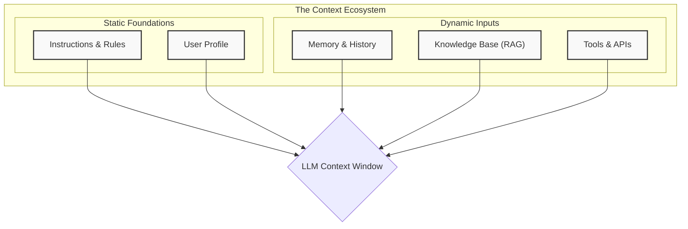

<!-- AI-METADATA:
category: methodology
complexity: intermediate
updated: 2025-07-13
claude-ready: true
priority: high
token-optimized: true
audience: developers
ai-context-weight: important
-->

# Core Components of the Context Ecosystem

<!-- AI-CONTEXT-BOUNDARY: start -->

The context provided to an LLM is not monolithic. It's a carefully assembled collection of different types of information. At Kodix, we categorize these into five core components, each serving a distinct purpose in guiding the agent's behavior and reasoning.

---

## a. Instructions & Rules

- **What it is:** The foundational, static directives that define the AI's persona, objectives, constraints, and operational principles. This is the most direct form of "telling the AI what to do and how to behave."
- **Purpose:** To ensure consistent behavior, enforce safety protocols, and align the agent's actions with high-level goals.
- **Implementation at Kodix:**
  - **System Prompts:** The core prompt that sets the stage for the entire interaction (e.g., `You are a senior software engineer...`).
  - **Rule Files:** `.md` files within the repo (like `docs/rules-ai/README.md` and `CLAUDE.md`) that are dynamically loaded into the context. This allows us to maintain and version control rules as part of the codebase.
  - **Guardrails:** Hard-coded constraints that prevent the model from taking certain actions or generating specific types of content.

---

## b. User Profile

- **What it is:** A collection of semi-static information about the current user. This includes their role, preferences, permissions, and other details that help tailor the AI's responses.
- **Purpose:** To personalize the interaction and make the AI more helpful and efficient for the specific user. An action that is correct for a senior developer might be wrong for a project manager.
- **Implementation at Kodix:**
  - **User/Team Data:** Information fetched from the `users` and `teams` tables in the database.
  - **Permissions:** Role-based access control (RBAC) data from the `permissions` package, which determines what tools the AI is allowed to use on behalf of the user.
  - **User-Specific Settings:** Configurations saved via `app.getUserAppTeamConfig` that define user preferences for a specific sub-app.

---

## c. Memory & History

- **What it is:** The dynamic record of past interactions. This can be broken down into short-term (current session) and long-term (across sessions) memory.
- **Purpose:** To provide continuity, learn from previous exchanges, and avoid repeating questions or mistakes.
- **Current State at Kodix:**
  - **Short-Term (Session Memory):** The history of messages and tool calls within the current conversation thread, managed by each AI assistant's native capabilities.
  - **Long-Term (Persistent Memory):** Currently handled through documentation files and the PRP system. Structured database-backed memory is planned but not yet implemented.

---

## d. Knowledge Base (RAG)

- **What it is:** A vast collection of external, verifiable information that the AI can query to answer questions or ground its responses in facts. This is the primary mechanism for Retrieval-Augmented Generation (RAG).
- **Purpose:** To reduce hallucinations, provide the AI with up-to-date or domain-specific knowledge, and allow it to answer questions beyond its training data.
- **Implementation at Kodix:**
  - **Codebase Indexing:** The entire Kodix monorepo is indexed, allowing the AI to perform semantic searches for relevant code, components, or documentation.
  - **Documentation (`/docs`):** All markdown files in the `docs/` directory serve as a primary knowledge source, especially for architecture, rules, and procedures.
  - **Semantic Search:** AI assistants use their built-in search capabilities to find relevant information across the codebase and documentation.

---

## 🔗 e. Tools & APIs

- **What it is:** A set of functions or API endpoints that the AI can call to perform actions or retrieve information from the outside world. This is what transforms the LLM from a text generator into a true agent.
- **Purpose:** To enable the AI to interact with other systems, fetch real-time data, and execute tasks on behalf of the user.
- **Implementation at Kodix:**
  - **tRPC Endpoints:** The primary way for the AI to interact with the Kodix backend, allowing it to fetch data from the database or trigger server-side logic.
  - **File System Tools:** A suite of tools (`read_file`, `edit_file`, `list_dir`) that allow the AI to interact directly with the workspace file system.
  - **External APIs:** Functions that call third-party services (e.g., searching the web, checking a server status).

<!-- AI-CONTEXT-BOUNDARY: end -->

---

**Last Updated**: 2025-07-13  
**Next**: [Key Strategies for Context Management](./02-key-strategies.md)
