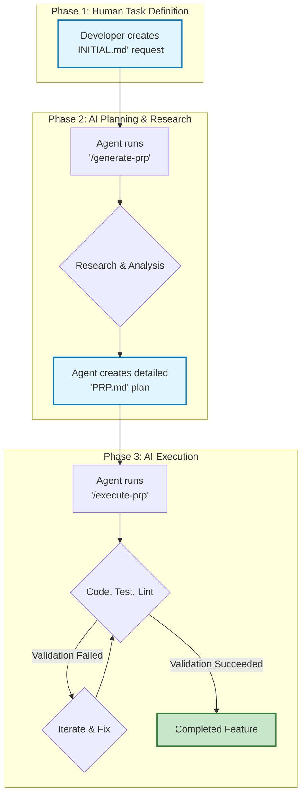

<!-- AI-METADATA:
category: methodology
complexity: intermediate
updated: 2025-07-13
claude-ready: true
priority: critical
token-optimized: true
audience: developers
ai-context-weight: critical
-->

# 4. Practical Workflow: The PRP Method

<!-- AI-CONTEXT-BOUNDARY: start -->

While the previous documents cover the "what" and "why" of Context Engineering, this document outlines the "how"—a practical, repeatable workflow for tackling complex development tasks with an AI agent at Kodix. This method is heavily inspired by the [Context Engineering Intro repository](https://github.com/coleam00/context-engineering-intro) and formalizes a two-step process: **Plan, then Execute**.

The core of this workflow is the **PRP (Product Requirements Prompt)**. A PRP is similar to a traditional PRD (Product Requirements Document), but is specifically engineered to be consumed by an AI agent, containing all the context, examples, and validation steps necessary for successful implementation.

---

## The PRP Workflow Diagram

---

## Step 1: The Initial Request (`INITIAL.md`)

Before any code is written, the developer must clearly define the task. We standardize this with a template file, let's call it `INITIAL.md`. This file is the primary input for the agent.

- **Purpose:** To force the developer to think through the requirements and provide the agent with a structured, high-quality starting point.
- **Structure:**
  - `FEATURE`: A clear and specific description of the functionality to be built.
    - ❌ **Bad:** "Add a database connection."
    - ✅ **Good:** "Implement a singleton pattern for our PostgreSQL connection using the `pg` library, with environment variables for credentials and a robust retry mechanism."
  - `EXAMPLES`: A list of files in the codebase that the agent should use as a reference. This is one of the most critical sections.
    - **Usage:** Point to specific files that demonstrate the desired coding style, testing patterns, or architectural conventions.
  - `DOCUMENTATION`: Links to any relevant external resources.
    - **Usage:** API docs, library readmes, relevant ADRs, etc.
  - `OTHER CONSIDERATIONS`: A catch-all for important details.
    - **Usage:** Mention potential gotchas, performance requirements, security constraints, or anything an agent might typically overlook.

---

## Step 2: PRP Generation (`/generate-prp`)

This is the **Research Phase**. Instead of immediately trying to solve the problem, the agent's first task is to create a comprehensive plan—the PRP.

- **Agent's Goal:** To read the `INITIAL.md`, research the codebase and documentation, and produce a detailed, step-by-step implementation plan.
- **A Good PRP Includes:**
  1.  **Context Summary:** A recap of the goal.
  2.  **File Manifest:** A list of all files to be created or modified.
  3.  **Step-by-Step Plan:** A detailed sequence of actions (e.g., "1. Add `DB_URL` to `env.ts`. 2. Create `packages/db/src/connection.ts`. 3. Implement the `connect` function...").
  4.  **Validation Gates:** Explicit commands that must be run to verify success (e.g., `pnpm test:db`, `pnpm lint`). The agent must ensure these pass.
  5.  **Success Criteria:** A clear definition of "done."

---

## Step 3: PRP Execution (`/execute-prp`)

This is the **Execution Phase**. With a detailed, context-rich plan in hand, the agent can now proceed with implementation.

- **Agent's Goal:** To follow the PRP step-by-step, executing the plan and running validation gates until all success criteria are met.
- **The Execution Loop:**
  1.  **Load Context:** The agent reads the entire PRP.
  2.  **Implement Step:** It tackles the next item in the plan.
  3.  **Validate:** After a logical chunk of work, it runs the specified validation commands.
  4.  **Iterate:** If validation fails, the agent enters a self-correction loop, debugging the issue based on the error messages until the validation passes.
  5.  **Complete:** Once all steps are implemented and all validation gates pass, the task is complete.

By adopting this structured PRP workflow, we move from "vibe-based coding" to a predictable, engineered process that dramatically increases the success rate of complex AI-driven development.

<!-- AI-CONTEXT-BOUNDARY: end -->

---

**Last Updated**: 2025-07-13  
**Next**: [PRP System Guide](./prp/README.md)
