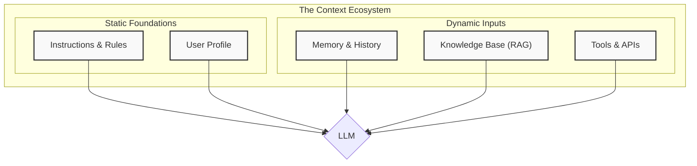
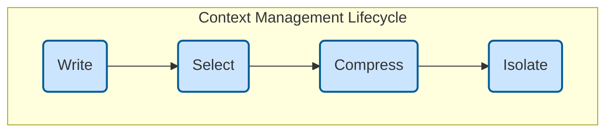

# Context Engineering at Kodix: An Overview

<!-- AI-METADATA:
category: architecture
stack: general
complexity: intermediate
dependencies: []
-->

## 🎯 Quick Summary

Context Engineering is the evolution of prompt engineering - a discipline for designing and managing the entire informational ecosystem in which AI agents operate, moving from static prompts to dynamic, stateful systems.

## 📋 Overview

**Context Engineering** represents a paradigm shift in how we interact with AI systems. Rather than crafting single, static prompts, we orchestrate a dynamic ecosystem that provides AI with the right information and tools at the right time.

Our goal is to **set the AI up for success**. Most failures in agentic systems stem not from flawed models, but from incomplete or poorly constructed context.

### Evolution from Prompt Engineering

| Principle | Prompt Engineering (Static)     | Context Engineering (Dynamic)                |
| :-------- | :------------------------------ | :------------------------------------------- |
| **Scope** | A single input (the prompt).    | The entire system of inputs.                 |
| **State** | Stateless.                      | Stateful, with memory and history.           |
| **Data**  | Included in the prompt.         | Retrieved dynamically from external sources. |
| **Goal**  | Get a good output for one task. | Build a reliable, autonomous agent.          |

## 🚀 Kodix Context Engineering Initiative

<!-- AI-CONTEXT: Strategic Documentation Upgrade -->

### Current Status

We are actively upgrading our documentation to follow structured context engineering principles. This initiative will transform our documentation from traditional human-centric content to a dual-purpose system serving both humans and AI tools effectively.

### Key Resources

- **[🌍 Universal Compatibility Principle](./universal-compatibility-principle.md)** - Core principle for cross-AI assistant compatibility
- **[📊 Strategic Upgrade Plan](./planning/kodix-documentation-upgrade-plan.md)** - Comprehensive roadmap for context engineering implementation
- **[📝 Documentation Standards](./standards/)** - Patterns and guidelines for context-aware documentation
  - [Documentation Patterns](./standards/documentation-patterns.md) - Core patterns for all documentation
- **[🚀 PRP Workflow Implementation](./planning/prp-workflow-implementation.md)** - Quick win: Structured development with `/generate-prp` and `/execute-prp` commands

### Quick Win: PRP Workflow ✅

We've successfully implemented a Product Requirements Prompt (PRP) workflow as an immediate improvement to our development process:

- **`/generate-prp`**: Transforms feature requests into detailed specifications
- **`/execute-prp`**: Executes PRPs with automated testing and quality checks
- **[📚 PRP Guide](./prp/README.md)**: Complete guide on using the PRP workflow
- **[📝 Example](./prp/INITIAL-example.md)**: Sample feature request format
- **[🤖 Universal Commands](./commands/)**: Tool-agnostic command instructions

This provides a structured approach to development while we build out the full context engineering system. The commands work universally across all AI assistants!

## 🏗️ The Anatomy of Context

A well-engineered context is composed of several layers. These components are the building blocks we use to construct the AI's "working memory" for any given task.

**Note on Instructions & Rules:** The Kodix project enforces **[Priority Policies](../rules/PRIORITY-POLICIES.md)** as the highest-level rules that must be loaded first by all AI assistants. These policies override all other instructions and establish critical development standards.

[➡️ **Learn more about the Core Components**](./01-core-components.md)

## 🔄 Key Strategies for Context Management

Managing what goes into the context window is the primary job of an AI engineer. We group our management strategies into four categories, based on the lifecycle of information.

- **Write:** Persisting context outside the context window (e.g., to a scratchpad or memory).
- **Select:** Strategically pulling relevant information _into_ the context window when needed.
- **Compress:** Summarizing or trimming context to preserve tokens and reduce noise.
- **Isolate:** Separating context across different agents or environments to manage complexity.

[➡️ **Learn more about Key Strategies**](./02-key-strategies.md)

## ⚠️ Challenges and Considerations

A large context is not always a better context. Poorly managed context can lead to specific, identifiable problems.

- **Context Poisoning:** Hallucinations or errors are saved and pollute future interactions.
- **Context Distraction:** The model is overwhelmed by irrelevant information.
- **Context Confusion:** Superfluous information influences the output incorrectly.
- **Context Clash:** Contradictory pieces of information exist within the context.

[➡️ **Learn more about Challenges and Mitigations**](./03-challenges.md)

## 💡 Practical Workflow: The PRP Method

Beyond the core concepts, we have a standardized, practical workflow for applying these principles to complex development tasks. This method, called the **Product Requirements Prompt (PRP)**, structures the interaction with an AI agent into distinct "planning" and "execution" phases.

[➡️ **Learn our step-by-step practical workflow**](./04-practical-workflow-the-prp-method.md)

## 🎯 Implementation Roadmap

<!-- AI-CONTEXT: Upgrade Timeline -->

### Phase 1: Foundation (Current)

- ✅ Strategic upgrade plan created
- 🔄 Documentation standards in development
- 📅 Template creation in progress

### Phase 2: Restructuring (Weeks 3-4)

- Architecture documentation enhancement
- SubApp standardization
- Semantic navigation creation

### Phase 3: Stack Integration (Weeks 5-6)

- Kodix stack-specific modules
- Code-documentation bridges

### Phase 4: AI Enhancement (Weeks 7-8)

- Context window optimization
- Interactive documentation features

### Phase 5: Tool Abstraction (Weeks 9-10)

- Universal documentation interface
- Multi-tool support

## 🔗 Related Resources

<!-- AI-RELATED: Cross-references -->

- [Kodix Architecture Documentation](../architecture/)
- [SubApp Documentation](../subapps/)
- [Development Standards](../architecture/coding-standards.md)

<!-- DEPENDS-ON: [all-documentation] -->
<!-- REQUIRED-BY: [ai-tools, development-workflow] -->
<!-- SEE-ALSO: [docs/README.md] -->
