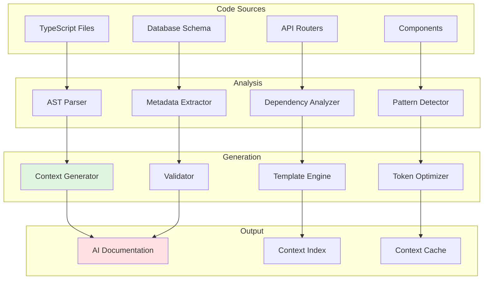

<!-- AI-METADATA:
category: automation
complexity: advanced
updated: 2025-01-12
claude-ready: true
phase: 4
priority: high
token-optimized: true
audience: developers
ai-context-weight: important
-->

<!-- AI-CONTEXT-BOUNDARY: start -->
# Automated Context Generation

> Scripts and tools for automatically generating and maintaining AI-consumable context from codebase

## 🎯 Purpose

Automate the creation and maintenance of documentation context to ensure AI assistants always have access to current, accurate information about the Kodix codebase.

## 🤖 Automation Architecture

### Overview



## 📝 Context Generation Scripts

### Main Generation Script

```typescript
// scripts/generate-ai-context.ts
import { generateRouterContext } from './generators/router-context';
import { generateComponentContext } from './generators/component-context';
import { generateSchemaContext } from './generators/schema-context';
import { optimizeTokenUsage } from './optimizers/token-optimizer';
import { validateContext } from './validators/context-validator';

interface GenerationConfig {
  outputDir: string;
  maxTokensPerFile: number;
  includeExamples: boolean;
  compressionLevel: 'none' | 'basic' | 'aggressive';
}

export async function generateAIContext(config: GenerationConfig) {
  console.log('🚀 Starting AI context generation...');
  
  // 1. Analyze codebase structure
  const analysis = await analyzeCodebase();
  
  // 2. Generate context for each layer
  const contexts = await Promise.all([
    generateRouterContext(analysis.routers),
    generateComponentContext(analysis.components),
    generateSchemaContext(analysis.schemas),
    generateServiceContext(analysis.services),
  ]);
  
  // 3. Optimize for token usage
  const optimizedContexts = await optimizeTokenUsage(contexts, config);
  
  // 4. Validate generated context
  const validationResults = await validateContext(optimizedContexts);
  
  // 5. Write to output directory
  await writeContextFiles(optimizedContexts, config.outputDir);
  
  // 6. Generate index and metadata
  await generateContextIndex(optimizedContexts, config.outputDir);
  
  console.log('✅ AI context generation complete!');
  return {
    filesGenerated: optimizedContexts.length,
    totalTokens: calculateTotalTokens(optimizedContexts),
    validation: validationResults,
  };
}

// Usage in package.json script
// "ai:generate-context": "tsx scripts/generate-ai-context.ts"
```

### Router Context Generator

```typescript
// scripts/generators/router-context.ts
import { readFileSync } from 'fs';
import { Project, SourceFile } from 'ts-morph';
import { extractTRPCRouters } from '../analyzers/trpc-analyzer';

export interface RouterContext {
  name: string;
  procedures: ProcedureContext[];
  patterns: string[];
  examples: CodeExample[];
  tokenCount: number;
}

export async function generateRouterContext(
  routerFiles: string[]
): Promise<RouterContext[]> {
  const project = new Project();
  const contexts: RouterContext[] = [];
  
  for (const filePath of routerFiles) {
    const sourceFile = project.addSourceFileAtPath(filePath);
    const routers = extractTRPCRouters(sourceFile);
    
    for (const router of routers) {
      const context: RouterContext = {
        name: router.name,
        procedures: await analyzeProcedures(router.procedures),
        patterns: extractPatterns(router),
        examples: generateCodeExamples(router),
        tokenCount: 0, // Will be calculated later
      };
      
      contexts.push(context);
    }
  }
  
  return contexts;
}

function extractPatterns(router: any): string[] {
  const patterns = [];
  
  // Check for team isolation pattern
  if (hasTeamIsolation(router)) {
    patterns.push('team-isolation');
  }
  
  // Check for pagination pattern
  if (hasPagination(router)) {
    patterns.push('pagination');
  }
  
  // Check for error handling pattern
  if (hasProperErrorHandling(router)) {
    patterns.push('error-handling');
  }
  
  return patterns;
}

async function analyzeProcedures(procedures: any[]): Promise<ProcedureContext[]> {
  return procedures.map(proc => ({
    name: proc.name,
    type: proc.type, // query | mutation
    input: extractInputSchema(proc),
    output: extractOutputType(proc),
    permissions: extractPermissions(proc),
    validation: extractValidation(proc),
  }));
}
```

### Component Context Generator

```typescript
// scripts/generators/component-context.ts
import { ComponentAnalyzer } from '../analyzers/component-analyzer';

export interface ComponentContext {
  name: string;
  type: 'page' | 'container' | 'presentation' | 'utility';
  props: PropContext[];
  hooks: HookUsage[];
  patterns: string[];
  examples: string[];
  dependencies: string[];
  tokenCount: number;
}

export async function generateComponentContext(
  componentFiles: string[]
): Promise<ComponentContext[]> {
  const analyzer = new ComponentAnalyzer();
  const contexts: ComponentContext[] = [];
  
  for (const filePath of componentFiles) {
    const analysis = await analyzer.analyzeComponent(filePath);
    
    const context: ComponentContext = {
      name: analysis.name,
      type: categorizeComponent(analysis),
      props: extractPropTypes(analysis),
      hooks: extractHookUsage(analysis),
      patterns: identifyPatterns(analysis),
      examples: generateUsageExamples(analysis),
      dependencies: analysis.dependencies,
      tokenCount: 0,
    };
    
    contexts.push(context);
  }
  
  return contexts;
}

function categorizeComponent(analysis: any): ComponentContext['type'] {
  // Analyze component to determine its category
  if (analysis.hasDataFetching) return 'container';
  if (analysis.isRoutePage) return 'page';
  if (analysis.isUtilityComponent) return 'utility';
  return 'presentation';
}

function identifyPatterns(analysis: any): string[] {
  const patterns = [];
  
  if (analysis.usesTRPC) patterns.push('trpc-integration');
  if (analysis.hasLoadingStates) patterns.push('loading-states');
  if (analysis.hasErrorHandling) patterns.push('error-handling');
  if (analysis.usesI18n) patterns.push('internationalization');
  if (analysis.isResponsive) patterns.push('responsive-design');
  
  return patterns;
}
```

### Schema Context Generator

```typescript
// scripts/generators/schema-context.ts
import { SchemaAnalyzer } from '../analyzers/schema-analyzer';

export interface SchemaContext {
  tableName: string;
  fields: FieldContext[];
  relations: RelationContext[];
  indexes: IndexContext[];
  patterns: string[];
  migrations: MigrationInfo[];
  tokenCount: number;
}

export async function generateSchemaContext(
  schemaFiles: string[]
): Promise<SchemaContext[]> {
  const analyzer = new SchemaAnalyzer();
  const contexts: SchemaContext[] = [];
  
  for (const filePath of schemaFiles) {
    const tables = await analyzer.extractTables(filePath);
    
    for (const table of tables) {
      const context: SchemaContext = {
        tableName: table.name,
        fields: analyzeFields(table.fields),
        relations: analyzeRelations(table),
        indexes: analyzeIndexes(table),
        patterns: identifySchemaPatterns(table),
        migrations: findRelatedMigrations(table.name),
        tokenCount: 0,
      };
      
      contexts.push(context);
    }
  }
  
  return contexts;
}

function identifySchemaPatterns(table: any): string[] {
  const patterns = [];
  
  if (hasTeamIdField(table)) patterns.push('team-isolation');
  if (hasTimestamps(table)) patterns.push('audit-timestamps');
  if (hasSoftDelete(table)) patterns.push('soft-delete');
  if (hasUUIDPrimaryKey(table)) patterns.push('uuid-primary-key');
  
  return patterns;
}
```

## 🔧 Analysis Tools

### AST-Based Code Analysis

```typescript
// scripts/analyzers/ast-analyzer.ts
import { Project, Node, SyntaxKind } from 'ts-morph';

export class ASTAnalyzer {
  private project: Project;
  
  constructor() {
    this.project = new Project({
      tsConfigFilePath: 'tsconfig.json',
    });
  }
  
  analyzeFile(filePath: string) {
    const sourceFile = this.project.addSourceFileAtPath(filePath);
    
    return {
      imports: this.extractImports(sourceFile),
      exports: this.extractExports(sourceFile),
      functions: this.extractFunctions(sourceFile),
      types: this.extractTypes(sourceFile),
      patterns: this.identifyPatterns(sourceFile),
    };
  }
  
  private extractImports(sourceFile: any) {
    return sourceFile
      .getImportDeclarations()
      .map((imp: any) => ({
        module: imp.getModuleSpecifierValue(),
        imports: imp.getNamedImports().map((ni: any) => ni.getName()),
      }));
  }
  
  private identifyPatterns(sourceFile: any): string[] {
    const patterns = [];
    const text = sourceFile.getFullText();
    
    // Check for common Kodix patterns
    if (text.includes('useTRPC()')) patterns.push('trpc-hook-pattern');
    if (text.includes('protectedProcedure')) patterns.push('auth-protection');
    if (text.includes('teamId')) patterns.push('team-isolation');
    if (text.includes('useTranslation')) patterns.push('i18n-integration');
    if (text.includes('TRPCError')) patterns.push('error-handling');
    
    return patterns;
  }
}
```

### Dependency Analysis

```typescript
// scripts/analyzers/dependency-analyzer.ts
export class DependencyAnalyzer {
  async analyzeDependencies(filePath: string) {
    const deps = await this.extractDependencies(filePath);
    
    return {
      direct: deps.direct,
      transitive: deps.transitive,
      circular: this.detectCircularDeps(deps),
      external: deps.external,
      internal: deps.internal,
    };
  }
  
  private async extractDependencies(filePath: string) {
    // Implementation to extract all dependencies
    // Returns categorized dependency information
  }
  
  detectCircularDeps(deps: any): string[] {
    // Algorithm to detect circular dependencies
    return [];
  }
}
```

## 📊 Token Optimization

### Context Optimizer

```typescript
// scripts/optimizers/token-optimizer.ts
export class TokenOptimizer {
  async optimize(
    contexts: any[], 
    maxTokens: number
  ): Promise<OptimizedContext[]> {
    const optimized = [];
    
    for (const context of contexts) {
      const compressed = await this.compressContext(context, maxTokens);
      optimized.push(compressed);
    }
    
    return optimized;
  }
  
  private async compressContext(
    context: any, 
    maxTokens: number
  ): Promise<OptimizedContext> {
    let currentTokens = this.estimateTokens(context);
    
    if (currentTokens <= maxTokens) {
      return context;
    }
    
    // Apply compression strategies
    context = await this.removeRedundantInfo(context);
    context = await this.shortenExamples(context);
    context = await this.useReferences(context);
    
    return context;
  }
  
  private estimateTokens(content: any): number {
    // Rough estimation: 1 token ≈ 4 characters
    const text = JSON.stringify(content);
    return Math.ceil(text.length / 4);
  }
}
```

### Template Engine

```typescript
// scripts/generators/template-engine.ts
export class TemplateEngine {
  private templates: Map<string, string> = new Map();
  
  constructor() {
    this.loadTemplates();
  }
  
  generate(type: string, context: any): string {
    const template = this.templates.get(type);
    if (!template) {
      throw new Error(`Template not found: ${type}`);
    }
    
    return this.renderTemplate(template, context);
  }
  
  private renderTemplate(template: string, context: any): string {
    // Use a templating engine like handlebars or implement simple substitution
    return template.replace(/\{\{(\w+)\}\}/g, (match, key) => {
      return context[key] || match;
    });
  }
  
  private loadTemplates() {
    // Load templates for different context types
    this.templates.set('router', this.getRouterTemplate());
    this.templates.set('component', this.getComponentTemplate());
    this.templates.set('schema', this.getSchemaTemplate());
  }
  
  private getRouterTemplate(): string {
    return `
<!-- AI-CONTEXT: {{name}} Router -->
# {{name}} Router Context

## Procedures
{{#each procedures}}
- **{{name}}** ({{type}}): {{description}}
  - Input: {{input}}
  - Output: {{output}}
  - Patterns: {{patterns}}
{{/each}}

## Usage Examples
\`\`\`typescript
{{examples}}
\`\`\`

Token Count: {{tokenCount}}
    `;
  }
}
```

## 🔄 Continuous Integration

### GitHub Actions Workflow

```yaml
# .github/workflows/ai-context-generation.yml
name: Generate AI Context

on:
  push:
    branches: [main, develop]
    paths: 
      - 'packages/**/*.ts'
      - 'apps/**/*.tsx'
      - 'packages/db/schema/**'
  schedule:
    - cron: '0 2 * * *' # Daily at 2 AM

jobs:
  generate-context:
    runs-on: ubuntu-latest
    
    steps:
      - uses: actions/checkout@v4
      
      - name: Setup Node.js
        uses: actions/setup-node@v4
        with:
          node-version: '22'
          cache: 'pnpm'
          
      - name: Install dependencies
        run: pnpm install
        
      - name: Generate AI Context
        run: pnpm ai:generate-context
        
      - name: Validate Generated Context
        run: pnpm ai:validate-context
        
      - name: Check for changes
        id: changes
        run: |
          git diff --quiet docs/ai-context/ || echo "changed=true" >> $GITHUB_OUTPUT
          
      - name: Commit changes
        if: steps.changes.outputs.changed == 'true'
        run: |
          git config --local user.email "action@github.com"
          git config --local user.name "GitHub Action"
          git add docs/ai-context/
          git commit -m "🤖 Update AI context [skip ci]"
          git push
```

### Pre-commit Hooks

```bash
# .husky/pre-commit
#!/usr/bin/env sh
. "$(dirname -- "$0")/_/husky.sh"

# Check if files that affect AI context have changed
if git diff --cached --name-only | grep -E '\.(ts|tsx)$' > /dev/null; then
  echo "🤖 Updating AI context for changed files..."
  pnpm ai:update-context-incremental
fi
```

## 📋 Usage Instructions

### Setup

```bash
# Install dependencies
pnpm install

# Initial context generation
pnpm ai:generate-context

# Validate context
pnpm ai:validate-context

# Watch for changes and update
pnpm ai:watch-context
```

### Package.json Scripts

```json
{
  "scripts": {
    "ai:generate-context": "tsx scripts/generate-ai-context.ts",
    "ai:validate-context": "tsx scripts/validate-context.ts",
    "ai:update-context-incremental": "tsx scripts/update-context-incremental.ts",
    "ai:watch-context": "chokidar 'packages/**/*.ts' 'apps/**/*.tsx' -c 'pnpm ai:update-context-incremental'",
    "ai:compress-context": "tsx scripts/compress-context.ts",
    "ai:analyze-tokens": "tsx scripts/analyze-token-usage.ts"
  }
}
```

### Configuration

```typescript
// ai-context.config.ts
export const contextConfig = {
  outputDir: 'docs/ai-context',
  maxTokensPerFile: 2000,
  compressionLevel: 'basic' as const,
  includeExamples: true,
  watchPaths: [
    'packages/**/*.ts',
    'apps/**/*.tsx',
    'packages/db/schema/**',
  ],
  excludePaths: [
    '**/*.test.ts',
    '**/*.spec.ts',
    '**/node_modules/**',
  ],
  patterns: {
    detectTeamIsolation: true,
    detectErrorHandling: true,
    detectI18nUsage: true,
    detectTRPCPatterns: true,
  },
};
```

## 🔗 Related Resources

- [Code to Context Bridges](./code-to-context-bridges.md)
- [Intelligent Summarization](./intelligent-summarization.md)
- [Context Compression](../ai-optimization/context-compression.md)

<!-- AI-CONTEXT-BOUNDARY: end -->