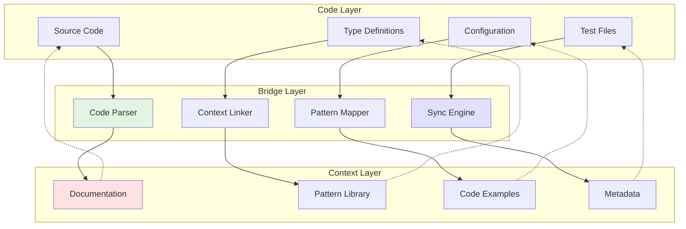

<!-- AI-METADATA:
category: automation
complexity: intermediate
updated: 2025-01-12
claude-ready: true
phase: 4
priority: high
token-optimized: true
audience: developers
ai-context-weight: important
-->

<!-- AI-CONTEXT-BOUNDARY: start -->
# Code-to-Context Bridges

> Automated systems for linking code implementations to AI-consumable documentation context

## 🎯 Purpose

Create automated bridges between code and documentation, ensuring AI assistants can understand the relationship between implementation and context, enabling more accurate code generation and maintenance.

## 🌉 Bridge Architecture

### Overview



## 🔗 Bridge Implementation

### Comment-Based Linking

```typescript
// Code with AI-consumable comments
export class UserService {
  /**
   * @ai-context: user-management
   * @ai-pattern: service-layer
   * @ai-example: docs/examples/user-service.md
   * @ai-related: UserController, UserRepository
   */
  async createUser(data: CreateUserDto): Promise<User> {
    // @ai-note: Validates team isolation before creation
    await this.validateTeamAccess(data.teamId);
    
    // @ai-pattern: audit-logging
    const user = await this.repository.create({
      ...data,
      createdAt: new Date(),
      createdBy: this.getCurrentUserId(),
    });
    
    // @ai-event: user-created
    this.eventEmitter.emit('user.created', user);
    
    return user;
  }
}
```

### TypeScript Decorator System

```typescript
// Enhanced decorator system for context linking
import { AIContext, AIPattern, AIExample } from '../decorators/ai-annotations';

@AIContext({
  category: 'service',
  patterns: ['team-isolation', 'audit-logging', 'event-emission'],
  documentation: 'docs/services/user-service.md',
  examples: ['docs/examples/user-crud.md'],
})
export class UserService {
  
  @AIPattern('crud-operation')
  @AIExample('user-creation-example')
  async createUser(
    @AIValidation('CreateUserDto') data: CreateUserDto
  ): Promise<User> {
    // Implementation
  }
  
  @AIPattern('query-operation')
  @AITeamIsolation(true)
  async findUsersByTeam(teamId: string): Promise<User[]> {
    // Implementation with automatic team isolation documentation
  }
}
```

### Configuration Bridges

```typescript
// ai-bridge.config.ts
export const bridgeConfig = {
  // Map code patterns to documentation
  patterns: {
    'createTRPCRouter': {
      documentation: 'docs/patterns/trpc-router.md',
      examples: 'docs/examples/router-implementation.md',
      context: 'api-development',
    },
    'protectedProcedure': {
      documentation: 'docs/patterns/auth-protection.md',
      context: 'authentication',
    },
    'useTRPC': {
      documentation: 'docs/patterns/frontend-api.md',
      context: 'data-fetching',
    },
  },
  
  // Map file paths to context categories
  fileMapping: {
    'packages/api/src/routers/*.ts': 'api-layer',
    'apps/web/src/subapps/*/components/*.tsx': 'ui-components',
    'packages/db/schema/*.ts': 'data-layer',
    'apps/web/src/subapps/*/server/*.ts': 'server-components',
  },
  
  // Context inheritance rules
  inheritance: {
    'api-layer': ['service-layer', 'data-layer'],
    'ui-components': ['design-system', 'state-management'],
    'server-components': ['api-layer', 'authentication'],
  },
};
```

## 🔄 Real-time Synchronization

### File Watcher System

```typescript
// scripts/bridges/file-watcher.ts
import chokidar from 'chokidar';
import { updateContextFromCode } from './context-updater';
import { validateBridgeIntegrity } from './bridge-validator';

export class CodeContextBridge {
  private watcher: chokidar.FSWatcher;
  private updateQueue: Map<string, NodeJS.Timeout> = new Map();
  
  constructor() {
    this.watcher = chokidar.watch([
      'packages/**/*.ts',
      'apps/**/*.tsx',
    ], {
      ignored: ['**/node_modules/**', '**/*.d.ts'],
      persistent: true,
    });
    
    this.setupWatchers();
  }
  
  private setupWatchers() {
    this.watcher
      .on('change', (filePath) => this.scheduleUpdate(filePath))
      .on('add', (filePath) => this.scheduleUpdate(filePath))
      .on('unlink', (filePath) => this.handleFileDelete(filePath));
  }
  
  private scheduleUpdate(filePath: string) {
    // Debounce updates to avoid excessive processing
    const existingTimeout = this.updateQueue.get(filePath);
    if (existingTimeout) {
      clearTimeout(existingTimeout);
    }
    
    const timeout = setTimeout(async () => {
      try {
        await this.updateContext(filePath);
        this.updateQueue.delete(filePath);
      } catch (error) {
        console.error(`Failed to update context for ${filePath}:`, error);
      }
    }, 1000); // 1 second debounce
    
    this.updateQueue.set(filePath, timeout);
  }
  
  private async updateContext(filePath: string) {
    console.log(`🔄 Updating context for: ${filePath}`);
    
    // 1. Parse the code for AI annotations
    const annotations = await this.parseAIAnnotations(filePath);
    
    // 2. Update related documentation
    await updateContextFromCode(filePath, annotations);
    
    // 3. Validate bridge integrity
    await validateBridgeIntegrity(filePath);
    
    console.log(`✅ Context updated for: ${filePath}`);
  }
  
  private async parseAIAnnotations(filePath: string) {
    // Extract @ai-context, @ai-pattern, etc. from code
    const content = await fs.readFile(filePath, 'utf-8');
    const annotations = {
      contexts: this.extractPattern(content, /@ai-context:\s*(\S+)/g),
      patterns: this.extractPattern(content, /@ai-pattern:\s*(\S+)/g),
      examples: this.extractPattern(content, /@ai-example:\s*(\S+)/g),
      notes: this.extractPattern(content, /@ai-note:\s*(.+)/g),
    };
    
    return annotations;
  }
  
  private extractPattern(content: string, regex: RegExp): string[] {
    const matches = [];
    let match;
    while ((match = regex.exec(content)) !== null) {
      matches.push(match[1]);
    }
    return matches;
  }
}
```

### Context Updater

```typescript
// scripts/bridges/context-updater.ts
export async function updateContextFromCode(
  filePath: string, 
  annotations: any
) {
  const contextUpdates = [];
  
  // Update documentation based on annotations
  for (const contextName of annotations.contexts) {
    const contextFile = `docs/ai-context/${contextName}.md`;
    const update = await generateContextUpdate(filePath, contextName);
    contextUpdates.push({ file: contextFile, content: update });
  }
  
  // Update pattern library
  for (const patternName of annotations.patterns) {
    const patternFile = `docs/patterns/${patternName}.md`;
    const update = await generatePatternUpdate(filePath, patternName);
    contextUpdates.push({ file: patternFile, content: update });
  }
  
  // Write all updates
  for (const update of contextUpdates) {
    await writeContextUpdate(update.file, update.content);
  }
}

async function generateContextUpdate(filePath: string, contextName: string) {
  // Analyze code to generate context documentation
  const codeAnalysis = await analyzeCode(filePath);
  
  return {
    timestamp: new Date().toISOString(),
    sourceFile: filePath,
    context: contextName,
    patterns: codeAnalysis.patterns,
    examples: codeAnalysis.examples,
    dependencies: codeAnalysis.dependencies,
  };
}
```

## 📊 Bridge Validation

### Integrity Checker

```typescript
// scripts/bridges/bridge-validator.ts
export class BridgeValidator {
  async validateIntegrity(filePath?: string) {
    const results = {
      valid: true,
      errors: [],
      warnings: [],
      suggestions: [],
    };
    
    const files = filePath ? [filePath] : await this.getAllCodeFiles();
    
    for (const file of files) {
      const validation = await this.validateFile(file);
      results.errors.push(...validation.errors);
      results.warnings.push(...validation.warnings);
      results.suggestions.push(...validation.suggestions);
      
      if (validation.errors.length > 0) {
        results.valid = false;
      }
    }
    
    return results;
  }
  
  private async validateFile(filePath: string) {
    const content = await fs.readFile(filePath, 'utf-8');
    const annotations = this.parseAnnotations(content);
    const errors = [];
    const warnings = [];
    const suggestions = [];
    
    // Check if referenced documentation exists
    for (const contextRef of annotations.contexts) {
      const contextFile = `docs/ai-context/${contextRef}.md`;
      if (!await fs.pathExists(contextFile)) {
        errors.push({
          file: filePath,
          type: 'missing-context',
          message: `Referenced context '${contextRef}' not found at ${contextFile}`,
        });
      }
    }
    
    // Check if patterns are documented
    for (const pattern of annotations.patterns) {
      const patternFile = `docs/patterns/${pattern}.md`;
      if (!await fs.pathExists(patternFile)) {
        warnings.push({
          file: filePath,
          type: 'missing-pattern',
          message: `Pattern '${pattern}' should be documented at ${patternFile}`,
        });
      }
    }
    
    // Suggest missing annotations
    if (this.shouldHaveAIAnnotations(content) && annotations.contexts.length === 0) {
      suggestions.push({
        file: filePath,
        type: 'missing-annotations',
        message: 'Consider adding @ai-context annotations for better AI understanding',
      });
    }
    
    return { errors, warnings, suggestions };
  }
  
  private shouldHaveAIAnnotations(content: string): boolean {
    // Check if file contains patterns that should be annotated
    return (
      content.includes('createTRPCRouter') ||
      content.includes('export class') ||
      content.includes('export function') ||
      content.includes('export const')
    );
  }
}
```

## 🎯 Smart Context Generation

### Pattern Detection

```typescript
// scripts/bridges/pattern-detector.ts
export class PatternDetector {
  async detectPatterns(filePath: string) {
    const content = await fs.readFile(filePath, 'utf-8');
    const ast = this.parseAST(content);
    const patterns = [];
    
    // Detect common Kodix patterns
    if (this.hasPattern(content, 'createTRPCRouter')) {
      patterns.push({
        name: 'trpc-router',
        confidence: 0.9,
        context: 'api-development',
        examples: this.extractRouterExamples(ast),
      });
    }
    
    if (this.hasPattern(content, 'protectedProcedure')) {
      patterns.push({
        name: 'auth-protection',
        confidence: 0.95,
        context: 'authentication',
        examples: this.extractAuthExamples(ast),
      });
    }
    
    if (this.hasPattern(content, 'teamId.*eq\\(')) {
      patterns.push({
        name: 'team-isolation',
        confidence: 0.8,
        context: 'multi-tenancy',
        examples: this.extractTeamIsolationExamples(ast),
      });
    }
    
    return patterns;
  }
  
  private hasPattern(content: string, pattern: string): boolean {
    const regex = new RegExp(pattern);
    return regex.test(content);
  }
}
```

### Auto-Documentation Generator

```typescript
// scripts/bridges/auto-doc-generator.ts
export class AutoDocGenerator {
  async generateDocumentationFromCode(filePath: string) {
    const analysis = await this.analyzeCode(filePath);
    const template = this.selectTemplate(analysis.type);
    
    const documentation = this.renderTemplate(template, {
      fileName: path.basename(filePath),
      analysis,
      patterns: analysis.patterns,
      examples: this.generateExamples(analysis),
      usage: this.generateUsageInstructions(analysis),
      relatedFiles: await this.findRelatedFiles(filePath),
    });
    
    return documentation;
  }
  
  private selectTemplate(codeType: string): string {
    const templates = {
      'trpc-router': this.getRouterTemplate(),
      'react-component': this.getComponentTemplate(),
      'service-class': this.getServiceTemplate(),
      'database-schema': this.getSchemaTemplate(),
    };
    
    return templates[codeType] || this.getGenericTemplate();
  }
  
  private getRouterTemplate(): string {
    return `
# {{fileName}} Context

## Purpose
{{analysis.description}}

## Patterns Used
{{#each patterns}}
- **{{name}}**: {{description}}
{{/each}}

## Procedures
{{#each analysis.procedures}}
### {{name}} ({{type}})
- **Input**: {{input}}
- **Output**: {{output}}
- **Authorization**: {{auth}}
- **Team Isolation**: {{teamIsolation}}

\`\`\`typescript
{{example}}
\`\`\`
{{/each}}

## Related Files
{{#each relatedFiles}}
- [{{name}}]({{path}})
{{/each}}

**Last Updated**: {{timestamp}}
**Source**: {{fileName}}
    `;
  }
}
```

## 🚀 Advanced Features

### AI-Powered Context Enhancement

```typescript
// scripts/bridges/ai-enhancer.ts
export class AIContextEnhancer {
  async enhanceContext(filePath: string, baseContext: any) {
    // Use AI to improve generated context
    const enhancedContext = await this.callAI({
      prompt: `
        Enhance this code context for AI assistant consumption:
        
        File: ${filePath}
        Current Context: ${JSON.stringify(baseContext, null, 2)}
        
        Please:
        1. Add missing pattern descriptions
        2. Improve example clarity
        3. Add usage recommendations
        4. Suggest related concepts
        
        Keep response under 500 tokens.
      `,
      maxTokens: 500,
    });
    
    return this.mergeContexts(baseContext, enhancedContext);
  }
  
  private async callAI(request: any) {
    // Integration with AI service for context enhancement
    // This could use OpenAI, Anthropic, or local models
  }
}
```

### Cross-Reference Discovery

```typescript
// scripts/bridges/cross-ref-discovery.ts
export class CrossReferenceDiscovery {
  async discoverReferences(filePath: string) {
    const references = {
      imports: await this.findImportReferences(filePath),
      exports: await this.findExportUsages(filePath),
      types: await this.findTypeUsages(filePath),
      patterns: await this.findPatternUsages(filePath),
    };
    
    return this.generateReferenceMap(references);
  }
  
  private async findPatternUsages(filePath: string) {
    // Find where patterns from this file are used elsewhere
    const patterns = await this.extractPatterns(filePath);
    const usages = [];
    
    for (const pattern of patterns) {
      const files = await this.searchForPattern(pattern);
      usages.push({ pattern, files });
    }
    
    return usages;
  }
}
```

## 📋 Usage Instructions

### Setup Bridge System

```bash
# Install bridge dependencies
pnpm install -D @typescript-eslint/typescript-estree chokidar

# Initialize bridge system
pnpm bridge:init

# Start watching for changes
pnpm bridge:watch

# Validate bridge integrity
pnpm bridge:validate
```

### Annotation Guidelines

```typescript
// Best practices for AI annotations

// 1. Context Annotations
/**
 * @ai-context: user-management
 * @ai-pattern: service-layer
 * @ai-example: docs/examples/user-service.md
 */

// 2. Inline Pattern Notes
// @ai-pattern: team-isolation
const users = await db.query.users.findMany({
  where: eq(users.teamId, currentTeamId),
});

// 3. Event Documentation
// @ai-event: user-created
// @ai-payload: { id: string, email: string, teamId: string }
this.eventEmitter.emit('user.created', user);

// 4. Related Context Links
// @ai-related: UserController, UserRepository, UserDto
// @ai-depends: TeamService, AuthService
```

## 🔗 Related Resources

- [Auto Context Generation](./auto-context-generation.md)
- [Intelligent Summarization](./intelligent-summarization.md)
- [Context Compression](../ai-optimization/context-compression.md)

<!-- AI-CONTEXT-BOUNDARY: end -->