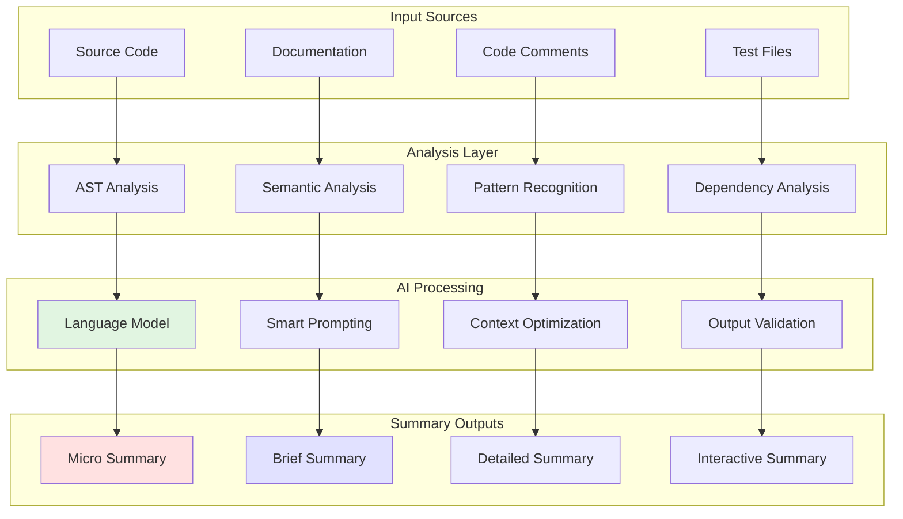

<!-- AI-METADATA:
category: automation
complexity: advanced
updated: 2025-01-12
claude-ready: true
phase: 4
priority: high
token-optimized: true
audience: developers
ai-context-weight: important
-->

<!-- AI-CONTEXT-BOUNDARY: start -->
# Intelligent Summarization

> AI-powered systems for automatically generating concise, contextually relevant summaries of code and documentation

## 🎯 Purpose

Leverage AI to automatically create intelligent summaries of complex codebases, enabling faster comprehension and more efficient context delivery to AI assistants.

## 🧠 Summarization Architecture

### Multi-Level Summarization



## 📝 Summary Types & Implementation

### Micro Summaries (10-20 tokens)

```typescript
// scripts/summarization/micro-summarizer.ts
export class MicroSummarizer {
  async generateMicroSummary(filePath: string): Promise<string> {
    const analysis = await this.analyzeFile(filePath);
    
    const prompt = `
      Summarize this ${analysis.type} in 10-15 words:
      
      File: ${path.basename(filePath)}
      Purpose: ${analysis.purpose}
      Key Patterns: ${analysis.patterns.slice(0, 3).join(', ')}
      
      Format: "${analysis.type}: [purpose] using [key pattern]"
    `;
    
    const summary = await this.callAI(prompt, { maxTokens: 20 });
    return this.validateMicroSummary(summary);
  }
  
  private validateMicroSummary(summary: string): string {
    // Ensure summary meets micro format requirements
    const wordCount = summary.split(' ').length;
    if (wordCount > 20) {
      throw new Error(`Micro summary too long: ${wordCount} words`);
    }
    return summary;
  }
}

// Example outputs:
// "tRPC Router: User CRUD operations with team isolation"
// "React Component: Calendar view with drag-drop events"
// "Service Class: Email sending with template rendering"
```

### Brief Summaries (50-100 tokens)

```typescript
// scripts/summarization/brief-summarizer.ts
export class BriefSummarizer {
  async generateBriefSummary(filePath: string): Promise<BriefSummary> {
    const analysis = await this.analyzeFile(filePath);
    
    const prompt = this.buildBriefPrompt(analysis);
    const summary = await this.callAI(prompt, { maxTokens: 100 });
    
    return this.structureBriefSummary(summary, analysis);
  }
  
  private buildBriefPrompt(analysis: any): string {
    return `
      Create a brief technical summary (50-80 words) for:
      
      **File**: ${analysis.fileName}
      **Type**: ${analysis.type}
      **Purpose**: ${analysis.purpose}
      **Key Functions**: ${analysis.keyFunctions.join(', ')}
      **Patterns**: ${analysis.patterns.join(', ')}
      **Dependencies**: ${analysis.mainDependencies.join(', ')}
      
      Include:
      1. Primary responsibility (1 sentence)
      2. Key features/patterns (1-2 bullet points)
      3. Integration points (1 sentence)
      
      Keep technical, concise, actionable.
    `;
  }
  
  private structureBriefSummary(summary: string, analysis: any): BriefSummary {
    return {
      micro: this.extractFirstSentence(summary),
      purpose: this.extractPurpose(summary),
      features: this.extractFeatures(summary),
      integration: this.extractIntegration(summary),
      patterns: analysis.patterns,
      tokenCount: this.estimateTokens(summary),
    };
  }
}
```

### Detailed Summaries (200-500 tokens)

```typescript
// scripts/summarization/detailed-summarizer.ts
export class DetailedSummarizer {
  async generateDetailedSummary(filePath: string): Promise<DetailedSummary> {
    const analysis = await this.deepAnalyzeFile(filePath);
    const context = await this.gatherRelatedContext(filePath);
    
    const prompt = this.buildDetailedPrompt(analysis, context);
    const summary = await this.callAI(prompt, { maxTokens: 500 });
    
    return this.structureDetailedSummary(summary, analysis, context);
  }
  
  private buildDetailedPrompt(analysis: any, context: any): string {
    return `
      Create a comprehensive technical summary for AI assistant consumption:
      
      **File Analysis**:
      ${JSON.stringify(analysis, null, 2)}
      
      **Related Context**:
      ${JSON.stringify(context, null, 2)}
      
      Structure the summary as:
      
      ## Purpose & Responsibility
      [Main purpose and scope]
      
      ## Architecture & Patterns
      [Design patterns and architectural decisions]
      
      ## Key Implementation Details
      [Important functions, classes, or components]
      
      ## Integration Points
      [How it connects to other parts of the system]
      
      ## Usage Patterns
      [How other code should interact with this]
      
      ## AI Development Notes
      [Specific guidance for AI assistants working with this code]
      
      Keep under 400 tokens, focus on information useful for code generation.
    `;
  }
}
```

## 🔍 Analysis Components

### Semantic Code Analysis

```typescript
// scripts/analysis/semantic-analyzer.ts
export class SemanticAnalyzer {
  async analyzeSemantics(filePath: string) {
    const ast = await this.parseAST(filePath);
    const content = await fs.readFile(filePath, 'utf-8');
    
    return {
      intent: await this.extractIntent(ast, content),
      complexity: this.calculateComplexity(ast),
      responsibilities: this.identifyResponsibilities(ast),
      relationships: await this.mapRelationships(ast),
      businessLogic: this.extractBusinessLogic(ast),
      technicalConcerns: this.extractTechnicalConcerns(ast),
    };
  }
  
  private async extractIntent(ast: any, content: string): Promise<string> {
    // Use AI to understand the intent behind the code
    const prompt = `
      Analyze this code structure and determine its primary intent:
      
      Functions: ${this.extractFunctionNames(ast)}
      Classes: ${this.extractClassNames(ast)}
      Imports: ${this.extractImports(ast)}
      
      Key code patterns:
      ${this.extractKeyPatterns(content)}
      
      What is the primary intent/purpose of this file? (1 sentence)
    `;
    
    return await this.callAI(prompt, { maxTokens: 50 });
  }
  
  private identifyResponsibilities(ast: any): string[] {
    const responsibilities = [];
    
    // Analyze functions to identify responsibilities
    const functions = this.extractFunctions(ast);
    for (const func of functions) {
      const responsibility = this.inferResponsibility(func);
      if (responsibility) {
        responsibilities.push(responsibility);
      }
    }
    
    return [...new Set(responsibilities)]; // Remove duplicates
  }
}
```

### Pattern Recognition Engine

```typescript
// scripts/analysis/pattern-recognizer.ts
export class PatternRecognizer {
  private patterns: Map<string, PatternDefinition> = new Map();
  
  constructor() {
    this.loadKodixPatterns();
  }
  
  async recognizePatterns(filePath: string): Promise<RecognizedPattern[]> {
    const content = await fs.readFile(filePath, 'utf-8');
    const ast = await this.parseAST(filePath);
    
    const recognizedPatterns = [];
    
    for (const [patternName, definition] of this.patterns) {
      const confidence = await this.matchPattern(definition, content, ast);
      
      if (confidence > 0.7) {
        recognizedPatterns.push({
          name: patternName,
          confidence,
          evidence: this.extractEvidence(definition, content),
          implications: definition.implications,
          relatedPatterns: definition.related,
        });
      }
    }
    
    return recognizedPatterns.sort((a, b) => b.confidence - a.confidence);
  }
  
  private loadKodixPatterns() {
    this.patterns.set('trpc-router', {
      indicators: ['createTRPCRouter', 'protectedProcedure', '.query(', '.mutation('],
      structure: ['router object', 'procedure definitions', 'input validation'],
      implications: ['API endpoint', 'type safety', 'authentication required'],
      related: ['service-layer', 'validation', 'error-handling'],
    });
    
    this.patterns.set('team-isolation', {
      indicators: ['teamId', 'eq(.*teamId', 'where.*team'],
      structure: ['team context', 'filtering by team', 'access control'],
      implications: ['multi-tenancy', 'data isolation', 'security'],
      related: ['authentication', 'authorization', 'data-access'],
    });
    
    // Add more Kodix-specific patterns
  }
}
```

## 🎨 Summary Templates

### Router Summary Template

```typescript
// templates/router-summary.template.ts
export const routerSummaryTemplate = `
## {{routerName}} Router Summary

**Purpose**: {{purpose}}
**Endpoints**: {{procedureCount}} procedures ({{queryCount}} queries, {{mutationCount}} mutations)
**Patterns**: {{patterns}}

### Key Procedures:
{{#each topProcedures}}
- **{{name}}** ({{type}}): {{description}}
  - Input: {{inputSummary}}
  - Auth: {{authRequired}}
  - Team Isolation: {{teamIsolation}}
{{/each}}

### Integration:
{{integrationSummary}}

**AI Usage**: {{aiUsageNotes}}
**Token Count**: ~{{tokenCount}}
`;
```

### Component Summary Template

```typescript
// templates/component-summary.template.ts
export const componentSummaryTemplate = `
## {{componentName}} Component Summary

**Type**: {{componentType}} ({{complexity}} complexity)
**Props**: {{propCount}} props, {{requiredProps}} required
**Hooks**: {{hooksUsed}}
**Patterns**: {{patterns}}

### Functionality:
{{functionality}}

### Data Flow:
{{dataFlow}}

### UI Patterns:
{{uiPatterns}}

**AI Usage**: {{aiUsageNotes}}
**Token Count**: ~{{tokenCount}}
`;
```

## 🚀 AI-Powered Enhancement

### Context-Aware Summarization

```typescript
// scripts/summarization/context-aware-summarizer.ts
export class ContextAwareSummarizer {
  async summarizeWithContext(
    filePath: string, 
    targetAudience: 'developer' | 'ai-assistant' | 'documentation'
  ) {
    const baseAnalysis = await this.analyzeFile(filePath);
    const audienceContext = this.getAudienceContext(targetAudience);
    
    const prompt = this.buildContextAwarePrompt(baseAnalysis, audienceContext);
    const summary = await this.callAI(prompt);
    
    return this.optimizeForAudience(summary, targetAudience);
  }
  
  private getAudienceContext(audience: string) {
    const contexts = {
      'developer': {
        focus: 'implementation details, patterns, maintainability',
        style: 'technical, precise, actionable',
        include: 'performance considerations, edge cases, testing notes',
      },
      'ai-assistant': {
        focus: 'patterns, relationships, generation guidance',
        style: 'structured, reference-heavy, token-optimized',
        include: 'similar implementations, constraints, validation rules',
      },
      'documentation': {
        focus: 'purpose, usage, integration',
        style: 'explanatory, user-friendly, comprehensive',
        include: 'examples, best practices, common pitfalls',
      },
    };
    
    return contexts[audience];
  }
}
```

### Multi-Modal Summarization

```typescript
// scripts/summarization/multi-modal-summarizer.ts
export class MultiModalSummarizer {
  async generateMultiModalSummary(filePath: string) {
    const textSummary = await this.generateTextSummary(filePath);
    const visualSummary = await this.generateVisualSummary(filePath);
    const interactiveSummary = await this.generateInteractiveSummary(filePath);
    
    return {
      text: textSummary,
      visual: visualSummary,
      interactive: interactiveSummary,
      combined: this.combineModalities(textSummary, visualSummary, interactiveSummary),
    };
  }
  
  private async generateVisualSummary(filePath: string) {
    const analysis = await this.analyzeFile(filePath);
    
    // Generate mermaid diagrams, flowcharts, etc.
    return {
      architecture: this.generateArchitectureDiagram(analysis),
      dataFlow: this.generateDataFlowDiagram(analysis),
      dependencies: this.generateDependencyGraph(analysis),
    };
  }
  
  private async generateInteractiveSummary(filePath: string) {
    // Generate interactive elements like expandable sections,
    // code examples with try-it buttons, etc.
    return {
      expandableSections: this.createExpandableSections(filePath),
      codePlayground: this.createCodePlayground(filePath),
      relatedLinks: await this.generateSmartLinks(filePath),
    };
  }
}
```

## 📊 Quality Metrics

### Summary Quality Assessment

```typescript
// scripts/quality/summary-assessor.ts
export class SummaryQualityAssessor {
  async assessSummary(
    originalCode: string, 
    summary: any, 
    summaryType: string
  ): Promise<QualityMetrics> {
    const metrics = {
      accuracy: await this.measureAccuracy(originalCode, summary),
      completeness: await this.measureCompleteness(originalCode, summary),
      conciseness: this.measureConciseness(summary, summaryType),
      clarity: await this.measureClarity(summary),
      actionability: await this.measureActionability(summary),
      tokenEfficiency: this.measureTokenEfficiency(summary),
    };
    
    const overallScore = this.calculateOverallScore(metrics);
    
    return {
      ...metrics,
      overallScore,
      recommendations: this.generateRecommendations(metrics),
    };
  }
  
  private async measureAccuracy(originalCode: string, summary: any): Promise<number> {
    // Use AI to verify that summary accurately represents the code
    const prompt = `
      Rate the accuracy of this summary (0-1 scale):
      
      Original code analysis: ${this.extractKeyPoints(originalCode)}
      Summary: ${JSON.stringify(summary)}
      
      Does the summary accurately represent the code's purpose, patterns, and functionality?
      Respond with just a number between 0 and 1.
    `;
    
    const score = await this.callAI(prompt);
    return parseFloat(score);
  }
  
  private measureConciseness(summary: any, summaryType: string): number {
    const tokenCount = this.estimateTokens(summary);
    const targetTokens = this.getTargetTokenCount(summaryType);
    
    // Optimal score when within 10% of target
    const ratio = tokenCount / targetTokens;
    if (ratio >= 0.9 && ratio <= 1.1) return 1.0;
    if (ratio < 0.9) return 0.8; // Too short
    return Math.max(0.1, 1.2 - ratio); // Too long
  }
}
```

### Continuous Improvement

```typescript
// scripts/quality/summary-improver.ts
export class SummaryImprover {
  async improveSummary(
    summary: any, 
    qualityMetrics: QualityMetrics
  ): Promise<any> {
    const improvements = [];
    
    if (qualityMetrics.accuracy < 0.8) {
      improvements.push(await this.improveAccuracy(summary));
    }
    
    if (qualityMetrics.completeness < 0.8) {
      improvements.push(await this.improveCompleteness(summary));
    }
    
    if (qualityMetrics.conciseness < 0.8) {
      improvements.push(await this.improveConciseness(summary));
    }
    
    return this.applyImprovements(summary, improvements);
  }
  
  private async improveAccuracy(summary: any) {
    const prompt = `
      Improve the accuracy of this summary:
      ${JSON.stringify(summary)}
      
      Focus on:
      1. Correcting any misrepresented functionality
      2. Adding missing critical patterns
      3. Fixing technical inaccuracies
      
      Return the improved version.
    `;
    
    return await this.callAI(prompt);
  }
}
```

## 📋 Usage Instructions

### Basic Summarization

```bash
# Generate summaries for all files
pnpm summarize:all

# Generate summary for specific file
pnpm summarize:file src/routers/user.router.ts

# Generate micro summaries only
pnpm summarize:micro

# Generate context-aware summaries
pnpm summarize:context --audience=ai-assistant
```

### Configuration

```typescript
// summarization.config.ts
export const summarizationConfig = {
  tokenLimits: {
    micro: 20,
    brief: 100,
    detailed: 500,
    comprehensive: 1000,
  },
  
  aiProvider: {
    model: 'claude-3-opus',
    maxTokens: 4000,
    temperature: 0.1,
  },
  
  quality: {
    minAccuracy: 0.8,
    minCompleteness: 0.7,
    maxTokenOverage: 0.2,
  },
  
  patterns: {
    detectKodixPatterns: true,
    includePatternContext: true,
    linkToDocumentation: true,
  },
};
```

## 🔗 Related Resources

- [Auto Context Generation](./auto-context-generation.md)
- [Code to Context Bridges](./code-to-context-bridges.md)
- [Context Compression](../ai-optimization/context-compression.md)

<!-- AI-CONTEXT-BOUNDARY: end -->