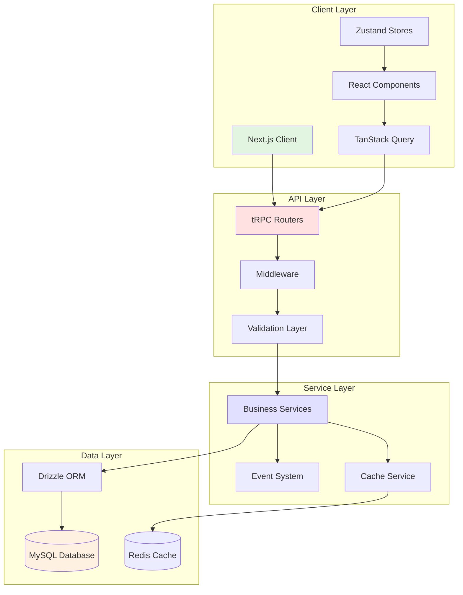
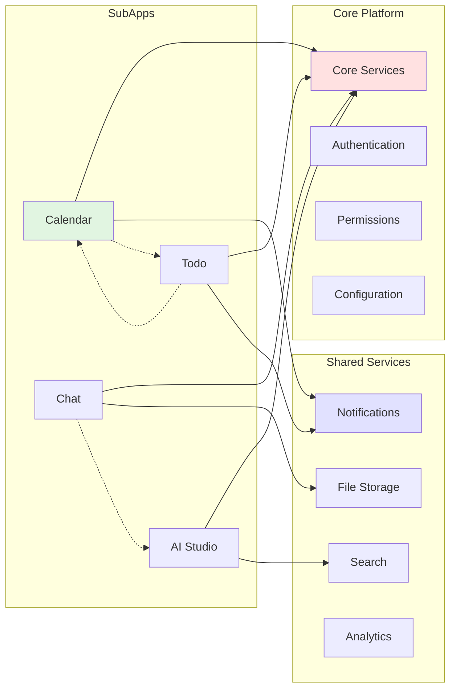
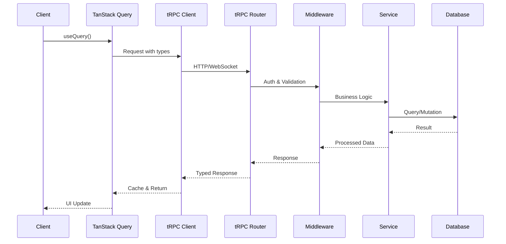
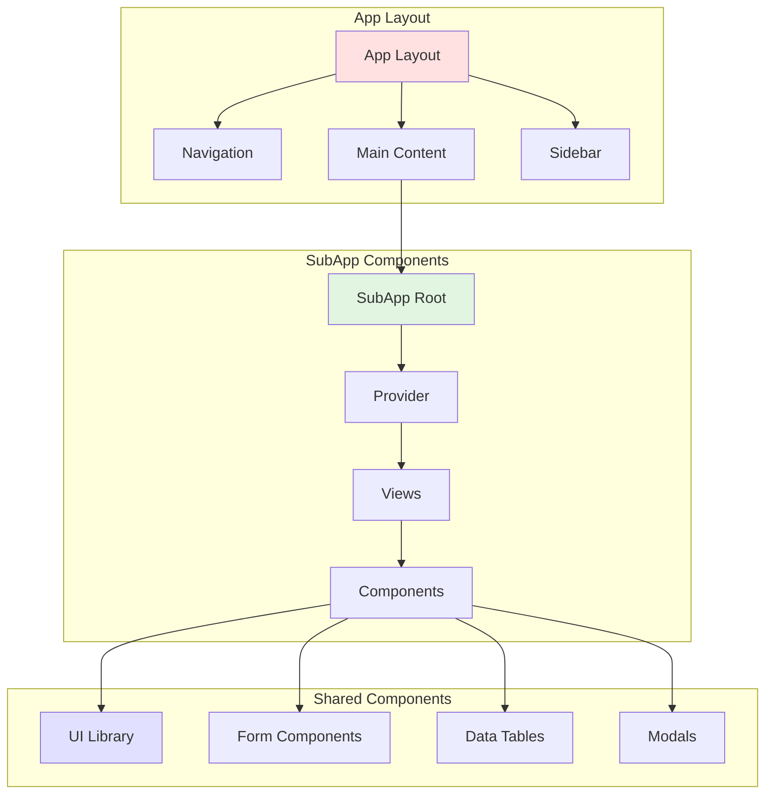
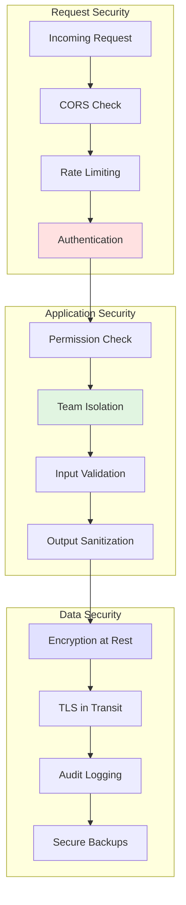
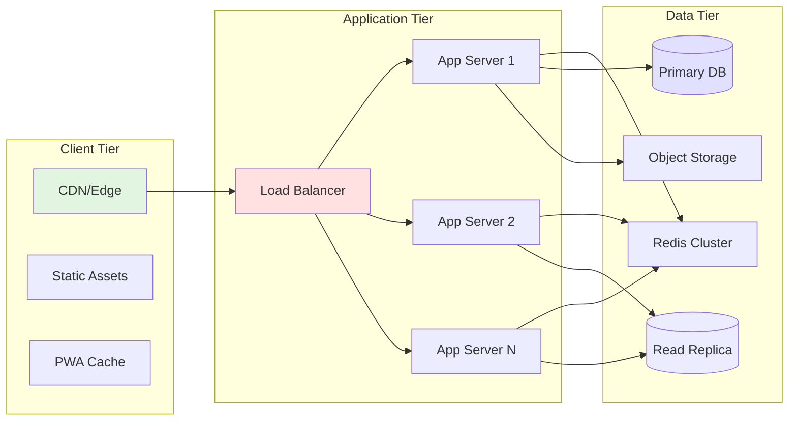

<!-- AI-METADATA:
category: context-map
complexity: advanced
updated: 2025-01-12
claude-ready: true
phase: 4
priority: high
token-optimized: true
audience: ai-assistants
ai-context-weight: critical
-->

<!-- AI-CONTEXT-BOUNDARY: start -->
# Architecture Context Maps

> Visual and structured context maps for understanding Kodix architecture patterns

## 🎯 Purpose

Provide AI assistants with comprehensive architectural context through visual maps and structured relationships, enabling better understanding of system design and component interactions.

## 🗺️ System Architecture Map

### High-Level Architecture



### Context for AI Assistants

```markdown
When working with Kodix architecture:

**Layer Responsibilities**:
1. **Client Layer**: UI rendering, user interactions, client state
2. **API Layer**: Request handling, validation, authentication
3. **Service Layer**: Business logic, cross-cutting concerns
4. **Data Layer**: Persistence, caching, database operations

**Data Flow**:
1. User interaction → React Component
2. Component → TanStack Query → tRPC Client
3. tRPC Client → API Router → Middleware
4. Middleware → Validation → Service Layer
5. Service Layer → Data Layer → Database
6. Response flows back through the same path

**Key Architectural Decisions**:
- Type-safe end-to-end with TypeScript and tRPC
- Service layer for business logic separation
- Event-driven communication between modules
- Team-based data isolation at all layers
```

## 🔄 SubApp Integration Map

### SubApp Ecosystem



### Integration Context

```markdown
SubApp Integration Patterns:

**Direct Dependencies** (Solid Lines):
- All SubApps depend on Core Services
- SubApps use Shared Services as needed
- Authentication and Permissions are mandatory

**Indirect Communication** (Dotted Lines):
- Event-based communication between SubApps
- No direct imports between SubApps
- Loose coupling through events

**Integration Points**:
1. **Configuration**: Each SubApp registers its config schema
2. **Navigation**: SubApps register navigation entries
3. **Permissions**: SubApps define required permissions
4. **Events**: SubApps can emit and listen to events

Example Integration Flow:
\`\`\`typescript
// Calendar emits event
subAppEvents.emit("calendar:meeting-scheduled", { 
  id, 
  attendees, 
  time 
});

// Todo listens and creates task
subAppEvents.on("calendar:meeting-scheduled", (data) => {
  createTodoForMeeting(data);
});
\`\`\`
```

## 📊 Data Flow Architecture

### Request Lifecycle Map



### Data Flow Context

```markdown
Understanding the request lifecycle:

**1. Client Initiation**:
- Component uses typed hooks
- TanStack Query manages caching
- Request includes team context

**2. API Processing**:
- tRPC ensures type safety
- Middleware handles auth/validation
- Router delegates to procedures

**3. Service Execution**:
- Business logic in service layer
- Database operations via Drizzle
- Event emission for side effects

**4. Response Handling**:
- Typed response back to client
- Automatic cache updates
- UI reactivity via React

**Error Handling at Each Stage**:
- Client: Error boundaries and fallbacks
- API: Structured error responses
- Service: Business rule validation
- Database: Transaction rollbacks
```

## 🏗️ Component Architecture Map

### Component Hierarchy



### Component Context

```markdown
Component Architecture Patterns:

**Layout Structure**:
- App Layout provides navigation and structure
- SubApps render in main content area
- Shared sidebar for cross-app features

**SubApp Components**:
- Root component handles initialization
- Provider supplies context and config
- Views represent different pages/routes
- Components are reusable UI pieces

**Shared Component Usage**:
\`\`\`typescript
// Import from UI library
import { Button, Card, Input } from "@/components/ui";
import { DataTable } from "@/components/data-table";
import { FormField } from "@/components/form";

// Use in SubApp component
export function EventList() {
  return (
    <Card>
      <DataTable
        columns={eventColumns}
        data={events}
        pagination
        search
      />
    </Card>
  );
}
\`\`\`

**Component Best Practices**:
1. Use shared components for consistency
2. Extend shared components, don't duplicate
3. Keep SubApp components focused
4. Implement proper TypeScript types
```

## 🔐 Security Architecture Map

### Security Layers



### Security Context

```markdown
Security implementation at each layer:

**Request Security**:
\`\`\`typescript
// Middleware stack
export const secureRoute = t.procedure
  .use(corsMiddleware)
  .use(rateLimitMiddleware)
  .use(authMiddleware)
  .use(permissionMiddleware);
\`\`\`

**Application Security**:
\`\`\`typescript
// Team isolation in queries
const events = await db.query.events.findMany({
  where: and(
    eq(events.teamId, ctx.session.teamId),
    // other conditions
  ),
});

// Input validation
const createEventSchema = z.object({
  title: z.string().min(1).max(255),
  date: z.date().min(new Date()),
  teamId: z.string().uuid(),
});
\`\`\`

**Data Security**:
- All sensitive data encrypted at rest
- TLS for all external communications
- Comprehensive audit logging
- Regular automated backups
```

## 🚀 Deployment Architecture Map

### Infrastructure Overview



### Deployment Context

```markdown
Deployment Architecture Considerations:

**Scalability Patterns**:
- Horizontal scaling of application servers
- Read replicas for database scaling
- CDN for static asset delivery
- Redis cluster for session/cache

**High Availability**:
- Multiple app server instances
- Database replication
- Automated failover
- Health checks and monitoring

**Performance Optimization**:
- Edge caching for static assets
- Database query optimization
- Connection pooling
- Lazy loading of SubApps

**Deployment Commands**:
\`\`\`bash
# Build for production
pnpm build

# Run production server
pnpm start

# Deploy to staging
pnpm deploy:staging

# Deploy to production
pnpm deploy:production
\`\`\`
```

## 🔗 Context Map Usage

### For AI Assistants

1. **Reference specific maps** based on the task:
   - System Architecture for overall design
   - SubApp Integration for module work
   - Data Flow for API implementation
   - Component Architecture for UI work
   - Security Architecture for auth/permissions
   - Deployment Architecture for DevOps

2. **Combine multiple maps** for complex tasks:
   ```markdown
   For implementing a new secured API endpoint:
   - Reference Data Flow Architecture for request lifecycle
   - Reference Security Architecture for auth implementation
   - Reference System Architecture for layer responsibilities
   ```

3. **Use maps for validation**:
   - Ensure implementations follow architectural patterns
   - Verify security measures at each layer
   - Confirm proper data flow and isolation

## 🔗 Related Resources

- [Stack Context Templates](./stack-context-templates.md)
- [SubApp Context Patterns](./subapp-context-patterns.md)
- [Development Context Flows](./development-context-flows.md)

<!-- AI-CONTEXT-BOUNDARY: end -->