# Context Engineering Strategic Plan

<!-- AI-METADATA:
category: planning
complexity: expert
updated: 2025-07-13
claude-ready: true
phase: planning
priority: critical
token-optimized: true
audience: developers
ai-context-weight: critical
-->

<!-- AI-CONTEXT-BOUNDARY: start -->

## 🎯 Overview

This directory contains the **strategic implementation plan** for Context Engineering at Kodix, focused on implementing the proven 5-phase Context Engineering methodology as a practical, systematic approach to AI-driven development.

## 📋 Implementation Strategy

### **Core Implementation** (Proven Methodology)
Implement the 5-phase Context Engineering workflow systematically:

- **[Phase 1: Global Rules Setup](./phase-1-global-rules.md)** (2 weeks)
  - Create comprehensive CLAUDE.md
  - Establish Kodix-specific AI behavior standards
  - Integrate with existing rule systems

- **[Phase 2: Template System](./phase-2-templates.md)** (2 weeks)
  - Develop INITIAL.md templates for Kodix
  - Create PRP templates adapted to Kodix patterns
  - Establish validation criteria

- **[Phase 3: Pattern Documentation](./phase-3-patterns.md)** (3 weeks)
  - Document existing Kodix code patterns
  - Create example library for AI reference
  - Establish architecture integration points

### **Enhancement Track** (Optional Advanced Features)
Optional enhancements to the core methodology:

- **[Phase 4: Automation Tools](./phase-4-automation.md)** (4 weeks)
  - Command automation and shortcuts
  - Quality validation automation
  - Documentation generation tools

- **[Phase 5: Team Integration](./phase-5-integration.md)** (3 weeks)
  - Multi-developer workflow optimization
  - Team collaboration patterns
  - Knowledge sharing systems

## 🏗️ Implementation Strategy

### **Implementation Dependencies**

```mermaid
graph TD
    subgraph "Core Track (Required)"
        P1[Phase 1: Global Rules] --> P2[Phase 2: Templates]
        P2 --> P3[Phase 3: Patterns]
    end
    
    subgraph "Enhancement Track (Optional)"
        P3 --> P4[Phase 4: Automation]
        P4 --> P5[Phase 5: Team Integration]
    end
    
    subgraph "Current Foundation"
        PRP[PRP Workflow ✅] -.-> P1
        DOCS[Documentation Standards ✅] -.-> P1
        RULES[CLAUDE.md ✅] -.-> P1
    end
    
    style P1 fill:#e1f5fe,stroke:#0277bd,stroke-width:2px
    style P2 fill:#e1f5fe,stroke:#0277bd,stroke-width:2px
    style P3 fill:#e1f5fe,stroke:#0277bd,stroke-width:2px
    style P4 fill:#f3e5f5,stroke:#7b1fa2,stroke-width:2px
    style P5 fill:#f3e5f5,stroke:#7b1fa2,stroke-width:2px
```

### **Current Foundation** ✅ **OPERATIONAL**
The PRP workflow is already functional and provides the foundation:
- `/generate-prp` and `/execute-prp` commands working
- Universal AI compatibility established
- Documentation standards defined
- Basic templates and examples available

*Note: Implementation phases will systematize and enhance the existing foundation*

### **Implementation Approach**

#### **Core Track** (Phases 1-3)
- **Focus**: Systematic implementation of proven Context Engineering methodology
- **Duration**: 7 weeks total
- **Priority**: High (Foundation for all AI development)
- **Outcome**: Reliable, systematic AI development workflow

#### **Enhancement Track** (Phases 4-5) 
- **Focus**: Team collaboration and automation improvements
- **Duration**: 7 weeks total  
- **Priority**: Medium (Productivity improvements)
- **Outcome**: Optimized team-wide Context Engineering adoption

## 📊 Success Metrics

### **Core Success Criteria**
- **Phase 1**: Comprehensive CLAUDE.md operational across all AI assistants
- **Phase 2**: Standardized INITIAL.md and PRP templates in active use
- **Phase 3**: Complete pattern library enabling consistent AI implementations

### **Enhancement Success Criteria**
- **Phase 4**: 80% reduction in manual validation through automation
- **Phase 5**: Team-wide adoption with 90%+ developer satisfaction
- **Overall**: 3x improvement in AI development success rate

## 🔗 Integration with Existing Systems

### **Built on Operational Foundation**
This plan systematizes and enhances the existing Context Engineering foundation:

- **[PRP Workflow](../prp/)** - ✅ Operational `/generate-prp` and `/execute-prp` commands
- **[Universal Commands](../commands/)** - ✅ Cross-AI assistant command system
- **[Documentation Standards](../standards/)** - ✅ AI-first markup and patterns
- **[Global Rules](../../CLAUDE.md)** - ✅ Basic AI behavior guidelines

### **Methodology Foundation**
- **[Context Engineering Methodology](../standards/context-engineering-methodology.md)** - Complete theoretical framework
- **[Core Components](../01-core-components.md)** - Context ecosystem understanding
- **[Key Strategies](../02-key-strategies.md)** - Context management approaches
- **[Universal Compatibility](../universal-compatibility-principle.md)** - Cross-AI principles

## 🎯 Expected Outcomes

### **Short-Term** (Core Track Completion - 7 weeks)
- Systematic Context Engineering methodology fully implemented
- Complete Kodix pattern library for AI reference
- Consistent, high-quality AI development across all projects
- 3x improvement in AI development success rate

### **Medium-Term** (Enhancement Track Completion - 14 weeks total)
- Automated quality assurance and validation workflows
- Team-wide Context Engineering adoption and expertise
- Significant productivity improvements and error reduction
- Scalable framework for organization-wide adoption

### **Long-Term** (Continuous Evolution)
- Industry-leading AI development methodology
- Comprehensive knowledge base of proven patterns
- Sustainable competitive advantage through systematic AI collaboration
- Foundation for next-generation AI development innovations

## 📚 Related Documentation

### **Implementation Guides**
- **[PRP System](../prp/README.md)** - Current workflow implementation
- **[Universal Commands](../commands/README.md)** - AI assistant command reference
- **[Standards](../standards/README.md)** - AI-first documentation patterns

### **Strategic Context**
- **[Universal Compatibility Principle](../universal-compatibility-principle.md)** - Foundation philosophy
- **[PRP Workflow Implementation](../prp/README.md)** - Current operational system

### **Technical Integration**
- **[Architecture Standards](../../architecture/standards/)** - Technical foundation
- **[Documentation Standards](../../documentation-standards/)** - Structural requirements

---

## ✅ Plan Validation

### Alignment with Context Engineering Methodology
- **✅ Phase Structure**: Follows proven 5-phase Context Engineering workflow
- **✅ Kodix Integration**: Adapted to Kodix platform requirements and patterns
- **✅ Practical Focus**: Emphasizes implementable, tested approaches over theoretical concepts
- **✅ Progressive Implementation**: Core foundations before optional enhancements
- **✅ Measurable Outcomes**: Clear success criteria and validation metrics

### Key Improvements Made
- **Removed Theoretical Phases**: Eliminated overly complex "predictive AI" and "AI-AI communication" phases
- **Focused on Proven Methods**: Based implementation on established Context Engineering patterns
- **Kodix-Specific Adaptations**: Tailored all phases to Kodix architecture and development patterns
- **Realistic Timelines**: Set achievable 2-3 week phases instead of months-long initiatives
- **Clear Dependencies**: Established logical progression from foundations to enhancements

---

**Methodology Source**: [Context Engineering Implementation Guide](../standards/context-engineering-methodology.md)  
**Maintained By**: Context Engineering Team  
**Last Updated**: 2025-07-13  
**Status**: ✅ **Validated and Ready for Implementation**

<!-- AI-CONTEXT-BOUNDARY: end -->