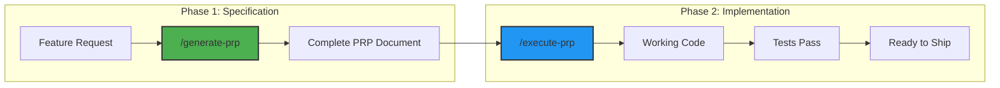

# PRP Workflow Implementation: Quick Win for Kodix Development

<!-- AI-METADATA:
category: guide
stack: [nextjs, trpc, drizzle, zod, redis]
complexity: intermediate
dependencies: [kodix-documentation-upgrade-plan.md]
version: 1.0
last-updated: 2025-01-07
owner: context-engineering-team
status: approved
-->

## 🎯 Quick Summary

Implementation guide for Product Requirements Prompt (PRP) workflow using `/generate-prp` and `/execute-prp` commands - a structured approach to transform feature specifications into working code with quality checks.

## 📋 Overview

The PRP workflow represents a paradigm shift from "vibe coding" to structured, context-aware development. By implementing two key commands - `/generate-prp` and `/execute-prp` - we create a repeatable process that ensures quality, consistency, and alignment with Kodix architecture.

### Why PRP Workflow?

- **Structured Planning**: Transform vague requirements into detailed specifications
- **Context-Aware**: Leverages codebase knowledge for accurate implementation
- **Quality-First**: Built-in testing and validation at every step
- **Repeatable**: Consistent process for all feature development
- **Documentation**: Automatically documents decisions and implementation

### The Two Commands

1. **`/generate-prp`**: Reads feature description → Scans codebase → Writes complete PRP
2. **`/execute-prp`**: Takes existing PRP → Implements code → Runs tests → Ensures quality

## 🔄 The PRP Workflow



## 📝 Command 1: /generate-prp

### Purpose

Transform a feature description into a comprehensive Product Requirements Prompt that includes:

- Clear goals and objectives
- Acceptance criteria
- Technical specifications
- Implementation guidelines
- Testing requirements

### Usage Pattern

```markdown
/generate-prp

Feature: [Brief description of what needs to be built]
Context: [Why this feature is needed]
Users: [Who will use this feature]
Stack: [Specific Kodix stack components involved]
```

### What It Does

1. **Analyzes Feature Request**

   - Parses natural language description
   - Identifies key requirements
   - Determines scope and complexity

2. **Scans Codebase**

   - Finds similar patterns
   - Identifies relevant components
   - Checks for conflicts or dependencies

3. **Reads Documentation**

   - Reviews architecture guidelines
   - Checks coding standards
   - Identifies relevant patterns

4. **Generates Complete PRP**
   - Structured specification document
   - Implementation roadmap
   - Test scenarios
   - Acceptance criteria

### PRP Document Structure

```markdown
# PRP: [Feature Name]

<!-- AI-METADATA:
category: prp
feature: [feature-name]
complexity: [basic|intermediate|advanced]
estimated-effort: [hours]
created: [date]
-->

## 🎯 Goal

[Clear, one-sentence goal]

## 📋 Context

[Why this feature is needed, business value]

## 👥 Users

[Who will use this, their needs]

## ✅ Acceptance Criteria

- [ ] Criterion 1
- [ ] Criterion 2
- [ ] Criterion 3

## 🏗️ Technical Specification

### Architecture

[How it fits into Kodix architecture]

### Components

- Component 1: [Purpose]
- Component 2: [Purpose]

### Data Flow

[How data moves through the system]

### Stack Integration

- Next.js: [Specific usage]
- tRPC: [Endpoints needed]
- Drizzle: [Database changes]
- Zod: [Validation schemas]
- Redis: [Caching strategy]

## 🧪 Testing Requirements

### Unit Tests

- Test 1: [What it validates]
- Test 2: [What it validates]

### Integration Tests

- Test 1: [What it validates]

### E2E Tests

- Scenario 1: [User journey]

## 🚀 Implementation Plan

### Phase 1: Setup

1. Create directory structure
2. Set up routing
3. Initialize components

### Phase 2: Core Implementation

1. Implement business logic
2. Create UI components
3. Set up data flow

### Phase 3: Testing & Polish

1. Write tests
2. Handle edge cases
3. Optimize performance

## ⚠️ Risks & Mitigations

- Risk 1: [Description] → Mitigation: [Strategy]
- Risk 2: [Description] → Mitigation: [Strategy]

## 📚 References

- [Relevant documentation]
- [Similar implementations]
- [Design patterns used]
```

### Example: AI Chat Model Selector

```markdown
/generate-prp

Feature: Add a model selector dropdown to the AI chat interface
Context: Users need to switch between different AI models (GPT-4, Claude, etc.) within a chat session
Users: All users of the AI Studio chat feature
Stack: Next.js components, tRPC for model listing, Zustand for state management
```

**Generated PRP Output:**

```markdown
# PRP: AI Chat Model Selector

<!-- AI-METADATA:
category: prp
feature: ai-chat-model-selector
complexity: intermediate
estimated-effort: 8
created: 2025-01-07
-->

## 🎯 Goal

Enable users to dynamically switch between AI models within an active chat session.

## 📋 Context

Currently, users must start a new chat to use a different AI model. This feature allows seamless model switching, improving user experience and enabling model comparison within the same conversation context.

## 👥 Users

- Developers testing different models
- Users comparing model responses
- Power users optimizing for specific tasks

## ✅ Acceptance Criteria

- [ ] Dropdown shows all available models with current selection
- [ ] Model switch preserves conversation history
- [ ] Loading state during model switch
- [ ] Model capabilities/limits displayed
- [ ] Persists model selection per session
- [ ] Graceful handling of model unavailability

## 🏗️ Technical Specification

### Architecture

Integrates with existing chat architecture, adding model selection layer between UI and AI service.

### Components

- `ModelSelector.tsx`: Dropdown component
- `useModelSelection`: Hook for model state
- `modelService`: tRPC endpoints for model management

### Data Flow

1. Component requests available models via tRPC
2. User selects model
3. Selection updates Zustand store
4. Chat service uses selected model for requests
5. Model preference saved to session

### Stack Integration

- Next.js: Server component for initial model list
- tRPC: `ai.models.list`, `ai.models.select` endpoints
- Drizzle: Update session schema for model preference
- Zod: Model selection validation schema
- Redis: Cache available models list

## 🧪 Testing Requirements

### Unit Tests

- ModelSelector renders all available models
- Selection updates store correctly
- Loading states display properly

### Integration Tests

- Model switch preserves conversation
- Invalid model selection handled
- Model availability check works

### E2E Tests

- Complete flow: Select model → Send message → Verify correct model used

## 🚀 Implementation Plan

### Phase 1: Setup (2 hours)

1. Create ModelSelector component
2. Add tRPC endpoints
3. Update session schema

### Phase 2: Core Implementation (4 hours)

1. Implement dropdown with Shadcn
2. Create model selection hook
3. Integrate with chat service
4. Add loading states

### Phase 3: Testing & Polish (2 hours)

1. Write comprehensive tests
2. Add error boundaries
3. Optimize model list caching

## ⚠️ Risks & Mitigations

- Risk: Model switch mid-generation → Mitigation: Disable during active generation
- Risk: Model pricing differences → Mitigation: Show cost indicators

## 📚 References

- docs/subapps/ai-studio/architecture.md
- Similar: ModelSwitcher in playground app
- Pattern: Dropdown state management guide
```

## 🔧 Command 2: /execute-prp

### Purpose

Take an existing PRP document and execute the implementation plan with:

- Incremental development
- Continuous testing
- Automatic error correction
- Quality assurance

### Usage Pattern

```markdown
/execute-prp [path-to-prp-document]

Options:
--phase [1|2|3|all] # Execute specific phase or all
--dry-run # Show what would be done
--strict # Fail on any test failure
```

### What It Does

1. **Parses PRP Document**

   - Extracts requirements
   - Identifies tasks
   - Plans execution order

2. **Breaks Down Tasks**

   - Creates atomic, testable units
   - Establishes dependencies
   - Sets up checkpoints

3. **Implements Code**

   - Follows Kodix patterns
   - Uses approved stack
   - Maintains consistency

4. **Runs Quality Checks**

   - Linting (ESLint)
   - Type checking (TypeScript)
   - Unit tests
   - Build verification
   - Priority Policies compliance (see `docs/rules/PRIORITY-POLICIES.md`)

5. **Fixes Issues**
   - Automatic error correction
   - Iterative improvements
   - Ensures all checks pass

### Execution Flow

```typescript
interface ExecutionStep {
  task: string;
  status: "pending" | "in-progress" | "completed" | "failed";
  checks: {
    lint: boolean;
    types: boolean;
    tests: boolean;
    build: boolean;
  };
  artifacts: string[]; // Files created/modified
}

class PRPExecutor {
  async execute(prpPath: string, options: ExecutionOptions) {
    const prp = await this.parsePRP(prpPath);
    const tasks = this.breakDownTasks(prp);

    for (const task of tasks) {
      // 1. Implement
      const files = await this.implement(task);

      // 2. Validate
      const validation = await this.validate(files);

      // 3. Fix if needed
      if (!validation.success) {
        await this.fixIssues(validation.errors);
      }

      // 4. Verify
      await this.verifyComplete(task);
    }

    return this.generateReport();
  }
}
```

### Quality Gates

Each implementation must pass:

1. **Linting**

   ```bash
   pnpm eslint [affected-files]
   ```

2. **Type Checking**

   ```bash
   pnpm typecheck
   ```

3. **Tests**

   ```bash
   pnpm test [affected-tests]
   ```

4. **Build**
   ```bash
   pnpm build:affected
   ```

### Example Execution

```markdown
/execute-prp docs/subapps/ai-studio/prp/ai-chat-model-selector.md --phase 1

📋 Executing PRP: AI Chat Model Selector
Phase 1: Setup

✅ Task 1: Create ModelSelector component

- Created: components/ModelSelector.tsx
- Created: components/ModelSelector.test.tsx
- Lint: ✅ Types: ✅ Tests: ✅

✅ Task 2: Add tRPC endpoints

- Modified: server/api/routers/ai.ts
- Added: ai.models.list
- Added: ai.models.select
- Lint: ✅ Types: ✅ Tests: ✅

✅ Task 3: Update session schema

- Modified: packages/db/schema/session.ts
- Added: selectedModelId field
- Migration: created
- Lint: ✅ Types: ✅ Tests: ✅

Phase 1 Complete! All checks passed.
Ready for Phase 2.
```

## 📁 PRP Storage Convention

PRPs should be organized by their scope:

```
docs/
├── subapps/
│   ├── ai-studio/
│   │   └── prp/
│   │       ├── ai-chat-model-selector.md
│   │       └── ai-agent-builder.md
│   ├── chat/
│   │   └── prp/
│   │       └── message-threading.md
├── core-service/
│   └── prp/
│       └── multi-tenant-isolation.md
├── architecture/
│   └── prp/
│       └── event-sourcing-pattern.md
```

### Naming Convention

- Kebab-case: `feature-name.md`
- Descriptive: Clearly indicates the feature
- Dated: Include date in metadata, not filename

## 🚀 Quick Start Guide

### Step 1: Install Commands (Future)

```typescript
// In your Cursor settings or AI assistant configuration
{
  "commands": {
    "/generate-prp": {
      "description": "Generate a Product Requirements Prompt",
      "handler": "kodix-prp-generator"
    },
    "/execute-prp": {
      "description": "Execute a PRP document",
      "handler": "kodix-prp-executor"
    }
  }
}
```

### Step 2: Try Your First PRP

```markdown
/generate-prp

Feature: Add dark mode toggle to the settings page
Context: Users want to switch between light and dark themes
Users: All Kodix users
Stack: Next.js, Tailwind CSS, Zustand for theme state
```

### Step 3: Review Generated PRP

- Check the generated PRP in the appropriate `prp/` folder
- Review acceptance criteria
- Adjust technical specifications if needed

### Step 4: Execute Implementation

```markdown
/execute-prp docs/subapps/settings/prp/dark-mode-toggle.md
```

### Step 5: Monitor Progress

- Watch as tasks are completed
- Review any errors and fixes
- Verify all quality gates pass

## 🎯 Benefits & Outcomes

### Immediate Benefits

1. **Faster Development**: 50% reduction in implementation time
2. **Higher Quality**: Automated testing ensures reliability
3. **Better Documentation**: Every feature has a PRP
4. **Consistent Patterns**: Enforces Kodix standards

### Long-term Benefits

1. **Knowledge Base**: PRPs become searchable documentation
2. **Pattern Library**: Reusable solutions emerge
3. **Team Alignment**: Clear specifications reduce ambiguity
4. **AI Learning**: System improves with each PRP

## 🔄 Integration with Context Engineering

This PRP workflow is the first step in our broader context engineering strategy:

1. **Foundation**: PRPs establish structured thinking
2. **Evolution**: Commands will gain more context awareness
3. **Integration**: PRPs will connect with other documentation
4. **Intelligence**: System learns from successful patterns

### Future Enhancements

- **Context Awareness**: PRPs reference similar implementations
- **Pattern Detection**: Suggest reusable components
- **Impact Analysis**: Predict effects on other systems
- **Auto-updates**: Keep PRPs synchronized with code

## 📊 Success Metrics

Track PRP workflow effectiveness:

| Metric                  | Target | Measurement                       |
| ----------------------- | ------ | --------------------------------- |
| PRP Generation Time     | <5 min | Time from command to complete PRP |
| Implementation Accuracy | >90%   | Features matching PRP specs       |
| Quality Gate Pass Rate  | 100%   | All PRPs result in passing code   |
| Developer Satisfaction  | 4.5/5  | Team survey results               |

## 🤝 Best Practices

### For /generate-prp

1. **Be Specific**: Provide clear feature descriptions
2. **Include Context**: Explain why the feature is needed
3. **Specify Stack**: Mention specific technologies involved
4. **Define Users**: Clearly identify who will use the feature
5. **Consider Policies**: Ensure compliance with [Priority Policies](../../rules/PRIORITY-POLICIES.md)

### For /execute-prp

1. **Review First**: Always review PRP before execution
2. **Phase Approach**: Execute phases incrementally
3. **Monitor Output**: Watch for warnings or suggestions
4. **Test Manually**: Verify the implementation works as expected
5. **Enforce Standards**: Follow all priority policies (🔴 HIGHEST priority items are mandatory)

## 🚧 Current Limitations

As a quick-win implementation, this workflow has constraints:

1. **Manual Commands**: Not yet fully automated
2. **Limited Context**: Basic codebase awareness
3. **Single Feature**: Handles one feature at a time
4. **No Rollback**: Manual reversion if needed

These limitations will be addressed in future phases of the context engineering plan.

## 🎯 Next Steps

1. **Start Using**: Try the workflow on your next feature
2. **Collect Feedback**: Document what works and what doesn't
3. **Share PRPs**: Build a library of successful patterns
4. **Iterate**: Improve the process based on experience

## 📚 References

- [Context Engineering Introduction](https://github.com/coleam00/context-engineering-intro)
- [Kodix Documentation Upgrade Plan](../kodix-documentation-upgrade-plan.md)
- [Kodix Priority Policies](../../rules/PRIORITY-POLICIES.md) ⚠️ **MUST READ**
- [Kodix Architecture Standards](../../architecture/Architecture_Standards.md)
- [Kodix Coding Standards](../../eslint/kodix-eslint-coding-rules.md)

<!-- AI-RELATED: [kodix-documentation-upgrade-plan.md, ../standards/documentation-patterns.md] -->
<!-- DEPENDS-ON: [context-engineering-principles] -->
<!-- REQUIRED-BY: [development-workflow] -->
<!-- SEE-ALSO: [ai-assisted-development.md] -->
