# Context Engineering Methodology: Complete Implementation Guide

<!-- AI-METADATA:
category: methodology
complexity: advanced
updated: 2025-07-13
claude-ready: true
priority: critical
token-optimized: true
audience: developers
ai-context-weight: critical
source: https://github.com/coleam00/context-engineering-intro
-->

<!-- AI-CONTEXT-BOUNDARY: start -->

## 🎯 Core Definition

**Context Engineering** is a systematic methodology for providing AI coding assistants with comprehensive context to enable reliable, end-to-end feature implementation. It represents a fundamental shift from ad-hoc prompting to structured, documentation-driven AI development.

> **Key Insight**: "Context Engineering is 10x better than prompt engineering and 100x better than vibe coding" - Cole Anderson

## 🔄 Methodology Comparison

| Approach | Scope | Context | Success Rate | Complexity |
|----------|-------|---------|--------------|------------|
| **Vibe Coding** | Single task | Minimal | ~30% | Low |
| **Prompt Engineering** | Single interaction | Clever phrasing | ~60% | Medium |
| **Context Engineering** | Complete system | Comprehensive | ~90%+ | High |

### The Evolution

```mermaid
graph LR
    A[Vibe Coding] --> B[Prompt Engineering]
    B --> C[Context Engineering]
    
    A1["❌ Hit or miss<br/>❌ No structure<br/>❌ Hard to reproduce"] -.-> A
    B1["✅ Better phrasing<br/>❌ Limited context<br/>❌ Single-use"] -.-> B
    C1["✅ Systematic<br/>✅ Comprehensive<br/>✅ Reproducible<br/>✅ Scalable"] -.-> C
```



## 🏗️ Core Architecture

### The Context Ecosystem

Context Engineering creates a comprehensive informational environment with five key components:

1. **Global Rules & Standards** (`CLAUDE.md`)
2. **Feature Specifications** (`INITIAL.md`)
3. **Implementation Blueprints** (PRPs)
4. **Code Patterns & Examples**
5. **Validation Systems**

### Information Flow

```mermaid
graph TD
    A[Developer Need] --> B[INITIAL.md]
    B --> C[/generate-prp]
    C --> D[Research Phase]
    D --> E[PRP Creation]
    E --> F[/execute-prp]
    F --> G[Implementation]
    G --> H[Validation]
    H --> I[Working Feature]
    
    J[CLAUDE.md] --> C
    J --> F
    K[Examples] --> C
    K --> F
    L[Documentation] --> C
    L --> F
```

## 📋 Complete Workflow

### Phase 1: Global Setup

#### Create Global Rules (`CLAUDE.md`)

**Purpose**: Establish project-wide AI behavior, coding standards, and operational guidelines.

**Essential Sections**:

```markdown
# Global AI Rules for [Project Name]

## Project Awareness & Context
- Always read PLANNING.md at project start
- Check current tasks before beginning work
- Understand project structure and conventions

## Code Structure & Standards
- Limit files to 500 lines maximum
- Use consistent naming conventions
- Prefer relative imports over absolute
- Follow [language] best practices

## Testing Requirements
- Create tests for all new features
- Include unit tests, integration tests
- Test edge cases and failure scenarios
- Update tests when logic changes

## Task Management
- Mark completed tasks
- Add discovered sub-tasks during development
- Document any blockers or issues

## AI Behavior Rules
- Never assume missing context
- Ask questions when uncertain
- Only use verified libraries/packages
- Confirm file paths before referencing
- Never delete code without explicit instruction
```

### Phase 2: Feature Request (`INITIAL.md`)

**Purpose**: Structured feature specification that provides comprehensive context for AI implementation.

**Template Structure**:

```markdown
# Feature Request: [Feature Name]

## FEATURE:
[Detailed description of what needs to be built]

**Requirements**:
- Specific functionality needed
- User interaction patterns
- Performance requirements
- Integration points

## EXAMPLES:
[Reference existing code patterns in the codebase]

**Relevant Files**:
- `path/to/similar/feature.ts` - Shows data handling pattern
- `path/to/ui/component.tsx` - Demonstrates UI patterns
- `path/to/test/example.test.ts` - Testing approach

## DOCUMENTATION:
[External references and specifications]

**Resources**:
- API documentation: [URL]
- Library docs: [URL]
- Design specifications: [URL]
- Architecture decisions: [URL]

## OTHER CONSIDERATIONS:
[Critical details AI assistants often miss]

**Gotchas**:
- Error handling requirements
- Security considerations
- Performance constraints
- Browser compatibility
- Database constraints
- Team isolation requirements (for Kodix)
```

### Phase 3: PRP Generation (`/generate-prp`)

**Purpose**: Research codebase, analyze patterns, and create comprehensive implementation blueprint.

**AI Process**:
1. **Context Loading**: Read CLAUDE.md and INITIAL.md
2. **Codebase Research**: Search for similar patterns and implementations
3. **Documentation Review**: Analyze relevant technical documentation
4. **Pattern Analysis**: Identify architectural patterns and conventions
5. **Blueprint Creation**: Generate detailed PRP document

### Phase 4: PRP Structure

**Complete PRP Template**:

```markdown
# PRP: [Feature Name]

## Name and Description
**Feature**: [Concise feature name]
**Description**: [One-sentence description]

## Purpose
[Why this feature exists and its business value]

## Core Principles
- Context is King
- Validation Loops
- Information Density
- Progressive Success

## Goal
[Specific, measurable outcome]

## Why
[Business justification and user benefit]

## What
[Detailed functional requirements]

### Success Criteria
- [ ] Functional requirement 1
- [ ] Functional requirement 2
- [ ] Performance requirement
- [ ] Security requirement
- [ ] Testing requirement

## All Needed Context

### Documentation & References
- [Link 1]: Description
- [Link 2]: Description

### Current Codebase Tree
```
project/
├── relevant/
│   ├── existing/
│   └── patterns/
└── structure/
```

### Desired Codebase Tree
```
project/
├── new/
│   ├── feature/
│   └── files/
└── updated/
    └── structure/
```

### Known Gotchas & Library Quirks
- **Issue 1**: Description and solution
- **Issue 2**: Description and solution

## Implementation Blueprint

### Data Models and Structure
```typescript
interface FeatureModel {
  // Define data structures
}
```

### List of Tasks
1. **Task 1**: Create data models
   - Subtask 1.1: Define interfaces
   - Subtask 1.2: Implement validation
2. **Task 2**: Implement core logic
   - Subtask 2.1: Business logic
   - Subtask 2.2: Error handling

### Per Task Pseudocode
**Task 1: Data Models**
```
1. Define TypeScript interfaces
2. Add validation schemas
3. Create utility functions
4. Export types
```

### Integration Points
- **API Integration**: How feature connects to backend
- **UI Integration**: How feature connects to frontend
- **Database Integration**: Data persistence patterns

## Validation Loop

### Level 1: Syntax & Style
- Code compiles without errors
- Passes linting rules
- Follows project conventions

### Level 2: Unit Tests
- All functions have unit tests
- Edge cases covered
- Error scenarios tested

### Level 3: Integration Tests
- Feature works end-to-end
- Integrates with existing systems
- Performance meets requirements

## Final Validation Checklist
- [ ] All success criteria met
- [ ] Code follows project patterns
- [ ] Tests passing
- [ ] Documentation updated
- [ ] No security vulnerabilities
- [ ] Performance requirements met

## Anti-Patterns to Avoid
- Hardcoded values
- Missing error handling
- Inconsistent naming
- Missing tests
- Poor separation of concerns

## Confidence Score
**9/10** - All requirements clear, implementation path well-defined
```

### Phase 5: Implementation (`/execute-prp`)

**Purpose**: Execute the PRP blueprint with systematic validation.

**AI Process**:
1. **Context Loading**: Read complete PRP
2. **Task Breakdown**: Create implementation plan
3. **Incremental Implementation**: Build feature step-by-step
4. **Continuous Validation**: Run tests after each major change
5. **Iteration**: Fix issues and continue until success criteria met

## 🔧 Implementation Techniques

### Context Assembly Strategy

```markdown
<!-- AI-CONTEXT-ASSEMBLY -->
1. **Global Rules**: Load CLAUDE.md first
2. **Feature Context**: Load INITIAL.md and PRP
3. **Code Patterns**: Search for similar implementations
4. **Documentation**: Reference relevant external docs
5. **Validation Rules**: Include testing requirements
<!-- /AI-CONTEXT-ASSEMBLY -->
```

### Progressive Success Pattern

```markdown
<!-- AI-PROGRESSIVE-SUCCESS -->
1. **Start Simple**: Get basic functionality working
2. **Add Complexity**: Incrementally add features
3. **Validate Continuously**: Test at each step
4. **Iterate**: Fix issues before proceeding
5. **Optimize**: Performance and code quality
<!-- /AI-PROGRESSIVE-SUCCESS -->
```

### Validation Gates

```markdown
<!-- AI-VALIDATION-GATES -->
**Level 1 - Syntax**: 
- Code compiles
- No syntax errors
- Passes basic linting

**Level 2 - Function**:
- Unit tests pass
- Core functionality works
- Error handling implemented

**Level 3 - Integration**:
- End-to-end functionality
- Performance acceptable
- Security requirements met
<!-- /AI-VALIDATION-GATES -->
```

## 🎯 Kodix-Specific Applications

### AI Rules Integration

```markdown
# CLAUDE.md for Kodix

## Kodix-Specific Requirements
- **Team Isolation**: Always consider teamId in database operations
- **i18n Required**: No hardcoded strings, use translation keys
- **tRPC Patterns**: Use `useTRPC()` hook, never `import { api }`
- **Type Safety**: Zero tolerance for `any` type
- **SubApp Architecture**: Maintain isolation between subapps

## Quality Standards
- ESLint rules must pass
- TypeScript compilation required
- Database operations need WHERE clauses
- Environment variables must be validated

## Development Workflow
- Use PRP workflow for all features
- Follow service layer patterns
- Implement comprehensive testing
- Update documentation
```

### INITIAL.md Template for Kodix

```markdown
# Kodix Feature Request

## FEATURE:
[Feature description with team isolation considerations]

## STACK:
- Frontend: Next.js, React, TypeScript
- Backend: tRPC, Drizzle ORM
- Database: MySQL with team isolation
- Styling: Tailwind CSS

## EXAMPLES:
- Similar SubApp implementation: `docs/subapps/[similar]/`
- Database patterns: `packages/db/src/schema/`
- tRPC patterns: `apps/core/src/server/api/routers/`

## KODIX CONSIDERATIONS:
- Team isolation requirements
- Internationalization needs
- SubApp architecture compliance
- Permission system integration
```

### PRP Adaptations for Kodix

```markdown
## Kodix Success Criteria
- [ ] Team isolation implemented correctly
- [ ] All strings internationalized
- [ ] tRPC patterns followed
- [ ] TypeScript types defined
- [ ] Database schema updated
- [ ] Tests include team isolation scenarios
- [ ] SubApp boundaries respected

## Kodix Validation Gates
**Level 1**: ESLint, TypeScript, basic functionality
**Level 2**: Team isolation, i18n, tRPC patterns
**Level 3**: End-to-end with multiple teams, performance
```

## 📊 Success Metrics

### Quantitative Measures

| Metric | Traditional AI | Context Engineering |
|--------|----------------|-------------------|
| **Success Rate** | 30-60% | 85-95% |
| **First-Try Success** | 10-30% | 60-80% |
| **Code Quality** | Variable | Consistently High |
| **Time to Working Feature** | 2-10 iterations | 1-3 iterations |
| **Maintenance Issues** | High | Low |

### Qualitative Benefits

- **Predictable Outcomes**: Structured approach reduces variability
- **Knowledge Transfer**: Documentation captures implementation patterns
- **Reduced Debugging**: Comprehensive validation catches issues early
- **Team Consistency**: Standardized patterns across all AI implementations
- **Scalable Process**: Works for simple and complex features

## 🚀 Quick Start Guide

### For New Projects

1. **Create CLAUDE.md**: Define project rules and standards
2. **Set Up Templates**: Create INITIAL.md and PRP templates
3. **Document Patterns**: Identify and document code patterns
4. **Train Team**: Ensure everyone understands the workflow
5. **Iterate**: Improve based on real usage

### For Existing Projects (Like Kodix)

1. **Audit Current Context**: What rules and patterns exist?
2. **Create CLAUDE.md**: Consolidate existing rules
3. **Template Creation**: Build INITIAL.md template
4. **Pattern Documentation**: Document existing code patterns
5. **Pilot Features**: Test workflow on new features
6. **Scale Gradually**: Expand usage across team

### First Feature Implementation

1. **Write INITIAL.md**: Use template for your feature
2. **Run `/generate-prp`**: Let AI create implementation plan
3. **Review PRP**: Validate the plan makes sense
4. **Run `/execute-prp`**: Implement with AI assistance
5. **Validate Results**: Ensure all criteria met
6. **Document Learnings**: Improve process for next time

## 🔗 Integration with Kodix Context Engineering

This methodology directly supports the Kodix Context Engineering initiative:

- **Complements PRP Workflow**: Provides the theoretical foundation
- **Enhances Documentation Standards**: Adds structured approach
- **Supports Universal Compatibility**: Works across all AI assistants
- **Enables Advanced Features**: Foundation for predictive systems

The Context Engineering methodology provides the missing piece for transforming ad-hoc AI development into a systematic, reliable, and scalable approach that aligns perfectly with Kodix's documentation-first strategy.

<!-- AI-CONTEXT-BOUNDARY: end -->

---

**Source**: [Context Engineering Intro Repository](https://github.com/coleam00/context-engineering-intro)  
**Adapted For**: Kodix Development Platform  
**Last Updated**: 2025-07-13  
**Next**: [Applying Context Engineering in Kodix](../current-status-summary.md)