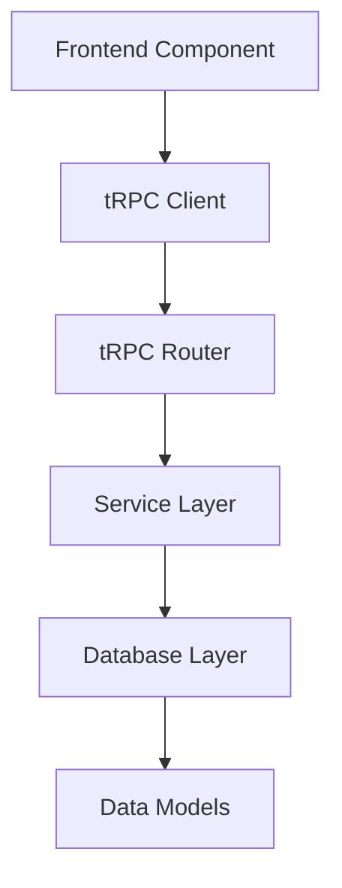

# PRP Template

<!-- AI-METADATA:
category: templates
complexity: intermediate
updated: 2025-07-13
claude-ready: true
priority: high
token-optimized: true
audience: developers
ai-context-weight: important
-->

<!-- AI-CONTEXT-BOUNDARY: start -->

## 🎯 Purpose

Template for creating Product Requirements Prompt (PRP) documents that serve as comprehensive implementation blueprints for AI-driven development.

## 📋 Complete PRP Template

```markdown
# PRP: [Feature Name] - [Date]

<!-- AI-METADATA:
category: planning
complexity: intermediate
updated: YYYY-MM-DD
claude-ready: true
priority: high
token-optimized: true
audience: developers
ai-context-weight: critical
-->

<!-- AI-CONTEXT-BOUNDARY: start -->

## 📊 Executive Summary

**Feature**: [One-line feature description]  
**Scope**: [SubApp/System scope]  
**Complexity**: [Low/Medium/High]  
**Timeline**: [Estimated implementation time]  
**Dependencies**: [Key dependencies]

## 🎯 Feature Requirements

### Core Functionality
[Detailed description of what the feature does, based on INITIAL.md analysis]

### Success Criteria
- [ ] **Functional**: [Specific functional requirements]
- [ ] **Performance**: [Performance requirements]
- [ ] **Security**: [Security requirements]
- [ ] **Usability**: [User experience requirements]

## 🏗️ Technical Architecture

### System Integration


### Component Architecture
- **Frontend**: [React components, hooks, pages]
- **Backend**: [tRPC routers, services, utilities]
- **Database**: [Tables, relations, migrations]
- **Integration**: [External APIs, services]

### Technology Stack
- **Framework**: Next.js with TypeScript
- **API**: tRPC with Zod validation
- **Database**: Drizzle ORM with MySQL
- **Styling**: Tailwind CSS with shadcn/ui
- **State**: React hooks and context
- **Testing**: Vitest with Testing Library

## 💾 Data Architecture

### Database Schema
```sql
-- Primary data table
CREATE TABLE feature_table (
  id VARCHAR(36) PRIMARY KEY,
  team_id VARCHAR(36) NOT NULL, -- Required for team isolation
  name VARCHAR(255) NOT NULL,
  description TEXT,
  created_at TIMESTAMP DEFAULT CURRENT_TIMESTAMP,
  updated_at TIMESTAMP DEFAULT CURRENT_TIMESTAMP ON UPDATE CURRENT_TIMESTAMP,
  
  INDEX idx_team_id (team_id),
  FOREIGN KEY (team_id) REFERENCES teams(id) ON DELETE CASCADE
);
```

### Data Models
```typescript
// Drizzle schema definition
export const featureTable = mysqlTable('feature_table', {
  id: varchar('id', { length: 36 }).primaryKey(),
  teamId: varchar('team_id', { length: 36 }).notNull(),
  name: varchar('name', { length: 255 }).notNull(),
  description: text('description'),
  createdAt: timestamp('created_at').defaultNow(),
  updatedAt: timestamp('updated_at').defaultNow().onUpdateNow(),
});

// TypeScript types
export type Feature = typeof featureTable.$inferSelect;
export type NewFeature = typeof featureTable.$inferInsert;
```

### Data Access Patterns
```typescript
// Service layer with team isolation
export class FeatureService {
  async findByTeam(teamId: string): Promise<Feature[]> {
    return await db.query.featureTable.findMany({
      where: eq(featureTable.teamId, teamId),
      orderBy: desc(featureTable.createdAt),
    });
  }

  async create(data: NewFeature): Promise<Feature> {
    // Validate team isolation
    if (!data.teamId) {
      throw new Error('Team ID is required');
    }
    
    const [created] = await db.insert(featureTable)
      .values(data)
      .returning();
    return created;
  }
}
```

## 🔌 API Architecture

### tRPC Router Structure
```typescript
// Feature router with team isolation
export const featureRouter = createTRPCRouter({
  // Get all features for current team
  findMany: protectedProcedure
    .input(z.object({
      limit: z.number().min(1).max(100).default(20),
      offset: z.number().min(0).default(0),
    }))
    .output(z.array(FeatureSchema))
    .query(async ({ ctx, input }) => {
      return await featureService.findByTeam(
        ctx.session.user.teamId,
        input
      );
    }),

  // Create new feature
  create: protectedProcedure
    .input(CreateFeatureSchema)
    .output(FeatureSchema)
    .mutation(async ({ ctx, input }) => {
      return await featureService.create({
        ...input,
        teamId: ctx.session.user.teamId, // Enforce team isolation
      });
    }),

  // Get feature by ID (with team validation)
  findById: protectedProcedure
    .input(z.object({ id: z.string().uuid() }))
    .output(FeatureSchema.nullable())
    .query(async ({ ctx, input }) => {
      return await featureService.findById(
        input.id,
        ctx.session.user.teamId
      );
    }),
});
```

### Input/Output Schemas
```typescript
// Zod validation schemas
export const CreateFeatureSchema = z.object({
  name: z.string().min(1).max(255),
  description: z.string().optional(),
});

export const UpdateFeatureSchema = z.object({
  id: z.string().uuid(),
  name: z.string().min(1).max(255).optional(),
  description: z.string().optional(),
});

export const FeatureSchema = z.object({
  id: z.string().uuid(),
  teamId: z.string().uuid(),
  name: z.string(),
  description: z.string().nullable(),
  createdAt: z.date(),
  updatedAt: z.date(),
});
```

## 🎨 Frontend Architecture

### Component Structure
```
src/components/features/
├── FeatureList.tsx          # Main list component
├── FeatureCard.tsx          # Individual feature display
├── CreateFeatureForm.tsx    # Feature creation form
├── EditFeatureModal.tsx     # Edit modal component
├── FeatureActions.tsx       # Action buttons/menu
└── hooks/
    ├── useFeatures.tsx      # Data fetching hook
    ├── useCreateFeature.tsx # Creation logic hook
    └── useFeatureActions.tsx # Action handlers
```

### React Components
```typescript
// Main feature list component
export function FeatureList() {
  const { data: features, isLoading } = api.feature.findMany.useQuery();

  if (isLoading) return <FeatureListSkeleton />;

  return (
    <div className="space-y-4">
      <div className="flex justify-between items-center">
        <h2 className="text-2xl font-bold">Features</h2>
        <CreateFeatureButton />
      </div>
      
      <div className="grid gap-4 md:grid-cols-2 lg:grid-cols-3">
        {features?.map((feature) => (
          <FeatureCard key={feature.id} feature={feature} />
        ))}
      </div>
    </div>
  );
}

// Feature creation form
export function CreateFeatureForm() {
  const form = useForm<CreateFeatureInput>({
    resolver: zodResolver(CreateFeatureSchema),
    defaultValues: {
      name: '',
      description: '',
    },
  });

  const createMutation = api.feature.create.useMutation({
    onSuccess: () => {
      toast.success('Feature created successfully');
      form.reset();
    },
  });

  return (
    <Form {...form}>
      <form onSubmit={form.handleSubmit(createMutation.mutate)}>
        <FormField
          control={form.control}
          name="name"
          render={({ field }) => (
            <FormItem>
              <FormLabel>Feature Name</FormLabel>
              <FormControl>
                <Input {...field} placeholder="Enter feature name" />
              </FormControl>
              <FormMessage />
            </FormItem>
          )}
        />
        
        <FormField
          control={form.control}
          name="description"
          render={({ field }) => (
            <FormItem>
              <FormLabel>Description</FormLabel>
              <FormControl>
                <Textarea {...field} placeholder="Feature description" />
              </FormControl>
              <FormMessage />
            </FormItem>
          )}
        />
        
        <Button type="submit" disabled={createMutation.isPending}>
          {createMutation.isPending ? 'Creating...' : 'Create Feature'}
        </Button>
      </form>
    </Form>
  );
}
```

### Custom Hooks
```typescript
// Data fetching hook with error handling
export function useFeatures() {
  return api.feature.findMany.useQuery(undefined, {
    onError: (error) => {
      toast.error('Failed to load features');
      console.error('Feature loading error:', error);
    },
  });
}

// Feature creation hook with optimistic updates
export function useCreateFeature() {
  const utils = api.useUtils();
  
  return api.feature.create.useMutation({
    onMutate: async (newFeature) => {
      await utils.feature.findMany.cancel();
      
      const previousFeatures = utils.feature.findMany.getData();
      
      utils.feature.findMany.setData(undefined, (old) => [
        ...(old ?? []),
        {
          ...newFeature,
          id: 'temp-' + Date.now(),
          teamId: 'temp',
          createdAt: new Date(),
          updatedAt: new Date(),
        } as Feature,
      ]);
      
      return { previousFeatures };
    },
    onError: (err, newFeature, context) => {
      utils.feature.findMany.setData(undefined, context?.previousFeatures);
      toast.error('Failed to create feature');
    },
    onSettled: () => {
      utils.feature.findMany.invalidate();
    },
  });
}
```

## 🧪 Testing Strategy

### Unit Tests
```typescript
// Component testing
describe('FeatureList', () => {
  it('renders features correctly', async () => {
    const mockFeatures = [
      { id: '1', name: 'Test Feature', description: 'Test description' },
    ];
    
    render(<FeatureList />, {
      wrapper: createTestWrapper({
        trpc: {
          feature: {
            findMany: { data: mockFeatures },
          },
        },
      }),
    });
    
    expect(screen.getByText('Test Feature')).toBeInTheDocument();
  });
});

// Service testing
describe('FeatureService', () => {
  it('enforces team isolation', async () => {
    const feature = await featureService.create({
      name: 'Test',
      teamId: 'team-1',
    });
    
    // Should not find feature from different team
    const result = await featureService.findById(feature.id, 'team-2');
    expect(result).toBeNull();
  });
});
```

### Integration Tests
```typescript
// API endpoint testing
describe('Feature API', () => {
  it('creates feature with team isolation', async () => {
    const { req, res } = createMocks({
      method: 'POST',
      body: { name: 'Test Feature' },
    });
    
    const session = await getSession(req, res);
    const response = await featureRouter
      .createCaller({ session })
      .feature.create({ name: 'Test Feature' });
    
    expect(response.teamId).toBe(session.user.teamId);
  });
});
```

### E2E Tests
```typescript
// End-to-end workflow testing
test('feature creation workflow', async ({ page }) => {
  await page.goto('/features');
  
  await page.click('[data-testid="create-feature-button"]');
  await page.fill('[data-testid="feature-name-input"]', 'New Feature');
  await page.fill('[data-testid="feature-description-input"]', 'Description');
  await page.click('[data-testid="submit-button"]');
  
  await expect(page.locator('[data-testid="feature-card"]')).toContainText('New Feature');
});
```

## 🚀 Implementation Checklist

### Database Implementation
- [ ] **Schema Design**: Create database tables with proper indexes
- [ ] **Migration Scripts**: Database migration files
- [ ] **Seed Data**: Initial data for development
- [ ] **Team Isolation**: Ensure all queries include teamId filtering

### Backend Implementation
- [ ] **Data Models**: Drizzle schema definitions
- [ ] **Service Layer**: Business logic implementation
- [ ] **tRPC Routers**: API endpoint implementation
- [ ] **Input Validation**: Zod schema validation
- [ ] **Error Handling**: Comprehensive error handling
- [ ] **Testing**: Unit and integration tests

### Frontend Implementation
- [ ] **Components**: React component implementation
- [ ] **Hooks**: Custom hooks for data management
- [ ] **Forms**: Form validation and submission
- [ ] **UI/UX**: Responsive design with loading states
- [ ] **Error Handling**: User-friendly error messages
- [ ] **Testing**: Component and integration tests

### Quality Assurance
- [ ] **Type Safety**: Full TypeScript coverage, no `any` types
- [ ] **ESLint Clean**: No linting errors or warnings
- [ ] **Performance**: Optimized queries and rendering
- [ ] **Accessibility**: WCAG compliance where applicable
- [ ] **Security**: Proper authentication and authorization
- [ ] **Documentation**: Updated component and API documentation

## 📊 Success Metrics

### Technical Metrics
- **Response Time**: API endpoints < 200ms
- **Bundle Size**: Frontend bundle impact < 50kb
- **Test Coverage**: > 90% code coverage
- **Performance**: Lighthouse score > 90

### User Metrics
- **Time to Complete**: Feature tasks < 30 seconds
- **Error Rate**: < 1% user-facing errors
- **Accessibility**: WCAG AA compliance
- **Mobile Performance**: Works on mobile devices

## 🔗 Implementation Resources

### Code Patterns
- **[tRPC Patterns](../../architecture/trpc-patterns.md)** - API implementation patterns
- **[Database Patterns](../../architecture/database-patterns.md)** - Data access patterns
- **[Component Patterns](../../architecture/component-patterns.md)** - React component patterns

### Testing Resources
- **[Testing Guide](../../testing/testing-guide.md)** - Testing strategies and patterns
- **[E2E Testing](../../testing/e2e-guide.md)** - End-to-end testing setup

### Deployment
- **[Deployment Guide](../../deployment/deployment-guide.md)** - Production deployment process
- **[Migration Guide](../../deployment/migration-guide.md)** - Database migration process

<!-- AI-CONTEXT-BOUNDARY: end -->

---

**Generated From**: [Feature Name] INITIAL.md  
**Implementation Status**: Ready for development  
**Next Step**: Execute with `/execute-prp` command  
**Last Updated**: YYYY-MM-DD
```

## 🎯 Template Usage Guidelines

### When to Use PRPs
- **After INITIAL.md Creation**: Transform requirements into implementation blueprint
- **Complex Features**: Features requiring detailed technical planning
- **Team Collaboration**: When multiple developers will work on implementation
- **AI-Driven Development**: Leveraging AI assistants for implementation

### PRP Quality Standards

#### Technical Completeness
- [ ] **Architecture Clarity**: Clear system and component architecture
- [ ] **Implementation Detail**: Sufficient detail for immediate development
- [ ] **Pattern Compliance**: Follows established Kodix patterns
- [ ] **Quality Criteria**: Specific quality and testing requirements

#### AI Optimization
- [ ] **Structured Information**: Clear sections and hierarchical organization
- [ ] **Complete Context**: All necessary information for AI implementation
- [ ] **Code Examples**: Working code examples for key patterns
- [ ] **Validation Criteria**: Clear success measures and checkpoints

### Customization Guidelines

#### For Simple Features
- Reduce architectural complexity sections
- Focus on core implementation patterns
- Simplify testing requirements
- Streamline quality checklist

#### For Complex Features
- Expand architectural documentation
- Add detailed integration patterns
- Include comprehensive testing strategy
- Add performance considerations

#### For UI-Heavy Features
- Expand frontend architecture section
- Add detailed component specifications
- Include design system integration
- Add accessibility requirements

#### For Data-Heavy Features
- Expand database architecture section
- Add detailed data modeling
- Include migration strategy
- Add data validation patterns

<!-- AI-CONTEXT-BOUNDARY: end -->

---

**Usage**: Generated by `/generate-prp` command from INITIAL.md files  
**Execution**: Use `/execute-prp` command to implement the PRP  
**Related**: [INITIAL.md Template](./initial-template.md) | [Context Engineering Methodology](../context-engineering-methodology.md)  
**Last Updated**: 2025-07-13