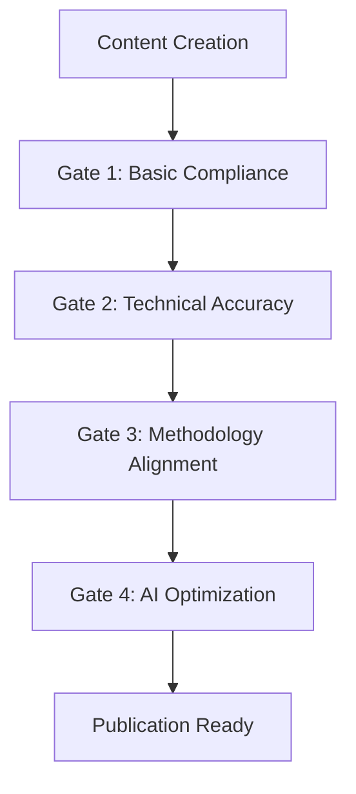

# Quality Gates

<!-- AI-METADATA:
category: validation
complexity: intermediate
updated: 2025-07-13
claude-ready: true
priority: medium
token-optimized: true
audience: developers
ai-context-weight: medium
-->

<!-- AI-CONTEXT-BOUNDARY: start -->

## 🎯 Purpose

Systematic quality validation levels for Context Engineering documentation and implementation, ensuring consistent standards and progressive quality improvement.

## 📋 Quality Gate Structure

### Gate Hierarchy



## 🚪 Gate 1: Basic Compliance

**Purpose**: Ensure fundamental standards are met  
**Requirement**: Must pass before any review process

### Document Structure
- [ ] **AI Metadata Header**: Complete and properly formatted
- [ ] **Context Boundaries**: Properly marked content boundaries
- [ ] **Title and Purpose**: Clear document title and purpose statement
- [ ] **Update Date**: Current date in metadata

### Content Quality
- [ ] **Professional Writing**: Grammar, spelling, and tone
- [ ] **Logical Structure**: Information flows logically
- [ ] **Readability**: Appropriate for target audience
- [ ] **Completeness**: No obvious gaps or incomplete sections

### Technical Format
- [ ] **Markdown Syntax**: Valid markdown formatting
- [ ] **Link Syntax**: Proper internal and external link format
- [ ] **Code Blocks**: Properly formatted with language specification
- [ ] **Metadata Format**: Valid YAML in metadata blocks

### Validation Tools
```bash
# Automated basic compliance check
pnpm validate:basic

# Individual checks
pnpm lint:docs
pnpm check:links
pnpm validate:metadata
```

## 🔧 Gate 2: Technical Accuracy

**Purpose**: Verify technical correctness and implementation quality  
**Requirement**: Must pass before technical review

### Code Quality
- [ ] **Syntax Validation**: All code examples compile/run
- [ ] **Kodix Patterns**: Follows established Kodix patterns
- [ ] **Best Practices**: Uses recommended approaches
- [ ] **Error Handling**: Appropriate error handling included

### Architecture Compliance
- [ ] **SubApp Architecture**: Aligns with SubApp patterns
- [ ] **Team Isolation**: Multi-tenancy properly implemented
- [ ] **Technology Stack**: Uses approved technologies
- [ ] **Integration Points**: Properly documented interfaces

### Implementation Verification
- [ ] **Working Examples**: All examples tested and functional
- [ ] **Dependencies**: Accurate dependency information
- [ ] **Configuration**: Correct configuration examples
- [ ] **Environment**: Proper environment considerations

### Validation Approach
```typescript
// Example validation workflow
interface TechnicalValidation {
  codeCompilation: boolean;
  patternCompliance: boolean;
  dependencyCheck: boolean;
  integrationTest: boolean;
}
```

## 🎯 Gate 3: Methodology Alignment

**Purpose**: Ensure alignment with Context Engineering methodology  
**Requirement**: Must pass for Context Engineering system inclusion

### Methodology Compliance
- [ ] **5-Phase Alignment**: Fits within the 5-phase methodology
- [ ] **AI-First Design**: Optimized for AI consumption
- [ ] **Universal Compatibility**: Works across AI assistants
- [ ] **Pattern Consistency**: Uses established patterns

### Workflow Integration
- [ ] **PRP Compatibility**: Supports PRP workflow processes
- [ ] **Command Integration**: Compatible with `/generate-prp` and `/execute-prp`
- [ ] **Documentation First**: Follows documentation-first approach
- [ ] **Context Assembly**: Enables effective context assembly

### System Coherence
- [ ] **Cross-References**: Proper integration with existing docs
- [ ] **Knowledge Graph**: Contributes to documentation graph
- [ ] **Progressive Disclosure**: Supports layered information access
- [ ] **Semantic Consistency**: Consistent terminology and concepts

## 🤖 Gate 4: AI Optimization

**Purpose**: Maximize AI assistant effectiveness  
**Requirement**: Must pass for advanced AI integration

### AI Comprehension
- [ ] **Semantic Markers**: Appropriate semantic markup applied
- [ ] **Context Clarity**: Sufficient context for AI understanding
- [ ] **Example Quality**: High-quality, complete examples
- [ ] **Pattern Recognition**: Clear, recognizable patterns

### Token Efficiency
- [ ] **Optimized Content**: Minimal token usage for maximum value
- [ ] **Strategic Compression**: Effective use of compression markers
- [ ] **Context Boundaries**: Precise content boundaries
- [ ] **Priority Weighting**: Appropriate priority markers

### Cross-AI Testing
- [ ] **Claude Code**: Tested with Claude Code assistant
- [ ] **Universal Patterns**: Compatible with multiple AI assistants
- [ ] **Performance**: Efficient processing across platforms
- [ ] **Consistency**: Consistent behavior across AI tools

## 📊 Quality Metrics

### Quantitative Measures

| Gate | Metric | Target | Measurement |
|------|--------|--------|-------------|
| **Gate 1** | Basic Compliance Rate | 100% | Automated validation |
| **Gate 2** | Technical Accuracy | 95% | Code compilation + review |
| **Gate 3** | Methodology Alignment | 90% | Pattern compliance check |
| **Gate 4** | AI Optimization Score | 85% | AI performance metrics |

### Qualitative Assessment

**Gate 1 - Basic Quality**:
- Clear, professional communication
- Proper structure and formatting
- Complete required information

**Gate 2 - Technical Excellence**:
- Accurate, working implementations
- Follows established patterns
- Production-ready quality

**Gate 3 - Methodology Integration**:
- Supports Context Engineering goals
- Enhances overall system coherence
- Enables effective AI collaboration

**Gate 4 - AI Optimization**:
- Maximizes AI assistant effectiveness
- Efficient token utilization
- Universal compatibility

## 🔄 Gate Progression

### Sequential Requirements
1. **Must pass each gate in order**
2. **Previous gate requirements maintained**
3. **Escalation for failures**
4. **Continuous monitoring**

### Failure Handling
- **Gate 1 Failure**: Return to author with specific issues
- **Gate 2 Failure**: Technical review and correction
- **Gate 3 Failure**: Methodology consultation required
- **Gate 4 Failure**: AI optimization specialist review

### Re-validation Triggers
- Content updates beyond minor corrections
- Methodology changes or updates
- Technology stack changes
- Quality standard evolution

## 🛠️ Implementation Support

### Automated Tools
```bash
# Run complete quality gate validation
pnpm validate:quality-gates

# Individual gate checks
pnpm validate:gate-1
pnpm validate:gate-2
pnpm validate:gate-3
pnpm validate:gate-4
```

### Manual Review Process
1. **Self-Assessment**: Author uses [Standards Checklist](./standards-checklist.md)
2. **Peer Review**: Technical accuracy verification
3. **Methodology Review**: Context Engineering alignment
4. **AI Optimization Review**: Final optimization check

### Documentation
- [ ] **Gate Status**: Track gate progression for each document
- [ ] **Issue Log**: Record and track validation issues
- [ ] **Improvement Metrics**: Monitor quality trends
- [ ] **Best Practice Updates**: Evolve gates based on experience

<!-- AI-CONTEXT-BOUNDARY: end -->

---

**Implementation**: Use these gates for systematic quality assurance  
**Integration**: Combine with automated validation tools  
**Related**: [Standards Checklist](./standards-checklist.md) | [Context Engineering Methodology](../context-engineering-methodology.md)  
**Last Updated**: 2025-07-13