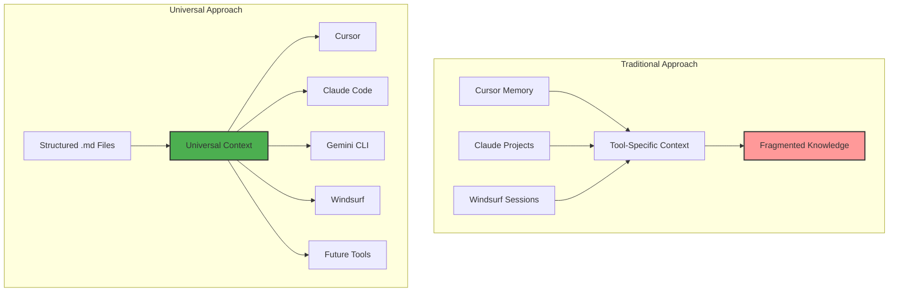

# Universal Context Engineering Principle

<!-- AI-METADATA:
category: standards
complexity: intermediate
updated: 2025-07-13
claude-ready: true
priority: critical
token-optimized: true
audience: developers
ai-context-weight: critical
-->

<!-- AI-CONTEXT-BOUNDARY: start -->

## 🎯 Quick Summary

The foundational principle that ensures Kodix documentation works seamlessly across all AI assistants by storing context in structured `.md` files rather than tool-specific configurations.

## 🔍 📋 Overview

<!-- AI-COMPRESS: strategy="summary" max-tokens="150" -->
**Quick Summary**: Key points for rapid AI context understanding.
<!-- /AI-COMPRESS -->
The **Universal Context Engineering Principle** is the cornerstone of Kodix's documentation strategy. It establishes that all critical context, plans, and prompts must be stored in structured markdown files to ensure consistency, portability, and reproducibility across different AI development tools.

### Core Principle

> **All context must live in `.md` files, not in tool-specific memory or configurations.**

This principle ensures that our documentation and development knowledge remains:

- **Tool-agnostic**: Works with any AI assistant
- **Persistent**: Survives tool changes and updates
- **Portable**: Can be moved between projects and teams
- **Reproducible**: Produces consistent results across different environments

## 🧠 Why This Principle Matters

### The Problem with Tool-Specific Memory

Traditional AI assistant workflows suffer from several limitations:

1. **Memory Fragmentation**: Context scattered across different tools
2. **Tool Lock-in**: Knowledge trapped in proprietary formats
3. **Session Dependency**: Context lost between sessions
4. **Team Isolation**: Knowledge not shared between team members
5. **Version Drift**: Different team members have different context

### The Solution: Documentation-First Context

By storing context in structured markdown files:



## 📐 Implementation Framework

### Documentation Structure

```
docs/
├── README.md                    # Project overview (universal entry point)
├── architecture/               # System design (tool-agnostic)
├── subapps/                   # Feature documentation
├── context-engineering/       # AI assistant guidelines
├── ai-assistants/            # Tool-specific differences only
│   ├── cursor/               # Cursor-specific setup
│   ├── claude-code/          # Claude Code specifics
│   └── windsurf/             # Windsurf specifics
└── rules-ai/                 # AI assistant rules and standards
    └── README.md             # Universal AI rules (loaded by CLAUDE.md)
```

### Content Distribution

| Content Type               | Location                     | Rationale                               |
| -------------------------- | ---------------------------- | --------------------------------------- |
| **Shared Knowledge**       | `/docs`                      | Universal access across all tools       |
| **Architecture Decisions** | `/docs/architecture`         | Core knowledge needed by all assistants |
| **Feature Specifications** | `/docs/subapps`              | Implementation guidance for any tool    |
| **Context Engineering**    | `/docs/context-engineering`  | AI assistant best practices             |
| **Tool Differences**       | Tool-specific locations      | Minimal setup differences only          |
| **Universal AI Rules**     | `/CLAUDE.md` and `/docs/rules-ai/` | Core rules loaded by all assistants |

## 🔧 Universal Documentation Patterns

### Standard Document Structure

Every documentation file follows this universal pattern:

```markdown
# Document Title

<!-- AI-METADATA:
category: [type]
stack: [technologies]
complexity: [level]
dependencies: [list]
-->

## 🎯 Quick Summary

One-line description for any AI tool

## 🔍 📋 Overview

<!-- AI-COMPRESS: strategy="summary" max-tokens="150" -->
**Quick Summary**: Key points for rapid AI context understanding.
<!-- /AI-COMPRESS -->
Comprehensive context that any assistant can understand

## 🏗️ Implementation

Tool-agnostic implementation guidance

## 📋 🧩 Examples

Universal code examples

## 🔗 Related Resources

Cross-references to other documentation
```

### Context Markers

Universal semantic markers that work across all AI tools:

```markdown
<!-- AI-CONTEXT: [type] -->
<!-- AI-PRIORITY: [level] -->
<!-- AI-STACK: [technology] -->
<!-- AI-SCOPE: [breadth] -->
<!-- DEPENDS-ON: [dependencies] -->
<!-- REQUIRED-BY: [dependents] -->
<!-- SEE-ALSO: [related] -->
```

## 🚀 Cross-Tool Compatibility

### How Different Tools Consume Documentation

| AI Assistant     | Documentation Access       | Context Priority         |
| ---------------- | -------------------------- | ------------------------ |
| **Cursor**       | `.md` files + `.mdc` rules | Documentation first      |
| **Claude Code**  | Project markdown files     | Structured content       |
| **Gemini CLI**   | Repository documentation   | Hierarchical information |
| **Windsurf**     | Workspace markdown         | Pattern recognition      |
| **Future Tools** | Standard markdown          | Universal format         |

### Tool-Specific Adaptations

Each AI assistant folder contains **only** the minimal differences:

```markdown
# docs/ai-assistants/cursor/setup.md

## 🚀 Cursor-Specific Setup

- .mdc rules configuration
- Workspace settings
- Cursor-specific shortcuts

## Integration with Universal Docs

All core knowledge remains in /docs - this file only covers Cursor setup.
```

## 📊 Benefits of Universal Approach

### For Development Teams

1. **Consistency**: Same context across all team members
2. **Onboarding**: New tools can immediately access full context
3. **Knowledge Preservation**: Context survives tool changes
4. **Collaboration**: Shared understanding regardless of tool preference

### For AI Assistants

1. **Rich Context**: Comprehensive understanding from structured docs
2. **Consistent Behavior**: Same knowledge base produces similar results
3. **Reduced Hallucinations**: Clear documentation reduces incorrect assumptions
4. **Better Suggestions**: More context leads to better recommendations

### For Project Maintenance

1. **Portability**: Easy migration between tools
2. **Versioning**: Documentation changes tracked in git
3. **Searchability**: Universal format enables powerful search
4. **Maintainability**: Single source of truth for all context

## 🎯 Implementation Guidelines

### For New Projects

1. **Start with Documentation**: Create comprehensive README and architecture docs
2. **Use Universal Patterns**: Follow established documentation templates
3. **Avoid Tool Lock-in**: Keep tool-specific content minimal
4. **Plan for Growth**: Structure documentation for future tools

### For Existing Projects

1. **Audit Current Context**: Identify tool-specific knowledge
2. **Extract to Documentation**: Move context to universal markdown files
3. **Standardize Format**: Apply universal documentation patterns
4. **Minimize Tool Dependencies**: Reduce tool-specific configurations

### Quality Checklist

- [ ] All critical context documented in `.md` files
- [ ] Tool-specific folders contain only setup differences
- [ ] Documentation follows universal patterns
- [ ] Cross-references link related concepts
- [ ] Examples work across different tools
- [ ] No essential knowledge trapped in tool memory

## 🔄 Evolution and Maintenance

### Continuous Improvement

1. **Regular Audits**: Review documentation completeness
2. **Tool Feedback**: Incorporate learnings from different AI assistants
3. **Pattern Refinement**: Improve documentation patterns based on usage
4. **Cross-Tool Testing**: Verify compatibility with multiple tools

### Future-Proofing

1. **Standard Formats**: Use widely-supported markdown features
2. **Semantic Clarity**: Write for both humans and machines
3. **Modular Design**: Enable easy reorganization
4. **Version Control**: Track changes and evolution

## 🌟 Success Metrics

### Quantitative Measures

- **Tool Adoption**: Time to onboard new AI assistants
- **Context Consistency**: Similar responses across different tools
- **Knowledge Retention**: Reduced repeated questions
- **Team Efficiency**: Faster development with any tool

### Qualitative Indicators

- **Developer Satisfaction**: Positive feedback on documentation quality
- **Reduced Confusion**: Fewer misunderstandings about project context
- **Easier Onboarding**: New team members productive quickly
- **Tool Flexibility**: Easy switching between AI assistants

## 📚 References

- [Documentation Patterns](./standards/documentation-patterns.md)
- <!-- AI-LINK: type="related" importance="medium" -->
<!-- AI-CONTEXT-REF: importance="medium" type="guide" -->
[Semantic Markers Guide](./standards/semantic-markers.md)
<!-- /AI-CONTEXT-REF -->
<!-- /AI-LINK -->
- [Universal AI Commands](./commands/README.md)
- [Context Engineering Best Practices](https://github.com/coleam00/context-engineering-intro)

<!-- AI-CONTEXT-BOUNDARY: end -->

---

**Last Updated**: 2025-07-13  
**Maintained By**: Context Engineering Team  
**Next Review**: Quarterly
