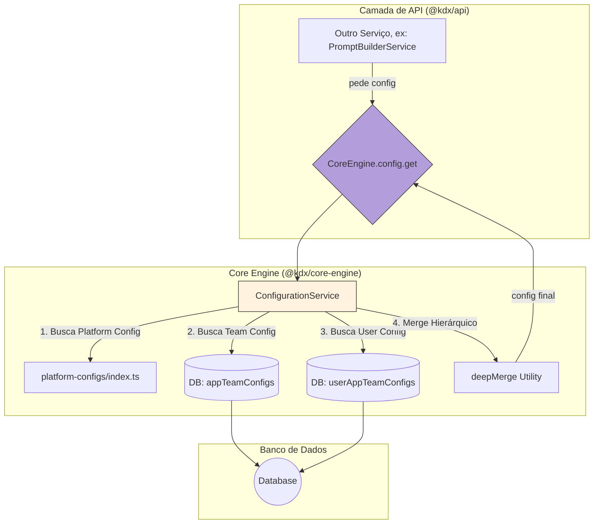

# Arquitetura do Core Engine

**Data:** 2025-07-02  
**Autor:** KodixAgent  
**Status:** 🟢 Ativo

## 1. Visão Geral

O pacote `@kdx/core-engine` é o coração da lógica de negócio desacoplada da plataforma Kodix. Ele foi projetado para abrigar serviços fundamentais que podem ser consumidos por qualquer camada de API (seja a API principal, CLIs ou outros serviços futuros), garantindo a reutilização de código e uma clara separação de responsabilidades.

## 1.1. ⚠️ Status da Implementação e Pré-requisitos

**ESTADO ATUAL:** `Parcialmente Implementado`

Embora a arquitetura aqui descrita represente o estado final desejado, a implementação atual do `ConfigurationService` está **incompleta**.

- **Funcional:** O serviço pode buscar e mesclar a configuração de **Nível 1 (Plataforma)**.
- **Pendente:** A integração com o banco de dados para buscar as configurações de **Nível 2 (Time)** e **Nível 3 (Usuário)** foi adiada.

**PRÉ-REQUISITO CRÍTICO:** Qualquer funcionalidade em outros SubApps que dependa da configuração hierárquica completa (Níveis 1, 2 e 3) está **bloqueada** até que a **[Fase 4 do plano de implementação do Core Engine](./planning/core-engine-v1-config-plan.md)** seja concluída.

## 2. Serviço Principal: `ConfigurationService`

O principal serviço atualmente implementado no Core Engine é o `ConfigurationService`.

### 2.1. Propósito

O `ConfigurationService` é a **fonte única da verdade** para todas as configurações de SubApps. Ele resolve a complexidade de obter configurações de múltiplos níveis, garantindo que a aplicação sempre use a configuração mais específica disponível para um determinado contexto.

### 2.2. Modelo de Configuração Hierárquica

O serviço implementa uma lógica de merge hierárquico com 3 níveis, onde cada nível subsequente sobrescreve o anterior:

1.  **Nível 1: Configuração de Plataforma (Base)**

    - Definida estaticamente no código (`packages/core-engine/src/configuration/platform-configs`).
    - Representa os padrões de fábrica para cada SubApp.

2.  **Nível 2: Configuração do Time (`appTeamConfig`)**

    - Armazenada no banco de dados.
    - Permite que administradores de um time customizem o comportamento de um SubApp para todos os seus membros.

3.  **Nível 3: Configuração do Usuário (`userAppTeamConfig`)**
    - Armazenada no banco de dados.
    - Permite que cada usuário personalize sua própria experiência dentro de um SubApp, tendo a prioridade máxima.

### 2.3. Fluxo de Dados

O fluxo de dados para obter uma configuração é orquestrado inteiramente dentro do `ConfigurationService`, que é consumido por outros serviços na camada de API.



### 2.4. Como Consumir

Qualquer serviço que precise de configurações deve consumir o `ConfigurationService` através da fachada `CoreEngine`.

```typescript
// Exemplo de uso em um serviço no @kdx/api
import { CoreEngine } from "@kdx/core-engine";

// ... dentro de um método de serviço ...
const config = await CoreEngine.config.get({
  appId: "ai_studio_app_789", // ID do SubApp alvo
  teamId: "some-team-id",
  userId: "some-user-id", // Opcional
});

// `config` agora contém o objeto de configuração final e mesclado
const teamInstructions = config.teamInstructions.content;
```

Este padrão garante que a lógica de configuração complexa permaneça encapsulada dentro do `core-engine`, e os consumidores apenas peçam a configuração de que precisam, sem se preocupar com os detalhes da implementação.
