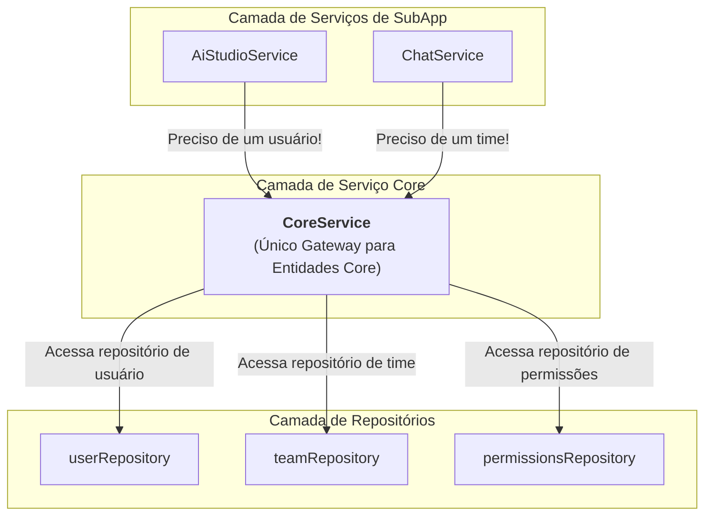

<!-- AI-METADATA:
<!-- AI-CONTEXT-PRIORITY: always-include="false" summary-threshold="medium" -->category: reference
complexity: intermediate
updated: 2025-07-12
claude-ready: true
phase: 4
priority: medium
token-optimized: true
audience: all
ai-context-weight: important
last-ai-review: 2025-07-12
-->

# Proposta de Arquitetura: Centralização com `CoreService`

**Autor:** @KodixAgent & @User
**Data:** 2025-07-01
**Status:** 📝 Proposta / RFC (Request for Comments)
**Contexto:** Este documento propõe uma refatoração arquitetural para centralizar o acesso às entidades core da plataforma (usuários, times, permissões, configurações) através de um único gateway: o `CoreService`.
**Nota:** Este documento está temporariamente em `docs/core-engine/`. Com a aprovação da proposta, o diretório será renomeado para `docs/core-service/`.

---

## 🎯 Nota sobre Implementação Incremental (Estratégia Pragmática)

Embora este documento detalhe a **visão arquitetural final** com um `CoreService` centralizado, a implementação seguirá uma abordagem **pragmática e incremental (Estratégia 1)**.

- **Primeiro Passo (Plano Atual):** O primeiro passo concreto será a refatoração de serviços de SubApp (como o `AiStudioService`) para consumirem repositórios diretamente do pacote `@kdx/db` (ex: `PlatformConfigRepository`). Isso nos permite validar a camada de dados de forma isolada e entregar valor rapidamente.
- **Evolução Futura:** O `CoreService` será construído gradualmente, atuando como uma fachada que, eventualmente, irá encapsular o acesso a esses repositórios. A migração dos serviços de SubApp para consumir o `CoreService` ocorrerá em uma fase posterior, uma vez que o `CoreService` tenha funcionalidades suficientes para justificar a camada extra de abstração.

Esta abordagem equilibra a visão de longo prazo com a necessidade de desenvolvimento ágil e iterativo.

---

## 1. Proposta

Propõe-se a criação de um `CoreService` dentro de `packages/api/src`. Este serviço se tornaria a **única porta de entrada autorizada** para qualquer operação relacionada às entidades fundamentais do Kodix.

Como consequência, todos os serviços de SubApp (como `AiStudioService`, `ChatService`, etc.) seriam **proibidos** de acessar diretamente os repositórios core (`userRepository`, `teamRepository`, `appRepository`) e deveriam, obrigatoriamente, consumir o `CoreService`.

---

## 2. Justificativa

A arquitetura atual permite que serviços de SubApps acessem diretamente os repositórios core. Embora pragmático, este padrão apresenta riscos a longo prazo:

1.  **Duplicação de Lógica:** Lógicas complexas para, por exemplo, consolidar permissões de um usuário, podem ser duplicadas em múltiplos serviços que precisam dessa informação.
2.  **Descentralização do Controle:** Para adicionar uma regra de negócio global (como um novo sistema de cache ou logs de auditoria para todas as buscas de `team`), seria necessário modificar todos os serviços que consomem o `teamRepository`.
3.  **Acoplamento com a Camada de Dados:** Os serviços ficam acoplados à implementação dos repositórios, em vez de dependerem de um contrato de serviço estável.

A centralização via `CoreService` resolve esses problemas ao fornecer:

- **Encapsulamento:** A complexidade do acesso a dados fica contida no `CoreService`.
- **Single Source of Truth:** Um único local para a lógica de negócio relacionada a entidades core.
- **Ponto Único de Controle:** Facilita a implementação de regras transversais como cache, logging e segurança.

---

## 3. Arquitetura Proposta

### Diagrama de Fluxo



### Estrutura de Código Proposta

<!-- AI-CODE-BLOCK: typescript-example -->
<!-- AI-CODE-OPTIMIZATION: language="typescript" context="kodix-patterns" -->
```typescript
// AI-CONTEXT: TypeScript implementation following Kodix patterns
// Localização: packages/api/src/core-service/core.service.ts

import type { AppId, AppTeamConfig, Team, User } from "@kdx/db/schema";
import {
  appRepository,
  teamRepository,
  userRepository,
} from "@kdx/db/repositories";

/**
 * Gateway centralizado para todas as entidades e lógicas core da plataforma.
 * ÚNICA forma autorizada de acessar usuários, times, permissões, etc.
 */
export class CoreService {
  /**
   * Ponte para buscar um usuário por ID.
   */
  public async findUserById(id: string): Promise<User | null> {
    console.log(`[CORE_SERVICE] findUserById called for id: ${id}`);
    return userRepository.findById(id);
  }

  /**
   * Ponte para buscar um time por ID.
   */
  public async findTeamById(id: string): Promise<Team | null> {
    console.log(`[CORE_SERVICE] findTeamById called for id: ${id}`);
    return teamRepository.findById(id);
  }

  /**
   * Ponte para buscar a configuração de um SubApp para um time.
   */
  public async getAppTeamConfig(params: {
    appId: AppId;
    teamId: string;
  }): Promise<AppTeamConfig["config"] | null> {
    console.log(
      `[CORE_SERVICE] getAppTeamConfig for ${params.appId} on team ${params.teamId}`,
    );
    const config = await appRepository.findAppTeamConfig(params);
    return config?.config ?? null;
  }

  // ... outros métodos: saveAppTeamConfig, getUserPermissions, etc.
}

export const coreService = new CoreService();
```
<!-- /AI-CODE-OPTIMIZATION -->
<!-- /AI-CODE-BLOCK -->

---

## 4. Exemplo de Refatoração: `AiStudioService`

Este exemplo prático ilustra como o `AiStudioService` seria refatorado.

#### **Antes (Arquitetura Atual)**

O serviço acessa `db.query` diretamente para buscar uma configuração.

<!-- AI-CODE-BLOCK: typescript-example -->
<!-- AI-CODE-OPTIMIZATION: language="typescript" context="kodix-patterns" -->
```typescript
// AI-CONTEXT: TypeScript implementation following Kodix patterns
// packages/api/src/internal/services/ai-studio.service.ts (VERSÃO ATUAL)
import { db } from "@kdx/db/client";

export class AiStudioService {
  static async getTeamInstructions({ teamId, ... }: { /*...*/ }) {
    // ...
    // ACESSO DIRETO AO BANCO (DB QUERY)
    const teamConfig = await db.query.appTeamConfigs.findFirst({
      where: (appTeamConfig, { eq, and }) =>
        and(
          eq(appTeamConfig.appId, aiStudioAppId),
          eq(appTeamConfig.teamId, teamId),
        ),
      columns: { config: true },
    });
    // ...
  }
}
```
<!-- /AI-CODE-OPTIMIZATION -->
<!-- /AI-CODE-BLOCK -->

#### **Depois (Com o `CoreService`)**

O serviço delega a busca de configuração para o `coreService`.

<!-- AI-CODE-BLOCK: typescript-example -->
<!-- AI-CODE-OPTIMIZATION: language="typescript" context="kodix-patterns" -->
```typescript
// AI-CONTEXT: TypeScript implementation following Kodix patterns
// packages/api/src/internal/services/ai-studio.service.ts (VERSÃO PROPOSTA)
import { coreService } from '../../core-service/core.service'; // Nova dependência

export class AiStudioService {
  static async getTeamInstructions({ teamId, ... }: { /*...*/ }) {
    // ...
    // CHAMADA PARA A PONTE (CORE SERVICE)
    const config = await coreService.getAppTeamConfig({
      appId: aiStudioAppId,
      teamId: teamId,
    });
    // ...
  }
}
```
<!-- /AI-CODE-OPTIMIZATION -->
<!-- /AI-CODE-BLOCK -->

---

## 5. Prós e Contras

**✅ Prós:**

- **Encapsulamento Forte:** Esconde a complexidade da camada de dados.
- **Centralização da Lógica:** Ponto único para regras de negócio core.
- **Facilidade de Manutenção:** Modificações em regras de acesso são feitas em um só lugar.
- **Consistência Garantida:** Todos os SubApps obtêm dados core da mesma forma.

**❌ Contras:**

- **Aumento da Abstração:** Adiciona uma camada extra para operações simples, o que pode parecer excessivo para buscas diretas.
- **Risco de "God Object":** Se não for gerenciado com disciplina, o `CoreService` pode crescer excessivamente, tornando-se um ponto único de falha e um gargalo para o desenvolvimento. **Mitigação:** Este risco pode ser mitigado adotando uma estrutura interna modular desde o início (ex: `core.users.findById`, `core.teams.findById`) ou, se a complexidade justificar, dividindo-o em serviços mais granulares (`UserCoreService`, `TeamCoreService`) que são exportados conjuntamente.

---

## 6. Novas Regras Arquiteturais

Se esta proposta for aceita, as seguintes regras se tornam mandatórias:

1.  **PROIBIDO:** Um serviço de SubApp (`AiStudioService`, etc.) **NUNCA** deve importar ou usar um repositório core (`userRepository`, `teamRepository`, `appRepository`) diretamente.
2.  **OBRIGATÓRIO:** Todo acesso a uma entidade core (usuário, time, permissão, configuração de app) a partir de um serviço de SubApp **DEVE** ser feito através do `coreService`.
3.  **PERMITIDO:** Um serviço de SubApp ainda pode (e deve) acessar **seu próprio repositório** (ex: `AiStudioService` acessando `aiStudioRepository`).
4.  **GARANTIA POR LINTING:** Uma regra de ESLint deve ser implementada para proibir que o `core-service` importe diretamente o tRPC (`@trpc/server`) ou qualquer serviço de SubApp, garantindo seu isolamento e papel como camada base.

---

## 7. Próximos Passos

1.  Discutir e aprovar esta proposta arquitetural.
2.  Renomear o diretório `docs/core-engine/` para `docs/core-service/` para refletir a nova nomenclatura.
3.  Criar a estrutura `packages/api/src/core-service/` e implementar as regras de ESLint.
4.  Implementar a primeira versão do `CoreService` com os métodos-ponte essenciais.
5.  Refatorar um único serviço (ex: `AiStudioService`) como Prova de Conceito (POC).
6.  Atualizar a documentação de arquitetura (`../../../architecture/backend/backend-guide.md`, etc.) para refletir as novas regras.
7.  Planejar a refatoração gradual dos demais serviços.
