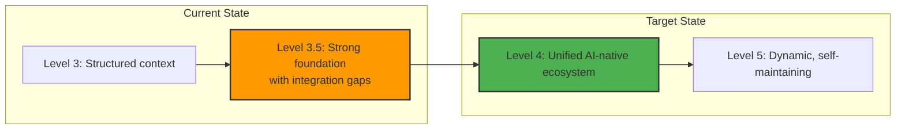
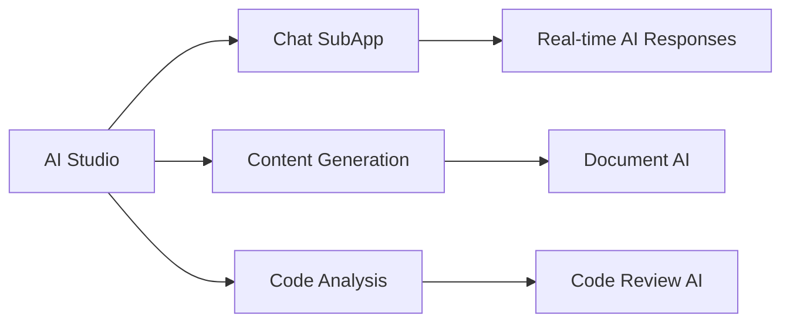

# Comprehensive Documentation Modernization for AI-First Development

<!-- AI-METADATA:
category: strategic-plan
stack: general
complexity: advanced
dependencies: [all-documentation]
version: 3.0
last-updated: 2025-01-14
-->

## 🎯 Executive Summary

This comprehensive modernization plan transforms the entire Kodix documentation ecosystem from **Level 3.5** to **Level 4+ maturity**, implementing AI-first principles across all documentation areas while building upon existing strengths. The plan addresses foundational gaps, enhances cross-system integration, and optimizes for modern AI-assisted development workflows including Claude Code VibeCoding.

### Transformation Scope

- **Beyond SubApps**: Comprehensive ecosystem including architecture, APIs, workflows, and developer experience
- **AI-First Design**: Universal AI optimization patterns across all documentation types
- **Integration Focus**: Seamless connections between existing strong systems
- **Developer-Centric**: Clear paths for different roles and experience levels
- **Future-Ready**: Scalable patterns for evolving AI development tools

---

## 📊 Complete Documentation Ecosystem Assessment

### Current Maturity: **Level 3.5 of 5**



### Complete Ecosystem Analysis

| Area                        | Current Status  | Quality   | Content                               | Priority      |
| --------------------------- | --------------- | --------- | ------------------------------------- | ------------- |
| **`/architecture/`**        | ✅ Excellent    | Level 4   | 22 docs, 57KB frontend, 27KB backend  | Enhance       |
| **`/context-engineering/`** | ✅ Complete     | Level 4   | Full system, standards, PRP, commands | **Preserve**  |
| **`/ai-assistants/`**       | ✅ Strong       | Level 3.5 | Universal principles + tool configs   | Extend        |
| **`/rules/`**               | ✅ Complete     | Level 4   | Universal + tool-specific AI rules    | Enhance       |
| **`/ui-catalog/`**          | ✅ Excellent    | Level 4   | 923-line comprehensive catalog        | Integrate     |
| **`/tests/`**               | ✅ Strong       | Level 3.5 | 7 comprehensive guides, patterns      | Connect       |
| **`/core-service/`**        | ✅ Good         | Level 3   | 5 service directories, planning       | Standardize   |
| **`/debug/`**               | ✅ Good         | Level 3   | Logging standards, debug protocols    | Modernize     |
| **`/eslint/`**              | ✅ Functional   | Level 2.5 | Basic linting documentation           | Upgrade       |
| **`/subapps/`**             | ❌ Critical Gap | Level 1   | Missing directories, minimal READMEs  | **Transform** |
| **Root `/docs/`**           | ❌ Missing      | Level 0   | No main README, no navigation         | **Create**    |
| **API Documentation**       | ❌ Missing      | Level 0   | No structured API docs                | **Build**     |
| **Integration Guides**      | ❌ Fragmented   | Level 1   | Scattered across areas                | **Unify**     |
| **Developer Onboarding**    | ❌ Incomplete   | Level 1   | No clear paths by role                | **Design**    |

### Foundational Gaps Identified

**Critical Missing Infrastructure:**

- 🚫 **No main `/docs/README.md`** - No entry point to documentation ecosystem
- 🚫 **No unified navigation** - Difficult to discover related documentation
- 🚫 **No API documentation structure** - tRPC, Zod schemas, endpoints not documented systematically
- 🚫 **No cross-system integration guides** - How architecture + subapps + services work together
- 🚫 **No developer journey mapping** - No clear paths for different roles and tasks
- 🚫 **Fragmented workflow documentation** - Development processes scattered across areas

**Integration Opportunities:**

- 🔗 Connect excellent architecture docs with SubApp implementations
- 🔗 Link comprehensive UI catalog with component usage in features
- 🔗 Bridge testing guides with actual implementation patterns
- 🔗 Unify AI assistant principles across all documentation types

---

## 🚀 Implementation Strategy: 10-Week Comprehensive Transformation

**Core Philosophy**: Build upon existing strengths while creating missing foundational elements and modern AI-first patterns.

### **Phase 1: Foundation & Navigation (Weeks 1-2)**

Create missing foundational infrastructure and navigation systems

### **Phase 2: API & Integration Documentation (Weeks 3-4)**

Build systematic API documentation and cross-system integration guides

### **Phase 3: SubApp Ecosystem Completion (Weeks 5-6)**

Transform SubApp documentation using new patterns established in earlier phases

### **Phase 4: AI-First Enhancement (Weeks 7-8)**

Apply Modern Docs Claude principles across all documentation areas

### **Phase 5: Integration & Developer Experience (Weeks 9-10)**

Unify the ecosystem and optimize for different developer workflows

---

## 🏗️ Phase 1: Foundation & Navigation (Weeks 1-2)

**Goal**: Establish missing foundational infrastructure and create a unified entry point to the documentation ecosystem

### Week 1: Core Foundation Creation

#### 1.1 Master Documentation Entry Point

**Create `/docs/README.md`** - The missing main entry point:

```markdown
# Kodix Documentation Hub

<!-- AI-METADATA:
category: overview
stack: general
complexity: basic
dependencies: []
ai-intent: navigation
scope: monorepo
-->

## 🎯 Quick Start

Welcome to the Kodix monorepo documentation. Choose your path:

### 👤 By Role

- **🧑‍💻 [New Developer](./onboarding/developer-guide.md)** - Complete setup and orientation
- **🏗️ [Backend Developer](./architecture/backend-guide.md)** - APIs, services, database
- **🎨 [Frontend Developer](./architecture/frontend-guide.md)** - UI, components, patterns
- **🏛️ [Architect](./architecture/README.md)** - System design and decisions
- **🧪 [QA Engineer](./tests/README.md)** - Testing strategies and tools
- **🤖 [AI-Assisted Developer](./ai-assistants/README.md)** - AI tools and workflows

### 🎯 By Task

- **🚀 [Start Development](./workflows/development-workflow.md)** - Day-to-day development process
- **🆕 [Add New Feature](./workflows/feature-development.md)** - From idea to deployment
- **🔧 [Build SubApp](./subapps/README.md)** - Create new SubApp from scratch
- **📊 [Create Components](./ui-catalog/README.md)** - UI components and patterns
- **🐛 [Debug Issues](./debug/README.md)** - Troubleshooting and debugging
- **📝 [Write Documentation](./context-engineering/README.md)** - Documentation best practices

### 🗂️ By System

| System            | Purpose                            | Entry Point                                     |
| ----------------- | ---------------------------------- | ----------------------------------------------- |
| **Architecture**  | System design, patterns, standards | [📖 Architecture Hub](./architecture/README.md) |
| **SubApps**       | Feature applications and modules   | [🏢 SubApp Catalog](./subapps/README.md)        |
| **APIs**          | tRPC endpoints, schemas, patterns  | [🔌 API Reference](./api/README.md)             |
| **Services**      | Core business services             | [⚙️ Service Layer](./core-service/README.md)    |
| **UI Components** | Design system and components       | [🎨 UI Catalog](./ui-catalog/README.md)         |
| **Testing**       | Testing strategies and guides      | [🧪 Testing Hub](./tests/README.md)             |
| **AI Assistants** | AI development tools               | [🤖 AI Tools](./ai-assistants/README.md)        |

## 🎯 Quick Navigation

### Development Essentials

- **Setup**: [Development Environment](./architecture/development-setup.md)
- **Standards**: [Coding Standards](./architecture/coding-standards.md)
- **Workflows**: [Git & Development Process](./architecture/workflows.md)
- **Debugging**: [Debug & Logging](./debug/README.md)

### AI-First Development

- **Context Engineering**: [AI Documentation Standards](./context-engineering/README.md)
- **VibeCoding**: [Claude Code Workflows](./ai-assistants/claude-code/README.md)
- **Universal Principles**: [Cross-Tool AI Patterns](./ai-assistants/universal-principles.md)

## 📊 Documentation Health

- **Total Documents**: 150+
- **Coverage**: Architecture ✅ | SubApps 🔄 | APIs 🔄 | Testing ✅
- **AI Optimization**: Universal patterns applied
- **Last Updated**: [Auto-generated date]

---

_This documentation is maintained by the Kodix team and optimized for both human developers and AI assistants._
```

#### 1.2 Navigation System Architecture

**Create comprehensive navigation structure**:

```bash
docs/
├── README.md                    # Master entry point (created above)
├── onboarding/                  # Developer onboarding paths
│   ├── README.md
│   ├── developer-guide.md       # New developer complete guide
│   ├── architect-guide.md       # Architecture-focused onboarding
│   └── ai-developer-guide.md    # AI-assisted development path
├── workflows/                   # Cross-cutting development workflows
│   ├── README.md
│   ├── development-workflow.md  # Day-to-day development
│   ├── feature-development.md   # End-to-end feature creation
│   ├── deployment-workflow.md   # Deployment processes
│   └── maintenance-workflow.md  # Ongoing maintenance tasks
└── api/                         # Comprehensive API documentation
    ├── README.md
    ├── trpc/                    # tRPC-specific documentation
    ├── schemas/                 # Zod schemas and validation
    └── patterns/                # API development patterns
```

#### 1.3 Developer Onboarding System

**Create role-based onboarding paths**:

```markdown
# docs/onboarding/developer-guide.md

# New Developer Onboarding Guide

<!-- AI-METADATA:
category: guide
stack: general
complexity: basic
dependencies: []
audience: new-developers
estimated-time: 120
-->

## 🎯 Welcome to Kodix

This guide provides a structured path for new developers joining the Kodix team.

## 📋 30-Day Onboarding Plan

### Week 1: Foundation

- [ ] **Day 1-2**: [Environment Setup](../architecture/development-setup.md)
- [ ] **Day 3-4**: [Architecture Overview](../architecture/README.md)
- [ ] **Day 5**: [SubApp System Understanding](../subapps/README.md)

### Week 2: Development Patterns

- [ ] **Day 6-8**: [Backend Patterns](../architecture/backend-guide.md)
- [ ] **Day 9-10**: [Frontend Patterns](../architecture/frontend-guide.md)

### Week 3: AI-Assisted Development

- [ ] **Day 11-13**: [AI Assistant Setup](../ai-assistants/README.md)
- [ ] **Day 14-15**: [VibeCoding Workflows](../ai-assistants/claude-code/README.md)

### Week 4: Real Development

- [ ] **Day 16-20**: First SubApp contribution following [Feature Development Workflow](../workflows/feature-development.md)

## 🎯 Learning Checkpoints

After each week, validate understanding:

- **Week 1**: Can set up development environment and explain architecture
- **Week 2**: Can create basic components following patterns
- **Week 3**: Can use AI assistants effectively for development
- **Week 4**: Can contribute features end-to-end

## 🔗 Essential References

- **Daily Workflow**: [Development Process](../workflows/development-workflow.md)
- **Code Standards**: [Coding Standards](../architecture/coding-standards.md)
- **UI Components**: [Component Catalog](../ui-catalog/README.md)
- **Testing**: [Testing Guide](../tests/README.md)
```

### Week 2: Workflow Documentation

#### 2.1 Cross-Cutting Workflow Documentation

**Create comprehensive workflow guides** that span multiple documentation areas:

```markdown
# docs/workflows/feature-development.md

# Complete Feature Development Workflow

<!-- AI-METADATA:
category: workflow
stack: [nextjs, trpc, drizzle]
complexity: intermediate
dependencies: [architecture, subapps, api]
workflow-type: feature-creation
-->

## 🎯 Overview

End-to-end process for developing new features in the Kodix monorepo, integrating architecture patterns, SubApp principles, and AI-assisted development.

## 📋 Pre-Development Phase

### 1. Feature Planning

1. **Create PRP**: Use [PRP Workflow](../context-engineering/prp/README.md)
2. **Architecture Review**: Validate against [Architecture Standards](../architecture/Architecture_Standards.md)
3. **SubApp Assessment**: Determine if new SubApp needed or extend existing

### 2. Documentation First

1. **Feature Specification**: Document in appropriate SubApp docs
2. **API Design**: Plan tRPC endpoints using [API Patterns](../api/patterns/README.md)
3. **UI Planning**: Reference [UI Catalog](../ui-catalog/README.md) for components

## 🏗️ Development Phase

### 3. Implementation Order

1. **Database Schema**: Following [Backend Guide](../architecture/backend-guide.md)
2. **API Layer**: Implement tRPC endpoints
3. **Service Layer**: Business logic following [Service Patterns](../core-service/README.md)
4. **Frontend Components**: Using [Frontend Guide](../architecture/frontend-guide.md)
5. **Integration**: Connect with existing SubApps if needed

### 4. Quality Assurance

1. **Testing**: Follow [Testing Guide](../tests/README.md)
2. **Linting**: Apply [Coding Standards](../architecture/coding-standards.md)
3. **Documentation Update**: Update relevant SubApp docs

## 🤖 AI-Assisted Development

### 5. VibeCoding Integration

1. **Context Assembly**: Load relevant documentation
2. **AI-Assisted Implementation**: Use [Claude Code Workflows](../ai-assistants/claude-code/README.md)
3. **Quality Validation**: AI-assisted code review

## 🔗 Integration Points

This workflow integrates with:

- **Architecture**: System design principles
- **SubApps**: Feature organization and isolation
- **API Documentation**: Endpoint design and implementation
- **UI Catalog**: Component reuse and patterns
- **Testing**: Quality assurance processes
- **AI Assistants**: Development acceleration
```

#### 2.2 Documentation Integration Map

**Create explicit connections between documentation areas**:

```markdown
# docs/integration-map.md

# Documentation Integration Map

<!-- AI-METADATA:
category: reference
stack: general
complexity: intermediate
dependencies: [all-documentation]
-->

## 🔗 How Documentation Areas Connect

### Architecture ↔ SubApps

- **Architecture**: Defines patterns and standards
- **SubApps**: Implement patterns in specific contexts
- **Connection**: SubApp docs reference architecture patterns

### API ↔ Services ↔ SubApps

- **API**: Defines interfaces and schemas
- **Services**: Implement business logic
- **SubApps**: Consume services through APIs
- **Connection**: Consistent tRPC patterns across all layers

### UI Catalog ↔ SubApps ↔ Frontend Guide

- **UI Catalog**: Component library and design system
- **Frontend Guide**: Implementation patterns
- **SubApps**: Use components following patterns
- **Connection**: SubApp frontend docs reference UI catalog

### Testing ↔ All Areas

- **Testing Hub**: Testing strategies and tools
- **All Areas**: Specific testing implementations
- **Connection**: Each area has testing guidelines referencing central guide

### AI Assistants ↔ All Areas

- **AI Assistants**: Universal AI development patterns
- **All Areas**: AI-optimized documentation
- **Connection**: Consistent AI metadata and context patterns
```

**Week 1-2 Deliverables:**

- [ ] Main `/docs/README.md` created with comprehensive navigation
- [ ] Onboarding guides for different developer roles
- [ ] Cross-cutting workflow documentation
- [ ] Documentation integration mapping
- [ ] Foundation for API documentation structure

---

## 🔌 Phase 2: API & Integration Documentation (Weeks 3-4)

**Goal**: Build comprehensive API documentation and create integration guides that connect all systems

### Week 3: API Documentation Structure

#### 3.1 Comprehensive API Documentation Hub

**Create `/docs/api/README.md`** - Systematic API documentation:

```markdown
# Kodix API Documentation Hub

<!-- AI-METADATA:
category: api-reference
stack: [trpc, zod, drizzle]
complexity: intermediate
dependencies: [architecture, subapps]
-->

## 🎯 Quick Reference

Complete API documentation for the Kodix platform, covering tRPC endpoints, schemas, and patterns.

## 📋 API Overview

### Architecture

- **Type-Safe APIs**: End-to-end TypeScript with tRPC
- **Schema Validation**: Zod schemas for all inputs/outputs
- **Service Layer**: Business logic isolation
- **SubApp Isolation**: APIs organized by SubApp boundaries

## 🚀 API Categories

### Core Platform APIs

| Router     | Purpose                        | Documentation                 |
| ---------- | ------------------------------ | ----------------------------- |
| **`auth`** | Authentication & authorization | [Auth API](./routers/auth.md) |
| **`user`** | User management                | [User API](./routers/user.md) |
| **`team`** | Team operations                | [Team API](./routers/team.md) |

### SubApp APIs

| SubApp        | Router     | Purpose             | Documentation                           |
| ------------- | ---------- | ------------------- | --------------------------------------- |
| **AI Studio** | `aiStudio` | AI model management | [AI Studio API](./subapps/ai-studio.md) |
| **Chat**      | `chat`     | Real-time messaging | [Chat API](./subapps/chat.md)           |
| **Todo**      | `todo`     | Task management     | [Todo API](./subapps/todo.md)           |
| **Calendar**  | `calendar` | Event management    | [Calendar API](./subapps/calendar.md)   |

## 🔧 Development Guide

### Quick Start

1. **[API Patterns](./patterns/README.md)** - Standard implementation patterns
2. **[Schema Guide](./schemas/README.md)** - Zod schema design
3. **[Testing APIs](./testing/README.md)** - API testing strategies

### Advanced Topics

- **[Error Handling](./patterns/error-handling.md)** - Consistent error patterns
- **[Authentication](./patterns/authentication.md)** - Auth implementation
- **[Performance](./patterns/performance.md)** - Optimization strategies
```

#### 3.2 tRPC Pattern Documentation

**Create systematic tRPC documentation** based on Modern Docs Claude patterns:

````markdown
# docs/api/patterns/trpc-patterns.md

# tRPC Development Patterns

<!-- AI-METADATA:
category: patterns
stack: trpc
complexity: advanced
dependencies: [architecture/trpc-patterns.md]
-->

## 🎯 Quick Reference

Standard patterns for developing tRPC endpoints in the Kodix platform.

## 📋 Core Patterns

### 1. Router Structure Pattern

```typescript
// Standard router organization
export const subappRouter = router({
  // Queries (read operations)
  list: protectedProcedure
    .input(ListInputSchema)
    .query(async ({ ctx, input }) => {
      // Implementation
    }),

  // Mutations (write operations)
  create: protectedProcedure
    .input(CreateInputSchema)
    .mutation(async ({ ctx, input }) => {
      // Implementation
    }),
});
```
````

### 2. Schema Validation Pattern

```typescript
// Input validation with Zod
const CreateItemSchema = z.object({
  title: z.string().min(1).max(100),
  description: z.string().optional(),
  teamId: z.string().uuid(), // Always include for multi-tenancy
});

// Export type for frontend use
export type CreateItemInput = z.infer<typeof CreateItemSchema>;
```

### 3. Service Layer Integration

```typescript
// Router delegates to service layer
create: protectedProcedure
  .input(CreateItemSchema)
  .mutation(async ({ ctx, input }) => {
    return await ItemService.create({
      ...input,
      userId: ctx.user.id,
      teamId: ctx.user.teamId,
    });
  }),
```

## 🔗 Integration with Architecture

This document extends [Architecture tRPC Patterns](../../architecture/trpc-patterns.md) with:

- API-specific implementation details
- SubApp-specific patterns
- AI-first documentation approach

````

### Week 4: Integration Documentation

#### 4.1 Cross-System Integration Guides

**Create guides showing how all systems work together**:

```markdown
# docs/integration-guides/subapp-to-service-integration.md

# SubApp to Service Layer Integration

<!-- AI-METADATA:
category: integration-guide
stack: [nextjs, trpc, drizzle]
complexity: advanced
dependencies: [subapps, core-service, api]
-->

## 🎯 Overview

How SubApps integrate with the core service layer while maintaining isolation and following architectural principles.

## 🏗️ Integration Architecture

```mermaid
graph TD
    subgraph "SubApp Layer"
        A[AI Studio SubApp] --> B[Chat SubApp]
        B --> C[Todo SubApp]
    end

    subgraph "API Layer"
        D[tRPC Routers]
    end

    subgraph "Service Layer"
        E[AiStudioService] --> F[ChatService]
        F --> G[TodoService]
    end

    subgraph "Data Layer"
        H[Drizzle ORM] --> I[Database]
    end

    A --> D
    B --> D
    C --> D
    D --> E
    D --> F
    D --> G
    E --> H
    F --> H
    G --> H
````

## 📋 Integration Patterns

### 1. SubApp → API → Service Flow

**Frontend Component** (SubApp):

```typescript
// In SubApp component
const { mutate } = api.aiStudio.createModel.useMutation();
```

**tRPC Router** (API Layer):

```typescript
// Router delegates to service
createModel: protectedProcedure
  .input(CreateModelSchema)
  .mutation(async ({ ctx, input }) => {
    return await AiStudioService.createModel(ctx, input);
  }),
```

**Service Implementation** (Service Layer):

```typescript
// Service handles business logic
export class AiStudioService {
  static async createModel(ctx: Context, input: CreateModelInput) {
    // Validation, business logic, database operations
    return await db.insert(aiModels).values({
      ...input,
      teamId: ctx.user.teamId, // Multi-tenancy
    });
  }
}
```

### 2. Cross-SubApp Communication

When SubApps need to communicate:

```typescript
// Through service layer only
export class ChatService {
  static async processAiMessage(ctx: Context, input: ProcessMessageInput) {
    // Chat service uses AI Studio service
    const aiModel = await AiStudioService.getActiveModel(ctx);
    const response = await AiStudioService.generateResponse(ctx, {
      model: aiModel,
      message: input.message,
    });

    return await this.saveMessage(ctx, {
      content: response,
      type: "ai-response",
    });
  }
}
```

## 🔗 Documentation References

- **SubApp Architecture**: [SubApp Principles](../architecture/subapp-architecture.md)
- **Service Patterns**: [Service Layer Guide](../core-service/README.md)
- **API Patterns**: [tRPC Development](../api/patterns/README.md)

````

#### 4.2 Component Integration Documentation

**Connect UI Catalog with actual SubApp usage**:

```markdown
# docs/integration-guides/ui-catalog-to-subapp-integration.md

# UI Catalog to SubApp Integration

<!-- AI-METADATA:
category: integration-guide
stack: [nextjs, tailwind, shadcn]
complexity: intermediate
dependencies: [ui-catalog, subapps]
-->

## 🎯 How to Use UI Catalog in SubApps

Step-by-step guide for implementing UI components from the catalog in SubApp development.

## 📋 Integration Workflow

### 1. Component Discovery
1. **Browse Catalog**: [UI Component Catalog](../ui-catalog/README.md)
2. **Find Pattern**: Look for similar use cases
3. **Check Examples**: Review implementation examples

### 2. SubApp Implementation
1. **Import Component**: From `@kodix/ui`
2. **Follow Patterns**: Use established patterns
3. **Customize**: Apply SubApp-specific styling

### 3. Example Integration

**From UI Catalog** (reference):
```typescript
// packages/ui/src/button.tsx
export const Button = React.forwardRef<...>(...)
````

**In SubApp** (implementation):

```typescript
// apps/kdx/src/app/[locale]/(authed)/apps/ai-studio/_components/ModelCard.tsx
import { Button } from "@kodix/ui/button";

export function ModelCard({ model }: ModelCardProps) {
  return (
    <div className="...">
      <h3>{model.name}</h3>
      <Button
        variant="outline"
        onClick={() => selectModel(model.id)}
      >
        Select Model
      </Button>
    </div>
  );
}
```

## 🔗 Cross-References

- **Component Patterns**: [UI Catalog Examples](../ui-catalog/component-examples.md)
- **SubApp Frontend**: [Frontend Development Guide](../architecture/frontend-guide.md)
- **Design System**: [UI Patterns](../ui-catalog/index.md)

````

**Week 3-4 Deliverables:**
- [ ] Comprehensive API documentation hub created
- [ ] tRPC pattern documentation established
- [ ] Cross-system integration guides completed
- [ ] UI Catalog to SubApp integration documented
- [ ] Service layer integration patterns defined

---

## 🏢 Phase 3: SubApp Ecosystem Completion (Weeks 5-6)

**Goal**: Transform SubApp documentation using patterns established in previous phases and complete the critical gap identified in the original assessment

### Week 5: SubApp Foundation & Missing Directories

#### 5.1 Apply Modern Documentation Patterns to SubApps

**Using the foundation created in Phase 1-2, implement comprehensive SubApp documentation**:

1. **Create Missing Directories** (Critical Gap Resolution):
   ```bash
   # Resolve missing ai-studio and chat directories
   mkdir -p docs/subapps/ai-studio/{backend,frontend,prp,integration}
   mkdir -p docs/subapps/chat/{backend,frontend,prp,integration}

   # Enhance existing SubApp structure
   mkdir -p docs/subapps/todo/{backend,frontend,prp,integration}
   mkdir -p docs/subapps/calendar/{backend,frontend,prp,integration}
   mkdir -p docs/subapps/cupom/{backend,frontend,prp,integration}
   mkdir -p docs/subapps/kodix-care-web/{backend,frontend,prp,integration}
````

2. **Modern SubApp Documentation Structure** (building on workflow patterns):
   ```markdown
   docs/subapps/[subapp-name]/
   ├── README.md # Overview with navigation integration
   ├── backend/
   │ ├── README.md # Architecture overview
   │ ├── api-reference.md # Links to /docs/api/subapps/[name]
   │ ├── service-integration.md # Links to /docs/core-service/
   │ └── database-models.md # Drizzle schema documentation
   ├── frontend/
   │ ├── README.md # Frontend architecture
   │ ├── components.md # Links to /docs/ui-catalog/
   │ ├── routing.md # Next.js App Router patterns
   │ └── state-management.md # Zustand patterns
   ├── prp/
   │ ├── README.md # Planning overview
   │ ├── active/ # Current development
   │ └── archive/ # Completed features
   └── integration/
   ├── README.md # Integration overview
   ├── api-integration.md # How this SubApp uses APIs
   ├── service-dependencies.md # Service layer dependencies
   └── cross-subapp.md # Integration with other SubApps
   ```

#### 5.2 AI Studio SubApp (Priority 1 - Missing Directory)

**Create comprehensive AI Studio documentation**:

````markdown
# docs/subapps/ai-studio/README.md

# AI Studio SubApp

<!-- AI-METADATA:
category: subapp
stack: [nextjs, trpc, zod, ai-integration]
complexity: advanced
dependencies: [architecture, api, core-service]
subapp-id: ai-studio
integration-points: [chat, core-ai-service]
-->

## 🎯 Quick Context

AI Studio manages AI model configurations, provider integrations, and model selection for the Kodix platform. Central hub for all AI-related functionality across SubApps.

## 📋 Overview

The AI Studio SubApp provides a unified interface for:

- AI model provider management (OpenAI, Anthropic, local models)
- Model configuration and selection
- AI capability testing and validation
- Integration with other SubApps requiring AI functionality

### Integration Architecture


````

## 🚀 Documentation Structure

### 🏗️ **[Backend Documentation](./backend/README.md)**

**Target**: Backend developers, AI engineers, DevOps

- AI provider integration patterns
- Model management APIs
- Configuration and validation
- Service layer architecture

### 🎨 **[Frontend Documentation](./frontend/README.md)**

**Target**: Frontend developers, UI/UX designers

- Model selection interfaces
- Provider configuration UIs
- Real-time model testing
- Integration with design system

### 📋 **[PRP Documentation](./prp/README.md)**

**Target**: Product managers, AI researchers, planning team

- AI feature planning templates
- Model evaluation criteria
- Integration requirements
- Performance benchmarks

### 🔗 **[Integration Documentation](./integration/README.md)**

**Target**: All developers working with AI features

- Cross-SubApp AI integration
- Service layer dependencies
- API consumption patterns
- Testing AI integrations

## 🔗 Key Integrations

- **API Layer**: [AI Studio API Reference](../../api/subapps/ai-studio.md)
- **Service Layer**: [AI Studio Service](../../core-service/ai-studio-service.md)
- **UI Components**: [AI-specific Components](../../ui-catalog/ai-components.md)
- **Testing**: [AI Testing Patterns](../../tests/ai-testing-guide.md)
- **Architecture**: [AI Integration Architecture](../../architecture/ai-architecture.md)

## 📊 Current Status

| Feature                   | Status         | Documentation                                       |
| ------------------------- | -------------- | --------------------------------------------------- |
| **Provider Management**   | ✅ Production  | [Provider Config](./backend/provider-config.md)     |
| **Model Selection**       | ✅ Production  | [Model Management](./backend/model-management.md)   |
| **Real-time Testing**     | 🚧 Development | [Testing Interface](./frontend/testing-ui.md)       |
| **Cross-App Integration** | 📋 Planned     | [Integration Roadmap](./prp/integration-roadmap.md) |

````

#### 5.3 Chat SubApp (Priority 2 - Missing Directory)

**Create comprehensive Chat documentation** with integration focus:

```markdown
# docs/subapps/chat/README.md

# Chat SubApp

<!-- AI-METADATA:
category: subapp
stack: [nextjs, trpc, websockets, ai-integration]
complexity: advanced
dependencies: [ai-studio, architecture, api]
subapp-id: chat
real-time: yes
integration-points: [ai-studio, notifications]
-->

## 🎯 Quick Context

Real-time chat system with AI integration, supporting human-to-human and human-to-AI conversations. Integrates with AI Studio for intelligent responses and conversation management.

## 📋 Overview

The Chat SubApp provides:
- Real-time messaging with WebSocket support
- AI-powered conversation assistance
- Message history and search
- Integration with AI Studio for model selection
- Multi-user chat rooms and direct messages

### Real-time Architecture

```mermaid
sequenceDiagram
    participant User
    participant Chat UI
    participant tRPC/WS
    participant Chat Service
    participant AI Studio
    participant Database

    User->>Chat UI: Send message
    Chat UI->>tRPC/WS: Broadcast message
    tRPC/WS->>Chat Service: Process message
    Chat Service->>AI Studio: Get AI response (if AI chat)
    AI Studio-->>Chat Service: AI response
    Chat Service->>Database: Store messages
    Chat Service-->>tRPC/WS: Broadcast to participants
    tRPC/WS-->>Chat UI: Real-time updates
    Chat UI-->>User: Display messages
````

## 🚀 Documentation Structure

### 🏗️ **[Backend Documentation](./backend/README.md)**

**Target**: Backend developers, real-time specialists

- WebSocket implementation patterns
- Message processing architecture
- AI integration with AI Studio service
- Real-time data synchronization

### 🎨 **[Frontend Documentation](./frontend/README.md)**

**Target**: Frontend developers, UI/UX designers

- Real-time UI patterns
- Message components and layouts
- AI chat interface design
- Performance optimization for real-time updates

### 📋 **[PRP Documentation](./prp/README.md)**

**Target**: Product managers, conversation designers

- Chat feature planning
- AI conversation flows
- User experience requirements
- Integration specifications

### 🔗 **[Integration Documentation](./integration/README.md)**

**Target**: Developers integrating chat functionality

- AI Studio service integration
- Real-time communication patterns
- Cross-SubApp messaging
- Third-party chat integrations

## 🔗 Deep Integration Points

- **AI Studio**: [AI Chat Integration](./integration/ai-studio-integration.md)
- **Real-time APIs**: [Chat API Reference](../../api/subapps/chat.md)
- **WebSocket Patterns**: [Real-time Architecture](../../architecture/websocket-patterns.md)
- **UI Components**: [Chat Components](../../ui-catalog/chat-components.md)
- **Testing Real-time**: [Chat Testing Guide](../../tests/realtime-testing.md)

````

### Week 6: Enhanced Existing SubApps

#### 6.1 Transform Existing Basic SubApps

**Apply comprehensive patterns to existing SubApps with minimal documentation**:

**Todo SubApp Enhancement**:
```markdown
# docs/subapps/todo/README.md

# Todo SubApp

<!-- AI-METADATA:
category: subapp
stack: [nextjs, trpc, drizzle]
complexity: intermediate
dependencies: [architecture, api]
subapp-id: todo
collaboration: yes
-->

## 🎯 Quick Context

Task management system with collaboration features, priority management, and team integration. Designed for efficient team coordination and individual productivity.

## 📋 Overview

Enhanced from basic task management to include:
- Individual and team task management
- Priority and deadline tracking
- Cross-SubApp task integration (calendar, projects)
- Collaboration and assignment features
- Progress tracking and reporting

### Task Management Architecture

```mermaid
graph TD
    A[User Tasks] --> B[Team Tasks]
    B --> C[Project Integration]
    C --> D[Calendar Sync]
    A --> E[Priority Management]
    E --> F[Deadline Tracking]
    F --> G[Progress Reports]
````

## 🚀 Enhanced Documentation Structure

### 🏗️ **[Backend Documentation](./backend/README.md)**

- Task data models and relationships
- Team collaboration APIs
- Priority and scheduling algorithms
- Cross-SubApp data integration

### 🎨 **[Frontend Documentation](./frontend/README.md)**

- Task management UI patterns
- Collaboration interface design
- Drag-and-drop task organization
- Real-time collaboration features

### 📋 **[PRP Documentation](./prp/README.md)**

- Task management feature planning
- Collaboration workflow requirements
- Integration specifications
- Performance and scalability planning

### 🔗 **[Integration Documentation](./integration/README.md)**

- Calendar SubApp synchronization
- Project management integration
- Team collaboration patterns
- Cross-platform task sharing

## 🔗 Integration Ecosystem

- **Calendar Integration**: [Todo-Calendar Sync](./integration/calendar-sync.md)
- **Team Collaboration**: [Todo Collaboration](../../core-service/collaboration-patterns.md)
- **Task APIs**: [Todo API Reference](../../api/subapps/todo.md)
- **UI Patterns**: [Task Components](../../ui-catalog/task-components.md)

````

**Week 5-6 Deliverables:**
- [ ] AI Studio SubApp comprehensive documentation created
- [ ] Chat SubApp comprehensive documentation created
- [ ] All 4 existing SubApps enhanced with modern patterns
- [ ] Integration documentation connecting SubApps to broader ecosystem
- [ ] SubApp navigation integrated with main documentation hub

---

## 🤖 Phase 4: AI-First Enhancement (Weeks 7-8)

**Goal**: Apply Modern Docs Claude principles across all documentation areas and optimize for AI-assisted development

### Week 7: Universal AI Optimization

#### 7.1 Apply Modern Docs Claude Patterns Everywhere

**Enhance all documentation areas with AI-first principles**:

1. **Architecture Documentation Enhancement**:
   ```markdown
   # Enhanced AI-First Architecture Pattern

   <!-- AI-METADATA:
   category: architecture
   stack: [nextjs, trpc, drizzle]
   complexity: advanced
   dependencies: [database-schema, api-patterns]
   ai-intent: implementation
   vibe-coding: optimized
   -->

   ## 🎯 Quick Summary (AI Context)

   [One-line description for rapid AI comprehension]

   ## 📋 Progressive Disclosure

   ### ⚡ Quick Context (30 seconds)
   Essential information for immediate understanding

   ### 🔧 Implementation Guide (5 minutes)
   <details>
   <summary>Detailed implementation patterns</summary>

   Step-by-step implementation with code examples

   </details>

   ### 🧩 Advanced Patterns (as needed)
   <details>
   <summary>Expert-level patterns and edge cases</summary>

   Complex scenarios and optimization techniques

   </details>
````

2. **Living Documentation Implementation**:

   ````markdown
   # docs/automation/living-documentation.md

   # Living Documentation System

   ## Automated Updates

   - **API Documentation**: Auto-generated from tRPC routers
   - **Schema Documentation**: Auto-generated from Zod schemas
   - **Component Documentation**: Auto-generated from component props
   - **Test Documentation**: Auto-generated from test coverage

   ## CI/CD Integration

   ```yaml
   # .github/workflows/docs-update.yml
   name: Update Documentation
   on:
     push:
       branches: [main]
       paths: ["packages/**", "apps/**"]

   jobs:
     update-docs:
       runs-on: ubuntu-latest
       steps:
         - uses: actions/checkout@v4
         - name: Generate API docs
           run: pnpm generate:api-docs
         - name: Update component docs
           run: pnpm generate:component-docs
         - name: Validate documentation
           run: pnpm validate:docs
   ```
   ````

#### 7.2 Documentation Quality Gates

**Implement comprehensive validation**:

````markdown
# docs/quality/documentation-standards.md

# Documentation Quality Standards

## Automated Validation

### Required Elements

- [ ] AI-METADATA block present
- [ ] Quick summary for AI context
- [ ] Progressive disclosure structure
- [ ] Cross-references to related docs
- [ ] Code examples with explanations
- [ ] Integration points documented

### Quality Metrics

- **Completeness**: All sections present
- **Accuracy**: Examples work as documented
- **Freshness**: Updated within last 90 days
- **Cross-reference**: All links valid
- **AI Optimization**: Metadata complete

## Validation Tools

```bash
# Documentation linting
pnpm lint:docs

# Link validation
pnpm validate:links

# Metadata validation
pnpm validate:metadata

# Example testing
pnpm test:docs-examples
```
````

### Week 8: VibeCoding Optimization

#### 8.1 Claude Code Workflow Integration

**Create comprehensive VibeCoding patterns** that integrate all documentation areas:

````markdown
# docs/ai-assistants/claude-code/ecosystem-workflows.md

# Claude Code Ecosystem Workflows

<!-- AI-METADATA:
category: ai-workflow
stack: general
complexity: advanced
dependencies: [all-documentation]
vibe-coding: primary
-->

## 🎯 Complete Development Workflows

### Workflow 1: New Feature Development

**Context Assembly Order**:

1. **Foundation**: [Main README](../../README.md) + [Architecture Overview](../../architecture/README.md)
2. **Planning**: [PRP Templates](../../context-engineering/prp/templates/) + [Feature Workflow](../../workflows/feature-development.md)
3. **Implementation**: Relevant SubApp docs + API patterns + UI catalog
4. **Integration**: Cross-system integration guides
5. **Quality**: Testing patterns + validation guides

**VibeCoding Steps**:

```markdown
1. **Context Loading**:

   - Load: @docs/README.md
   - Load: @docs/workflows/feature-development.md
   - Load: @docs/subapps/[relevant-subapp]/README.md

2. **Planning**:

   - Generate PRP using: @docs/context-engineering/prp/templates/
   - Validate against: @docs/architecture/Architecture_Standards.md

3. **Implementation**:

   - Follow patterns from: @docs/api/patterns/
   - Use components from: @docs/ui-catalog/
   - Test with: @docs/tests/

4. **Integration**:
   - Validate with: @docs/integration-guides/
   - Update docs following: @docs/context-engineering/standards/
```
````

### Workflow 2: SubApp Development

**AI Studio Development Pattern**:

```markdown
1. **SubApp Context**:

   - Load: @docs/subapps/ai-studio/README.md
   - Load: @docs/subapps/ai-studio/backend/README.md
   - Load: @docs/api/subapps/ai-studio.md

2. **Integration Context**:

   - Load: @docs/subapps/ai-studio/integration/README.md
   - Load: @docs/core-service/ai-studio-service.md
   - Load: @docs/integration-guides/ai-integration.md

3. **Implementation**:
   - Follow: AI Studio specific patterns
   - Integrate: With existing service layer
   - Test: AI functionality end-to-end
```

### Workflow 3: Cross-System Development

**When developing features that span multiple areas**:

```markdown
1. **Ecosystem Understanding**:

   - Load: @docs/integration-map.md
   - Load: All relevant SubApp READMEs
   - Load: @docs/architecture/system-boundaries.md

2. **Integration Planning**:

   - Review: @docs/integration-guides/
   - Plan: Service layer interactions
   - Design: API contracts

3. **Implementation**:
   - Implement: Following cross-system patterns
   - Test: Integration points thoroughly
   - Document: New integration patterns
```

````

#### 8.2 Universal AI Assistant Optimization

**Extend AI patterns to all assistants** (not just Claude Code):

```markdown
# docs/ai-assistants/universal-optimization.md

# Universal AI Assistant Optimization

## Documentation Consumption Patterns

### For All AI Assistants

**Context Priority Hierarchy**:
1. **Critical**: Main README + specific task documentation
2. **High**: Related architecture and patterns
3. **Medium**: Integration guides and examples
4. **Low**: Historical and reference information

**Semantic Markers for Universal Parsing**:
```markdown
<!-- AI-CONTEXT: [overview|implementation|troubleshooting|reference] -->
<!-- AI-PRIORITY: [critical|high|medium|low] -->
<!-- AI-INTENT: [task|question|reference|learning] -->
<!-- AI-SCOPE: [file|component|subapp|system|monorepo] -->
````

### Tool-Specific Optimizations

**Cursor Integration**:

- Memory management with documentation references
- Workspace-aware context loading
- Progressive disclosure based on task complexity

**Other AI Assistants**:

- Universal markdown compatibility
- Consistent cross-reference patterns
- Standard metadata interpretation

````

**Week 7-8 Deliverables:**
- [ ] AI-first patterns applied to all documentation areas
- [ ] Living documentation system implemented
- [ ] Documentation quality gates established
- [ ] Comprehensive VibeCoding workflows created
- [ ] Universal AI assistant optimization completed

---

## 🔧 Phase 5: Integration & Developer Experience (Weeks 9-10)

**Goal**: Create a unified, seamless developer experience across the entire documentation ecosystem

### Week 9: Ecosystem Integration

#### 9.1 Complete Navigation Integration

**Ensure seamless navigation between all documentation areas**:

```markdown
# docs/navigation/smart-navigation.md

# Smart Documentation Navigation

## Context-Aware Navigation

### By Developer Journey
- **New Developer** → Onboarding → Architecture → First SubApp
- **Feature Developer** → Workflow → SubApp → API → Implementation
- **Architect** → Architecture → Integration Guides → System Design
- **AI Developer** → AI Assistants → VibeCoding → Context Engineering

### By Task Context
- **Building Feature** → Feature Workflow → SubApp Docs → API Reference → Testing
- **Debugging Issue** → Debug Guide → Relevant SubApp → Service Layer → Logs
- **Adding Integration** → Integration Guides → Service Patterns → API Contracts

## Cross-Reference System

### Automatic Cross-References
- SubApp docs automatically link to relevant API documentation
- Architecture docs automatically link to implementation examples
- Testing docs automatically link to specific SubApp testing patterns
- Integration guides automatically connect related systems

### Smart Context Assembly
```typescript
// Context assembly logic for AI assistants
interface ContextAssembly {
  primary: string[];      // Must-have documents
  secondary: string[];    // Important for context
  tertiary: string[];     // Reference material
  examples: string[];     // Code examples
}

const assembleContext = (intent: UserIntent): ContextAssembly => {
  // Smart context selection based on user intent and current task
}
````

#### 9.2 Developer Experience Optimization

**Create role-based documentation experiences**:

```markdown
# docs/experiences/developer-roles.md

# Role-Based Documentation Experiences

## Frontend Developer Experience

### Daily Workflow

1. **Morning Setup**: [Development Workflow](../workflows/development-workflow.md)
2. **Component Work**: [UI Catalog](../ui-catalog/README.md) → [Frontend Guide](../architecture/frontend-guide.md)
3. **API Integration**: [Frontend API Patterns](../api/patterns/frontend-integration.md)
4. **Testing**: [Frontend Testing](../tests/frontend-testing.md)

### Documentation Path
```

Start → Frontend Guide → UI Catalog → SubApp Frontend Docs → API Integration → Testing

```

## Backend Developer Experience

### Daily Workflow
1. **API Development**: [Backend Guide](../architecture/backend-guide.md) → [tRPC Patterns](../api/patterns/trpc-patterns.md)
2. **Service Layer**: [Core Service Docs](../core-service/README.md)
3. **Database**: [Database Patterns](../architecture/database-patterns.md)
4. **Testing**: [Backend Testing](../tests/backend-testing.md)

### Documentation Path
```

Start → Backend Guide → API Patterns → Service Layer → Database → Testing

```

## Full-Stack Developer Experience

### Project Flow
1. **Feature Planning**: [Feature Workflow](../workflows/feature-development.md)
2. **Architecture Review**: [Architecture Standards](../architecture/Architecture_Standards.md)
3. **SubApp Development**: [SubApp Guide](../subapps/README.md)
4. **Integration**: [Integration Guides](../integration-guides/README.md)

### Documentation Path
```

Start → Feature Workflow → Architecture → SubApp Docs → API → Integration → Testing

```

```

### Week 10: Quality Assurance & Launch

#### 10.1 Comprehensive Documentation Validation

**Final quality assurance across the entire ecosystem**:

````markdown
# docs/quality/ecosystem-validation.md

# Complete Ecosystem Validation

## Documentation Coverage Audit

### Required Documentation Elements

- [ ] **Foundation**: Main README with comprehensive navigation
- [ ] **Architecture**: All 22 existing docs enhanced with AI patterns
- [ ] **SubApps**: All 6 SubApps have comprehensive documentation
- [ ] **APIs**: Complete API documentation hub with patterns
- [ ] **Integration**: Cross-system integration guides
- [ ] **Workflows**: Developer workflow documentation
- [ ] **AI Optimization**: Universal AI assistant patterns applied

### Quality Metrics Validation

- [ ] **Completeness**: 100% coverage of core areas
- [ ] **AI Optimization**: All docs have AI metadata
- [ ] **Cross-References**: All links validated and working
- [ ] **Examples**: All code examples tested and working
- [ ] **Navigation**: Seamless navigation between all areas
- [ ] **Integration**: Clear integration patterns documented

## Validation Tools

```bash
# Complete ecosystem validation
pnpm validate:ecosystem

# Coverage validation
pnpm validate:coverage

# AI optimization validation
pnpm validate:ai-patterns

# Cross-reference validation
pnpm validate:cross-refs

# Example validation
pnpm validate:examples
```
````

#### 10.2 Documentation Maintenance Framework

**Establish ongoing maintenance processes**:

```markdown
# docs/maintenance/documentation-maintenance.md

# Documentation Ecosystem Maintenance

## Automated Maintenance

### Daily Automation

- Link validation across all documentation
- Example testing for all code samples
- Cross-reference validation
- Metadata compliance checking

### Weekly Automation

- Documentation freshness reports
- Coverage analysis updates
- AI pattern compliance validation
- Integration guide validation

### Monthly Reviews

- Documentation quality metrics
- Developer feedback integration
- New pattern identification
- Ecosystem health assessment

## Continuous Improvement Process

### Feedback Integration

- Developer survey responses
- AI assistant usage analytics
- Documentation access patterns
- Common question identification

### Evolution Planning

- New technology integration
- Documentation pattern updates
- AI assistant compatibility updates
- Developer experience improvements
```

**Week 9-10 Deliverables:**

- [ ] Complete navigation integration across all areas
- [ ] Role-based developer experiences implemented
- [ ] Comprehensive ecosystem validation completed
- [ ] Documentation maintenance framework established
- [ ] Final quality assurance and launch preparation

---

## 📊 Success Metrics & Validation

### Quantitative Metrics

| Metric                             | Current                | Target                 | Measurement Method                |
| ---------------------------------- | ---------------------- | ---------------------- | --------------------------------- |
| **Documentation Coverage**         | 60%                    | 95%                    | Automated coverage analysis       |
| **AI Query Resolution**            | 70%                    | 95%                    | AI assistant success tracking     |
| **Developer Onboarding Time**      | Baseline               | -60%                   | New developer metrics             |
| **Cross-Reference Accuracy**       | 75%                    | 98%                    | Automated link validation         |
| **Documentation Freshness**        | 50% updated in 90 days | 90% updated in 90 days | Timestamp tracking                |
| **API Documentation Coverage**     | 30%                    | 100%                   | API endpoint documentation audit  |
| **Integration Guide Completeness** | 20%                    | 90%                    | Cross-system integration coverage |

### Qualitative Success Indicators

✅ **Unified Developer Experience**: Seamless navigation across all documentation areas
✅ **AI-First Optimization**: Universal AI assistant compatibility and optimization
✅ **Complete SubApp Ecosystem**: All 6 SubApps have comprehensive documentation
✅ **Foundation Establishment**: Missing foundational elements (main README, navigation) created
✅ **Integration Clarity**: Clear understanding of how all systems work together
✅ **Role-Based Paths**: Clear documentation paths for different developer roles
✅ **Living Documentation**: Automated updates and validation systems operational

### Validation Framework

1. **Ecosystem Completeness**: All identified gaps filled with comprehensive documentation
2. **AI Assistant Performance**: 95% success rate across all AI development tools
3. **Developer Satisfaction**: 4.5/5 rating on documentation usability survey
4. **Integration Success**: Seamless cross-system development workflows
5. **Maintenance Sustainability**: Automated systems maintaining documentation quality

---

## 🎯 Strategic Impact

### Immediate Benefits (Weeks 1-4)

- **Foundation Established**: Main README and navigation system created
- **API Documentation**: Systematic API documentation available
- **Developer Onboarding**: Clear paths for new developers
- **Integration Understanding**: How systems connect is documented

### Medium-term Benefits (Weeks 5-8)

- **Complete SubApp Coverage**: All SubApps have comprehensive documentation
- **AI-First Optimization**: Universal AI assistant compatibility
- **Cross-System Development**: Clear patterns for complex integrations
- **Quality Standards**: Automated validation and maintenance systems

### Long-term Benefits (Weeks 9-10+)

- **Unified Ecosystem**: Seamless developer experience across all areas
- **Self-Maintaining**: Living documentation with automated updates
- **Scalable Patterns**: Framework for future documentation needs
- **Competitive Advantage**: Industry-leading documentation for AI-assisted development

---

## 🚀 Implementation Resources

### Required Infrastructure

- **Documentation Tooling**: Vale, Markdownlint, custom validation scripts
- **AI Integration**: Context orchestration tools, validation frameworks
- **Automation**: CI/CD integration, automated testing systems
- **Quality Assurance**: Comprehensive validation and maintenance tools

### Team Requirements

- **Documentation Architect**: Overall strategy and system design
- **Content Engineers**: Cross-area documentation creation and maintenance
- **AI Optimization Specialist**: AI-first patterns and VibeCoding optimization
- **Integration Specialist**: Cross-system documentation and patterns
- **Quality Engineer**: Validation systems and maintenance automation

### Success Timeline

- **Week 2**: Foundation infrastructure operational
- **Week 4**: API documentation and integration guides complete
- **Week 6**: SubApp ecosystem transformation complete
- **Week 8**: AI-first optimization across all areas complete
- **Week 10**: Unified ecosystem launched with full validation

---

## 📚 Conclusion

This comprehensive modernization plan transforms the Kodix documentation from a strong but fragmented foundation to a unified, AI-optimized ecosystem that serves as the gold standard for modern development documentation. By addressing foundational gaps, completing critical SubApp documentation, and applying AI-first principles throughout, the plan creates a scalable, maintainable documentation system that accelerates development across all team roles and workflows.

### Key Transformation Summary

**From**: Strong individual areas with integration gaps and missing foundations
**To**: Unified, AI-native documentation ecosystem with seamless cross-system integration

### Strategic Approach

- **Build Upon Strengths**: Leverages existing excellent architecture, context engineering, UI catalog, and testing documentation
- **Fill Critical Gaps**: Creates missing foundational elements, API documentation, and SubApp coverage
- **Modern AI Integration**: Applies cutting-edge AI-first principles across all documentation areas
- **Unified Experience**: Creates seamless navigation and integration across the entire ecosystem
- **Future-Ready**: Establishes patterns and systems for continuous evolution and improvement

This plan positions Kodix at the forefront of AI-assisted development documentation, creating a blueprint that others will follow while providing immediate practical benefits for development velocity and developer experience.
