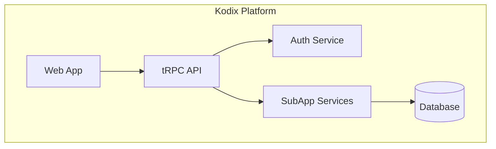

<!-- AI-METADATA:
category: standards
complexity: advanced
updated: 2025-01-12
claude-ready: true
phase: 4
priority: high
token-optimized: true
audience: developers
ai-context-weight: critical
-->

<!-- AI-CONTEXT-BOUNDARY: start -->
# AI Assistant Compatibility Standards

> Guidelines for optimizing Kodix documentation for universal AI assistant performance and compatibility

## 🎯 Purpose

Establish standards that ensure Kodix documentation works optimally across all major AI development tools while maintaining excellent human readability and usability.

## 🤖 Universal Compatibility Matrix

### Supported AI Assistants
| AI Assistant | Compatibility Level | Optimization Status | Special Features |
|--------------|-------------------|-------------------|------------------|
| **Claude Code** | ✅ Native | ✅ VibeCoding Ready | Context engineering, real-time validation |
| **Cursor** | ✅ Enhanced | ✅ Autocomplete Optimized | Multi-file editing, intelligent suggestions |
| **GitHub Copilot** | ✅ Compatible | ✅ Pattern Optimized | Code generation, context-aware suggestions |
| **Gemini** | ✅ Optimized | ✅ Multi-modal Ready | Visual content understanding, comprehensive analysis |
| **ChatGPT** | ✅ Compatible | ✅ Conversation Ready | Structured prompts, interactive guidance |

### Feature Support Matrix
| Feature | Claude Code | Cursor | Copilot | Gemini | ChatGPT |
|---------|-------------|--------|---------|---------|---------|
| Context Engineering | ✅ Native | ✅ Adapted | ✅ Compatible | ✅ Optimized | ✅ Compatible |
| Live Examples | ✅ Interactive | ✅ Preview | 🔄 Planned | ✅ Interactive | 🔄 Planned |
| Smart Navigation | ✅ Integrated | ✅ Plugin | 🔄 Extension | ✅ Integrated | 🔄 Extension |
| Semantic Markup | ✅ Full Support | ✅ Partial | ✅ Basic | ✅ Advanced | ✅ Basic |
| Token Optimization | ✅ Advanced | ✅ Good | ✅ Good | ✅ Advanced | ✅ Good |

## 🏷️ Universal Markup Standards

### AI Metadata Headers
```markdown
<!-- AI-METADATA:
category: [architecture|component|api|guide|reference|standards]
complexity: [basic|intermediate|advanced]
updated: YYYY-MM-DD
claude-ready: true
phase: [1|2|3|4]
priority: [low|medium|high|critical]
token-optimized: true
audience: [developers|fullstack|backend|frontend|devops|all]
ai-context-weight: [low|medium|important|critical]
ai-tool: [claude-code|cursor|universal]
last-ai-review: YYYY-MM-DD
dependencies: ["file1.md", "file2.md"]
related-concepts: ["concept1", "concept2", "concept3"]
-->
```

### Context Boundaries
```markdown
<!-- AI-CONTEXT-BOUNDARY: start -->
[Primary content for AI consumption]
<!-- AI-CONTEXT-BOUNDARY: end -->
```

**Purpose**: 
- Clearly delineate content for AI processing
- Exclude navigation, metadata, and decorative elements
- Enable precise context extraction for token optimization

### Semantic Content Markers
```markdown
<!-- AI-CONTEXT: Essential context description -->
<!-- AI-PRIORITY: [low|medium|high|critical] -->
<!-- AI-TOKENS: estimated [number] -->
<!-- AI-SEMANTIC: [pattern-type] -->
<!-- AI-DEPENDENCIES: ["dep1", "dep2"] -->
<!-- AI-RELATED: ["doc1", "doc2"] -->
<!-- AI-EXAMPLES: [number] -->
```

## 🔧 Tool-Specific Optimizations

### Claude Code (VibeCoding)
#### Enhanced Features
- **Deep PRP Integration**: Product Requirements Prompt workflow support
- **Context-Aware Suggestions**: File and pattern recommendations
- **Intelligent Summarization**: Large codebase comprehension
- **Real-Time Validation**: Generated code verification

#### Optimization Patterns
```markdown
<!-- AI-CONTEXT-PRIORITY: always-include="true" summary-threshold="low" -->
<!-- AI-COMPRESS: strategy="hierarchical" max-tokens="500" -->

# VibeCoding-Optimized Content

<!-- AI-PATTERN-DETECTION: enabled="true" -->
Code patterns that Claude Code can recognize and utilize:

```typescript
// AI-PATTERN: kodix-team-isolation
const data = await db.query.table.findMany({
  where: eq(table.teamId, ctx.session.teamId),
});
```
<!-- /AI-PATTERN-DETECTION -->
```

### Cursor Integration
#### Enhanced Autocomplete
```markdown
<!-- AI-CURSOR-HINTS: enabled="true" -->
<!-- AI-AUTOCOMPLETE-CONTEXT: kodix-patterns -->

## Cursor-Optimized Patterns

### Code Completion Hints
- **useTRPC()**: Preferred over direct api imports
- **Team Isolation**: Always filter by teamId
- **Error Handling**: Use TRPCError with proper codes

### Snippet Triggers
- `kod-user` → User query with team isolation
- `kod-api` → tRPC procedure with validation
- `kod-comp` → React component with proper typing
```

### GitHub Copilot Integration
#### Pattern Recognition
```markdown
<!-- AI-COPILOT-PATTERNS: enabled="true" -->

## Copilot-Friendly Examples

### Function Signatures
```typescript
// Clear patterns for Copilot recognition
export async function createUser(
  data: CreateUserInput,
  teamId: string
): Promise<User> {
  // Implementation follows
}
```

### Comment-Driven Development
```typescript
// Create a new user with team isolation and validation
// 1. Validate input data
// 2. Check team permissions
// 3. Insert into database
// 4. Return created user
```
```

### Gemini Multi-Modal Support
#### Visual Content Integration
```markdown
<!-- AI-VISUAL-CONTENT: enabled="true" -->
<!-- AI-DIAGRAM-TYPE: mermaid -->

## Gemini-Enhanced Documentation

### Architecture Diagrams


### Image Descriptions
- **Alt Text**: Comprehensive descriptions for all images
- **Context**: Visual content relationship to code
- **Annotations**: Key points highlighted in visuals
```

### ChatGPT Conversation Support
#### Structured Prompts
```markdown
<!-- AI-CONVERSATION-READY: enabled="true" -->

## ChatGPT Interaction Patterns

### Question Templates
**Q**: How do I implement user authentication in Kodix?
**A**: [Structured response with examples]

### Follow-up Patterns
- **Next Steps**: Clear progression of topics
- **Related Questions**: Anticipated follow-up queries
- **Context Preservation**: Maintain conversation context
```

## 🚀 Performance Optimization

### Token Efficiency
#### Content Compression
```markdown
<!-- AI-TOKEN-BUDGET -->
**Estimated Tokens**: 
- Header: ~50 tokens
- Content: ~300 tokens  
- Examples: ~200 tokens
- Total: ~550 tokens
<!-- /AI-TOKEN-BUDGET -->

<!-- AI-COMPRESSION-NOTES -->
**Optimization Applied**:
- Removed redundant explanations
- Used pattern references instead of full code
- Compressed example code
- Smart linking to related content
<!-- /AI-COMPRESSION-NOTES -->
```

#### Hierarchical Information
```markdown
<!-- AI-HIERARCHY: level="1" importance="critical" -->
# Critical Information (Always Include)

<!-- AI-HIERARCHY: level="2" importance="high" -->
## Important Details (Include if Token Budget Allows)

<!-- AI-HIERARCHY: level="3" importance="medium" -->
### Additional Context (Optional)
```

### Context Window Management
#### Progressive Disclosure
1. **Summary Layer**: Essential information only
2. **Detailed Layer**: Comprehensive explanations
3. **Example Layer**: Working code samples
4. **Reference Layer**: Links to related content

#### Smart Chunking
```markdown
<!-- AI-CHUNK: id="overview" priority="high" tokens="150" -->
Core overview content
<!-- /AI-CHUNK -->

<!-- AI-CHUNK: id="implementation" priority="medium" tokens="300" -->
Implementation details
<!-- /AI-CHUNK -->

<!-- AI-CHUNK: id="examples" priority="low" tokens="200" -->
Code examples and references
<!-- /AI-CHUNK -->
```

## 🔍 Cross-Reference Intelligence

### Smart Linking
```markdown
<!-- AI-LINK: type="dependency" importance="high" -->
<!-- AI-CONTEXT-REF: importance="high" type="architecture" -->
[Architecture Standards](../architecture/standards/architecture-standards.md)
<!-- /AI-CONTEXT-REF -->
<!-- /AI-LINK -->{context="backend-development" audience="backend-developer" prerequisite="drizzle-orm-basics"}
```

### Relationship Mapping
```markdown
<!-- AI-RELATIONSHIPS -->
**Prerequisites**: [List of required knowledge]
**Dependencies**: [Files that must be read first]
**Related**: [Complementary information]
**Next Steps**: [Logical progression paths]
<!-- /AI-RELATIONSHIPS -->
```

## 🛠️ Implementation Guidelines

### Document Template
```markdown
<!-- AI-METADATA: [complete metadata] -->

<!-- AI-CONTEXT-BOUNDARY: start -->
# Document Title

> Purpose statement with AI-friendly description

<!-- AI-COMPRESS: strategy="summary" max-tokens="150" -->
**Quick Summary**: Key points for rapid AI context understanding.
<!-- /AI-COMPRESS -->

## 🎯 Purpose
[Clear objective and scope]

<!-- AI-PRIORITY: high -->
## Core Content
[Main documentation content with semantic markup]

<!-- AI-CODE-BLOCK: example-type -->
```language
// AI-CONTEXT: Code example description
[Working code example]
```
<!-- /AI-CODE-BLOCK -->

## 🔗 Related Resources
[Smart-linked related documentation]

<!-- AI-CONTEXT-BOUNDARY: end -->
```

### Validation Checklist
- [ ] **AI Metadata**: Complete and accurate
- [ ] **Context Boundaries**: Properly defined
- [ ] **Semantic Markup**: Appropriate markers used
- [ ] **Token Optimization**: Estimated and optimized
- [ ] **Cross-References**: Smart linking implemented
- [ ] **Tool Compatibility**: Tested across AI assistants
- [ ] **Performance**: Optimized for fast processing

### Quality Assurance
#### Automated Testing
```bash
# Validate AI markup
./scripts/validation/validate-ai-markup.sh

# Check token estimates
./scripts/optimization/estimate-tokens.sh

# Test cross-tool compatibility
./scripts/testing/test-ai-compatibility.sh
```

#### Manual Review
1. **Claude Code**: Test VibeCoding workflow
2. **Cursor**: Verify autocomplete enhancement
3. **Copilot**: Check pattern recognition
4. **Content Quality**: Human readability maintained

## 🔄 Evolution & Maintenance

### Version Control
- **AI Markup Version**: Track markup standard versions
- **Compatibility Updates**: Regular AI tool compatibility checks
- **Performance Monitoring**: Token usage and processing speed
- **Feature Updates**: New AI assistant feature integration

### Continuous Improvement
1. **Feedback Collection**: AI assistant performance metrics
2. **Pattern Analysis**: Successful markup patterns
3. **Optimization Opportunities**: Token and performance improvements
4. **Standard Evolution**: Markup standard refinements

## 🔗 Related Standards

- [Writing Rules](./writing-rules.md) - Content style and format guidelines
- [Folder Structure](./folder-structure.md) - Directory organization standards
- [Core Architecture Documentation](./core-architecture-docs.md) - Architecture-specific patterns

---

**Last Updated**: 2025-01-12  
**Version**: 1.0 (Phase 4 AI-First Implementation)  
**AI Compatibility**: Universal (Claude Code, Cursor, Copilot, Gemini, ChatGPT)

<!-- AI-CONTEXT-BOUNDARY: end -->