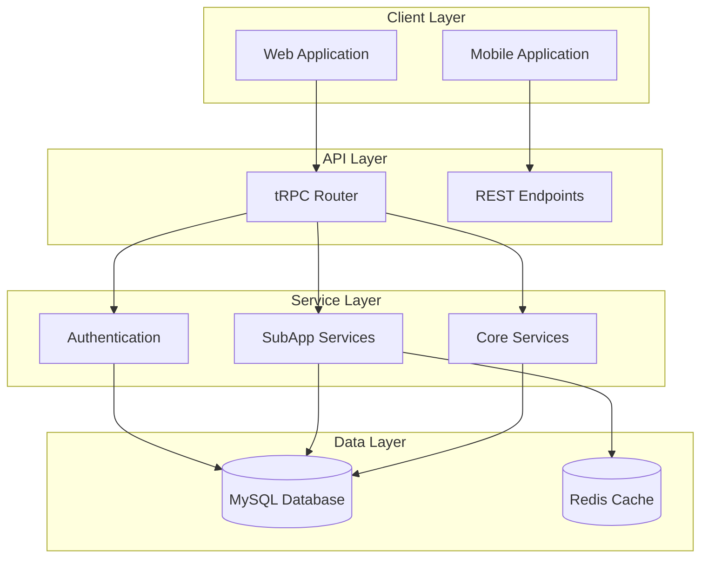
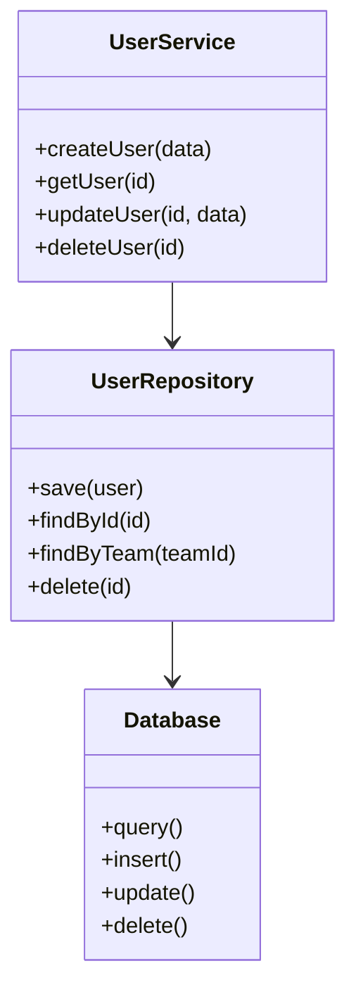
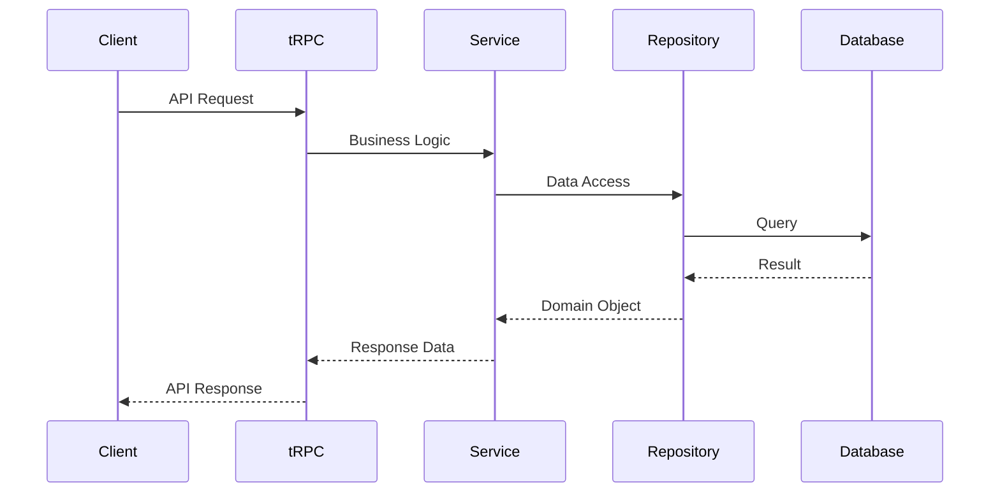

<!-- AI-METADATA:
category: standards
complexity: advanced
updated: 2025-01-12
claude-ready: true
phase: 4
priority: high
token-optimized: true
audience: developers
ai-context-weight: critical
-->

<!-- AI-CONTEXT-BOUNDARY: start -->
# Core Architecture Documentation Standards

> Standards and patterns for documenting technical architecture in the Kodix platform

## 🎯 Purpose

Define comprehensive standards for creating, organizing, and maintaining architecture documentation that serves both human developers and AI assistants effectively.

## 🏗️ Architecture Documentation Structure

### Standard Architecture Hierarchy
```
/docs/architecture/
├── README.md                           # Architecture overview and navigation
├── /standards/                         # Architectural standards
│   ├── README.md                      # Standards overview
│   ├── architecture-standards.md      # Core architectural principles
│   ├── coding-standards.md           # Development standards
│   ├── naming-conventions.md         # Naming and formatting rules
│   └── quality-standards.md          # Quality requirements
├── /platform/                         # Platform architecture
│   ├── README.md                      # Platform overview
│   ├── system-overview.md            # High-level system design
│   ├── technology-stack.md           # Technology choices and rationale
│   ├── configuration-model.md        # Configuration management
│   └── internationalization-i18n.md  # i18n architecture
├── /backend/                          # Backend architecture
│   ├── README.md                      # Backend overview
│   ├── backend-guide.md              # Comprehensive backend guide
│   ├── service-layer-patterns.md     # Service architecture patterns
│   ├── data-contracts-and-boundaries.md # Data layer architecture
│   ├── trpc-patterns.md              # tRPC implementation patterns
│   └── trpc-migration-guide.md       # Migration strategies
├── /frontend/                         # Frontend architecture
│   ├── README.md                      # Frontend overview
│   └── frontend-guide.md             # Comprehensive frontend guide
├── /infrastructure/                   # Infrastructure patterns
│   ├── README.md                      # Infrastructure overview
│   ├── deployment-architecture.md    # Deployment patterns
│   ├── database-design.md            # Database architecture
│   ├── caching-strategy.md           # Redis & caching patterns
│   └── monitoring-observability.md   # Monitoring & logging
├── /subapps/                          # SubApp architecture
│   ├── README.md                      # SubApp overview
│   ├── subapp-architecture.md        # SubApp design patterns
│   ├── subapp-configurations-system.md # Configuration management
│   ├── subapp-documentation-guide.md # Documentation standards
│   └── subapp-inter-dependencies.md  # Integration patterns
└── /decisions/                        # Architecture Decision Records
    ├── README.md                      # ADR overview
    ├── adr-template.md               # ADR template
    ├── lessons-learned.md            # Lessons from decisions
    ├── 001-technology-stack.md       # Stack selection rationale
    ├── 002-trpc-v11-migration.md     # tRPC v11 decision
    └── 003-subapp-architecture.md    # SubApp pattern decision
```

## 📋 Architecture Document Templates

### Architecture Overview Template
```markdown
<!-- AI-METADATA:
category: architecture
complexity: [basic|intermediate|advanced]
updated: YYYY-MM-DD
claude-ready: true
phase: 4
priority: [medium|high|critical]
token-optimized: true
audience: [backend|frontend|fullstack|devops]
ai-context-weight: [important|critical]
-->

<!-- AI-CONTEXT-BOUNDARY: start -->
# [Component/System] Architecture

> Brief description of the architectural component and its role

## 🎯 Purpose
[What this architecture addresses and why it exists]

## 🏗️ High-Level Design
[System overview with diagrams]

```mermaid
graph TB
    [Architecture diagram using Mermaid]
```

## 🔧 Key Components
[Detailed component breakdown]

## 🔗 Integration Points
[How this architecture integrates with other systems]

## 📊 Performance Considerations
[Performance characteristics and optimization strategies]

## 🔒 Security Aspects
[Security implications and measures]

## 🔗 Related Documentation
[Links to related architecture documents]

<!-- AI-CONTEXT-BOUNDARY: end -->
```

### Technology Stack Documentation
```markdown
# Technology Choice: [Technology Name]

## 🎯 Decision Context
**Problem**: [What problem this technology solves]
**Context**: [Environmental factors influencing the decision]
**Requirements**: [Key requirements driving the choice]

## 🏗️ Technology Overview
**Name**: [Technology name and version]
**Category**: [Database, Framework, Library, etc.]
**Maturity**: [Stable, Emerging, Experimental]
**License**: [License type and implications]

## ✅ Decision Rationale

### Benefits
- **[Benefit 1]**: Detailed explanation
- **[Benefit 2]**: Detailed explanation
- **[Benefit 3]**: Detailed explanation

### Trade-offs
- **[Trade-off 1]**: What we sacrifice and why it's acceptable
- **[Trade-off 2]**: What we sacrifice and why it's acceptable

### Alternatives Considered
- **[Alternative 1]**: Why it was rejected
- **[Alternative 2]**: Why it was rejected

## 🔧 Implementation Patterns

### Basic Usage
```typescript
// AI-CONTEXT: Standard implementation pattern
[Working code example showing proper usage]
```

### Advanced Patterns
```typescript
// AI-CONTEXT: Advanced usage with Kodix-specific optimizations
[Complex implementation example]
```

### Integration with Kodix Stack
[How this technology integrates with other Kodix technologies]

## 📊 Performance Characteristics
**Strengths**: [Performance advantages]
**Limitations**: [Known performance constraints]
**Optimization Strategies**: [How to optimize usage]

## 🔒 Security Considerations
[Security implications and best practices]

## 🔄 Migration Path
[How to migrate to/from this technology if needed]

## 📈 Future Considerations
[Long-term outlook and potential evolution]
```

## 🔧 Technical Pattern Documentation

### Service Layer Patterns
```markdown
# Service Layer Pattern: [Pattern Name]

## 🎯 Pattern Overview
**Intent**: [What this pattern accomplishes]
**Problem**: [What problem it solves]
**Solution**: [How it solves the problem]

## 🏗️ Structure
```mermaid
classDiagram
    [UML class diagram showing pattern structure]
```

## 🔧 Implementation

### Basic Implementation
```typescript
// AI-CONTEXT: Service layer implementation following Kodix patterns
interface ServiceInterface {
  [Method signatures with clear types]
}

class ConcreteService implements ServiceInterface {
  [Implementation with proper error handling and team isolation]
}
```

### Usage Example
```typescript
// AI-CONTEXT: How to use this service in tRPC procedures
export const exampleRouter = createTRPCRouter({
  exampleProcedure: protectedProcedure
    .input(ExampleSchema)
    .query(async ({ ctx, input }) => {
      const service = new ConcreteService(ctx.db);
      return await service.method(input);
    }),
});
```

## ✅ Benefits
- [List of specific benefits this pattern provides]

## ⚠️ Considerations
- [Important considerations when using this pattern]

## 🔗 Related Patterns
- [Links to related architectural patterns]
```

## 📊 Architecture Decision Records (ADRs)

### ADR Template Standard
```markdown
# ADR-[NUMBER]: [Decision Title]

**Date**: YYYY-MM-DD
**Status**: [Proposed | Accepted | Deprecated | Superseded]
**Deciders**: [List of decision makers]
**Technical Story**: [Link to related issue/story]

## Context

[Describe the forces at play, including technological, political, social, and project local. Include architectural context and requirements.]

## Decision Drivers

- [Decision driver 1]
- [Decision driver 2]
- [Decision driver 3]

## Considered Options

- [Option 1]: [Brief description]
- [Option 2]: [Brief description]
- [Option 3]: [Brief description]

## Decision Outcome

**Chosen option**: "[Option X]", because [justification summary].

### Positive Consequences
- [Positive consequence 1]
- [Positive consequence 2]

### Negative Consequences
- [Negative consequence 1]
- [Negative consequence 2]

## Implementation

[Describe the implementation approach and timeline]

## Validation

[How to validate this decision is working]

## Links

- [Link to related ADRs]
- [Link to implementation details]
- [Link to related documentation]
```

### ADR Categorization
- **Strategic**: High-level architectural decisions
- **Technical**: Technology choice decisions
- **Operational**: Deployment and operational decisions
- **Security**: Security-related architectural decisions

## 🔍 Diagramming Standards

### Mermaid Diagrams
#### System Architecture


#### Component Relationships


#### Data Flow


### Diagram Guidelines
- **Consistent Styling**: Use standard colors and shapes
- **Clear Labels**: All components clearly labeled
- **Appropriate Level**: Match diagram complexity to audience
- **Mermaid Syntax**: Use Mermaid for version control compatibility

## 🚀 Performance Documentation

### Performance Requirements Template
```markdown
## Performance Requirements

### Response Time Targets
- **API Endpoints**: < 200ms (95th percentile)
- **Database Queries**: < 50ms (average)
- **Page Load Time**: < 2s (initial load)
- **Cache Hit Ratio**: > 90%

### Scalability Targets
- **Concurrent Users**: 1000+ without degradation
- **Database Connections**: Efficient connection pooling
- **Memory Usage**: < 512MB per service instance
- **CPU Utilization**: < 70% under normal load

### Monitoring Points
- [Key metrics to monitor]
- [Performance benchmarks]
- [Alert thresholds]
```

## 🔒 Security Architecture Standards

### Security Documentation Template
```markdown
## Security Architecture

### Authentication & Authorization
- **Authentication Method**: [JWT, OAuth, etc.]
- **Session Management**: [Strategy and implementation]
- **Authorization Model**: [RBAC, ABAC, etc.]

### Data Protection
- **Data at Rest**: [Encryption methods]
- **Data in Transit**: [TLS/SSL configuration]
- **Sensitive Data**: [Handling and storage]

### Team Isolation
- **Row-Level Security**: [Implementation approach]
- **Data Boundaries**: [How data is isolated between teams]
- **Access Controls**: [Permission enforcement]

### Security Monitoring
- **Audit Logging**: [What is logged and how]
- **Intrusion Detection**: [Monitoring and alerting]
- **Vulnerability Management**: [Scanning and remediation]
```

## 🔗 Cross-Reference Standards

### Architecture Relationships
```markdown
<!-- AI-RELATIONSHIPS -->
**Prerequisites**: 
- [Technology Stack Overview](../platform/technology-stack.md)
- [System Architecture](../platform/system-overview.md)

**Dependencies**: 
- [Backend Guide](../backend/backend-guide.md)
- [Service Layer Patterns](../backend/service-layer-patterns.md)

**Related**: 
- [SubApp Architecture](../subapps/subapp-architecture.md)
- [Infrastructure Patterns](../infrastructure/)

**Implementations**: 
- [User Management SubApp](../../subapps/user-management/)
- [Authentication Service](../../core/authentication/)
<!-- /AI-RELATIONSHIPS -->
```

## 🔄 Maintenance Standards

### Review Cycles
- **Quarterly**: Architecture alignment review
- **Semi-Annual**: Technology stack assessment
- **Annual**: Comprehensive architecture review

### Update Triggers
- **Technology Upgrades**: When dependencies are updated
- **Pattern Changes**: When architectural patterns evolve
- **Performance Issues**: When performance requirements change
- **Security Updates**: When security requirements change

### Version Control
- **Architecture Versioning**: Track major architectural changes
- **Decision Tracking**: Maintain ADR history
- **Pattern Evolution**: Document pattern modifications

## 🔗 Related Standards

- [Writing Rules](./writing-rules.md) - Content style and format guidelines
- [AI Assistant Compatibility](./ai-assistant-compatibility.md) - AI optimization standards
- [Folder Structure](./folder-structure.md) - Directory organization guidelines

---

**Last Updated**: 2025-01-12  
**Version**: 1.0 (Consolidated from Phase 2 Architecture Enhancement)

<!-- AI-CONTEXT-BOUNDARY: end -->