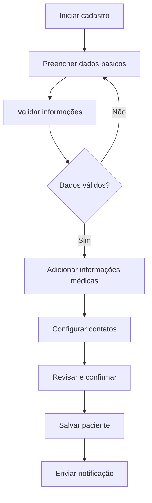
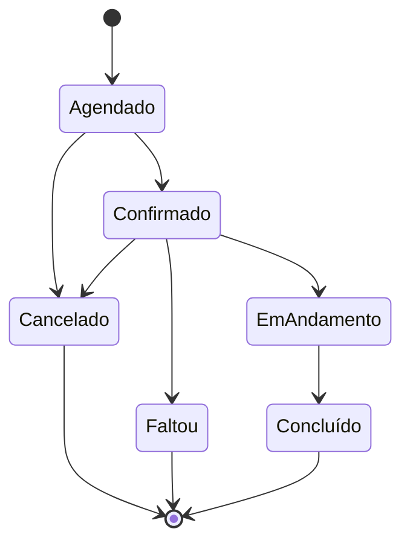
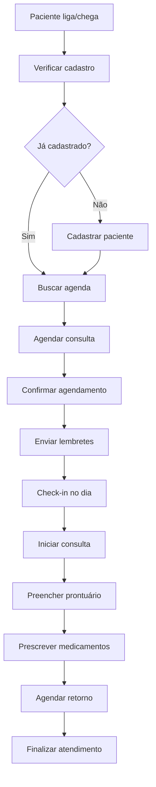
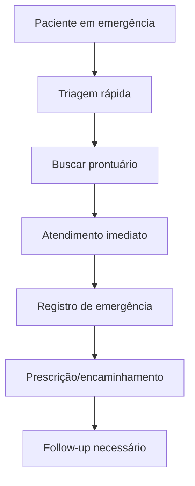

# Funcionalidades do Kodix Care

## Visão Geral

O **Kodix Care** é o módulo principal de gestão clínica da plataforma Kodix, focado no gerenciamento completo do ciclo de atendimento ao paciente, desde o cadastro inicial até o acompanhamento pós-consulta.

## Objetivos do Módulo

- **Centralizar** informações de pacientes e profissionais
- **Digitalizar** o processo de agendamento e consultas
- **Modernizar** o sistema de prontuários eletrônicos
- **Automatizar** fluxos administrativos
- **Facilitar** o acompanhamento de tratamentos

## Funcionalidades Principais

### 1. Gestão de Pacientes

#### 1.1 Cadastro de Pacientes

**Objetivo**: Permitir o registro completo de novos pacientes no sistema.

**Campos Obrigatórios:**

- Nome completo
- Data de nascimento
- Documento de identificação (CPF/RG)
- Contato principal (telefone ou email)

**Campos Opcionais:**

- Email secundário
- Telefone secundário
- Endereço completo
- Profissão
- Estado civil
- Convênio médico
- Contato de emergência

**Funcionalidades:**

- Validação de dados em tempo real
- Verificação de duplicatas por CPF/email
- Upload de documentos (RG, CPF, comprovante de residência)
- Geração automática de número de prontuário
- Envio de email/SMS de boas-vindas

**Fluxo do Processo:**



#### 1.2 Busca e Filtros

**Critérios de Busca:**

- Nome (busca parcial)
- CPF/documento
- Telefone
- Email
- Número do prontuário
- Data de nascimento

**Filtros Avançados:**

- Faixa etária
- Gênero
- Status (ativo/inativo)
- Data de cadastro
- Última consulta
- Convênio

#### 1.3 Perfil do Paciente

**Abas do Perfil:**

- **Dados Pessoais**: Informações básicas e contato
- **Histórico Médico**: Consultas anteriores e diagnósticos
- **Prontuários**: Documentos e registros médicos
- **Agendamentos**: Consultas marcadas e históricas
- **Financeiro**: Pagamentos e pendências
- **Documentos**: Arquivos anexados

### 2. Sistema de Agendamentos

#### 2.1 Criação de Agendamentos

**Campos Obrigatórios:**

- Paciente
- Profissional responsável
- Data e horário
- Tipo de consulta
- Duração estimada

**Tipos de Consulta:**

- Consulta inicial
- Retorno
- Emergência
- Exame
- Procedimento
- Telemedicina

**Funcionalidades:**

- Verificação de disponibilidade automática
- Detecção de conflitos de horário
- Sugestão de horários alternativos
- Bloqueio de horários indisponíveis
- Configuração de intervalos entre consultas

#### 2.2 Gestão de Agenda

**Visualizações:**

- **Dia**: Vista detalhada por profissional
- **Semana**: Visão geral semanal
- **Mês**: Calendário mensal
- **Lista**: Agendamentos em formato de lista

**Funcionalidades da Agenda:**

- Drag & drop para reagendamento
- Código de cores por tipo de consulta
- Notificações de lembretes
- Bloqueio de horários para férias/folgas
- Configuração de horários de atendimento

#### 2.3 Status de Agendamentos

**Status Possíveis:**

- **Agendado**: Consulta marcada
- **Confirmado**: Paciente confirmou presença
- **Em Andamento**: Consulta iniciada
- **Concluído**: Consulta finalizada
- **Cancelado**: Cancelado pelo paciente/profissional
- **Faltou**: Paciente não compareceu

**Transições de Status:**



### 3. Prontuários Eletrônicos

#### 3.1 Estrutura do Prontuário

**Seções Principais:**

- **Anamnese**: Histórico médico e queixas atuais
- **Exame Físico**: Resultados da avaliação clínica
- **Diagnóstico**: Diagnósticos primários e secundários
- **Prescrição**: Medicamentos e dosagens
- **Procedimentos**: Procedimentos realizados
- **Orientações**: Recomendações ao paciente
- **Anexos**: Documentos e imagens

#### 3.2 Templates de Prontuário

**Templates por Especialidade:**

- Clínica Geral
- Cardiologia
- Dermatologia
- Pediatria
- Ginecologia
- Ortopedia
- Psiquiatria

**Funcionalidades dos Templates:**

- Campos pré-definidos por especialidade
- Terminologia médica específica
- Calculadoras integradas (IMC, superfície corporal)
- Escalas de avaliação (dor, depressão)
- Protocolos de atendimento

#### 3.3 Histórico Médico

**Visualização Cronológica:**

- Timeline de consultas
- Evolução de diagnósticos
- Histórico de medicações
- Resultados de exames
- Internações e cirurgias

**Funcionalidades:**

- Busca por período
- Filtros por tipo de registro
- Exportação para PDF
- Compartilhamento seguro
- Assinatura digital

### 4. Sistema de Notificações

#### 4.1 Lembretes de Consulta

**Canais de Notificação:**

- Email
- SMS
- WhatsApp (integração futura)
- Push notification (app mobile)

**Configuração de Lembretes:**

- 24 horas antes
- 2 horas antes
- 30 minutos antes
- Personalização por paciente

#### 4.2 Notificações para Profissionais

**Tipos de Notificação:**

- Novo agendamento
- Cancelamento de consulta
- Paciente aguardando
- Prescrição vencendo
- Follow-up necessário

### 5. Relatórios e Analytics

#### 5.1 Relatórios Operacionais

**Relatórios Disponíveis:**

- Agendamentos por período
- Taxa de comparecimento
- Tempo médio de consulta
- Produtividade por profissional
- Pacientes mais atendidos

#### 5.2 Dashboards

**Métricas em Tempo Real:**

- Consultas do dia
- Pacientes em espera
- Taxa de ocupação
- Faturamento diário
- Alertas pendentes

### 6. Integração com Sistemas Externos

#### 6.1 Sistemas de Convênios

**Funcionalidades:**

- Verificação de elegibilidade
- Autorização prévia
- Faturamento automatizado
- Guias de consulta

#### 6.2 Laboratórios

**Integração com Labs:**

- Solicitação de exames
- Recebimento de resultados
- Anexação automática ao prontuário
- Alertas de resultados críticos

## Fluxos de Trabalho

### Fluxo Completo de Atendimento



### Fluxo de Emergência



## Permissões e Segurança

### Níveis de Acesso

#### Administrador

- Acesso total ao sistema
- Gerenciamento de usuários
- Configurações globais
- Relatórios administrativos

#### Médico

- Acesso a pacientes atribuídos
- Criação e edição de prontuários
- Prescrições médicas
- Agendamento de consultas

#### Enfermeiro

- Visualização de prontuários
- Registros de enfermagem
- Triagem de pacientes
- Administração de medicamentos

#### Recepcionista

- Cadastro de pacientes
- Gerenciamento de agendas
- Confirmação de consultas
- Relatórios básicos

#### Paciente (Portal do Paciente)

- Visualização do próprio prontuário
- Agendamento online
- Acesso a resultados de exames
- Histórico de consultas

### Auditoria

**Logs de Auditoria:**

- Todas as ações são registradas
- Identificação do usuário
- Timestamp preciso
- IP de origem
- Dados modificados (antes/depois)

## Configurações do Sistema

### Parâmetros Globais

**Configurações de Agendamento:**

- Horário de funcionamento
- Intervalo entre consultas
- Duração padrão por tipo
- Bloqueios automáticos
- Feriados e fechamentos

**Configurações de Notificação:**

- Templates de email/SMS
- Horários de envio
- Frequência de lembretes
- Canais ativos

### Personalização por Clínica

**Branding:**

- Logo da clínica
- Cores personalizadas
- Cabeçalhos de documentos
- Informações de contato

**Workflow Específico:**

- Campos obrigatórios customizados
- Templates de prontuário específicos
- Fluxos de aprovação
- Integrações particulares

## Integrações e APIs

### APIs Disponíveis

#### Pacientes API

```typescript
// Endpoints principais
GET / api / patients; // Listar pacientes
POST / api / patients; // Criar paciente
GET / api / patients / { id }; // Buscar paciente
PUT / api / patients / { id }; // Atualizar paciente
DELETE / api / patients / { id }; // Excluir paciente
```

#### Agendamentos API

```typescript
// Endpoints principais
GET / api / appointments; // Listar agendamentos
POST / api / appointments; // Criar agendamento
PUT / api / appointments / { id }; // Atualizar agendamento
DELETE / api / appointments / { id }; // Cancelar agendamento
```

### Webhooks

**Eventos Disponíveis:**

- `patient.created` - Novo paciente cadastrado
- `appointment.scheduled` - Nova consulta agendada
- `appointment.cancelled` - Consulta cancelada
- `appointment.completed` - Consulta finalizada
- `prescription.created` - Nova prescrição

## Roadmap de Funcionalidades

### Próximas Versões

#### v2.1 - Telemedicina

- [ ] Videochamadas integradas
- [ ] Prescrição digital
- [ ] Assinatura eletrônica
- [ ] Gravação de consultas

#### v2.2 - IA Assistant

- [ ] Sugestões de diagnóstico
- [ ] Análise de sintomas
- [ ] Lembretes inteligentes
- [ ] Detecção de interações medicamentosas

#### v2.3 - Mobile App

- [ ] App para profissionais
- [ ] App para pacientes
- [ ] Sincronização offline
- [ ] Notificações push

#### v3.0 - Expansão

- [ ] Módulo financeiro completo
- [ ] Integração com laboratórios
- [ ] Portal do paciente avançado
- [ ] Analytics predictivos

---

Para implementação técnica, consulte o [Guia de Desenvolvimento](./guia-desenvolvimento-kodix.md) e a [Documentação de Banco de Dados](./banco-de-dados-kodix.md).
