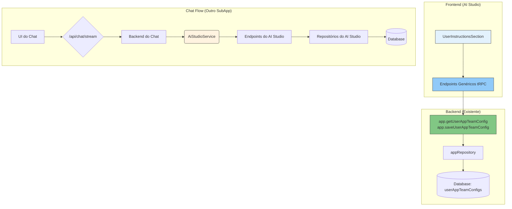

# Architecture - AI Studio SubApp

## 📋 Visão Geral

O AI Studio é construído com uma arquitetura moderna que combina React/Next.js no frontend com tRPC v11 no backend, oferecendo uma experiência type-safe completa para gerenciamento de recursos de IA. A arquitetura é modular, escalável e focada em segurança com isolamento total por equipe.

---

# 📱 Frontend Architecture

## 🏗️ Estrutura de Componentes

### Componentes Principais

#### `AiStudioContent`

- **Localização**: `_components/ai-studio-content.tsx`
- **Responsabilidade**: Container principal que renderiza seções baseado na navegação
- **Características**:
  - Renderiza seção ativa baseada no estado
  - Controla qual componente de seção mostrar
  - Mantém estado da seção ativa

#### `AppSidebar`

- **Localização**: `_components/app-sidebar.tsx`
- **Responsabilidade**: Navegação lateral entre seções com grupos organizados
- **Funcionalidades**:
  - Navegação organizada em "Principal" e "Configuração Geral"
  - Indicador visual da seção ativa
  - Ícones representativos para cada seção
  - Responsive com comportamento mobile

### Seções Principais

#### `TeamInstructionsSection`

- **Localização**: `_components/sections/team-instructions-section.tsx`
- **Funcionalidades**:
  - Editor de instruções da equipe
  - Toggle de ativação/desativação
  - Seleção de escopo (Chat ou All)
  - Preview das instruções

#### `TokensSection`

- **Localização**: `_components/sections/tokens-section.tsx`
- **Funcionalidades**:
  - Lista segura de tokens (mascarados)
  - Criação com validação por provedor
  - Indicador de provedor associado
  - Remoção com confirmação

#### `EnabledModelsSection`

- **Localização**: `_components/sections/enabled-models-section.tsx`
- **Funcionalidades**:
  - Lista de modelos disponíveis para a equipe
  - Toggle de ativação por modelo
  - Sistema de modelo padrão com radio buttons
  - Drag & drop para reordenação de prioridades
  - Teste de conectividade dos modelos
  - Badges de preço com tooltips detalhados

#### `AgentsSection`

- **Localização**: `_components/sections/agents-section.tsx`
- **Funcionalidades**:
  - Tabela de agentes com ações
  - Editor de instruções (não system prompt)
  - Seleção de biblioteca de conhecimento (não modelo)
  - Dialogs para CRUD completo

#### `LibrariesSection`

- **Localização**: `_components/sections/libraries-section.tsx`
- **Funcionalidades**:
  - Gestão de bibliotecas de conhecimento
  - Editor JSON para metadados de arquivos
  - Integração com agentes
  - Interface preparada para futuro upload

#### `ProvidersSection`

- **Localização**: `_components/sections/providers-section.tsx`
- **Funcionalidades**:
  - CRUD de provedores
  - Configuração de URLs base
  - Indicadores de status e tokens
  - Interface simplificada focada em nome e URL

#### `ModelsSection`

- **Localização**: `_components/sections/models-section.tsx`
- **Funcionalidades**:
  - Configuração de modelos globais do sistema
  - Toggle de ativação global
  - Editor JSON para configurações avançadas
  - Organização por provedor com ordenação

#### `UserInstructionsSection`

- **Localização**: `_components/sections/user-instructions-section.tsx`
- **Funcionalidades**:
  - Editor de instruções pessoais do usuário (Nível 3 de configuração)
  - Salva e carrega configurações usando endpoints genéricos
  - Tem prioridade sobre as instruções da equipe

## 🎨 Interface e UX

### Design System

```tsx
// Tema dark consistente
const containerClasses =
  "rounded-lg border bg-card text-card-foreground shadow-sm";
const headerClasses = "text-2xl font-bold tracking-tight";
const buttonClasses = "inline-flex items-center justify-center";
```

### Componentes de UI

- **Cards**: Exibição de recursos com ações rápidas
- **Dialogs**: Formulários de criação/edição
- **Tables**: Listagem organizada com ações
- **Badges**: Status e categorização
- **Tooltips**: Informações contextuais (especialmente preços)
- **Loading States**: Indicadores de carregamento

### Organização da Navegação

```tsx
// Seções principais (mais usadas diariamente)
const mainSections = [
  { id: "team-instructions", title: "teamInstructions", icon: MessageSquare },
  { id: "tokens", title: "tokens", icon: Key },
  { id: "enabled-models", title: "enabledModels", icon: Brain },
  { id: "agents", title: "agents", icon: Bot },
  { id: "libraries", title: "libraries", icon: Database },
];

// Configurações gerais (menos alteradas)
const configSections = [
  { id: "providers", title: "providers", icon: Building },
  { id: "models", title: "models", icon: Brain },
];
```

## 🔧 Gerenciamento de Estado

### React Query com tRPC

```tsx
// Padrão usado em todas as seções
const dataQuery = useQuery(
  trpc.app.aiStudio.[endpoint].queryOptions(params),
);

// Mutation padrão com invalidação
const createMutation = useMutation(
  trpc.app.aiStudio.[endpoint].mutationOptions({
    onSuccess: () => {
      queryClient.invalidateQueries(
        trpc.app.aiStudio.[endpoint].pathFilter(),
      );
      toast.success("Operação realizada com sucesso!");
    },
    onError: (error: any) => {
      toast.error(error.message || "Erro na operação");
    },
  }),
);
```

### Estado Local por Seção

```tsx
// Cada seção gerencia seu próprio estado
const [showCreateForm, setShowCreateForm] = useState(false);
const [showEditForm, setShowEditForm] = useState(false);
const [showDeleteDialog, setShowDeleteDialog] = useState(false);
const [itemToEdit, setItemToEdit] = useState(null);
const [itemToDelete, setItemToDelete] = useState(null);
```

## 📊 Fluxo de Dados

### Carregamento Inicial

1. **Sidebar carrega** → Seção padrão (tokens) ativa
2. **Seção específica** carrega seus dados via tRPC
3. **Loading states** mostram indicadores
4. **Dados chegam** → UI atualiza automaticamente

### Operações CRUD

1. **Usuário interage** → Dialog/Form abre
2. **Validação local** → Zod schemas
3. **Mutation executada** → Loading state
4. **Sucesso/Erro** → Toast notification
5. **Cache invalidado** → Lista atualiza

### Funcionalidades Específicas

#### Drag & Drop (Enabled Models)

```tsx
// Sistema de reordenação com DndKit
<DndContext onDragEnd={handleDragEnd}>
  <SortableContext items={modelIds}>
    {models.map((model) => (
      <SortableTableRow key={model.id} model={model} />
    ))}
  </SortableContext>
</DndContext>
```

#### Teste de Modelos

```tsx
// Validação de conectividade
const testModelMutation = useMutation(
  trpc.app.aiStudio.testModel.mutationOptions({
    onSuccess: (data, variables) => {
      setTestResponse({ ...data, modelId: variables.modelId });
    },
  }),
);
```

## 🚀 Performance

### Lazy Loading

```tsx
// Componentes carregados apenas quando necessário
const renderSection = () => {
  switch (activeSection) {
    case "team-instructions":
      return <TeamInstructionsSection />;
    case "agents":
      return <AgentsSection />;
    // ... outras seções
  }
};
```

### Otimização de Queries

```tsx
// Invalidação específica por seção
queryClient.invalidateQueries(trpc.app.aiStudio.findAiProviders.pathFilter());
```

## 🎯 Padrões de Componentes

### Estrutura Padrão de Seção

```tsx
export function [Section]Section() {
  // 1. Hooks tRPC
  const dataQuery = useQuery(trpc.app.aiStudio.[endpoint].queryOptions());
  const createMutation = useMutation(trpc.app.aiStudio.[endpoint].mutationOptions());

  // 2. Estados locais
  const [showCreateForm, setShowCreateForm] = useState(false);

  // 3. Handlers
  const handleCreate = (data) => createMutation.mutate(data);

  // 4. Render
  return (
    <div className="space-y-6">
      {/* Header com título e botão */}
      {/* Card principal com conteúdo */}
      {/* Dialogs/Forms */}
    </div>
  );
}
```

### Validação com Zod

```tsx
// Schema por seção
const createSchema = z.object({
  name: z.string().min(1, "Nome é obrigatório"),
  // ... outros campos
});

// Form com react-hook-form
const form = useForm({
  resolver: zodResolver(createSchema),
  defaultValues: {
    /* ... */
  },
});
```

## 🔐 Segurança no Frontend

### Validação de Inputs

- Schemas Zod para todos os formulários
- Validação de URLs e formatos
- Sanitização automática

### Proteção de Dados Sensíveis

- Tokens sempre mascarados na UI
- Confirmações para ações destrutivas
- Sem armazenamento local de credenciais

### Máscaramento de Tokens

```tsx
const maskToken = (token: string) => {
  if (token.length <= 8) return token;
  return token.substring(0, 8) + "..." + token.substring(token.length - 4);
};
```

## 📱 Responsividade

### Sidebar Responsivo

```tsx
<SidebarProvider className="min-h-[calc(100dvh-55px)] items-start">
  <AppSidebar /* props */ />
  <div className="flex flex-1 flex-col p-4">
    <div className="mb-4 flex items-center gap-2">
      <SidebarTrigger className="md:hidden" />
      {/* Header content */}
    </div>
    {/* Main content */}
  </div>
</SidebarProvider>
```

### Breakpoints e Adaptações

- **Mobile**: Sidebar colapsável, dialogs em tela cheia
- **Tablet**: Navegação otimizada para touch
- **Desktop**: Interface completa com todas as funcionalidades

---

# ⚙️ Backend Architecture

## 🏗️ Estrutura de APIs

### Router Principal (`_router.ts`)

```typescript
import { protectedProcedure } from "../../../../procedures";
import { t } from "../../../../trpc";

export const aiStudioRouter = t.router({
  // Team Instructions
  getTeamInstructions: protectedProcedure.query(),
  updateTeamInstructions: protectedProcedure.mutation(),

  // Provedores
  createAiProvider: protectedProcedure.mutation(),
  findAiProviders: protectedProcedure.query(),
  updateAiProvider: protectedProcedure.mutation(),
  deleteAiProvider: protectedProcedure.mutation(),

  // Tokens
  createAiTeamProviderToken: protectedProcedure.mutation(),
  findAiTeamProviderTokens: protectedProcedure.query(),
  updateAiTeamProviderToken: protectedProcedure.mutation(),
  removeTokenByProvider: protectedProcedure.mutation(),

  // Enabled Models
  findAvailableModels: protectedProcedure.query(),
  getDefaultModel: protectedProcedure.query(),
  toggleModel: protectedProcedure.mutation(),
  reorderModelsPriority: protectedProcedure.mutation(),
  testModel: protectedProcedure.mutation(),
  setDefaultModel: protectedProcedure.mutation(),

  // Agentes
  createAiAgent: protectedProcedure.mutation(),
  findAiAgents: protectedProcedure.query(),
  updateAiAgent: protectedProcedure.mutation(),
  deleteAiAgent: protectedProcedure.mutation(),

  // Bibliotecas
  createAiLibrary: protectedProcedure.mutation(),
  findAiLibraries: protectedProcedure.query(),
  updateAiLibrary: protectedProcedure.mutation(),
  deleteAiLibrary: protectedProcedure.mutation(),

  // System Models
  createAiModel: protectedProcedure.mutation(),
  findModels: protectedProcedure.query(),
  updateAiModel: protectedProcedure.mutation(),
  deleteAiModel: protectedProcedure.mutation(),
  toggleGlobalModel: protectedProcedure.mutation(),
});
```

### Organização Modular

- **`team-instructions.ts`** - Configurações globais da equipe
- **`providers.ts`** - Gerenciamento de provedores de IA
- **`tokens.ts`** - Gestão segura de tokens de API
- **`enabled-models.ts`** - Modelos disponíveis por equipe
- **`agents.ts`** - Sistema de agentes personalizados
- **`libraries.ts`** - Bibliotecas de conhecimento
- **`models.ts`** - Configuração global de modelos

## 🗄️ Modelo de Dados

### Schemas Principais

#### Provider

```typescript
{
  id: string;
  teamId: string;
  name: string;
  baseUrl?: string;
  createdAt: Date;
}
```

#### Model

```typescript
{
  id: string;
  providerId: string;
  name: string;
  enabled: boolean;
  config?: Record<string, any>;
  createdAt: Date;
}
```

#### Agent

```typescript
{
  id: string;
  teamId: string;
  name: string;
  instructions: string;
  libraryId?: string;
  createdAt: Date;
}
```

#### Library

```typescript
{
  id: string;
  teamId: string;
  name: string;
  files?: any[];
  createdAt: Date;
}
```

#### Token (Criptografado)

```typescript
{
  id: string;
  teamId: string;
  providerId: string;
  encryptedToken: string; // AES-256-GCM
  createdAt: Date;
}
```

#### Team Instructions

```typescript
{
  teamId: string;
  content: string;
  enabled: boolean;
  appliesTo: "chat" | "all";
  updatedAt: Date;
}
```

#### User Instructions (Nível de Usuário)

```typescript
{
  userId: string;
  teamId: string;
  appId: "ai_studio_app_789";
  config: {
    userInstructions?: {
      content: string; // Máximo 2500 caracteres
      enabled: boolean;
    }
  }
}
```

## 🔐 Sistema de Segurança

### Criptografia de Tokens

```typescript
// Criptografia AES-256-GCM
function encryptToken(token: string): string {
  const key = getEncryptionKey();
  const iv = crypto.randomBytes(16);
  const cipher = crypto.createCipheriv("aes-256-gcm", key, iv);

  let encrypted = cipher.update(token, "utf8", "hex");
  encrypted += cipher.final("hex");

  const authTag = cipher.getAuthTag();
  return `${iv.toString("hex")}:${authTag.toString("hex")}:${encrypted}`;
}
```

### Isolamento por Team

```typescript
// Todas as operações validam teamId
const teamId = ctx.auth.user.activeTeamId;
if (!resource || resource.teamId !== teamId) {
  throw new TRPCError({
    code: "NOT_FOUND",
    message: "Resource not found",
  });
}
```

## 📊 Processamento de Dados

### Validação com Zod

```typescript
const createAiProviderSchema = z.object({
  name: z.string().min(2).max(100),
  baseUrl: z.string().url().optional().or(z.literal("")),
});

const createAiAgentSchema = z.object({
  name: z.string().min(1),
  instructions: z.string().min(1),
  libraryId: z.string().optional(),
});
```

### Paginação Padrão

```typescript
const paginationSchema = z.object({
  limite: z.number().min(1).max(100).default(20),
  offset: z.number().min(0).default(0),
});
```

## 🚀 Performance

### Otimizações de Query

```typescript
// Queries paralelas para melhor performance
const [agents, libraries] = await Promise.all([
  agentRepository.findByTeam(teamId, { limit, offset }),
  libraryRepository.findByTeam(teamId),
]);
```

### Cache de Configurações

```typescript
// Cache de modelos disponíveis por team
const cacheKey = `ai-models:${teamId}`;
const cached = await redis.get(cacheKey);

if (cached) {
  return JSON.parse(cached);
}

const models = await findAvailableModels(teamId);
await redis.set(cacheKey, JSON.stringify(models), "EX", 300); // 5 min
```

## 🔄 Integração com Outros SubApps

### Padrão de Comunicação: Service Layer

A comunicação entre o AI Studio e outros SubApps (como o Chat) segue o padrão de **Service Layer**, garantindo isolamento, segurança e type-safety. O `AiStudioService` é a porta de entrada para todas as funcionalidades do AI Studio que precisam ser consumidas por outros serviços.

**NUNCA** acesse os repositórios do AI Studio diretamente de outro SubApp.

### Exemplo: `AiStudioService`

```typescript
// packages/api/src/internal/services/ai-studio.service.ts
import { aiStudioRepository } from "@kdx/db/repositories";

export class AiStudioService extends BaseService {
  static async getModelById({ modelId, teamId, requestingApp }) {
    this.validateTeamAccess(teamId);
    this.logAccess("getModelById", { teamId, requestingApp });

    const model = await aiStudioRepository.AiModelRepository.findById(modelId);

    // ... validações adicionais
    return model;
  }
}
```

### Exemplo: Consumo pelo Chat

```typescript
// No backend do SubApp de Chat
import { AiStudioService } from "../../../../internal/services/ai-studio.service";

const model = await AiStudioService.getModelById({
  modelId: "some-model-id",
  teamId: ctx.auth.user.activeTeamId,
  requestingApp: chatAppId,
});
```

## 🚀 Roadmap

- [ ] **Implementar `PromptBuilderService`**: Criar um serviço centralizado para construir o prompt final da IA, combinando as instruções de Nível 1 (Plataforma), Nível 2 (Time) e Nível 3 (Usuário) na ordem de precedência correta.
- [ ] Upload real de arquivos para bibliotecas
- [ ] Sistema de auditoria completo

## 🧪 Tratamento de Erros

### Padrões de Erro

```typescript
// Erro de validação
throw new TRPCError({
  code: "BAD_REQUEST",
  message: "Invalid provider configuration",
});

// Erro de autorização
throw new TRPCError({
  code: "UNAUTHORIZED",
  message: "Team ID is required",
});

// Recurso não encontrado
throw new TRPCError({
  code: "NOT_FOUND",
  message: "AI provider not found",
});

// Conflito de dados
throw new TRPCError({
  code: "CONFLICT",
  message: "Provider name already exists",
});
```

### Logging de Erros

```typescript
try {
  // Operação
} catch (error) {
  console.error(`❌ [AI_STUDIO] Error in ${operation}:`, error);
  throw new TRPCError({
    code: "INTERNAL_SERVER_ERROR",
    message: "Failed to process request",
    cause: error,
  });
}
```

## 📊 Métricas e Monitoramento

### Tracking de Uso

```typescript
// Log de operações para auditoria
await logActivity({
  appId: aiStudioAppId,
  teamId: ctx.auth.user.activeTeamId,
  userId: ctx.auth.user.id,
  action: "create_provider",
  metadata: { providerId: provider.id },
});
```

### Métricas de Performance

```typescript
// Tempo de resposta das APIs
const startTime = Date.now();
const result = await operation();
const duration = Date.now() - startTime;

metrics.recordHistogram("ai_studio.api.duration", duration, {
  operation: "createProvider",
});
```

## 🔒 Configurações de Ambiente

### Variáveis Obrigatórias

```bash
# Criptografia
ENCRYPTION_KEY=your-32-character-encryption-key

# Redis para cache (opcional)
REDIS_URL=redis://localhost:6379

# Configurações de rate limiting
RATE_LIMIT_WINDOW_MS=60000
RATE_LIMIT_MAX_REQUESTS=30
```

### Configurações por Ambiente

```typescript
const config = {
  development: {
    encryptionKey: "dev-key-for-testing",
    enableCache: false,
  },
  production: {
    encryptionKey: process.env.ENCRYPTION_KEY!,
    enableCache: true,
  },
};
```

---

## 🔗 Integração Frontend-Backend

### Fluxo de Dados Completo

1. **Frontend** → Usuário interage com componente
2. **tRPC Client** → Valida dados com Zod
3. **Backend** → Processa requisição com isolamento por team
4. **Database** → Persiste dados criptografados quando necessário
5. **Response** → Retorna dados formatados
6. **Frontend** → Atualiza UI via React Query

### Type Safety

- **Schemas compartilhados** entre frontend e backend
- **Validação automática** em ambas as pontas
- **IntelliSense completo** para todas as APIs
- **Erro de compilação** se API mudar

Esta arquitetura fornece uma base sólida e escalável para o AI Studio, com separação clara de responsabilidades, segurança robusta e excelente experiência de desenvolvimento.

## 2. Arquitetura da Solução



---

## 3. Implementação Detalhada
