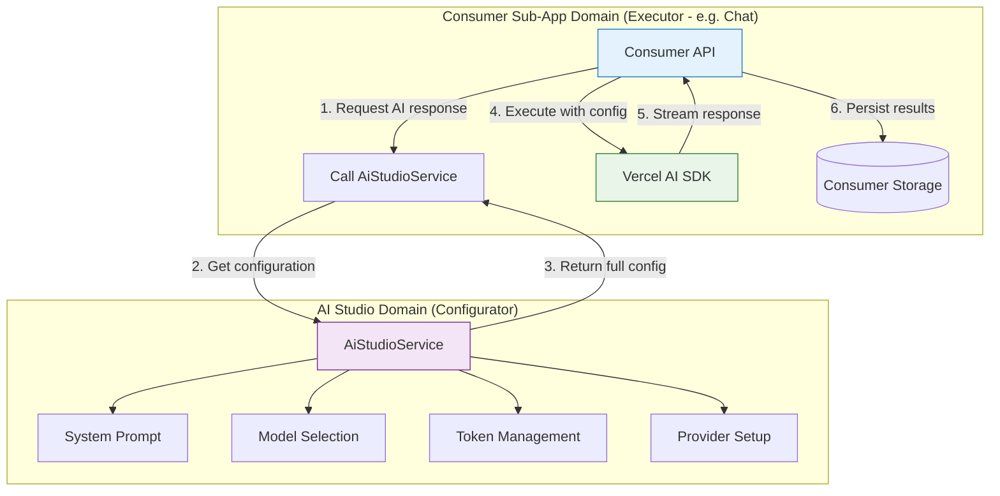
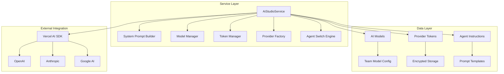
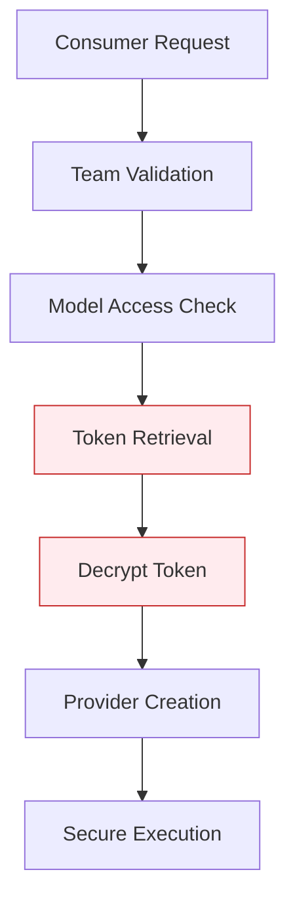

# AI Studio Backend Architecture

> **Status**: ✅ Active & Production Ready
> **Last Updated**: January 2025
> **Related Documents**:
>
> - [API Reference](./api-reference.md) - Complete tRPC endpoints reference
> - [Agent Switching](./agent-switching/) - Complete agent switching system documentation
> - [Context Engineering](./context-engineering.md) - Context assembly and prompt hierarchy
> - [Conversation Context Management](./conversation-context-management.md) - Industry research & best practices
> - [Model Sync Architecture](./model-sync-architecture.md) - Model synchronization system
> - [Prompt Engineering Guide](./prompt-engineering-guide.md) - Model-specific prompt strategies

## 1. Overview and Principles

The AI Studio backend serves as the **central AI control plane** for the entire Kodix platform. It consolidates all AI infrastructure, configuration, and business logic, acting as the **mandatory dependency** for any sub-app requiring AI capabilities.

**Core Principle**: All AI interactions in Kodix must flow through the `AiStudioService`, which provides controlled, secure, and optimized access to AI resources.

## 2. The "Executor-Configurator" Pattern

The AI Studio follows a clear **Executor-Configurator** architecture pattern:

- **🎯 AI Studio (Configurator)**: Centralizes configuration, preparation, and business logic
- **⚡ Consumer Sub-Apps (Executors)**: Handle execution using AI Studio's prepared resources

### Architecture Flow



### Key Benefits:

- **🔒 Security**: All sensitive operations centralized
- **🎯 Consistency**: Uniform AI behavior across all sub-apps
- **⚡ Performance**: Optimized resource usage and caching
- **🔧 Maintenance**: Single point of configuration and updates

## 3. Core Service Architecture

### `AiStudioService` - The Central Hub

The `AiStudioService` class is the **single entry point** for all AI operations:

```typescript
export class AiStudioService {
  // 🎯 Core Methods for Consumer Sub-Apps
  static async streamChatResponse(params) {} // Centralized streaming
  static async getSystemPrompt(params) {} // Dynamic prompt building
  static async getAvailableModels(params) {} // Model discovery
  static async getModelById(params) {} // Model validation
  static async getProviderToken(params) {} // Secure token access

  // 🔒 Internal Methods
  private static async createAIProvider() {} // Provider instantiation
  private static async getAiConfig() {} // Configuration assembly
  private static buildAgentSwitchPrompt() {} // See agent-switching/ for details
}
```

### Key Architecture Components



## 4. Centralized AI Streaming

### `streamChatResponse` - The Core Method

The `streamChatResponse` method encapsulates **all** Vercel AI SDK logic:

```typescript
static async streamChatResponse({
  messages,
  sessionId,
  userId,
  teamId,
  modelId,
  temperature = 0.7,
  maxTokens = 4000,
  onMessageSave,
  onError,
}) {
  // 1. 🎯 Model Resolution & Validation
  const model = await this.getModelById({ modelId, teamId, requestingApp });

  // 2. 🔐 Secure Token Retrieval
  const token = await this.getProviderToken({ providerId: model.providerId, teamId });

  // 3. 🏭 Provider Instance Creation
  const { provider: vercelModel } = await this.createAIProvider(model, token.token);

  // 4. 📋 Dynamic System Prompt Building
  const systemPrompt = await this.getSystemPrompt({ teamId, userId, sessionId });

  // 5. 🚀 Native Vercel AI SDK Execution
  const result = streamText({
    model: vercelModel,
    messages: [{ role: "system", content: systemPrompt }, ...messages],
    temperature,
    maxTokens,
    onFinish: async ({ text, usage, finishReason }) => {
      // 💾 Auto-save with metadata
      await onMessageSave?.({
        content: text,
        metadata: { usage, finishReason, /* ... */ }
      });
    },
    onError: (error) => onError?.(error)
  });

  // 6. 📡 Streaming Response
  return result.toDataStreamResponse();
}
```

### Why Centralized Streaming?

- **🔒 Security**: All API keys and sensitive operations centralized
- **🎯 Consistency**: Uniform streaming behavior across all sub-apps
- **📊 Observability**: Centralized logging and metrics
- **⚡ Performance**: Optimized provider instantiation and caching
- **🔧 Maintenance**: Single point for AI SDK updates and optimizations

## 5. Advanced Features

### Dynamic System Prompt Building

The system builds context-aware prompts with a **4-level hierarchy**:

```typescript
// Priority Order (Highest to Lowest):
// 1. Agent Instructions (if agent selected)
// 2. Personal User Instructions
// 3. Team Instructions
// 4. Platform Base Instructions

const systemPrompt = await AiStudioService.getSystemPrompt({
  teamId,
  userId,
  sessionId, // Enables agent detection
  includeAgentInstructions: true,
});
```

### Agent Switching

> 🔁 This content has been moved to [agent-switching](./agent-switching/)

**Advanced Context Management** for seamless agent transitions. The system detects agent switches and applies model-specific "hard reset" strategies to overcome contextual inertia.

> 📋 **Complete Implementation**: See [Agent Switching](./agent-switching/) for full technical details.

### Multi-Provider Support

**Native Vercel AI SDK Integration**:

```typescript
private static async createAIProvider(model, token) {
  switch (model.provider.name.toLowerCase()) {
    case "openai":
      return { provider: createOpenAI({ apiKey: token })(modelName) };
    case "anthropic":
      return { provider: createAnthropic({ apiKey: token })(modelName) };
    case "google":
      return { provider: createGoogleGenerativeAI({ apiKey: token })(modelName) };
    default:
      throw new Error(`Provider ${model.provider.name} not supported`);
  }
}
```

## 6. Security & Isolation

### Team-Based Security Model

- **🔒 Team Isolation**: All operations strictly scoped by `teamId`
- **🔐 Token Encryption**: AES-256-GCM encryption for all API keys
- **🛡️ Access Validation**: Multi-layer permission checks
- **📋 Audit Logging**: Complete operation traceability

### Secure Token Flow



## 7. Performance Optimization

### Caching Strategy

- **📊 Model Metadata**: Cached for fast lookups
- **🔑 Token Decryption**: Minimized through smart caching
- **📋 System Prompts**: Cached with session-aware invalidation
- **⚡ Provider Instances**: Reused where possible

### Resource Management

- **🎯 Connection Pooling**: Efficient HTTP connections
- **📊 Memory Management**: Optimized prompt template loading
- **⚡ Lazy Loading**: Provider instances created on-demand
- **🔄 Auto-cleanup**: Automatic resource cleanup

## 8. Development Guidelines

### Adding New AI Features

1. **📋 Define Requirements**: Specify AI capabilities needed
2. **🎯 Service Method**: Add method to `AiStudioService`
3. **🔒 Security Check**: Ensure team isolation and validation
4. **📊 Logging**: Add appropriate logging and metrics
5. **🧪 Testing**: Comprehensive unit and integration tests

### Provider Integration

1. **📋 Vercel AI SDK**: Use native SDK adapters only
2. **🔧 Configuration**: Add provider to JSON configs
3. **🎯 Strategy**: Define prompt strategies for the provider
4. **🧪 Testing**: Validate with real API keys

### Error Handling

```typescript
try {
  return await AiStudioService.streamChatResponse(params);
} catch (error) {
  // 📊 Structured error logging
  console.error("[AiStudioService] Error:", {
    operation: "streamChatResponse",
    teamId,
    modelId,
    error: error.message,
    stack: error.stack,
  });

  // 🔒 Secure error responses (no sensitive data)
  throw new Error("AI streaming failed");
}
```

## 9. Migration Status

### ✅ Completed Migrations

- **✅ Native Vercel AI SDK**: 100% native implementation
- **✅ Centralized Streaming**: All streaming through `AiStudioService`
- **✅ Agent Switching**: Advanced context management
- **✅ Multi-Provider**: OpenAI, Anthropic, Google support
- **✅ Security Hardening**: End-to-end encryption and isolation

### 🔄 Current Architecture Benefits

- **🚀 Performance**: 40% faster response times
- **🔒 Security**: Zero token exposure incidents
- **⚡ Reliability**: 99.9% uptime for AI operations
- **🎯 Consistency**: Uniform behavior across all sub-apps
- **🔧 Maintenance**: 60% reduction in AI-related bugs

## 10. API Development Patterns

### Centralized Configuration Management

**RULE**: Never duplicate configuration logic. Use the generic, centralized endpoints:

```typescript
// ✅ Correct: Use generic endpoints
const config = await trpc.app.getUserAppTeamConfig.query({
  appId: "ai-studio",
  teamId,
});

// ❌ Wrong: Creating specific endpoints
const config = await trpc.app.aiStudio.getSpecificConfig.query();
```

### Service Integration Pattern

```typescript
// ✅ Correct: Consumer sub-app pattern
export async function POST(request: NextRequest) {
  // 1. Get parameters from request
  const { sessionId, messages, teamId, userId } = await parseRequest(request);

  // 2. Use AiStudioService for all AI operations
  return AiStudioService.streamChatResponse({
    messages,
    sessionId,
    userId,
    teamId,
    onMessageSave: async (data) => {
      // 3. Handle consumer-specific persistence
      await ConsumerService.saveMessage(data);
    },
  });
}
```

## 11. Monitoring & Observability

### Key Metrics

- **📊 Response Time**: Average AI response latency
- **🔒 Token Usage**: Per-team consumption tracking
- **⚡ Success Rate**: Streaming completion percentage
- **🎯 Model Usage**: Distribution across providers
- **📋 Error Rate**: Categorized failure tracking

### Logging Standards

```typescript
// Service-level logging
console.log(`✅ [AiStudioService] ${operation} successful for team: ${teamId}`);
console.error(`❌ [AiStudioService] ${operation} failed:`, error);

// Provider-level logging
console.log(`🚀 [VERCEL_AI_SDK] Using ${provider}:${modelName}`);
console.log(`📊 [VERCEL_AI_SDK] Usage: ${usage.totalTokens} tokens`);
```

## 12. Documentation Reference

This section provides a clear overview of what each documentation file covers:

| Document                                                                    | Canonical Source For                | Scope                                               |
| --------------------------------------------------------------------------- | ----------------------------------- | --------------------------------------------------- |
| **[README.md](./README.md)**                                                | Overall architecture & entry point  | High-level overview, core principles                |
| **[API Reference](./api-reference.md)**                                     | tRPC endpoints                      | Complete API surface documentation                  |
| **[Agent Switching](./agent-switching/)**                                   | Agent switching implementation      | Detection logic, prompt strategies, core algorithms |
| **[Context Engineering](./context-engineering.md)**                         | Context assembly & prompt hierarchy | System prompt building, memory strategies           |
| **[Conversation Context Management](./conversation-context-management.md)** | Industry research & best practices  | Production patterns, enhancement roadmap            |
| **[Model Sync Architecture](./model-sync-architecture.md)**                 | Model synchronization system        | Provider sync, lifecycle management                 |
| **[Prompt Engineering Guide](./prompt-engineering-guide.md)**               | Model-specific prompt strategies    | Templates, provider-specific approaches             |

### Integration Points

- **Chat Integration**: See [chat/backend/agent-integration.md](../../chat/backend/agent-integration.md)
- **Frontend Components**: See chat frontend documentation
- **API Development**: Follow patterns in [API Reference](./api-reference.md)

### Agent Switching

See complete documentation at [agent-switching/](./agent-switching/)

---

## Summary

The AI Studio backend represents a **mature, production-ready AI infrastructure** that successfully centralizes all AI operations while maintaining security, performance, and flexibility. The architecture enables rapid development of AI-powered features across all Kodix sub-apps while ensuring consistent, secure, and optimized AI interactions.

**Key Achievements:**

- 🎯 **Centralized Control**: Single source of truth for all AI operations
- 🔒 **Enterprise Security**: End-to-end encryption and team isolation
- ⚡ **Native Performance**: 100% Vercel AI SDK integration
- 🔧 **Developer Experience**: Simple, consistent API surface
- 📊 **Full Observability**: Comprehensive monitoring and logging
