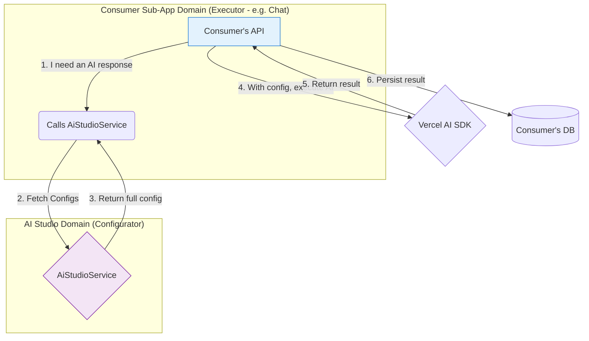
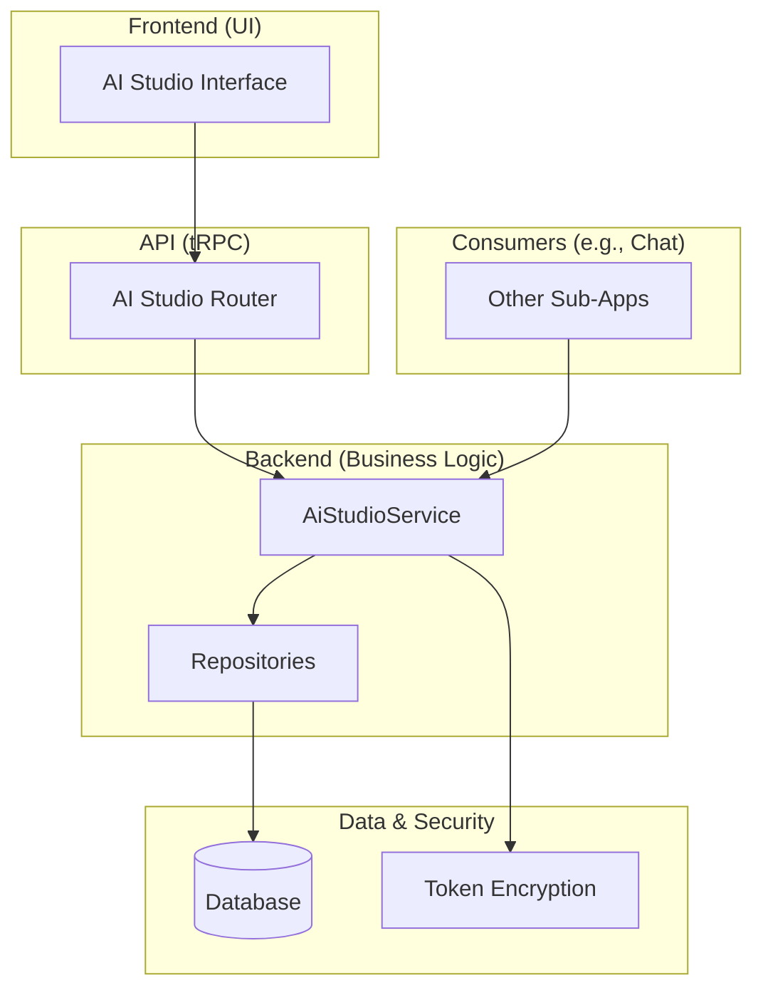

# AI Studio Backend Architecture

> **Status**: ✅ Active & Consolidated
> **Related Documents**:
>
> - [API Reference](./api-reference.md)
> - [Model Sync Architecture](./model-sync-architecture.md)
> - [Prompt Engineering Guide](./prompt-engineering-guide.md)

## 1. Overview and Principles

The AI Studio backend acts as the central control plane for all AI infrastructure at Kodix. It centralizes business logic, configuration, and communication with AI providers, serving as a mandatory dependency for any other sub-app that requires AI capabilities.

Communication from other sub-apps must occur **exclusively through the `AiStudioService`**, which safely exposes controlled AI resources.

## 2. The "Executor-Configurator" Pattern

All AI interactions in Kodix follow the **Executor-Configurator** pattern.

- **AI Studio is the Configurator**: It centralizes the business logic and complexity of AI. Its responsibility is to **configure and prepare** the execution, but never execute it directly on behalf of a consumer.
- **The Consuming Sub-App is the Executor**: The sub-app that needs an AI function (e.g., Chat) is responsible for **initiating and executing** the interaction.

### Flow Diagram

This separation of concerns is crucial:

- **AI Studio**: Thinks (builds the prompt) and Configures (provides models and tokens).
- **Chat**: Acts (executes the stream).

## 3. General Architecture

The system is modular with a clear separation of responsibilities.

- **Frontend**: UI for managing all AI resources.
- **API**: tRPC router exposing procedures to the frontend.
- **Backend**: The `AiStudioService` encapsulates all business logic.
- **Security**: Token encryption (AES-256-GCM) is handled in the backend.
- **Consumers**: Other sub-apps interact exclusively with the `AiStudioService`.

## 4. Security and Scoping

- **Team Isolation**: All backend operations are strictly isolated by `teamId`.
- **Token Encryption**: API keys are always encrypted (AES-256-GCM) in the database and never exposed to the frontend.

## 5. API Development Patterns

### Do Not Duplicate Configuration Logic

- **RULE**: **NEVER** create specific endpoints for saving app-related configurations.
- **PATTERN**: Use the generic, centralized endpoints already provided for this purpose.
  - `app.getUserAppTeamConfig`: Fetches configuration.
  - `app.saveUserAppTeamConfig`: Saves configuration.
- **HOW-TO**:
  1.  Define the configuration schema in `@kdx/shared`.
  2.  Register the `appId` and schema in the validation mappings.
  3.  Use the generic endpoints in the UI.
- **RATIONALE**: This approach centralizes logic, prevents redundancy, reduces maintenance, and ensures a consistent configuration management experience across all sub-apps.
