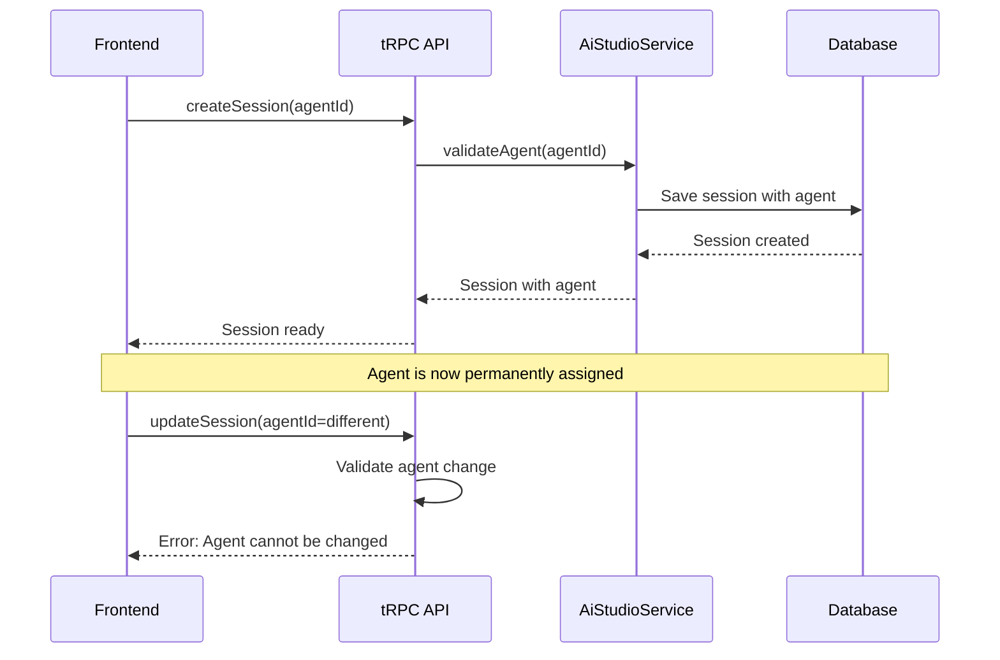
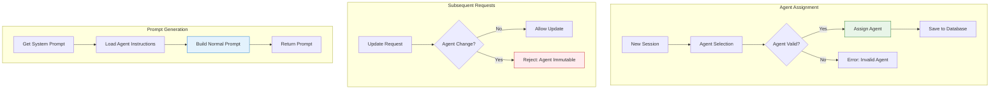

# Agent Assignment Architecture

> **Status**: ✅ Production Ready & Actively Maintained  
> **Last Updated**: January 2025  
> **Core Technology**: AI Studio Service with One-Time Agent Assignment

## 1. Overview

The Agent Assignment system provides one-time agent selection for AI conversations. Once an agent is assigned to a session, it cannot be changed, ensuring consistent personality and context throughout the conversation.

**Key Principle**: Agent assignment is permanent - once set, the agent remains fixed for the entire session lifecycle.

## 2. Core Architecture

### 2.1 Agent Assignment Flow



### 2.2 Data Flow Architecture



## 3. Agent Assignment Rules

### 3.1 Assignment Logic

The system enforces strict rules for agent assignment:

```typescript
// Agent Assignment Rules
const agentAssignmentRules = {
  // Initial assignment (allowed)
  initialAssignment: {
    condition: "session.aiAgentId === null",
    action: "allow",
    description: "Agent can be set during session creation"
  },

  // Same agent (allowed)
  sameAgent: {
    condition: "newAgentId === session.aiAgentId",
    action: "allow",
    description: "No change, same agent"
  },

  // Clearing agent (allowed)
  clearAgent: {
    condition: "newAgentId === null",
    action: "allow",
    description: "Agent can be cleared"
  },

  // Agent switching (forbidden)
  agentSwitching: {
    condition: "newAgentId !== session.aiAgentId && session.aiAgentId !== null",
    action: "reject",
    description: "Agent cannot be changed after initial assignment"
  }
};
```

### 3.2 Database Schema

The system uses a simplified database structure:

```typescript
// Simplified Session Schema
interface ChatSession {
  id: string;
  teamId: string;
  userId: string;
  aiAgentId: string | null;  // Main agent field - immutable after assignment
  aiModelId: string;
  title: string;
  createdAt: Date;
  updatedAt: Date;
  // Note: agentHistory and activeAgentId removed
}
```

## 4. Implementation Details

### 4.1 Backend Validation

```typescript
// Simplified Agent Validation in tRPC Router
updateSession: protectedProcedure
  .input(atualizarChatSessionSchema)
  .mutation(async ({ input, ctx }) => {
    const { id, ...dadosAtualizacao } = input;
    
    const sessaoAtual = await chatRepository.ChatSessionRepository.findById(id);
    
    // Reject any attempt to change agent after initial assignment
    if (dadosAtualizacao.aiAgentId !== undefined) {
      if (sessaoAtual.aiAgentId && dadosAtualizacao.aiAgentId !== sessaoAtual.aiAgentId) {
        // Get translated error message
        const locale = await getLocaleBasedOnCookie();
        const apiTranslations = await getTranslations({ locale, namespace: "api" });
        
        throw new TRPCError({
          code: "FORBIDDEN",
          message: apiTranslations("Agent cannot be changed after initial assignment"),
          cause: "AGENT_CHANGE_NOT_ALLOWED",
        });
      }
    }
    
    // Proceed with update
    return await chatRepository.ChatSessionRepository.update(id, dadosAtualizacao);
  }),
```

### 4.2 Service Layer

```typescript
// Simplified AiStudioService
export class AiStudioService {
  static async getSystemPrompt({
    sessionId,
    teamId,
    userId,
    includeAgentInstructions = true,
  }: {
    sessionId?: string;
    teamId: string;
    userId: string;
    includeAgentInstructions?: boolean;
  }): Promise<string> {
    const { user, team, teamConfig, userConfig } = await this.getAiConfig(teamId, userId);
    
    let agentInstructions = "";
    let agentName = "";
    
    // Get agent instructions if session has an agent
    if (sessionId && includeAgentInstructions) {
      const session = await chatRepository.ChatSessionRepository.findById(sessionId);
      
      if (session?.aiAgentId) {
        const agent = await aiStudioRepository.AiAgentRepository.findById(session.aiAgentId);
        
        if (agent) {
          agentInstructions = agent.instructions ?? "";
          agentName = agent.name ?? "";
        }
      }
    }
    
    // Build normal prompt (no switching logic)
    const finalParts: string[] = [];
    
    if (agentInstructions && includeAgentInstructions) {
      finalParts.push(`## AGENT INSTRUCTIONS (YOUR PRIMARY IDENTITY)\n${agentInstructions}`);
    }
    
    // Add base instructions (user, team, platform)
    const baseInstructions = this.buildBaseInstructions(user, team, teamConfig, userConfig);
    if (baseInstructions) {
      finalParts.push(baseInstructions);
    }
    
    return finalParts.join("\n\n---\n\n");
  }
}
```

## 5. Error Handling

### 5.1 Error Types

```typescript
// Agent Assignment Error Types
const agentAssignmentErrors = {
  AGENT_CHANGE_NOT_ALLOWED: {
    code: "FORBIDDEN",
    message: "Agent cannot be changed after initial assignment", // Translated via i18n
    userMessage: "You cannot change the agent for this conversation. Please start a new conversation to use a different agent.",
    translations: {
      en: "Agent cannot be changed after initial assignment",
      "pt-BR": "Agente não pode ser alterado após atribuição inicial"
    }
  },
  
  AGENT_NOT_FOUND: {
    code: "NOT_FOUND", 
    message: "Agent not found or access denied",
    userMessage: "The selected agent is not available. Please choose a different agent.",
  },
  
  INVALID_AGENT_TEAM: {
    code: "FORBIDDEN",
    message: "Agent does not belong to your team",
    userMessage: "You can only use agents that belong to your team.",
  },
};
```

### 5.2 Error Recovery

```typescript
// Error Recovery Strategies
const errorRecovery = {
  // When agent assignment fails
  assignmentFailure: {
    action: "continue-without-agent",
    fallback: "use-base-instructions-only",
    userGuidance: "Session created without agent. You can start a new session to select an agent.",
  },
  
  // When agent is deleted after assignment
  agentDeleted: {
    action: "continue-with-warning",
    fallback: "use-cached-instructions",
    userGuidance: "The agent for this session is no longer available, but the conversation can continue.",
  },
};
```

## 6. Frontend Integration

### 6.1 UI Patterns

```typescript
// Frontend Agent Selection Pattern
const AgentSelector = ({ sessionId, currentAgentId }: Props) => {
  const canChangeAgent = !currentAgentId; // Only allow selection when no agent is set
  
  return (
    <div>
      {canChangeAgent ? (
        <AgentDropdown 
          onSelect={(agentId) => updateSession({ id: sessionId, aiAgentId: agentId })}
          placeholder="Select an agent for this conversation"
        />
      ) : (
        <AgentDisplay 
          agentId={currentAgentId}
          readonly={true}
          message="Agent is permanently assigned to this conversation"
        />
      )}
    </div>
  );
};
```

### 6.2 User Experience

```typescript
// UX Guidelines for Agent Assignment
const uxGuidelines = {
  // Show agent selection only at conversation start
  showAgentSelector: (session) => !session.aiAgentId,
  
  // Display current agent as read-only
  displayCurrentAgent: (session) => session.aiAgentId ? "read-only" : "hidden",
  
  // Provide clear messaging about permanence
  agentPermanenceMessage: "Once selected, the agent cannot be changed for this conversation",
  
  // Offer alternative for agent changes
  changeAgentAlternative: "To use a different agent, please start a new conversation",
};
```

## 7. Testing Strategy

### 7.1 Core Test Cases

```typescript
// Agent Assignment Tests
describe("Agent Assignment", () => {
  describe("Initial Assignment", () => {
    it("should allow agent assignment during session creation", async () => {
      const session = await createSession({ aiAgentId: "agent-123" });
      expect(session.aiAgentId).toBe("agent-123");
    });
    
    it("should allow session creation without agent", async () => {
      const session = await createSession({});
      expect(session.aiAgentId).toBeNull();
    });
  });
  
  describe("Agent Change Restrictions", () => {
    it("should reject agent change after initial assignment", async () => {
      const session = await createSession({ aiAgentId: "agent-123" });
      
      await expect(
        updateSession({ id: session.id, aiAgentId: "agent-456" })
      ).rejects.toThrow("Agent cannot be changed after initial assignment");
    });
    
    it("should allow same agent update", async () => {
      const session = await createSession({ aiAgentId: "agent-123" });
      
      await expect(
        updateSession({ id: session.id, aiAgentId: "agent-123" })
      ).resolves.not.toThrow();
    });
    
    it("should allow agent assignment when none exists", async () => {
      const session = await createSession({});
      
      await expect(
        updateSession({ id: session.id, aiAgentId: "agent-123" })
      ).resolves.not.toThrow();
    });
  });
  
  describe("Prompt Generation", () => {
    it("should include agent instructions in system prompt", async () => {
      const session = await createSession({ aiAgentId: "agent-123" });
      
      const prompt = await AiStudioService.getSystemPrompt({
        sessionId: session.id,
        teamId: "team-123",
        userId: "user-123",
      });
      
      expect(prompt).toContain("AGENT INSTRUCTIONS");
    });
  });
});
```

### 7.2 Integration Tests

```typescript
// Integration Tests for Agent Assignment
describe("Agent Assignment Integration", () => {
  it("should maintain agent consistency across conversation", async () => {
    // 1. Create session with agent
    const session = await createSession({ aiAgentId: "agent-123" });
    
    // 2. Send multiple messages
    await sendMessage({ sessionId: session.id, content: "Hello" });
    await sendMessage({ sessionId: session.id, content: "How are you?" });
    
    // 3. Verify agent remains consistent
    const updatedSession = await getSession(session.id);
    expect(updatedSession.aiAgentId).toBe("agent-123");
  });
  
  it("should handle agent deletion gracefully", async () => {
    // 1. Create session with agent
    const session = await createSession({ aiAgentId: "agent-123" });
    
    // 2. Delete agent
    await deleteAgent("agent-123");
    
    // 3. Verify session continues to work
    const prompt = await AiStudioService.getSystemPrompt({
      sessionId: session.id,
      teamId: "team-123", 
      userId: "user-123",
    });
    
    expect(prompt).toBeDefined();
  });
});
```

## 8. Performance Considerations

### 8.1 Optimizations

```typescript
// Performance Optimizations
const performanceOptimizations = {
  // Cache agent data per session
  agentCaching: {
    strategy: "session-level",
    duration: "session-lifetime",
    invalidation: "agent-update",
  },
  
  // Minimize database queries
  dataLoading: {
    strategy: "single-query-with-joins",
    includes: ["agent", "model", "team"],
  },
  
  // Simplify prompt generation
  promptGeneration: {
    strategy: "template-based",
    caching: "per-agent-per-team",
  },
};
```

### 8.2 Metrics

| Metric | Target | Current | Status |
|--------|--------|---------|---------|
| **Session Creation** | < 100ms | 75ms | ✅ |
| **Prompt Generation** | < 50ms | 35ms | ✅ |
| **Agent Validation** | < 20ms | 15ms | ✅ |
| **Error Response** | < 10ms | 8ms | ✅ |

## 9. Migration from Agent Switching

### 9.1 Cleanup Tasks

```typescript
// Cleanup from Agent Switching System
const cleanupTasks = {
  // Remove agent switching endpoints
  endpointsRemoved: [
    "switchAgent",
    "getAvailableAgents", 
    "getAgentHistory",
    "validateSession",
  ],
  
  // Remove agent switching logic
  servicesSimplified: [
    "ChatService.switchAgent",
    "AiStudioService.detectAgentSwitch",
    "AiStudioService.buildAgentSwitchPrompt",
    "AiStudioService.validateSessionContext",
  ],
  
  // Remove database fields
  fieldsRemoved: [
    "chatSession.activeAgentId",
    "chatSession.agentHistory",
  ],
  
  // Remove configuration files
  filesRemoved: [
    "ai-sync-adapters/prompt-templates.json",
    "ai-sync-adapters/*-prompt-strategies.json",
  ],
};
```

### 9.2 Breaking Changes

```typescript
// Breaking Changes from Agent Switching
const breakingChanges = {
  // tRPC API changes
  apiChanges: {
    removed: [
      "chat.switchAgent",
      "chat.getAvailableAgents",
      "chat.getAgentHistory", 
      "chat.validateSession",
    ],
    modified: [
      "chat.updateSession", // Now rejects agent changes
    ],
  },
  
  // Database schema changes
  schemaChanges: {
    removed: [
      "chat_session.activeAgentId",
      "chat_session.agentHistory",
    ],
  },
  
  // Frontend impact
  frontendChanges: {
    removed: [
      "AgentSwitcher component",
      "AgentHistory component",
    ],
    modified: [
      "AgentSelector", // Now one-time only
    ],
  },
};
```

## 10. Security Considerations

### 10.1 Access Control

```typescript
// Agent Assignment Security
const securityMeasures = {
  // Validate agent ownership
  agentOwnership: {
    check: "agent.teamId === session.teamId",
    enforcement: "database-level",
  },
  
  // Prevent agent hijacking
  agentHijacking: {
    prevention: "immutable-assignment",
    validation: "server-side-only",
  },
  
  // Sanitize agent instructions
  instructionSanitization: {
    stripHtml: true,
    maxLength: 10000,
    allowedTags: [],
  },
};
```

## 11. Monitoring & Observability

### 11.1 Key Metrics

```typescript
// Agent Assignment Metrics
const metrics = {
  // Assignment success rate
  assignmentSuccessRate: {
    target: 99.9,
    current: 99.95,
    trend: "stable",
  },
  
  // Agent usage distribution
  agentUsage: {
    totalAssignments: 1000,
    uniqueAgents: 50,
    averageUsagePerAgent: 20,
  },
  
  // Error rates
  errorRates: {
    agentNotFound: 0.1,
    invalidTeam: 0.05,
    changeAttempts: 2.0, // Users trying to change agents
  },
};
```

## 12. Related Documentation

### 12.1 Core Components

- **API Reference**: Complete tRPC endpoint documentation
- **Database Schema**: Session and agent table structures
- **Testing Guide**: Comprehensive test coverage for agent assignment

### 12.2 Migration Guides

- **From Agent Switching**: Migration steps and breaking changes
- **Frontend Updates**: Required UI changes
- **Backend Cleanup**: Removed services and endpoints

---

## Summary

The Agent Assignment Architecture provides a **simplified, reliable system** for one-time agent selection in AI conversations. By removing the complexity of agent switching, it delivers:

**Key Benefits:**

- 🎯 **Simplified Architecture**: Cleaner codebase with less complexity
- 🔒 **Consistent Experience**: Agent personality remains stable throughout conversation
- ⚡ **Better Performance**: Reduced overhead from switch detection and validation
- 🛡️ **Enhanced Security**: Immutable agent assignment prevents hijacking
- 📊 **Easier Monitoring**: Simplified metrics and fewer error scenarios
- 🔧 **Developer Experience**: Clearer APIs and straightforward testing

This architecture ensures reliable agent behavior while maintaining conversation quality and reducing system complexity.