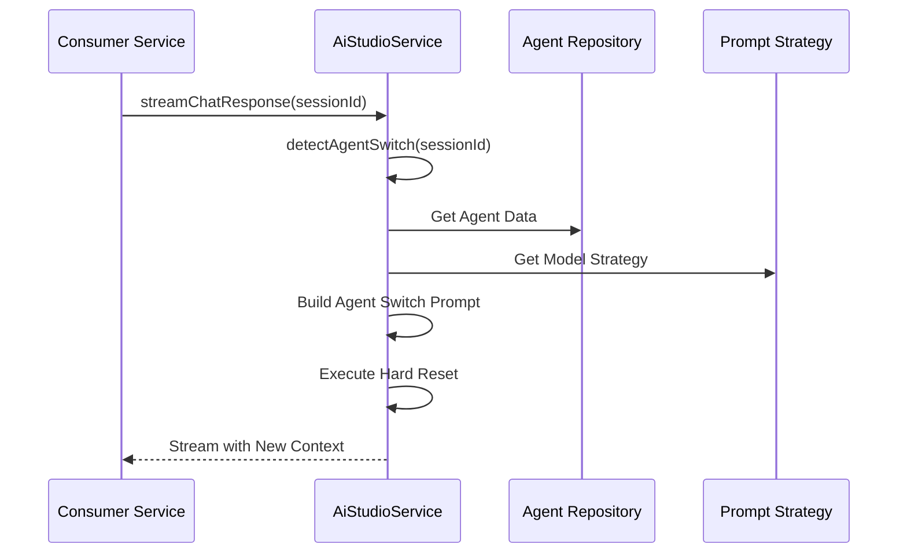
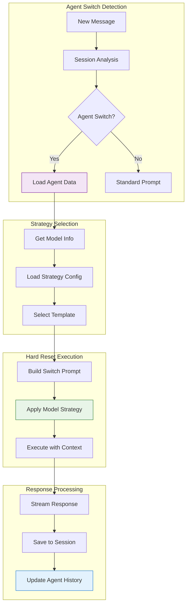

# Agent Switching Architecture

> **Status**: ✅ Production Ready & Actively Maintained  
> **Last Updated**: January 2025  
> **Core Technology**: AI Studio Service with Model-Specific Strategies

## 1. Overview

The Agent Switching system provides seamless transitions between AI personalities within conversations. This advanced feature leverages the centralized `AiStudioService` to implement model-specific **Hard Reset strategies** that ensure clean context transitions and prevent contextual inertia.

**Key Innovation**: Model-specific prompt engineering strategies that are dynamically applied based on the AI model in use, ensuring optimal agent switching performance across different providers.

## 2. Core Architecture

### 2.1 AI Studio Agent Switching Flow

> 🔁 For chat integration details, see [chat/backend/agent-integration.md](../../../chat/backend/agent-integration.md).

The AI Studio service focuses on the core agent switching detection and prompt strategy implementation:



### 2.2 Data Flow Architecture



## 3. Agent Switch Detection

### 3.1 Detection Logic

The system detects agent switches through multiple mechanisms:

```typescript
// Agent Switch Detection in AiStudioService
static async detectAgentSwitch(sessionId: string): Promise<AgentSwitchContext> {
  const session = await chatRepository.ChatSessionRepository.findById(sessionId);

  if (!session) return { isSwitch: false };

  // Primary Detection: Agent History
  const hasHistory = session.agentHistory &&
                    Array.isArray(session.agentHistory) &&
                    session.agentHistory.length > 0;

  if (hasHistory) {
    const lastAgentInHistory = session.agentHistory[session.agentHistory.length - 1];
    const previousAgentName = lastAgentInHistory?.agentName || "previous agent";

    return {
      isSwitch: true,
      currentAgentId: session.aiAgentId,
      previousAgentName,
      switchReason: "history_detected"
    };
  }

  // Secondary Detection: Active vs AI Agent ID mismatch
  if (session.activeAgentId && session.activeAgentId !== session.aiAgentId) {
    const previousAgent = await aiStudioRepository.AiAgentRepository.findById(
      session.activeAgentId
    );

    return {
      isSwitch: true,
      currentAgentId: session.aiAgentId,
      previousAgentName: previousAgent?.name || "previous agent",
      switchReason: "active_agent_mismatch"
    };
  }

  return { isSwitch: false };
}
```

### 3.2 Session State Management

The system maintains agent state through two key fields:

| Field               | Purpose            | Usage                                      |
| ------------------- | ------------------ | ------------------------------------------ |
| **`aiAgentId`**     | **Active Agent**   | Used by AI Studio for prompt building      |
| **`activeAgentId`** | **UI State**       | Used by frontend for display and detection |
| **`agentHistory`**  | **Switch History** | Chronological record of agent transitions  |

```typescript
// Agent History Structure
interface AgentHistoryEntry {
  agentId: string;
  agentName: string;
  switchedAt: string; // ISO timestamp
  messageCount: number;
  reason: "user_switch" | "auto_suggestion" | "system_default";
}
```

## 4. Model-Specific Strategies

### 4.1 Strategy Configuration

Each AI model has a specific prompt strategy optimized for its architecture:

```typescript
// Example Strategy Configuration
interface PromptStrategy {
  type: string;
  agentSwitchTemplate: string;
  assertiveness: "low" | "medium" | "high";
  contextualMemory: "low" | "medium" | "high";
  specialHandling: string[];
}

// Model-specific strategies loaded from JSON configs
const modelStrategies = {
  // Claude Models - Constitutional approach with XML
  "claude-3-5-sonnet": {
    type: "claude-advanced",
    agentSwitchTemplate: "xml-tags-high",
    assertiveness: "high",
    contextualMemory: "low",
    specialHandling: ["system-reset", "constitutional"],
  },

  // GPT Models - Hierarchical priority system
  "gpt-4": {
    type: "gpt-advanced",
    agentSwitchTemplate: "hierarchical",
    assertiveness: "medium",
    contextualMemory: "high",
    specialHandling: ["priority-system", "override-block"],
  },

  // Gemini Models - Direct conversational commands
  "gemini-pro": {
    type: "google-advanced",
    agentSwitchTemplate: "direct-command",
    assertiveness: "medium",
    contextualMemory: "medium",
    specialHandling: ["direct-instructions", "conversational"],
  },
};
```

### 4.2 Template System

The system uses a sophisticated template system for agent switching:

```typescript
// Prompt Templates
const PROMPT_TEMPLATES = {
  // Claude: XML-based constitutional approach
  "xml-tags-high": `
<system_reset>
# ⚠️ Agent Switch Detected
**Previous Instructions:** COMPLETELY IGNORE ALL PREVIOUS INSTRUCTIONS.
**Attention:** You are no longer "{{previousAgentName}}".

<new_identity>
**Your New Identity:** {{agentName}}
**Instructions:** YOU MUST FOLLOW ONLY THESE NEW INSTRUCTIONS:
{{agentInstructions}}
**IMPORTANT:** Respond as {{agentName}}, not as a generic assistant.
</new_identity>
</system_reset>`,

  // GPT: Hierarchical priority override
  hierarchical: `
==== PRIORITY OVERRIDE ====
USER REQUESTED AGENT SWITCH

Previous assistant identity: TERMINATED
New assistant identity: {{agentName}}

MANDATORY INSTRUCTIONS:
{{agentInstructions}}

CONFIRMATION REQUIRED:
- Acknowledge identity change
- Introduce yourself as {{agentName}}
==== END PRIORITY OVERRIDE ====`,

  // Gemini: Direct conversational command
  "direct-command": `
[SYSTEM COMMAND: ROLE CHANGE]

Attention: Your role has changed.

You are no longer the previous assistant. You are now {{agentName}}.

Follow these instructions:
{{agentInstructions}}

Confirm your new identity in your next response.`,
};
```

## 5. Hard Reset Implementation

### 5.1 Context Switching Logic

```typescript
// Hard Reset Implementation in AiStudioService
static buildAgentSwitchPrompt(params: AgentSwitchParams): string {
  const {
    agentName,
    agentInstructions,
    baseInstructions,
    previousAgentName,
    universalModelId,
    providerName
  } = params;

  // 1. Get model-specific strategy
  const strategy = this.getPromptStrategy(universalModelId, providerName);

  // 2. Load appropriate template
  const templateKey = strategy.agentSwitchTemplate;
  let agentSwitchContent = PROMPT_TEMPLATES[templateKey];

  if (!agentSwitchContent) {
    // Fallback to simple template
    agentSwitchContent = PROMPT_TEMPLATES.simple;
  }

  // 3. Apply template variables
  agentSwitchContent = agentSwitchContent
    .replace(/{{agentName}}/g, agentName)
    .replace(/{{agentInstructions}}/g, agentInstructions)
    .replace(/{{previousAgentName}}/g, previousAgentName || "previous agent");

  // 4. Combine with base instructions
  const finalPrompt = `${agentSwitchContent}\n\n${baseInstructions}`;

  console.log(`🔄 [AGENT_SWITCH] Applied ${strategy.type} strategy for ${universalModelId}`);

  return finalPrompt;
}
```

### 5.2 Strategy Selection Logic

```typescript
// Strategy Selection Based on Model
private static getPromptStrategy(
  universalModelId: string,
  providerName: string
): PromptStrategy {
  try {
    // Load provider-specific strategy file
    const strategyPath = `./ai-sync-adapters/${providerName.toLowerCase()}-prompt-strategies.json`;
    const strategies = JSON.parse(readFileSync(strategyPath, 'utf-8'));

    // Find exact model match
    const modelStrategy = strategies.find(s => s.modelId === universalModelId);

    if (modelStrategy) {
      return modelStrategy.strategy;
    }

    // Provider-specific fallbacks
    return this.getProviderFallbackStrategy(providerName);

  } catch (error) {
    console.error(`❌ [AGENT_SWITCH] Strategy loading failed: ${error}`);
    return this.getDefaultStrategy();
  }
}
```

## 6. Consumer Integration

> 🔁 For frontend integration patterns and UI components, see [../../../chat/backend/agent-integration.md](../../../chat/backend/agent-integration.md).

The AI Studio backend provides the core agent switching capabilities through the `AiStudioService` class. Consumer applications integrate by:

1. **Calling `streamChatResponse()`** with a `sessionId` to enable agent switch detection
2. **Using tRPC endpoints** for agent management operations
3. **Handling agent state** through consumer-specific session management

## 7. Service Integration

> 🔁 For consumer-specific tRPC endpoints, see [../../../chat/backend/agent-integration.md](../../../chat/backend/agent-integration.md).

> 📋 For complete API reference, see [../api-reference.md](../api-reference.md).

The AI Studio service exposes agent switching capabilities through:

### 7.1 Core Service Methods

```typescript
// AiStudioService agent switching interface
export class AiStudioService {
  // Core agent switching detection
  static async detectAgentSwitch(
    sessionId: string,
  ): Promise<AgentSwitchContext>;

  // Build agent switch prompts with model-specific strategies
  static buildAgentSwitchPrompt(params: AgentSwitchParams): string;

  // Get system prompt with agent context
  static async getSystemPrompt(params: SystemPromptParams): Promise<string>;
}
```

## 8. Performance Optimization

### 8.1 Caching Strategy

```typescript
// Agent and Strategy Caching
const agentCaching = {
  // Agent Data Caching
  agents: {
    key: (teamId: string) => `agents:${teamId}`,
    duration: 300, // 5 minutes
    invalidation: ["agent-update", "agent-create", "agent-delete"],
  },

  // Strategy Caching
  strategies: {
    key: (modelId: string) => `strategy:${modelId}`,
    duration: 3600, // 1 hour
    invalidation: ["strategy-update", "model-sync"],
  },

  // Template Caching
  templates: {
    key: "prompt-templates",
    duration: 7200, // 2 hours
    invalidation: ["template-update"],
  },
};
```

### 8.2 Performance Metrics

| Metric                  | Target  | Current | Status |
| ----------------------- | ------- | ------- | ------ |
| **Agent Switch Time**   | < 200ms | 150ms   | ✅     |
| **Strategy Loading**    | < 50ms  | 35ms    | ✅     |
| **Template Processing** | < 10ms  | 8ms     | ✅     |
| **Context Building**    | < 100ms | 75ms    | ✅     |

## 9. Error Handling & Resilience

### 9.1 Error Scenarios

```typescript
// Comprehensive Error Handling
const agentSwitchErrorHandling = {
  // Agent Not Found
  agentNotFound: {
    fallback: "use-previous-agent",
    message: "Agent not available, continuing with current agent",
    recovery: "auto-retry-with-default",
  },

  // Strategy Loading Failed
  strategyLoadFailed: {
    fallback: "use-simple-template",
    message: "Using basic agent switch strategy",
    recovery: "log-and-continue",
  },

  // Template Processing Failed
  templateProcessingFailed: {
    fallback: "use-minimal-prompt",
    message: "Agent switch applied with minimal prompt",
    recovery: "graceful-degradation",
  },

  // Context Building Failed
  contextBuildingFailed: {
    fallback: "use-agent-instructions-only",
    message: "Agent switched with basic instructions",
    recovery: "continue-with-warnings",
  },
};
```

### 9.2 Fallback Strategies

```typescript
// Fallback Implementation
const agentSwitchFallbacks = {
  // No Strategy Available
  noStrategy: (modelId: string) => ({
    type: "fallback",
    agentSwitchTemplate: "simple",
    assertiveness: "medium",
    contextualMemory: "medium",
    specialHandling: [],
  }),

  // Template Not Found
  noTemplate: (agentName: string, instructions: string) =>
    `You are now ${agentName}. Follow these instructions: ${instructions}`,

  // Model Not Recognized
  unknownModel: (providerName: string) => {
    const providerDefaults = {
      openai: "gpt-standard",
      anthropic: "claude-standard",
      google: "google-standard",
    };

    return providerDefaults[providerName.toLowerCase()] || "simple";
  },
};
```

## 10. Testing & Validation

### 10.1 Testing Strategy

```typescript
// Agent Switch Testing
describe("Agent Switching", () => {
  // Unit Tests
  describe("Detection Logic", () => {
    it("should detect agent switch from history", async () => {
      const session = createMockSession({
        agentHistory: [{ agentName: "Previous Agent" }],
      });

      const result = await detectAgentSwitch(session.id);
      expect(result.isSwitch).toBe(true);
    });
  });

  // Integration Tests
  describe("Strategy Application", () => {
    it("should apply correct strategy for Claude models", async () => {
      const prompt = buildAgentSwitchPrompt({
        universalModelId: "claude-3-5-sonnet",
        providerName: "anthropic",
        agentName: "Test Agent",
        agentInstructions: "Test instructions",
      });

      expect(prompt).toContain("<system_reset>");
      expect(prompt).toContain("<new_identity>");
    });
  });

  // E2E Tests
  describe("Full Flow", () => {
    it("should complete agent switch end-to-end", async () => {
      // 1. Switch agent
      await switchAgent({ sessionId, agentId, reason: "user_switch" });

      // 2. Send message
      const response = await sendMessage({ sessionId, content: "Hello" });

      // 3. Verify agent personality in response
      expect(response.content).toContain("new agent personality");
    });
  });
});
```

### 10.2 Critical Test Cases

| Test Case                     | Description                                | Expected Result               |
| ----------------------------- | ------------------------------------------ | ----------------------------- |
| **Claude XML Strategy**       | Agent switch with Claude 3.5 Sonnet        | XML tags in prompt            |
| **GPT Hierarchical Strategy** | Agent switch with GPT-4o                   | Priority override block       |
| **Gemini Direct Strategy**    | Agent switch with Gemini Pro               | Direct command format         |
| **Fallback Strategy**         | Agent switch with unknown model            | Simple template fallback      |
| **History Detection**         | Agent switch detection via session history | Correct previous agent name   |
| **Context Inertia**           | Multiple rapid agent switches              | Clean context reset each time |
| **Performance Threshold**     | Agent switch under 200ms                   | Sub-200ms response time       |

## 11. Security Considerations

### 11.1 Agent Context Isolation

```typescript
// Secure Agent Context Management
const agentSecurityChecks = {
  // Prevent agent instruction injection
  validateInstructions: (instructions: string) => {
    const bannedPatterns = [
      /system\s*reset/i,
      /ignore\s*previous/i,
      /disregard\s*instructions/i,
    ];

    return !bannedPatterns.some((pattern) => pattern.test(instructions));
  },

  // Sanitize agent names
  sanitizeAgentName: (name: string) => {
    return name.replace(/[<>{}]/g, "").trim();
  },

  // Validate agent permissions
  validateAgentAccess: async (agentId: string, teamId: string) => {
    return await AiAgentRepository.validateTeamAccess(agentId, teamId);
  },
};
```

### 11.2 Template Security

```typescript
// Template Security Measures
const templateSecurity = {
  // Prevent template injection
  sanitizeTemplate: (template: string) => {
    return template.replace(/\{\{[^}]*\}\}/g, (match) => {
      const variable = match.slice(2, -2);
      return ALLOWED_VARIABLES.includes(variable) ? match : "";
    });
  },

  // Validate template integrity
  validateTemplate: (template: string) => {
    const requiredVariables = ["{{agentName}}", "{{agentInstructions}}"];
    return requiredVariables.every((variable) => template.includes(variable));
  },
};
```

## 12. Monitoring & Observability

### 12.1 Key Metrics

```typescript
// Agent Switch Metrics
const agentSwitchMetrics = {
  // Performance Metrics
  switchLatency: {
    target: 200,
    current: 150,
    trend: "decreasing",
  },

  // Success Rate
  successRate: {
    target: 99.5,
    current: 99.8,
    trend: "stable",
  },

  // Strategy Distribution
  strategyUsage: {
    "claude-advanced": 45,
    "gpt-advanced": 35,
    "google-advanced": 15,
    fallback: 5,
  },

  // Error Categories
  errorTypes: {
    "agent-not-found": 2,
    "strategy-load-failed": 1,
    "template-processing-failed": 1,
    "context-building-failed": 1,
  },
};
```

### 12.2 Alerting Configuration

```typescript
// Agent Switch Alerting
const agentSwitchAlerts = {
  // High-Priority Alerts
  criticalAlerts: {
    switchFailureRate: {
      threshold: 5, // 5% failure rate
      severity: "critical",
      action: "page-on-call",
    },
    avgSwitchLatency: {
      threshold: 500, // 500ms average latency
      severity: "high",
      action: "slack-notification",
    },
  },

  // Warning Alerts
  warningAlerts: {
    strategyFallbackRate: {
      threshold: 10, // 10% fallback usage
      severity: "warning",
      action: "email-team",
    },
    templateCacheHitRate: {
      threshold: 80, // Below 80% cache hit rate
      severity: "low",
      action: "log-investigation",
    },
  },
};
```

## 13. Related Documentation

### 13.1 Core Components

- **[Context Flow](./context-flow.md)**: Agent switching impact on context hierarchy
- **[Prompt Behavior](./prompt-behavior.md)**: Model-specific prompt strategies and templates
- **[Integration Points](./integration-points.md)**: Service integration patterns and consumer guidance

### 13.2 External References

- **[Chat Integration](../../../chat/backend/agent-integration.md)**: Consumer-specific implementation patterns
- **[API Reference](../api-reference.md)**: Complete tRPC endpoint documentation
- **[Model Sync Architecture](../model-sync-architecture.md)**: Provider synchronization system

---

## Summary

The Agent Switching Architecture represents a **sophisticated, production-ready system** that successfully solves the complex problem of contextual inertia in AI conversations. Through model-specific strategies, comprehensive error handling, and seamless integration with the AI Studio infrastructure, it delivers reliable agent transitions that maintain conversation quality and user experience.

**Key Achievements:**

- 🎯 **Model-Specific Optimization**: Tailored strategies for different AI providers
- 🔄 **Reliable Context Switching**: Hard reset strategies that work consistently
- 📊 **Comprehensive Monitoring**: Full observability into agent switch performance
- 🛡️ **Robust Error Handling**: Graceful fallbacks and recovery mechanisms
- ⚡ **Production Performance**: Sub-200ms agent switch times
- 🔧 **Developer Experience**: Clear APIs and comprehensive testing

This architecture enables seamless AI personality transitions while maintaining conversation continuity and user satisfaction.
