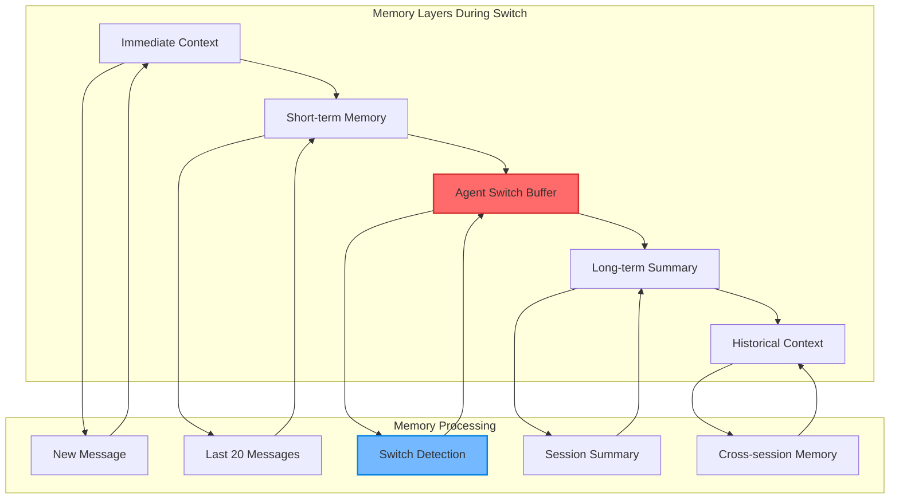

# Agent Switching Context Flow

> **Status**: ✅ Production Ready & Actively Maintained  
> **Last Updated**: January 2025  
> **Related**: [Architecture](./architecture.md) | [Prompt Behavior](./prompt-behavior.md) | [Integration Points](./integration-points.md)

## 1. Overview

The Agent Switching Context Flow describes how context management changes during agent transitions within the AI Studio system. This document focuses specifically on how the context hierarchy, memory systems, and prompt assembly adapt when agents are switched during conversations.

**Core Objective**: Ensure seamless context transitions that maintain conversation continuity while establishing new agent personalities.

## 2. Context Hierarchy During Agent Switching

### 2.1 The 4-Layer Context System

During agent switching, the AI Studio maintains a **4-level hierarchy** that adapts dynamically:

```mermaid
graph TD
    subgraph "Normal Context Flow"
        P[1. Platform Instructions] --> T[2. Team Instructions]
        T --> U[3. User Instructions]
        U --> A[4. Agent Instructions]
        A --> F[Final System Prompt]
    end

    subgraph "Agent Switch Context Flow"
        P2[1. Platform Instructions] --> T2[2. Team Instructions]
        T2 --> U2[3. User Instructions]
        U2 --> AS[4. Agent Switch Override]
        AS --> NA[5. New Agent Instructions]
        NA --> F2[Final System Prompt]
    end

    style AS fill:#ff6b6b,stroke:#d63031,stroke-width:2px
    style NA fill:#74b9ff,stroke:#0984e3,stroke-width:2px
    style F2 fill:#e8daef,stroke:#9b59b6,stroke-width:2px
```



### 2.2 Context Layer Adaptation

During agent switching, the context layers behave differently:

#### Layer 1: Platform Instructions (Unchanged)

- **Source**: Hardcoded in `AiStudioService`
- **Behavior**: Remains constant across all agent switches
- **Content**: Base AI behavior and security constraints

#### Layer 2: Team Instructions (Unchanged)

- **Source**: `Team.settings` in database
- **Behavior**: Provides team-wide context continuity
- **Content**: Team-specific configurations and guidelines

#### Layer 3: User Instructions (Unchanged)

- **Source**: `User.settings` (future implementation)
- **Behavior**: Maintains user personalization preferences
- **Content**: User-specific interaction preferences

#### Layer 4: Agent Instructions (Dynamically Replaced)

- **Source**: `AIAgent.prompt` for new agent
- **Behavior**: **Complete replacement** with hard reset strategies
- **Content**: New agent personality and capabilities

### 2.3 Context Injection Strategy

```typescript
// Context Flow During Agent Switch
export class AgentSwitchContextFlow {
  static async buildSwitchContext(params: AgentSwitchParams): Promise<string> {
    // 1. Build base context (layers 1-3)
    const baseContext = await this.buildBaseContext(params);

    // 2. Detect agent switch
    const switchContext = await AiStudioService.detectAgentSwitch(
      params.sessionId,
    );

    if (switchContext.isSwitch) {
      // 3. Apply hard reset strategy
      const hardResetPrompt = AiStudioService.buildAgentSwitchPrompt({
        ...params,
        previousAgentName: switchContext.previousAgentName,
      });

      // 4. Combine with base context
      return this.combineContexts(baseContext, hardResetPrompt);
    }

    // 5. Standard agent context
    return this.buildStandardAgentContext(baseContext, params);
  }
}
```

## 3. Memory Strategy During Agent Switching

### 3.1 Memory Layer Behavior

The memory system adapts to preserve conversation continuity while establishing new agent identity:



### 3.2 Short-Term Memory Adaptation

```typescript
// Short-Term Memory During Agent Switch
export class AgentSwitchMemoryAdapter {
  static async adaptShortTermMemory(
    sessionId: string,
    messages: Message[],
    switchContext: AgentSwitchContext,
  ): Promise<Message[]> {
    if (switchContext.isSwitch) {
      // 1. Mark the transition point
      const transitionMarker = {
        role: "system",
        content: `[AGENT_SWITCH] Previous: ${switchContext.previousAgentName} → Current: ${switchContext.currentAgentName}`,
        timestamp: new Date().toISOString(),
        metadata: { type: "agent_switch", reason: switchContext.switchReason },
      };

      // 2. Preserve conversation history but add transition context
      const adaptedMessages = this.addTransitionContext(
        messages,
        transitionMarker,
      );

      // 3. Optimize for new agent context
      return this.optimizeForNewAgent(adaptedMessages, switchContext);
    }

    return messages;
  }

  private static addTransitionContext(
    messages: Message[],
    transitionMarker: Message,
  ): Message[] {
    // Insert transition marker at appropriate position
    const lastUserMessageIndex = this.findLastUserMessageIndex(messages);

    const result = [...messages];
    result.splice(lastUserMessageIndex + 1, 0, transitionMarker);

    return result;
  }

  private static optimizeForNewAgent(
    messages: Message[],
    switchContext: AgentSwitchContext,
  ): Message[] {
    // Remove conflicting agent references from recent messages
    return messages.map((message) => {
      if (
        message.role === "assistant" &&
        this.containsOldAgentReference(
          message.content,
          switchContext.previousAgentName,
        )
      ) {
        return {
          ...message,
          content: this.sanitizeAgentReferences(message.content, switchContext),
        };
      }
      return message;
    });
  }
}
```

### 3.3 Long-Term Memory Integration

```typescript
// Long-Term Memory During Agent Switch
export class AgentSwitchLongTermMemory {
  static async buildSwitchAwareSummary(
    sessionId: string,
    switchContext: AgentSwitchContext,
  ): Promise<string> {
    const existingSummary = await this.getStoredSummary(sessionId);
    const agentHistory = await this.getAgentHistory(sessionId);

    // Build context-aware summary
    const switchAwareSummary = `
<conversation_context>
  <agent_history>
    ${agentHistory
      .map(
        (entry) => `
    - ${entry.agentName}: ${entry.messageCount} messages (${entry.switchedAt})
    `,
      )
      .join("")}
  </agent_history>
  
  <current_agent>
    Name: ${switchContext.currentAgentName}
    Switch Reason: ${switchContext.switchReason}
    Previous Agent: ${switchContext.previousAgentName}
  </current_agent>
  
  <conversation_summary>
    ${existingSummary}
  </conversation_summary>
</conversation_context>
    `;

    return switchAwareSummary;
  }
}
```

## 4. Context Optimization During Switching

### 4.1 Token Budget Management

```typescript
// Context Optimization for Agent Switching
export class AgentSwitchContextOptimizer {
  static async optimizeContextForSwitch(
    context: ChatContext,
    switchContext: AgentSwitchContext,
  ): Promise<ChatContext> {
    // 1. Calculate token budget
    const tokenBudget = await this.calculateTokenBudget(context);

    // 2. Prioritize agent switch content
    const prioritizedContent = await this.prioritizeAgentSwitchContent(
      context,
      switchContext,
    );

    // 3. Compress if needed
    if (prioritizedContent.tokenCount > tokenBudget) {
      return this.compressContextForSwitch(prioritizedContent, tokenBudget);
    }

    return prioritizedContent;
  }

  private static async prioritizeAgentSwitchContent(
    context: ChatContext,
    switchContext: AgentSwitchContext,
  ): Promise<ChatContext> {
    const priorityOrder = [
      "agent_switch_prompt", // Highest priority
      "new_agent_instructions",
      "recent_messages",
      "conversation_summary",
      "historical_context", // Lowest priority
    ];

    // Reorder content based on priority
    return this.reorderContextByPriority(context, priorityOrder);
  }

  private static async compressContextForSwitch(
    context: ChatContext,
    tokenBudget: number,
  ): Promise<ChatContext> {
    // Aggressive compression during agent switch
    const compressionStrategy = {
      agentSwitchPrompt: 0, // Never compress
      newAgentInstructions: 0, // Never compress
      recentMessages: 0.3, // Compress 30%
      conversationSummary: 0.5, // Compress 50%
      historicalContext: 0.8, // Compress 80%
    };

    return this.applyCompressionStrategy(
      context,
      compressionStrategy,
      tokenBudget,
    );
  }
}
```

### 4.2 Context Validation

```typescript
// Context Validation During Agent Switch
export class AgentSwitchContextValidator {
  static async validateSwitchContext(
    context: ChatContext,
    switchContext: AgentSwitchContext,
  ): Promise<ValidationResult> {
    const validationChecks = [
      this.validateAgentSwitchPrompt(context, switchContext),
      this.validateContextIntegrity(context),
      this.validateTokenBudget(context),
      this.validateAgentConsistency(context, switchContext),
      this.validateMemoryCoherence(context, switchContext),
    ];

    const results = await Promise.all(validationChecks);

    return this.combineValidationResults(results);
  }

  private static validateAgentSwitchPrompt(
    context: ChatContext,
    switchContext: AgentSwitchContext,
  ): ValidationResult {
    const requiredElements = [
      "agent_switch_detection",
      "hard_reset_strategy",
      "new_agent_instructions",
      "context_continuity",
    ];

    return this.validateRequiredElements(context, requiredElements);
  }

  private static validateAgentConsistency(
    context: ChatContext,
    switchContext: AgentSwitchContext,
  ): ValidationResult {
    // Check for conflicting agent references
    const conflicts = this.detectAgentConflicts(context, switchContext);

    if (conflicts.length > 0) {
      return {
        isValid: false,
        errors: conflicts.map(
          (conflict) => `Agent reference conflict: ${conflict}`,
        ),
        warnings: [],
      };
    }

    return { isValid: true, errors: [], warnings: [] };
  }
}
```

## 5. Performance Optimization

### 5.1 Caching Strategy for Agent Switch Context

```typescript
// Agent Switch Context Caching
export class AgentSwitchContextCache {
  private static cache = new Map<string, AgentSwitchContext>();

  static async getCachedSwitchContext(
    sessionId: string,
    currentAgentId: string,
  ): Promise<AgentSwitchContext | null> {
    const cacheKey = `${sessionId}:${currentAgentId}`;

    // Check cache first
    if (this.cache.has(cacheKey)) {
      const cached = this.cache.get(cacheKey);

      // Validate cache freshness
      if (this.isCacheValid(cached)) {
        return cached;
      }
    }

    // Build fresh context
    const freshContext = await this.buildFreshSwitchContext(
      sessionId,
      currentAgentId,
    );

    // Cache for future use
    this.cache.set(cacheKey, freshContext);

    // Auto-expire after 5 minutes
    setTimeout(() => this.cache.delete(cacheKey), 5 * 60 * 1000);

    return freshContext;
  }
}
```

### 5.2 Context Assembly Performance

```typescript
// Performance Metrics for Agent Switch Context
export class AgentSwitchContextMetrics {
  static async measureContextAssemblyTime(
    sessionId: string,
    switchContext: AgentSwitchContext,
  ): Promise<PerformanceMetrics> {
    const startTime = performance.now();

    const metrics = {
      detectionTime: 0,
      strategyLoadTime: 0,
      templateProcessingTime: 0,
      contextAssemblyTime: 0,
      totalTime: 0,
    };

    // Measure detection time
    const detectionStart = performance.now();
    await AiStudioService.detectAgentSwitch(sessionId);
    metrics.detectionTime = performance.now() - detectionStart;

    // Measure strategy loading
    const strategyStart = performance.now();
    const strategy = await this.loadStrategy(switchContext);
    metrics.strategyLoadTime = performance.now() - strategyStart;

    // Measure template processing
    const templateStart = performance.now();
    const template = await this.processTemplate(strategy, switchContext);
    metrics.templateProcessingTime = performance.now() - templateStart;

    // Measure context assembly
    const assemblyStart = performance.now();
    const finalContext = await this.assembleContext(template, switchContext);
    metrics.contextAssemblyTime = performance.now() - assemblyStart;

    metrics.totalTime = performance.now() - startTime;

    // Log performance metrics
    this.logPerformanceMetrics(metrics);

    return metrics;
  }
}
```

## 6. Error Handling in Context Flow

### 6.1 Context Flow Error Scenarios

```typescript
// Error Handling During Agent Switch Context Flow
export class AgentSwitchContextErrorHandler {
  static async handleContextFlowError(
    error: Error,
    sessionId: string,
    switchContext: AgentSwitchContext,
  ): Promise<FallbackContext> {
    const errorType = this.classifyError(error);

    switch (errorType) {
      case "AGENT_NOT_FOUND":
        return this.handleAgentNotFound(sessionId, switchContext);

      case "CONTEXT_ASSEMBLY_FAILED":
        return this.handleContextAssemblyFailure(sessionId, switchContext);

      case "MEMORY_CORRUPTION":
        return this.handleMemoryCorruption(sessionId, switchContext);

      case "TOKEN_BUDGET_EXCEEDED":
        return this.handleTokenBudgetExceeded(sessionId, switchContext);

      default:
        return this.handleUnknownError(sessionId, switchContext);
    }
  }

  private static async handleAgentNotFound(
    sessionId: string,
    switchContext: AgentSwitchContext,
  ): Promise<FallbackContext> {
    // Log the error
    console.error(
      `❌ [AGENT_SWITCH_CONTEXT] Agent not found: ${switchContext.currentAgentId}`,
    );

    // Build fallback context
    const fallbackContext = {
      systemPrompt: `You are an AI assistant. The requested agent is not available.`,
      agentName: "Default Assistant",
      fallbackReason: "agent_not_found",
      originalAgentId: switchContext.currentAgentId,
    };

    return fallbackContext;
  }

  private static async handleContextAssemblyFailure(
    sessionId: string,
    switchContext: AgentSwitchContext,
  ): Promise<FallbackContext> {
    // Use minimal context
    const minimalContext = {
      systemPrompt: this.buildMinimalPrompt(switchContext),
      agentName: switchContext.currentAgentName || "Assistant",
      fallbackReason: "context_assembly_failed",
      degradedMode: true,
    };

    return minimalContext;
  }
}
```

### 6.2 Context Recovery Strategies

```typescript
// Context Recovery During Agent Switch
export class AgentSwitchContextRecovery {
  static async recoverFromContextFailure(
    sessionId: string,
    switchContext: AgentSwitchContext,
    failureType: string,
  ): Promise<RecoveryResult> {
    const recoveryStrategies = {
      memory_corruption: this.recoverFromMemoryCorruption,
      token_overflow: this.recoverFromTokenOverflow,
      agent_conflict: this.recoverFromAgentConflict,
      template_error: this.recoverFromTemplateError,
    };

    const recoveryFunction = recoveryStrategies[failureType];

    if (recoveryFunction) {
      return await recoveryFunction(sessionId, switchContext);
    }

    // Default recovery
    return this.defaultRecovery(sessionId, switchContext);
  }

  private static async recoverFromMemoryCorruption(
    sessionId: string,
    switchContext: AgentSwitchContext,
  ): Promise<RecoveryResult> {
    // Clear corrupted memory and rebuild
    await this.clearCorruptedMemory(sessionId);

    // Rebuild context from scratch
    const freshContext = await this.buildFreshContext(sessionId, switchContext);

    return {
      success: true,
      context: freshContext,
      recoveryMethod: "memory_rebuild",
      warnings: ["Memory was corrupted and rebuilt"],
    };
  }

  private static async recoverFromTokenOverflow(
    sessionId: string,
    switchContext: AgentSwitchContext,
  ): Promise<RecoveryResult> {
    // Aggressive compression
    const compressedContext = await this.applyAggressiveCompression(
      sessionId,
      switchContext,
    );

    return {
      success: true,
      context: compressedContext,
      recoveryMethod: "aggressive_compression",
      warnings: ["Context was heavily compressed due to token limits"],
    };
  }
}
```

## 7. Integration with AI Studio Service

### 7.1 Service Integration Points

```typescript
// Integration with AiStudioService
export class AgentSwitchContextIntegration {
  static async integrateWithAiStudio(
    sessionId: string,
    messages: Message[],
    agentId: string,
  ): Promise<IntegrationResult> {
    // 1. Detect agent switch through AI Studio
    const switchContext = await AiStudioService.detectAgentSwitch(sessionId);

    // 2. Build context flow
    const contextFlow = await this.buildContextFlow(messages, switchContext);

    // 3. Optimize context for AI Studio
    const optimizedContext = await this.optimizeForAiStudio(contextFlow);

    // 4. Validate integration
    const validationResult = await this.validateIntegration(optimizedContext);

    return {
      switchContext,
      contextFlow,
      optimizedContext,
      validationResult,
    };
  }

  private static async buildContextFlow(
    messages: Message[],
    switchContext: AgentSwitchContext,
  ): Promise<ContextFlow> {
    if (switchContext.isSwitch) {
      // Build agent switch context flow
      return this.buildAgentSwitchFlow(messages, switchContext);
    }

    // Build standard context flow
    return this.buildStandardFlow(messages);
  }
}
```

### 7.2 Context Flow Monitoring

```typescript
// Context Flow Monitoring
export class AgentSwitchContextMonitor {
  static async monitorContextFlow(
    sessionId: string,
    switchContext: AgentSwitchContext,
  ): Promise<MonitoringResult> {
    const metrics = await this.collectContextMetrics(sessionId, switchContext);

    // Check for anomalies
    const anomalies = this.detectAnomalies(metrics);

    // Log context flow events
    this.logContextFlowEvents(sessionId, switchContext, metrics);

    // Send alerts if necessary
    if (anomalies.length > 0) {
      await this.sendAnomalyAlerts(sessionId, anomalies);
    }

    return {
      metrics,
      anomalies,
      health: anomalies.length === 0 ? "healthy" : "degraded",
    };
  }

  private static collectContextMetrics(
    sessionId: string,
    switchContext: AgentSwitchContext,
  ): Promise<ContextMetrics> {
    return {
      contextSize: this.measureContextSize(sessionId),
      assemblyTime: this.measureAssemblyTime(sessionId),
      memoryUsage: this.measureMemoryUsage(sessionId),
      cacheHitRate: this.measureCacheHitRate(sessionId),
      errorRate: this.measureErrorRate(sessionId, switchContext),
    };
  }
}
```

## 8. Related Documentation

### 8.1 Core Components

- **[Architecture](./architecture.md)**: Complete agent switching system architecture
- **[Prompt Behavior](./prompt-behavior.md)**: Model-specific prompt strategies during switching
- **[Integration Points](./integration-points.md)**: Service integration patterns and consumer guidance

### 8.2 External References

- **[Context Engineering](../context-engineering.md)**: Complete context management system
- **[Chat Integration](../../../chat/backend/agent-integration.md)**: Consumer-specific implementation patterns
- **[API Reference](../api-reference.md)**: Complete tRPC endpoint documentation

---

## Summary

The Agent Switching Context Flow ensures seamless context management during agent transitions while maintaining conversation continuity and establishing new agent personalities. Through sophisticated memory adaptation, context optimization, and error handling, the system delivers reliable context transitions that enhance user experience.

**Key Features:**

- 🔄 **Dynamic Context Adaptation**: Context hierarchy adapts to agent switches
- 🧠 **Memory Continuity**: Preserves conversation history while establishing new identity
- ⚡ **Performance Optimization**: Efficient context assembly and caching
- 🛡️ **Error Resilience**: Comprehensive error handling and recovery
- 📊 **Monitoring**: Complete observability into context flow health
- 🔧 **Integration**: Seamless integration with AI Studio service

This context flow system enables smooth agent transitions while maintaining high performance and reliability.
