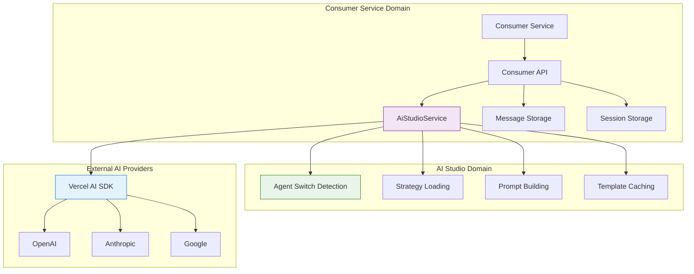

# Agent Switching Integration Points

> **Status**: ✅ Production Ready & Actively Maintained  
> **Last Updated**: January 2025  
> **Related**: [Architecture](./architecture.md) | [Context Flow](./context-flow.md) | [Prompt Behavior](./prompt-behavior.md)

## 1. Overview

This document provides comprehensive guidance for integrating agent switching functionality into consumer services and applications. It covers service integration patterns, API usage, consumer implementation strategies, and best practices for leveraging the AI Studio agent switching system.

**Core Principle**: Agent switching should be seamless and transparent to consumers while providing powerful customization capabilities.

## 2. Service Integration Architecture

### 2.1 Integration Pattern Overview

The agent switching system follows the **Executor-Configurator** pattern where AI Studio handles configuration and consumers handle execution:



### 2.2 Key Integration Points

| Integration Point      | Responsibility | Implementation                                |
| ---------------------- | -------------- | --------------------------------------------- |
| **Agent Detection**    | AI Studio      | `AiStudioService.detectAgentSwitch()`         |
| **Strategy Selection** | AI Studio      | Model-specific strategy loading               |
| **Prompt Building**    | AI Studio      | Template processing and variable substitution |
| **Session Management** | Consumer       | Agent state tracking and persistence          |
| **UI State**           | Consumer       | Frontend agent selection and display          |
| **Message Handling**   | Consumer       | Message persistence and retrieval             |

## 3. Core Service Integration

### 3.1 AiStudioService Integration

The primary integration point for agent switching is the `AiStudioService.streamChatResponse()` method:

```typescript
// Consumer Service Integration
export class ConsumerChatService {
  static async streamChatResponse(params: ChatStreamParams) {
    const {
      messages,
      sessionId,
      userId,
      teamId,
      modelId,
      agentId, // Optional: specific agent to use
      onMessageSave,
      onError,
    } = params;

    try {
      // Call AI Studio service with session ID for agent detection
      const response = await AiStudioService.streamChatResponse({
        messages,
        sessionId, // Enables automatic agent switch detection
        userId,
        teamId,
        modelId,
        temperature: 0.7,
        maxTokens: 4000,
        onMessageSave: async (messageData) => {
          // Consumer-specific message persistence
          await this.saveMessage({
            ...messageData,
            sessionId,
            userId,
            teamId,
            agentId: this.getCurrentAgentId(sessionId),
          });

          // Call consumer callback
          await onMessageSave?.(messageData);
        },
        onError: (error) => {
          console.error("[ConsumerChatService] AI streaming error:", error);
          onError?.(error);
        },
      });

      return response;
    } catch (error) {
      console.error("[ConsumerChatService] Chat streaming failed:", error);
      throw new Error("Chat streaming failed");
    }
  }
}
```

### 3.2 Session State Management

Consumers must manage session state to enable agent switching:

```typescript
// Session State Management
export class ConsumerSessionService {
  static async updateAgentState(
    sessionId: string,
    newAgentId: string,
    reason: AgentSwitchReason,
  ): Promise<void> {
    const session = await this.getSession(sessionId);

    if (!session) {
      throw new Error(`Session not found: ${sessionId}`);
    }

    // Update agent state
    const previousAgentId = session.aiAgentId;

    await this.updateSession(sessionId, {
      aiAgentId: newAgentId, // Used by AI Studio
      activeAgentId: newAgentId, // Used by frontend
      updatedAt: new Date(),
    });

    // Update agent history
    await this.updateAgentHistory(sessionId, {
      agentId: newAgentId,
      previousAgentId,
      switchedAt: new Date().toISOString(),
      reason,
      messageCount: await this.getMessageCount(sessionId),
    });

    console.log(
      `✅ [Session] Agent switched: ${previousAgentId} → ${newAgentId}`,
    );
  }

  static async getAgentHistory(
    sessionId: string,
  ): Promise<AgentHistoryEntry[]> {
    const session = await this.getSession(sessionId);
    return session?.agentHistory || [];
  }

  static async getCurrentAgent(sessionId: string): Promise<string | null> {
    const session = await this.getSession(sessionId);
    return session?.aiAgentId || null;
  }
}
```

### 3.3 Message Context Preparation

Consumers are responsible for preparing message context for AI Studio:

```typescript
// Message Context Preparation
export class ConsumerMessageService {
  static async prepareMessageContext(
    sessionId: string,
    limit: number = 20,
  ): Promise<Message[]> {
    // Fetch recent messages from consumer database
    const messages = await this.getRecentMessages(sessionId, limit);

    // Format for AI Studio consumption
    const formattedMessages = messages.map((msg) => ({
      role: msg.role as "user" | "assistant" | "system",
      content: msg.content,
      timestamp: msg.createdAt,
      metadata: {
        messageId: msg.id,
        agentId: msg.agentId,
        userId: msg.userId,
      },
    }));

    // Optimize for token budget
    return this.optimizeForTokenBudget(formattedMessages);
  }

  private static async optimizeForTokenBudget(
    messages: Message[],
  ): Promise<Message[]> {
    // Implement token budget optimization
    const tokenCount = await this.calculateTokenCount(messages);
    const tokenBudget = 8000; // Conservative budget

    if (tokenCount > tokenBudget) {
      // Truncate oldest messages while preserving recent context
      return this.truncateMessages(messages, tokenBudget);
    }

    return messages;
  }
}
```

## 4. tRPC API Integration

### 4.1 Agent Management Endpoints

Consumer services can leverage AI Studio's tRPC endpoints for agent management:

```typescript
// Consumer tRPC Integration
export class ConsumerAgentAPI {
  static async getAvailableAgents(teamId: string) {
    return await trpc.app.aiStudio.agents.findAiAgents.query({
      teamId,
    });
  }

  static async createAgent(params: CreateAgentParams) {
    return await trpc.app.aiStudio.agents.createAiAgent.mutate({
      teamId: params.teamId,
      name: params.name,
      prompt: params.instructions,
      isActive: true,
    });
  }

  static async updateAgent(params: UpdateAgentParams) {
    return await trpc.app.aiStudio.agents.updateAiAgent.mutate({
      id: params.agentId,
      name: params.name,
      prompt: params.instructions,
      isActive: params.isActive,
    });
  }

  static async deleteAgent(agentId: string) {
    return await trpc.app.aiStudio.agents.deleteAiAgent.mutate({
      id: agentId,
    });
  }
}
```

### 4.2 Model Management Integration

```typescript
// Model Management Integration
export class ConsumerModelAPI {
  static async getAvailableModels(teamId: string) {
    return await trpc.app.aiStudio.teamModels.findTeamModels.query({
      teamId,
    });
  }

  static async getDefaultModel(teamId: string) {
    return await trpc.app.aiStudio.teamModels.getDefaultModel.query({
      teamId,
    });
  }

  static async testModel(params: TestModelParams) {
    return await trpc.app.aiStudio.teamModels.testModel.mutate({
      teamId: params.teamId,
      modelId: params.modelId,
      testPrompt: params.testPrompt || "Hello, this is a test message.",
    });
  }
}
```

## 5. Frontend Integration Patterns

### 5.1 Agent Selection Component

```typescript
// Agent Selection Component
export interface AgentSelectionProps {
  sessionId: string;
  currentAgentId?: string;
  onAgentChange: (agentId: string) => void;
  teamId: string;
}

export const AgentSelection: React.FC<AgentSelectionProps> = ({
  sessionId,
  currentAgentId,
  onAgentChange,
  teamId
}) => {
  const [agents, setAgents] = useState<Agent[]>([]);
  const [isLoading, setIsLoading] = useState(false);

  // Fetch available agents
  useEffect(() => {
    const fetchAgents = async () => {
      try {
        const availableAgents = await ConsumerAgentAPI.getAvailableAgents(teamId);
        setAgents(availableAgents);
      } catch (error) {
        console.error('Failed to fetch agents:', error);
      }
    };

    fetchAgents();
  }, [teamId]);

  const handleAgentSwitch = async (agentId: string) => {
    setIsLoading(true);

    try {
      // Update session state
      await ConsumerSessionService.updateAgentState(
        sessionId,
        agentId,
        'user_switch'
      );

      // Update UI
      onAgentChange(agentId);

    } catch (error) {
      console.error('Agent switch failed:', error);
    } finally {
      setIsLoading(false);
    }
  };

  return (
    <div className="agent-selection">
      <label>Select Agent:</label>
      <select
        value={currentAgentId || ''}
        onChange={(e) => handleAgentSwitch(e.target.value)}
        disabled={isLoading}
      >
        <option value="">Default Assistant</option>
        {agents.map(agent => (
          <option key={agent.id} value={agent.id}>
            {agent.name}
          </option>
        ))}
      </select>
    </div>
  );
};
```

### 5.2 Agent Status Display

```typescript
// Agent Status Display Component
export interface AgentStatusProps {
  sessionId: string;
  currentAgentId?: string;
}

export const AgentStatus: React.FC<AgentStatusProps> = ({
  sessionId,
  currentAgentId
}) => {
  const [agentHistory, setAgentHistory] = useState<AgentHistoryEntry[]>([]);
  const [currentAgent, setCurrentAgent] = useState<Agent | null>(null);

  useEffect(() => {
    const fetchAgentData = async () => {
      try {
        // Fetch agent history
        const history = await ConsumerSessionService.getAgentHistory(sessionId);
        setAgentHistory(history);

        // Fetch current agent details
        if (currentAgentId) {
          const agent = await ConsumerAgentAPI.getAgent(currentAgentId);
          setCurrentAgent(agent);
        }
      } catch (error) {
        console.error('Failed to fetch agent data:', error);
      }
    };

    fetchAgentData();
  }, [sessionId, currentAgentId]);

  return (
    <div className="agent-status">
      <div className="current-agent">
        <h4>Current Agent</h4>
        <p>{currentAgent?.name || 'Default Assistant'}</p>
      </div>

      {agentHistory.length > 0 && (
        <div className="agent-history">
          <h4>Agent History</h4>
          <ul>
            {agentHistory.map((entry, index) => (
              <li key={index}>
                <strong>{entry.agentName}</strong>
                <span>({entry.messageCount} messages)</span>
                <small>{new Date(entry.switchedAt).toLocaleString()}</small>
              </li>
            ))}
          </ul>
        </div>
      )}
    </div>
  );
};
```

## 6. Error Handling and Recovery

### 6.1 Consumer Error Handling

```typescript
// Consumer Error Handling
export class ConsumerErrorHandler {
  static async handleAgentSwitchError(
    error: Error,
    sessionId: string,
    agentId: string,
  ): Promise<ErrorRecoveryResult> {
    const errorType = this.classifyError(error);

    switch (errorType) {
      case "AGENT_NOT_FOUND":
        return this.handleAgentNotFound(sessionId, agentId);

      case "AGENT_SWITCH_FAILED":
        return this.handleAgentSwitchFailed(sessionId, agentId);

      case "SESSION_NOT_FOUND":
        return this.handleSessionNotFound(sessionId);

      case "NETWORK_ERROR":
        return this.handleNetworkError(sessionId, agentId);

      default:
        return this.handleUnknownError(error, sessionId, agentId);
    }
  }

  private static async handleAgentNotFound(
    sessionId: string,
    agentId: string,
  ): Promise<ErrorRecoveryResult> {
    // Log the error
    console.error(`❌ [ConsumerErrorHandler] Agent not found: ${agentId}`);

    // Revert to default agent
    await ConsumerSessionService.updateAgentState(
      sessionId,
      "", // Empty string for default agent
      "error_recovery",
    );

    return {
      success: true,
      message: "Agent not found. Reverted to default assistant.",
      action: "reverted_to_default",
    };
  }

  private static async handleAgentSwitchFailed(
    sessionId: string,
    agentId: string,
  ): Promise<ErrorRecoveryResult> {
    // Retry the switch once
    try {
      await ConsumerSessionService.updateAgentState(
        sessionId,
        agentId,
        "retry_switch",
      );

      return {
        success: true,
        message: "Agent switch retry successful.",
        action: "retry_successful",
      };
    } catch (retryError) {
      // If retry fails, revert to previous state
      const history = await ConsumerSessionService.getAgentHistory(sessionId);
      const previousAgentId = history[history.length - 2]?.agentId || "";

      await ConsumerSessionService.updateAgentState(
        sessionId,
        previousAgentId,
        "error_recovery",
      );

      return {
        success: false,
        message: "Agent switch failed. Reverted to previous agent.",
        action: "reverted_to_previous",
      };
    }
  }
}
```

### 6.2 Graceful Degradation

```typescript
// Graceful Degradation Strategies
export class ConsumerGracefulDegradation {
  static async handleAiStudioUnavailable(
    sessionId: string,
    messages: Message[],
  ): Promise<DegradedResponse> {
    // Use fallback AI service or cached responses
    const fallbackResponse = await this.useFallbackAI(messages);

    if (fallbackResponse) {
      return {
        type: "fallback_ai",
        response: fallbackResponse,
        message: "Using fallback AI service",
      };
    }

    // Use cached responses for common queries
    const cachedResponse = await this.getCachedResponse(messages);

    if (cachedResponse) {
      return {
        type: "cached_response",
        response: cachedResponse,
        message: "Using cached response",
      };
    }

    // Return informative error message
    return {
      type: "error_message",
      response: {
        content:
          "AI service is temporarily unavailable. Please try again later.",
        role: "assistant",
      },
      message: "AI service unavailable",
    };
  }

  private static async useFallbackAI(
    messages: Message[],
  ): Promise<AIResponse | null> {
    try {
      // Implement fallback AI service call
      // This could be a different provider or a local model
      const fallbackService = new FallbackAIService();
      return await fallbackService.generate(messages);
    } catch (error) {
      console.error("Fallback AI service failed:", error);
      return null;
    }
  }
}
```

## 7. Performance Optimization

### 7.1 Caching Strategies

```typescript
// Consumer Caching Strategies
export class ConsumerCacheManager {
  private static agentCache = new Map<string, Agent>();
  private static sessionCache = new Map<string, Session>();

  static async getCachedAgent(agentId: string): Promise<Agent | null> {
    // Check memory cache first
    if (this.agentCache.has(agentId)) {
      return this.agentCache.get(agentId)!;
    }

    // Check persistent cache (Redis, etc.)
    const cachedAgent = await this.getPersistentCachedAgent(agentId);

    if (cachedAgent) {
      // Store in memory cache
      this.agentCache.set(agentId, cachedAgent);
      return cachedAgent;
    }

    return null;
  }

  static setCachedAgent(agentId: string, agent: Agent): void {
    // Store in memory cache
    this.agentCache.set(agentId, agent);

    // Store in persistent cache
    this.setPersistentCachedAgent(agentId, agent);

    // Auto-expire after 10 minutes
    setTimeout(
      () => {
        this.agentCache.delete(agentId);
      },
      10 * 60 * 1000,
    );
  }

  static async getCachedSession(sessionId: string): Promise<Session | null> {
    if (this.sessionCache.has(sessionId)) {
      return this.sessionCache.get(sessionId)!;
    }

    return null;
  }

  static setCachedSession(sessionId: string, session: Session): void {
    this.sessionCache.set(sessionId, session);

    // Auto-expire after 5 minutes
    setTimeout(
      () => {
        this.sessionCache.delete(sessionId);
      },
      5 * 60 * 1000,
    );
  }
}
```

### 7.2 Batching and Optimization

```typescript
// Batching and Optimization
export class ConsumerBatchManager {
  private static pendingAgentUpdates = new Map<string, AgentUpdateBatch>();

  static async batchAgentUpdates(
    sessionId: string,
    agentId: string,
    updateType: string,
  ): Promise<void> {
    const batchKey = `${sessionId}:${agentId}`;

    if (!this.pendingAgentUpdates.has(batchKey)) {
      this.pendingAgentUpdates.set(batchKey, {
        sessionId,
        agentId,
        updates: [],
        scheduledAt: Date.now(),
      });

      // Schedule batch processing
      setTimeout(() => {
        this.processBatch(batchKey);
      }, 100); // 100ms batch window
    }

    const batch = this.pendingAgentUpdates.get(batchKey)!;
    batch.updates.push({
      type: updateType,
      timestamp: Date.now(),
    });
  }

  private static async processBatch(batchKey: string): Promise<void> {
    const batch = this.pendingAgentUpdates.get(batchKey);

    if (!batch) return;

    try {
      // Process all updates in the batch
      await this.executeBatchUpdates(batch);

      console.log(`✅ [BatchManager] Processed batch for ${batchKey}`);
    } catch (error) {
      console.error(
        `❌ [BatchManager] Batch processing failed for ${batchKey}:`,
        error,
      );
    } finally {
      this.pendingAgentUpdates.delete(batchKey);
    }
  }
}
```

## 8. Monitoring and Analytics

### 8.1 Consumer Metrics

```typescript
// Consumer Metrics Collection
export class ConsumerMetrics {
  static async recordAgentSwitch(
    sessionId: string,
    fromAgentId: string,
    toAgentId: string,
    reason: string,
  ): Promise<void> {
    const metrics = {
      event: "agent_switch",
      sessionId,
      fromAgentId,
      toAgentId,
      reason,
      timestamp: Date.now(),
      metadata: {
        userAgent: this.getUserAgent(),
        ipAddress: this.getClientIP(),
        teamId: this.getTeamId(sessionId),
      },
    };

    // Send to analytics service
    await this.sendToAnalytics(metrics);

    // Log locally
    console.log(
      `📊 [ConsumerMetrics] Agent switch: ${fromAgentId} → ${toAgentId}`,
    );
  }

  static async recordPerformanceMetrics(
    operation: string,
    duration: number,
    success: boolean,
  ): Promise<void> {
    const metrics = {
      event: "performance",
      operation,
      duration,
      success,
      timestamp: Date.now(),
    };

    await this.sendToAnalytics(metrics);
  }

  static async recordErrorMetrics(
    error: Error,
    context: string,
  ): Promise<void> {
    const metrics = {
      event: "error",
      errorType: error.constructor.name,
      errorMessage: error.message,
      context,
      timestamp: Date.now(),
      stackTrace: error.stack,
    };

    await this.sendToAnalytics(metrics);
  }
}
```

### 8.2 Health Monitoring

```typescript
// Health Monitoring
export class ConsumerHealthMonitor {
  static async checkAgentSwitchHealth(): Promise<HealthStatus> {
    const checks = [
      this.checkAiStudioConnection(),
      this.checkDatabaseConnection(),
      this.checkCacheHealth(),
      this.checkAgentAvailability(),
    ];

    const results = await Promise.all(checks);

    const overallHealth = results.every((result) => result.healthy);

    return {
      healthy: overallHealth,
      checks: results,
      timestamp: Date.now(),
    };
  }

  private static async checkAiStudioConnection(): Promise<HealthCheckResult> {
    try {
      // Test AI Studio service connection
      const testResult = await AiStudioService.getAvailableModels({
        teamId: "health-check",
        requestingApp: "consumer-health",
      });

      return {
        name: "ai_studio_connection",
        healthy: true,
        responseTime: Date.now(),
        details: `${testResult.length} models available`,
      };
    } catch (error) {
      return {
        name: "ai_studio_connection",
        healthy: false,
        error: error.message,
        details: "AI Studio connection failed",
      };
    }
  }

  private static async checkAgentAvailability(): Promise<HealthCheckResult> {
    try {
      // Check if agents are available
      const agents = await ConsumerAgentAPI.getAvailableAgents("health-check");

      return {
        name: "agent_availability",
        healthy: agents.length > 0,
        details: `${agents.length} agents available`,
      };
    } catch (error) {
      return {
        name: "agent_availability",
        healthy: false,
        error: error.message,
        details: "Agent availability check failed",
      };
    }
  }
}
```

## 9. Testing Integration

### 9.1 Consumer Integration Tests

```typescript
// Consumer Integration Tests
describe('Agent Switching Integration', () => {
  let testSessionId: string;
  let testTeamId: string;
  let testAgentId: string;

  beforeEach(async () => {
    // Setup test environment
    testSessionId = await createTestSession();
    testTeamId = await createTestTeam();
    testAgentId = await createTestAgent();
  });

  afterEach(async () => {
    // Cleanup test environment
    await cleanupTestData();
  });

  describe('Service Integration', () => {
    it('should detect agent switches automatically', async () => {
      // 1. Set initial agent
      await ConsumerSessionService.updateAgentState(
        testSessionId,
        testAgentId,
        'user_switch'
      );

      // 2. Send message (should trigger detection)
      const response = await ConsumerChatService.streamChatResponse({
        messages: [{ role: 'user', content: 'Hello' }],
        sessionId: testSessionId,
        userId: 'test-user',
        teamId: testTeamId,
        modelId: 'gpt-4o'
      });

      // 3. Verify agent switch was detected
      expect(response).toBeDefined();

      // 4. Check agent history
      const history = await ConsumerSessionService.getAgentHistory(testSessionId);
      expect(history.length).toBeGreaterThan(0);
      expect(history[0].agentId).toBe(testAgentId);
    });

    it('should handle agent switching errors gracefully', async () => {
      // 1. Try to switch to non-existent agent
      const result = await ConsumerErrorHandler.handleAgentSwitchError(
        new Error('Agent not found'),
        testSessionId,
        'non-existent-agent'
      );

      // 2. Verify error was handled
      expect(result.success).toBe(true);
      expect(result.action).toBe('reverted_to_default');

      // 3. Verify session state was updated
      const currentAgent = await ConsumerSessionService.getCurrentAgent(testSessionId);
      expect(currentAgent).toBe(''); // Default agent
    });
  });

  describe('Frontend Integration', () => {
    it('should update UI state on agent switch', async () => {
      // Mock React component testing
      const mockOnAgentChange = jest.fn();

      const wrapper = render(
        <AgentSelection
          sessionId={testSessionId}
          currentAgentId=""
          onAgentChange={mockOnAgentChange}
          teamId={testTeamId}
        />
      );

      // Simulate agent selection
      const selectElement = wrapper.getByRole('combobox');
      fireEvent.change(selectElement, { target: { value: testAgentId } });

      // Wait for state update
      await waitFor(() => {
        expect(mockOnAgentChange).toHaveBeenCalledWith(testAgentId);
      });
    });
  });
});
```

### 9.2 Performance Testing

```typescript
// Performance Testing
describe("Agent Switching Performance", () => {
  it("should complete agent switch under 200ms", async () => {
    const startTime = performance.now();

    await ConsumerSessionService.updateAgentState(
      testSessionId,
      testAgentId,
      "user_switch",
    );

    const endTime = performance.now();
    const duration = endTime - startTime;

    expect(duration).toBeLessThan(200);
  });

  it("should handle concurrent agent switches", async () => {
    const concurrentSwitches = 10;
    const promises = [];

    for (let i = 0; i < concurrentSwitches; i++) {
      promises.push(
        ConsumerSessionService.updateAgentState(
          `test-session-${i}`,
          testAgentId,
          "concurrent_test",
        ),
      );
    }

    const results = await Promise.allSettled(promises);
    const successful = results.filter((r) => r.status === "fulfilled").length;

    expect(successful).toBe(concurrentSwitches);
  });
});
```

## 10. Best Practices

### 10.1 Integration Guidelines

1. **Session Management**

   - Always update both `aiAgentId` and `activeAgentId` fields
   - Maintain agent history for debugging and analytics
   - Use consistent session state across all components

2. **Error Handling**

   - Implement graceful degradation for AI service failures
   - Provide clear error messages to users
   - Log errors with sufficient context for debugging

3. **Performance**

   - Cache frequently accessed agent data
   - Use batching for multiple rapid updates
   - Implement connection pooling for database access

4. **Security**
   - Validate agent access permissions
   - Sanitize user input in agent instructions
   - Implement rate limiting for agent switches

### 10.2 Common Pitfalls

1. **State Inconsistency**

   - Problem: Frontend and backend agent state mismatch
   - Solution: Use single source of truth for agent state

2. **Missing Context**

   - Problem: Agent switch not detected due to missing sessionId
   - Solution: Always pass sessionId to AI Studio service

3. **Performance Issues**

   - Problem: Slow agent switches due to database queries
   - Solution: Implement caching and optimize database queries

4. **Error Propagation**
   - Problem: Agent switch errors breaking the entire chat flow
   - Solution: Implement proper error boundaries and fallbacks

## 11. Related Documentation

### 11.1 Core Components

- **[Architecture](./architecture.md)**: Complete agent switching system architecture
- **[Context Flow](./context-flow.md)**: Context management during agent switching
- **[Prompt Behavior](./prompt-behavior.md)**: Model-specific prompt strategies and templates

### 11.2 External References

- **[Chat Integration](../../../chat/backend/agent-integration.md)**: Specific chat service integration patterns
- **[API Reference](../api-reference.md)**: Complete tRPC endpoint documentation
- **[Context Engineering](../context-engineering.md)**: Complete context management system

---

## Summary

The Agent Switching Integration Points provide comprehensive guidance for implementing agent switching functionality in consumer services. Through proper service integration, error handling, and performance optimization, consumers can leverage the full power of the AI Studio agent switching system while maintaining reliability and user experience.

**Key Integration Points:**

- 🔧 **Service Integration**: Seamless integration with AiStudioService
- 📊 **Session Management**: Proper agent state tracking and persistence
- 🎨 **Frontend Components**: React components for agent selection and status
- 🛡️ **Error Handling**: Comprehensive error recovery and graceful degradation
- ⚡ **Performance**: Caching, batching, and optimization strategies
- 📈 **Monitoring**: Metrics, analytics, and health monitoring
- 🧪 **Testing**: Integration and performance testing patterns

This integration guide ensures that consumer services can effectively implement agent switching while maintaining system reliability and performance.
