# Chat Context Engineering

> **Status**: ✅ Production Ready & Actively Maintained  
> **Last Updated**: January 2025  
> **Core Technology**: AI Studio Service with Advanced Context Management

## 1. Overview

The Chat Context Engineering system implements sophisticated strategies for creating rich, dynamic AI contexts that enable complex, reliable, and autonomous behavior. This document consolidates all context management strategies used in the Kodix Chat system, from basic prompt hierarchy to advanced memory and tooling strategies.

**Core Objective**: Move beyond simple prompt-and-response to build a rich, dynamic ecosystem of information that sets the AI up for success.

## 2. Context Engineering Architecture

### 2.1 The Four Pillars of Context

```mermaid
graph TD
    subgraph "Context Engineering System"
        A[📜 Prompting Strategy] --> E[🧠 AiStudioService]
        B[🧠 Memory Strategy] --> E
        C[📚 Knowledge Base] --> E
        D[🛠️ Tooling Strategy] --> E

        E --> F[Dynamic Context]
        F --> G[AI Response]
    end

    subgraph "Implementation Layers"
        H[Instruction Hierarchy]
        I[Agent Switching]
        J[Short-term Memory]
        K[Long-term Memory]
        L[RAG Integration]
        M[Function Calling]
    end

    A --> H
    A --> I
    B --> J
    B --> K
    C --> L
    D --> M

    style E fill:#f3e5f5,stroke:#7b1fa2
    style F fill:#e8f5e8,stroke:#2e7d32
```



### 2.2 Core Principles

1. **🎯 Hierarchical Context**: Multi-layered instruction system with clear priority ordering
2. **🔄 Dynamic Adaptation**: Context changes based on conversation state and user actions
3. **🧠 Memory Integration**: Both short-term precision and long-term summarization
4. **📚 Knowledge Grounding**: RAG-based access to verified internal documentation
5. **🛠️ Active Capabilities**: Tool use for real-time information and actions

## 3. Prompting Strategy

### 3.1 The Prompt Hierarchy

The final system prompt is assembled from four distinct layers, with lower layers overriding higher ones:


#### Layer 1: Platform Instructions

- **Source**: Hardcoded in `AiStudioService`
- **Content**: Global, non-negotiable rules and base behavior
- **Example**: "You are an assistant within the Kodix platform. You must never ask for passwords."

#### Layer 2: Team Instructions

- **Source**: `Team.settings` in database
- **Content**: Team-wide configurations and directives
- **Example**: "All code snippets must be in TypeScript and follow our internal linting rules."

#### Layer 3: User Instructions

- **Source**: `User.settings` (future implementation)
- **Content**: User-specific preferences for personalization
- **Example**: "Explain technical concepts as if I were a junior developer."

#### Layer 4: Agent Instructions

- **Source**: `AIAgent.prompt` in database
- **Content**: Specific personality and skill set for selected agent
- **Example**: "You are a DevOps expert. Your tone is direct and technical."

### 3.2 Agent Switching Integration

> 🔁 This content has been moved to [agent-switching](./agent-switching/)

The AI Studio service implements hard reset strategies that are triggered based on consumer session state. The system detects agent switches and applies model-specific prompt templates to overcome contextual inertia.

> 📋 **Complete Implementation**: See [Agent Switching](./agent-switching/) for full technical details.

## 4. Memory Strategy

### 4.1 Layered Memory Architecture

The memory system combines high-fidelity short-term memory with efficient long-term summarization:


### 4.2 Short-Term Memory (Consumer Responsibility)

> 🔁 For message context preparation and chat history formatting, see [chat/backend/agent-integration.md](../../chat/backend/agent-integration.md).

The AI Studio service consumes pre-formatted message context provided by consumer applications. Consumer services are responsible for:

**Message Preparation**:

- Formatting conversation history into standard message format
- Managing token budget considerations
- Implementing efficient database queries and indexing

**AI Studio Consumption**:

- Receives formatted messages array from consumers
- Applies system prompt hierarchy to message context
- Handles context optimization and prompt assembly

### 4.3 Long-Term Memory Strategy (Proposed)

**Proposed Architecture**: Implement a `MemoryService` for summarization and context injection:

```typescript
// Proposed MemoryService
export class MemoryService {
  static async getSummarizedContext(sessionId: string) {
    const existingSummary = await this.getStoredSummary(sessionId);
    const newMessages = await this.getUnsummarizedMessages(sessionId);

    if (newMessages.length >= 10) {
      const newSummary = await this.summarizeMessages(newMessages);
      await this.appendSummary(sessionId, newSummary);
      return this.getCombinedSummary(sessionId);
    }

    return existingSummary;
  }

  private static async summarizeMessages(messages: Message[]) {
    // Use fast, cheap model for summarization
    return AiStudioService.streamChatResponse({
      messages: [
        {
          role: "system",
          content:
            "Summarize the key points, decisions, and unanswered questions from this conversation chunk.",
        },
        {
          role: "user",
          content: this.formatMessagesForSummary(messages),
        },
      ],
      modelId: "gpt-4o-mini", // Fast, cheap model
      teamId: "system",
      userId: "system",
    });
  }
}
```

**Injection Example**:

```typescript
// Long-term memory injection in system prompt
const finalPrompt = `
<system_prompt>
  You are a helpful assistant...
</system_prompt>

<long_term_memory_summary>
  - The user is working on a React component named 'DataGrid'
  - A bug related to pagination was discussed and solved
  - The user's main goal is to add a new filtering feature
</long_term_memory_summary>

<recent_conversation>
  User: Okay, the pagination is fixed. Now, where should I start with the filtering logic?
  ...
</recent_conversation>
`;
```

## 5. Knowledge Base Strategy (RAG)

### 5.1 RAG Architecture

Retrieval-Augmented Generation grounds AI responses in verified internal documentation:


### 5.2 Proposed RAGService Implementation

```typescript
// Proposed RAGService
export class RAGService {
  static async searchKnowledgeBase(query: string, limit: number = 5) {
    // 1. Determine if RAG is needed
    const needsRAG = await this.analyzeQuery(query);
    if (!needsRAG) return null;

    // 2. Convert query to vector
    const queryVector = await this.embedQuery(query);

    // 3. Semantic search
    const results = await this.vectorDatabase.search(queryVector, limit);

    // 4. Format for injection
    return this.formatForInjection(results);
  }

  private static formatForInjection(results: SearchResult[]) {
    return results
      .map(
        (result) => `
**Source: ${result.sourceFile}**
${result.content}
    `,
      )
      .join("\n\n");
  }
}
```

**Context Injection Example**:

```typescript
// RAG context injection
const ragContext = await RAGService.searchKnowledgeBase(userQuery);

if (ragContext) {
  systemPrompt += `
<retrieved_context>
  ${ragContext}
</retrieved_context>

Instructions: Answer based only on the provided context. Cite sources.
`;
}
```

### 5.3 Benefits

- **Reduces Hallucinations**: Answers based on verified documentation
- **Always Current**: Re-indexing keeps knowledge up-to-date
- **Source Citation**: Builds trust through verifiable references
- **Specialized Agents**: Enables domain-specific AI assistants

## 6. Tooling Strategy

### 6.1 Tool-Use Framework

Transform AI from conversationalist to active participant through function calling:


### 6.2 Core Tool Architecture

```typescript
// Tool definition system
interface ToolDefinition {
  name: string;
  description: string;
  schema: ZodSchema;
  executor: (params: any) => Promise<any>;
}

// Example tool definitions
const AVAILABLE_TOOLS: ToolDefinition[] = [
  {
    name: "codebase_search",
    description: "Searches the codebase for files matching a pattern",
    schema: z.object({
      query: z.string(),
      target_directories: z.array(z.string()),
    }),
    executor: async (params) => {
      return await CodebaseSearchService.search(params);
    },
  },
  {
    name: "read_file",
    description: "Reads the contents of a specific file",
    schema: z.object({
      target_file: z.string(),
      start_line: z.number().optional(),
      end_line: z.number().optional(),
    }),
    executor: async (params) => {
      return await FileSystemService.readFile(params);
    },
  },
];
```

### 6.3 Tool Integration in Streaming

```typescript
// Tool-enabled streaming
static async streamChatResponse(params: StreamingParams) {
  const result = streamText({
    model: vercelModel,
    messages: formattedMessages,
    tools: this.getAvailableTools(),
    onToolCall: async (toolCall) => {
      // Execute tool and return result
      const toolResult = await ToolExecutor.execute(
        toolCall.toolName,
        toolCall.parameters
      );
      return toolResult;
    },
    // ... other params
  });

  return result.toDataStreamResponse();
}
```

### 6.4 Proposed Initial Toolset

| Tool Name          | Description                                       | Parameters                              | Status   |
| ------------------ | ------------------------------------------------- | --------------------------------------- | -------- |
| `codebase_search`  | Finds code by meaning, not exact text             | `{ query, target_directories }`         | Proposed |
| `grep_search`      | Finds exact text matches or regex patterns        | `{ query, include_pattern }`            | Proposed |
| `read_file`        | Reads the contents of a specific file             | `{ target_file, start_line, end_line }` | Proposed |
| `list_dir`         | Lists the contents of a directory                 | `{ relative_workspace_path }`           | Proposed |
| `run_terminal_cmd` | Executes terminal commands (with strict controls) | `{ command }`                           | Proposed |

## 7. Implementation Roadmap

### 7.1 Current Status

**✅ Implemented**:

- Hierarchical prompt system
- Agent switching with hard reset
- Short-term memory (conversation history)
- Model-specific prompt strategies

**🚧 In Progress**:

- Advanced agent switching templates
- Performance optimization

**📋 Planned**:

- Long-term memory summarization
- RAG knowledge base integration
- Tool-use framework

### 7.2 Implementation Phases

#### Phase 1: Memory Enhancement (Next Quarter)

1. Implement `MemoryService` for long-term summarization
2. Add cross-session memory capabilities
3. Optimize memory injection strategies

#### Phase 2: Knowledge Integration (Following Quarter)

1. Build RAG indexing pipeline
2. Implement `RAGService` with vector search
3. Integrate knowledge base with chat responses

#### Phase 3: Tool Integration (Future)

1. Design secure tool execution framework
2. Implement core toolset
3. Add tool use to streaming responses

## 8. Performance Considerations

### 8.1 Context Optimization

```typescript
// Smart context management
export class ContextOptimizer {
  static async optimizeContext(context: ChatContext) {
    // 1. Token counting and budget management
    const tokenCount = await this.countTokens(context);

    if (tokenCount > this.getTokenBudget()) {
      context = await this.truncateContext(context);
    }

    // 2. Content prioritization
    context = await this.prioritizeContent(context);

    // 3. Compression for long content
    if (context.longTermMemory?.length > 1000) {
      context.longTermMemory = await this.compressMemory(
        context.longTermMemory,
      );
    }

    return context;
  }
}
```

### 8.2 Caching Strategies

```typescript
// Context caching for performance
export class ContextCache {
  private static cache = new Map<string, any>();

  static async getCachedPrompt(sessionId: string, agentId: string) {
    const cacheKey = `${sessionId}:${agentId}`;

    if (this.cache.has(cacheKey)) {
      return this.cache.get(cacheKey);
    }

    const prompt = await this.buildFreshPrompt(sessionId, agentId);
    this.cache.set(cacheKey, prompt);

    // Auto-expire after 5 minutes
    setTimeout(() => this.cache.delete(cacheKey), 5 * 60 * 1000);

    return prompt;
  }
}
```

## 9. Security & Privacy

### 9.1 Context Security

```typescript
// Secure context handling
export class ContextSecurityManager {
  static async sanitizeContext(context: any) {
    // Remove sensitive information
    const sanitized = {
      ...context,
      apiKeys: undefined,
      tokens: undefined,
      internalIds: undefined,
      userPasswords: undefined,
    };

    // Validate content
    await this.validateContextContent(sanitized);

    return sanitized;
  }

  static async validateContextContent(context: any) {
    // Check for potentially harmful content
    const violations = await this.scanForViolations(context);

    if (violations.length > 0) {
      throw new SecurityViolationError("Context contains prohibited content");
    }
  }
}
```

### 9.2 Privacy Controls

- **Data Minimization**: Only include necessary context
- **Retention Policies**: Automatic cleanup of old memory summaries
- **Access Controls**: Team-based context isolation
- **Audit Logging**: Track all context operations

## 10. Monitoring & Analytics

### 10.1 Context Metrics

```typescript
// Context performance tracking
export class ContextMetrics {
  static async trackContextUsage(sessionId: string, context: any) {
    const metrics = {
      tokenCount: await this.countTokens(context),
      promptLayers: this.countPromptLayers(context),
      memorySize: context.longTermMemory?.length || 0,
      ragChunks: context.retrievedContext?.length || 0,
      tools: context.availableTools?.length || 0,
      timestamp: new Date().toISOString(),
    };

    console.log("📊 [CONTEXT_METRICS]", {
      sessionId,
      ...metrics,
    });

    return metrics;
  }
}
```

### 10.2 Quality Metrics

- **Context Relevance**: How relevant is the assembled context
- **Response Quality**: Impact of context on response quality
- **Performance**: Context assembly and injection time
- **Memory Efficiency**: Optimal summarization strategies

## 11. Future Enhancements

### 11.1 Advanced Context Features

- **Multi-modal Context**: Images, documents, code snippets
- **Real-time Context**: Live data integration
- **Collaborative Context**: Shared team knowledge
- **Adaptive Context**: Learning from user feedback

### 11.2 Research Areas

- **Context Compression**: Advanced summarization techniques
- **Semantic Routing**: Smart context selection
- **Federated Learning**: Distributed context optimization
- **Autonomous Context**: Self-improving context strategies

---

> **Context Engineering Philosophy**: Create intelligent, adaptive context that empowers AI to understand not just what the user is asking, but the full situational awareness needed to provide truly helpful, accurate, and actionable responses. Build context that scales with complexity while maintaining performance and security.
