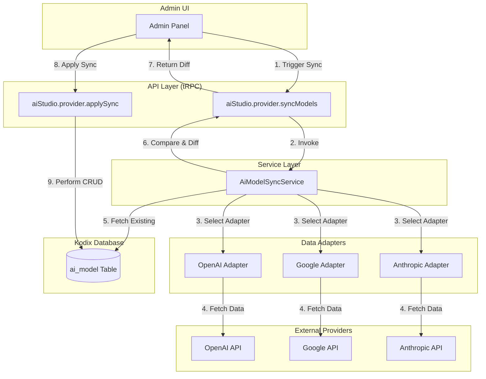

<!-- AI-METADATA:
category: architecture
feature: model-sync
complexity: advanced
created: 2025-07-29
updated: 2025-01-17
-->

# **Architecture: AI Model Sync & Lifecycle**

> **Status**: ✅ Active and Implemented
> **Owner**: AI Team
> **Related**: [AI Studio Architecture](./ai-studio-architecture.md)

## 1. Goal

This document describes the architecture of the **Model Sync** feature, which includes model **lifecycle management**. It establishes the foundational logic for fetching, normalizing, and preparing AI model metadata from primary providers—**OpenAI, Google (Gemini), and Anthropic**. The system intelligently archives models that are no longer active.

## 2. Architecture Overview

The system is designed to automate the process of keeping our internal `ai_model` database table synchronized with the latest model information from external providers. It handles both the addition of new models and the lifecycle management of existing ones (active vs. archived).

The core components are:

- **Provider Adapters**: Provider-specific logic to fetch and normalize model data.
- **Sync Service**: The central service that orchestrates the sync process.
- **tRPC API**: Endpoints for administrators to trigger and apply the synchronization.
- **Database Schema**: The `ai_model` table that stores the model information.

## 3. Database Schema (`ai_model`)

- **File**: `packages/db/src/schema/apps/ai-studio.ts`

The `ai_model` table is central to this architecture. Key fields include:

- **`displayName` (`string`)**: The user-facing name for the model, used for display purposes in the UI. This field is distinct from the technical identifier to allow for clear, editable names.
- **`universalModelId` (`string`)**: The unique, technical identifier used for API calls and internal logic.
- **`status` (`'active'` | `'archived'`)**: Represents the model's official lifecycle state from the provider. This is managed **automatically** by the sync service.
- **`enabled` (`boolean`)**: An **administrator-controlled** flag that determines if the model is usable within the Kodix platform.

A model with `status: "archived"` **cannot** be enabled.

### Database Schema Optimizations

The `universalModelId` column was added as a dedicated, indexed field to optimize performance and ensure data integrity. While this identifier is also present in the `config` JSON blob for external compatibility, its duplication as a top-level column allows for:

- **Efficient Queries**: Direct, indexed lookups without parsing JSON.
- **Reliable Joins**: Stable and performant joins with other tables.
- **Unique Constraint**: Enforces model uniqueness at the database level.

The model sync service is responsible for keeping both the column and the JSON field synchronized.

## 4. `ModelSyncDiff` Data Contract

The `AiModelSyncService` produces a `ModelSyncDiff` object to clearly communicate the difference between the provider's state and our database state. This DTO is sent to the client to allow the administrator to review changes before applying them.

- `newModels: NormalizedModel[]`: Models that exist in the provider's API but not in our database.
- `updatedModels: { existing: NormalizedModel; updated: NormalizedModel }[]`: Models in both places but with different metadata. This includes models changing from `active` to `archived`.
- `archivedModels: NormalizedModel[]`: Models in our database but no longer in the provider's API response (implicit deprecation).

## 5. Service: `AiModelSyncService`

- **File**: `packages/api/src/internal/services/ai-model-sync.service.ts`
- **Method**: `async syncWithProvider(providerId: 'openai' | 'google' | 'anthropic'): Promise<ModelSyncDiff>`
- **Logic**:
  - Acts as a controller, invoking the correct provider-specific adapter.
  - Fetches all existing models for the given provider from our database.
  - Compares the fresh data from the adapter with the existing data.
  - Generates and returns the `ModelSyncDiff` object.
  - Automatically identifies and marks models for archival if they are no longer in the provider's response.

## 6. Adapters: `ai-sync-adapters`

- **Directory**: `packages/api/src/internal/services/ai-sync-adapters/`
- **Strategy**: Each adapter is responsible for a single provider.
  1. Calls the provider's model-listing API (e.g., `GET /v1/models`).
  2. Reads a corresponding, manually-maintained `[provider]-pricing.json` file for supplemental data.
  3. **Checks for explicit deprecation flags** (e.g., OpenAI's `active: false`). If found, it sets the model's `status` to `"archived"`.
  4. Merges the live API data with the manual pricing data into a normalized format.
  5. **Applies strict filtering** to include only relevant text-based LLMs.

## 7. API: tRPC Router

- **File**: `packages/api/src/trpc/routers/app/ai-studio/providers.ts`
- **Procedures**:
  1.  **`aiStudio.provider.syncModels`**
      - **Input**: `z.object({ providerId: z.string() })`
      - **Logic**: A read-only operation that validates the `providerId`, calls the `AiModelSyncService`, and returns the `ModelSyncDiff` to the client for review.
  2.  **`aiStudio.provider.applySync`**
      - **Input**: The `ModelSyncDiff` object (or a derivative of it).
      - **Logic**: A write operation that executes the changes in the database in an efficient, multi-step process:
        - **Bulk Archive**: Updates all `archivedModels` with `status = "archived"`.
        - **Bulk Update**: Iterates through `updatedModels` to apply changes.
        - **Bulk Insert**: Inserts all `newModels`.
      - **Error Handling**: Includes comprehensive error handling and logging for each step.
      - **Timestamp Management**: Ensures `createdAt` and `updatedAt` are correctly managed.
