# AI Studio Frontend Architecture

> **Status**: ✅ Active & Production Ready
> **Last Updated**: January 2025
> **Related Documents**:
>
> - [Component Reference](./components.md)
> - [Backend Architecture](../backend/README.md)

## 1. Overview

The AI Studio frontend provides a **comprehensive management interface** for all AI infrastructure at Kodix. It serves as the **central control panel** where teams configure AI capabilities that power all other sub-apps throughout the platform.

This guide defines the standards and patterns for all frontend development within the AI Studio sub-app, ensuring consistency, maintainability, and optimal user experience.

## 2. Architecture Principles

### User-Centric Design

- **⚡ Fast Setup**: 5-minute quick setup for new teams
- **🎯 Intuitive Workflow**: Clear separation between frequent and administrative tasks
- **📱 Responsive Design**: Consistent experience across all devices
- **🔒 Security First**: No sensitive data exposure in UI

### Development Standards

- **📋 Type Safety**: Full TypeScript coverage with strict validation
- **🎨 Design System**: Consistent UI patterns using shadcn/ui
- **⚡ Performance**: Optimized queries and lazy loading
- **🧪 Testing**: Comprehensive component and integration tests

## 3. Core Implementation Order (Cross-Package)

**CRITICAL**: Any feature spanning multiple packages **MUST** follow this strict order:

1. **`@kdx/shared`** - Define base types and schemas
2. **`@kdx/validators`** - Create/update tRPC Zod validation schemas
3. **`@kdx/db`** - Update database schema and repositories
4. **`@kdx/api`** - Implement API endpoints and business logic
5. **`apps/kdx`** - Build UI components that consume the API

### Why This Order Matters

- **🔒 Type Safety**: Prevents type mismatches and runtime errors
- **⚡ Build Performance**: Avoids dependency graph issues
- **🎯 Developer Experience**: Clear development path with immediate feedback
- **🧪 Testing**: Enables testing at each layer

## 4. UI Architecture & User Flow

### Main Navigation Structure


### User Interface Sections

#### 🎯 Main Section (Daily Operations)

**Purpose**: Frequent-use features for team AI configuration

| Section               | Purpose                          | Key Features                            |
| --------------------- | -------------------------------- | --------------------------------------- |
| **My Instructions**   | Personal AI behavior rules       | ✅ Highest priority in prompt hierarchy |
| **Team Instructions** | Base AI behavior for entire team | ✅ Applies to all team members          |
| **Tokens**            | Secure API key management        | ✅ AES-256-GCM encryption               |
| **Enabled Models**    | Model selection & prioritization | ✅ Fallback order configuration         |
| **Agents**            | Custom AI personalities          | ✅ Task-specific assistants             |
| **Libraries**         | Knowledge base management        | ✅ Context for agents                   |

#### 🔧 General Configuration (Administrative)

**Purpose**: Platform-wide AI management (admin-only)

| Section           | Purpose               | Key Features                    |
| ----------------- | --------------------- | ------------------------------- |
| **Providers**     | AI company management | ✅ Provider registration & sync |
| **System Models** | Global model catalog  | ✅ Model lifecycle management   |

## 5. Quick Setup Workflow (5 Minutes)

### New Team Onboarding Flow

```mermaid
graph LR
    A[New Team] --> B[Add Provider]
    B --> C[Register Token]
    C --> D[Enable Models]
    D --> E[Set Instructions]
    E --> F[✅ AI Ready]

    style A fill:#ffebee,stroke:#c62828
    style F fill:#e8f5e8,stroke:#2e7d32
```



### Step-by-Step Setup

1. **🏢 Add Providers** (`General Configuration` → `Providers`)

   - Register AI companies (OpenAI, Anthropic, Google)
   - Configure base URLs and settings
   - Enable provider synchronization

2. **🔑 Register API Tokens** (`Main` → `Tokens`)

   - Select provider and add API key
   - Automatic encryption and secure storage
   - Test connectivity and validate permissions

3. **🤖 Enable Models** (`Main` → `Enabled Models`)

   - Activate desired AI models for the team
   - Set default model and fallback order
   - Configure model-specific parameters

4. **📋 Define Instructions** (`Main` → `Team Instructions`)
   - Set base AI behavior for all team members
   - Configure application scope (Chat, All Apps)
   - Define response style and constraints

## 6. Advanced Features

### Dynamic Model Synchronization

**Real-time Provider Integration**:

```typescript
// Model sync workflow
const syncWorkflow = {
  // 1. Trigger sync from UI
  onSyncClick: () => trpc.aiStudio.provider.syncModels.mutate({ providerId }),

  // 2. Review changes in dialog
  onReviewChanges: (diff) => {
    // Display new, updated, and archived models
    return <ModelSyncDialog diff={diff} />;
  },

  // 3. Apply changes to database
  onApplySync: (diff) => trpc.aiStudio.provider.applySync.mutate(diff)
};
```

### Intelligent Agent Management

**Context-Aware AI Assistants**:

```typescript
// Agent configuration
const agentConfig = {
  name: "Marketing Expert",
  instructions: "You are a marketing specialist...",
  libraries: ["marketing-guidelines", "brand-voice"],
  models: ["gpt-4", "claude-3-sonnet"],
  priority: "high",
};

// Agent switching detection
const agentSwitchingLogic = {
  detectSwitch: (previousAgent, currentAgent) =>
    previousAgent.id !== currentAgent.id,
  applyStrategy: (modelId, agentData) =>
    buildAgentSwitchPrompt(modelId, agentData),
};
```

### Enterprise Security Features

**Multi-Layer Protection**:

- **🔐 Token Encryption**: All API keys encrypted at rest
- **🛡️ Team Isolation**: Strict data separation between teams
- **📋 Audit Logging**: Complete action traceability
- **🔒 Role-Based Access**: Granular permission controls

## 7. UI Patterns & Best Practices

### Mandatory Visual Feedback

**All asynchronous operations MUST provide clear feedback**:

```typescript
// ✅ Correct: State management pattern
const CreateModelForm = () => {
  const [isDirty, setIsDirty] = useState(false);
  const createModel = useMutation({
    mutationFn: trpc.aiStudio.models.create.mutate,
    onSuccess: () => setIsDirty(false)
  });

  return (
    <Button
      disabled={!isDirty || createModel.isPending}
      onClick={() => createModel.mutate(formData)}
    >
      {createModel.isPending ? <Spinner /> : "Create Model"}
    </Button>
  );
};
```

### Form Validation Patterns

**Consistent validation across all forms**:

```typescript
// Schema-first validation
const modelSchema = z.object({
  name: z.string().min(1, "Name is required"),
  providerId: z.string().min(1, "Provider is required"),
  config: z.string().optional(),
  enabled: z.boolean().default(true),
});

// Form integration
const form = useForm({
  schema: modelSchema,
  defaultValues: { enabled: true },
});
```

### Loading States & Error Handling

**Comprehensive state management**:

```typescript
const ModelsList = () => {
  const { data: models, isLoading, error } = trpc.aiStudio.models.findAll.useQuery();

  if (isLoading) return <ModelsListSkeleton />;
  if (error) return <ErrorMessage error={error} />;

  return <ModelsTable models={models} />;
};
```

## 8. Integration with Backend

### Service Layer Communication

**All UI operations flow through the backend service**:

```typescript
// Frontend component
const ChatInterface = () => {
  const sendMessage = async (content: string) => {
    // Frontend initiates, backend orchestrates
    const response = await fetch("/api/chat/stream", {
      method: "POST",
      body: JSON.stringify({
        content,
        sessionId,
        // Backend handles all AI configuration
      }),
    });

    // Backend uses AiStudioService.streamChatResponse()
    return response.body; // Streaming response
  };
};
```

### Configuration Management

**Generic configuration patterns**:

```typescript
// ✅ Correct: Use generic endpoints
const useAiStudioConfig = (teamId: string) => {
  return trpc.app.getUserAppTeamConfig.useQuery({
    appId: "ai-studio",
    teamId,
  });
};

// ❌ Wrong: Creating specific endpoints
const useSpecificConfig = () => {
  return trpc.aiStudio.getSpecificConfig.useQuery();
};
```

## 9. Performance Optimization

### Query Optimization

**Smart data fetching patterns**:

```typescript
// Prefetch related data
const useModelsWithProviders = (teamId: string) => {
  const utils = trpc.useUtils();

  // Prefetch providers when models are loaded
  const models = trpc.aiStudio.models.findByTeam.useQuery(
    { teamId },
    {
      onSuccess: () => {
        utils.aiStudio.providers.findAll.prefetch();
      },
    },
  );

  return models;
};
```

### Component Optimization

**Efficient rendering patterns**:

```typescript
// Memoized components for large lists
const ModelListItem = memo(({ model }: { model: Model }) => {
  return (
    <Card>
      <CardHeader>
        <CardTitle>{model.displayName}</CardTitle>
        <ModelStatusBadge status={model.status} />
      </CardHeader>
    </Card>
  );
});
```

## 10. Testing Strategy

### Component Testing

**Comprehensive test coverage**:

```typescript
describe('ModelSyncDialog', () => {
  it('should display sync diff correctly', () => {
    const mockDiff = {
      newModels: [{ id: '1', name: 'GPT-4' }],
      updatedModels: [],
      archivedModels: []
    };

    render(<ModelSyncDialog diff={mockDiff} />);

    expect(screen.getByText('1 New Model')).toBeInTheDocument();
    expect(screen.getByText('GPT-4')).toBeInTheDocument();
  });
});
```

### Integration Testing

**End-to-end workflow validation**:

```typescript
describe("AI Studio Setup Flow", () => {
  it("should complete full setup workflow", async () => {
    // 1. Add provider
    await setupProvider("OpenAI");

    // 2. Add token
    await addProviderToken("openai-key");

    // 3. Enable models
    await enableModels(["gpt-4", "gpt-3.5-turbo"]);

    // 4. Verify chat integration
    await verifyModelsAvailableInChat();
  });
});
```

## 11. Debugging & Troubleshooting

### Common Issues & Solutions

#### Type Errors Across Packages

**Problem**: Persistent type errors after schema changes

**Solution**:

```bash
# 1. Check modified package first
pnpm typecheck --filter=@kdx/shared

# 2. Check consumer packages
pnpm typecheck --filter=@kdx/validators
pnpm typecheck --filter=@kdx/db
pnpm typecheck --filter=@kdx/api

# 3. If errors persist, clean and rebuild
pnpm turbo clean
pnpm turbo build
```

#### UI State Inconsistencies

**Problem**: UI not reflecting backend changes

**Solution**:

```typescript
// Invalidate queries after mutations
const updateModel = useMutation({
  mutationFn: trpc.aiStudio.models.update.mutate,
  onSuccess: () => {
    // Invalidate affected queries
    utils.aiStudio.models.invalidate();
    utils.aiStudio.teamModels.invalidate();
  },
});
```

## 12. Development Workflow

### Feature Development Checklist

- [ ] **📋 Schema Definition** - Define types in `@kdx/shared`
- [ ] **🔍 Validation** - Create Zod schemas in `@kdx/validators`
- [ ] **💾 Database** - Update schema and repositories
- [ ] **🔌 API** - Implement tRPC endpoints
- [ ] **🎨 UI Components** - Build frontend interface
- [ ] **🧪 Testing** - Unit and integration tests
- [ ] **📚 Documentation** - Update relevant docs

### Code Review Standards

- **📋 Type Safety**: All props and functions properly typed
- **🎯 Error Handling**: Comprehensive error boundaries
- **⚡ Performance**: Optimized queries and rendering
- **🔒 Security**: No sensitive data in frontend
- **🧪 Test Coverage**: Minimum 80% coverage for new features

## 13. Chat Integration

### Real-time AI Configuration

**The AI Studio directly powers the Chat sub-app**:


### Instruction Hierarchy in Chat

**System prompt assembly follows strict priority order**:

1. **🎯 Agent Instructions** (if agent selected) - Highest priority
2. **👤 Personal Instructions** - User-specific behavior
3. **🏢 Team Instructions** - Team-wide behavior
4. **🏛️ Platform Instructions** - Base system behavior

### Cache Management

**5-minute cache system for optimal performance**:

```typescript
// Configuration changes have 5-minute propagation delay
const CACHE_DURATION = 5 * 60 * 1000; // 5 minutes

// For immediate effect, users should start new chat sessions
const useConfigWithCache = (teamId: string) => {
  return trpc.aiStudio.config.get.useQuery(
    { teamId },
    {
      staleTime: CACHE_DURATION,
      cacheTime: CACHE_DURATION,
    },
  );
};
```

## 14. Monitoring & Analytics

### User Experience Metrics

- **⏱️ Setup Time**: Time to complete initial configuration
- **🎯 Success Rate**: Percentage of successful configurations
- **🔄 Sync Frequency**: How often teams sync models
- **📊 Feature Usage**: Most used AI Studio features

### Performance Metrics

- **📈 Query Response Time**: API call latency
- **💾 Cache Hit Rate**: Configuration cache effectiveness
- **🔄 Sync Duration**: Model synchronization performance
- **📱 UI Responsiveness**: Frontend interaction speed

---

## Summary

The AI Studio frontend represents a **mature, user-friendly interface** that successfully abstracts the complexity of AI infrastructure management while providing powerful configuration capabilities. The architecture ensures teams can quickly set up and manage AI capabilities that seamlessly integrate with all other Kodix sub-apps.

**Key Achievements:**

- 🎯 **Intuitive Design**: 5-minute setup for new teams
- 🔒 **Enterprise Security**: Complete UI security with no token exposure
- ⚡ **Performance**: Optimized queries and smart caching
- 🔧 **Developer Experience**: Clear patterns and comprehensive testing
- 📊 **Integration**: Seamless chat integration with real-time updates
