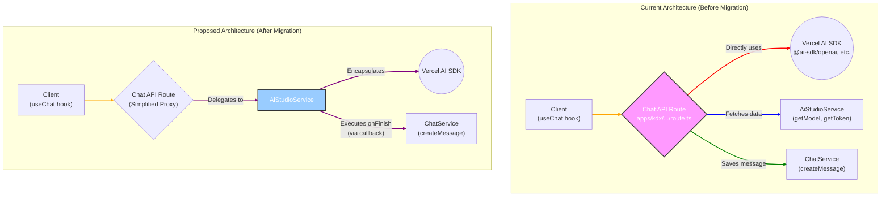

# AI Engine Migration: Visual Architecture

This document provides a visual representation of the architectural changes proposed in the [AI Engine Migration Execution Plan](ai-engine-migration-execution-plan.md).

## Key Changes Explained

### Before Migration

1.  **Thick API Route**: The **Chat API Route** is responsible for everything. It directly interacts with the Vercel AI SDK, fetches configuration from `AiStudioService`, and saves messages using `ChatService`.
2.  **Decentralized Logic**: All the complex streaming logic, provider-specific handling, and metadata creation is duplicated within the API route.
3.  **`AiStudioService` as Data Provider**: The service's role is passive; it only provides data and has no knowledge of the streaming process.

### After Migration

1.  **Thin API Route (Proxy)**: The **Chat API Route** becomes a simple proxy. Its only job is to authenticate the request, gather necessary data, and delegate the entire streaming operation to `AiStudioService`.
2.  **Centralized AI Engine**: The **`AiStudioService`** becomes the central AI engine. It encapsulates all interactions with the Vercel AI SDK, including model creation, streaming, and `onFinish` callbacks.
3.  **Decoupled & Reusable**: The streaming logic is now decoupled from the API route and can be reused by any other part of the application (e.g., another SubApp, a background job) just by calling the `streamChatResponse` method.
