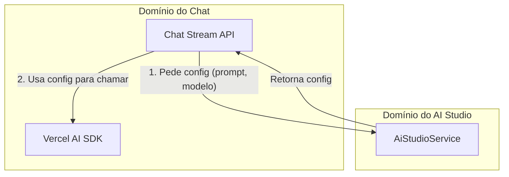
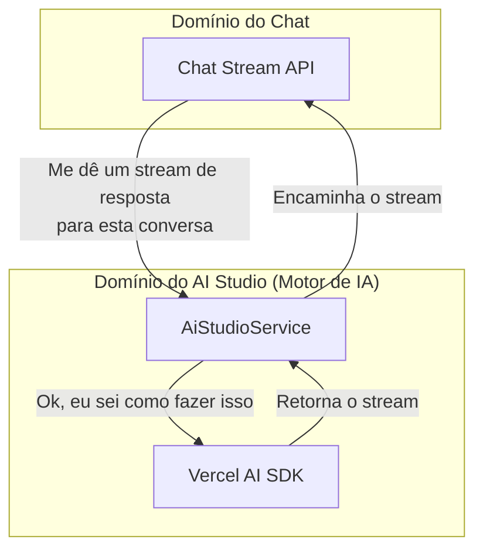

# Plano de Migração: AI Studio como Motor de Execução de IA

**Data:** 2025-06-28  
**Autor:** KodixAgent  
**Status:** 🟡 Proposta
**Escopo:** AI Studio & Chat SubApps - Backend
**Tipo:** Refatoração Arquitetural
**Documento Pai:** `docs/subapps/ai-studio/ai-studio-architecture.md`

---

## 1. Resumo Executivo

Este plano descreve a evolução arquitetural para posicionar o **AI Studio como o motor central de execução de IA** para toda a plataforma Kodix. Atualmente, o `Chat Stream API` é responsável por chamar o Vercel AI SDK. A proposta é mover essa responsabilidade para o `AiStudioService`.

Com esta mudança, o Chat (e qualquer outro SubApp) se tornará completamente agnóstico à implementação da IA. Ele apenas solicitará um stream de resposta, e o `AiStudioService` cuidará de toda a interação com o SDK, desde a construção do provedor até o streaming da resposta e os callbacks de conclusão.

### Objetivos

- ✅ Centralizar 100% da lógica de interação com o Vercel AI SDK dentro do `AiStudioService`.
- ✅ Refatorar o `Chat Stream API` para atuar como um proxy leve, delegando a execução ao `AiStudioService`.
- ✅ Abstrair completamente a tecnologia de IA dos SubApps consumidores.
- ✅ Aumentar a manutenibilidade, a flexibilidade e a consistência do sistema de IA.

---

## 2. Análise Arquitetural: Antes e Depois

### Arquitetura Atual

O Chat conhece e interage diretamente com o Vercel AI SDK.



### Arquitetura Proposta

O Chat apenas pede um stream de resposta. O AI Studio gerencia toda a interação com o Vercel AI SDK.



---

## 3. Plano de Implementação Detalhado

### Passo 1: Expandir o `AiStudioService`

O `AiStudioService` ganhará um novo método que encapsula a lógica do Vercel AI SDK.

**Exemplo de Implementação (`packages/api/src/internal/services/ai-studio.service.ts`):**

```typescript
// ... imports
import type { CoreMessage } from "ai";
import { createAnthropic } from "@ai-sdk/anthropic";
import { createOpenAI } from "@ai-sdk/openai";
import { streamText } from "ai";

import { ChatService } from "./chat.service"; // Para o callback onFinish

export class AiStudioService extends BaseService {
  // ... métodos existentes como getModelById, getProviderToken...

  /**
   * Orquestra e executa o streaming de uma resposta de IA.
   * Este método é o novo "motor de IA" da plataforma.
   */
  static async streamChatResponse(context: {
    teamId: string;
    userId: string;
    chatSessionId: string;
    messages: CoreMessage[];
    requestingApp: KodixAppId;
  }) {
    const { teamId, userId, chatSessionId, messages, requestingApp } = context;

    this.validateTeamAccess(teamId);
    this.logAccess("streamChatResponse", { teamId, requestingApp, userId });

    // 1. Obter informações do modelo e token (lógica existente)
    const session = await ChatService.findSessionById(chatSessionId); // Assume-se validação de acesso
    const modelInfo = await this.getModelById({
      modelId: session.aiModelId,
      teamId,
      requestingApp,
    });
    const token = await this.getProviderToken({
      providerId: modelInfo.providerId,
      teamId,
      requestingApp,
    });

    // 2. Criar o provedor de modelo nativo do Vercel AI SDK
    const vercelProvider = this.createVercelProvider(modelInfo, token);

    // 3. Executar o streaming com callbacks
    const result = streamText({
      model: vercelProvider,
      messages: messages,
      // Passar outros parâmetros como temperature, maxTokens, etc.

      onFinish: async ({ text, usage, finishReason }) => {
        // A lógica de salvar a mensagem da IA agora vive aqui
        await ChatService.createMessage({
          chatSessionId: chatSessionId,
          senderRole: "ai",
          content: text,
          status: "ok",
          metadata: {
            usage,
            finishReason,
            actualModelUsed: modelInfo.name,
            timestamp: new Date().toISOString(),
          },
        });
      },
      onError: (error) => {
        console.error("🔴 [AI_STUDIO_SERVICE_STREAM] Erro no stream:", error);
        // Adicionar lógica de notificação ou logging de erro robusto aqui
      },
    });

    // 4. Retornar o stream para ser encaminhado pela API
    return result.toDataStreamResponse();
  }

  private static createVercelProvider(modelInfo, token) {
    switch (modelInfo.provider.name.toLowerCase()) {
      case "openai":
        return createOpenAI({ apiKey: token });
      case "anthropic":
        return createAnthropic({ apiKey: token });
      // Adicionar outros provedores aqui
      default:
        throw new TRPCError({
          code: "BAD_REQUEST",
          message: `Provedor ${modelInfo.provider.name} não suportado.`,
        });
    }
  }
}
```

### Passo 2: Simplificar o `Chat Stream API`

O endpoint do Chat será refatorado para ser um simples proxy.

**Exemplo de Refatoração (`apps/kdx/src/app/api/chat/stream/route.ts`):**

```typescript
// ❌ Remover imports diretos do Vercel AI SDK: createAnthropic, createOpenAI, streamText
import { type NextRequest } from "next/server";
import { type CoreMessage } from "ai";

import { AiStudioService } from "@kdx/api/internal/services/ai-studio.service";
import { ChatService } from "@kdx/api/internal/services/chat.service";
import { auth } from "@kdx/auth";
import { chatAppId } from "@kdx/shared";

export async function POST(request: NextRequest) {
  const { messages, chatSessionId } = (await request.json()) as {
    messages: CoreMessage[];
    chatSessionId: string;
  };

  const session = await auth();
  if (!session?.user) return new Response("Unauthorized", { status: 401 });

  const { id: userId, activeTeamId: teamId } = session.user;

  // 1. Salvar a mensagem do usuário (esta responsabilidade pode permanecer aqui)
  const lastMessage = messages[messages.length - 1];
  if (lastMessage?.role === "user") {
    await ChatService.createMessage({
      chatSessionId: chatSessionId,
      senderRole: "user",
      content: lastMessage.content,
      status: "ok",
    });
  }

  // 2. Obter o `systemPrompt` através do AiStudioService (conforme plano anterior)
  const systemPrompt = await AiStudioService.getSystemPromptForChat({
    userId,
    teamId,
    requestingApp: chatAppId,
  });

  const finalMessages = [
    { role: "system", content: systemPrompt },
    ...messages,
  ];

  // 3. DELEGAR a execução do stream para o AiStudioService
  return AiStudioService.streamChatResponse({
    teamId,
    userId,
    chatSessionId,
    messages: finalMessages,
    requestingApp: chatAppId,
  });
}
```

---

## 4. Checklist de Implementação

### Backend (2-3 dias)

- [ ] **`AiStudioService`**:

  - [ ] Criar o novo método `streamChatResponse`.
  - [ ] Implementar a lógica de criação de provedor (`createVercelProvider`).
  - [ ] Mover a chamada `streamText` e seus callbacks para dentro do novo método.
  - [ ] Garantir que o método retorna um `ReadableStream` através de `toDataStreamResponse()`.
  - [ ] Adicionar testes unitários para o novo método, mockando os serviços dependentes.

- [ ] **`Chat Stream API` (`/api/chat/stream/route.ts`)**:
  - [ ] Remover todas as importações e lógica direta do Vercel AI SDK.
  - [ ] Refatorar o handler `POST` para chamar `AiStudioService.streamChatResponse`.
  - [ ] Garantir que o `systemPrompt` é obtido e adicionado às mensagens.
  - [ ] Assegurar que o stream retornado pelo serviço seja corretamente encaminhado como resposta da API.

### Documentação (4 horas)

- [ ] Atualizar `docs/subapps/chat/chat-architecture.md` para refletir o novo fluxo simplificado.
- [ ] Atualizar `docs/subapps/ai-studio/ai-studio-architecture.md` para documentar a nova e importante responsabilidade do `AiStudioService`.
- [ ] Marcar este plano como concluído.

### Teste E2E (1 dia)

- [ ] Testar o fluxo de chat completo para múltiplos provedores (OpenAI, Anthropic).
- [ ] Verificar se as mensagens do usuário e da IA são salvas corretamente no banco de dados (`onFinish` callback).
- [ ] Inspecionar os logs para confirmar que os erros de stream são capturados e registrados pelo `AiStudioService`.
- [ ] Validar que as instruções da plataforma, time e usuário ainda são corretamente aplicadas ao `systemPrompt`.

---

## 5. Benefícios Esperados

- **Abstração Total:** O Chat e outros SubApps não precisam saber qual tecnologia de IA está sendo usada.
- **Ponto Único de Manutenção:** Atualizações do Vercel AI SDK ou de provedores são feitas em um único lugar.
- **Flexibilidade Futura:** Torna trivial adicionar novos "motores de IA" (como LangChain) ou trocar os existentes.
- **Consistência Garantida:** Tratamento de erros, callbacks e formatação de respostas são padronizados para toda a plataforma.
