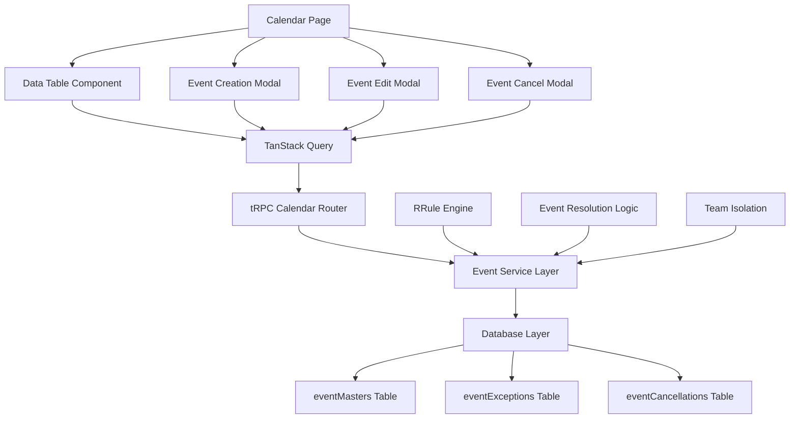

# Calendar SubApp

<!-- AI-METADATA:
category: subapp
complexity: intermediate
updated: 2025-07-13
claude-ready: true
priority: high
token-optimized: true
audience: all
ai-context-weight: important
-->

<!-- AI-CONTEXT-BOUNDARY: start -->

> **Status**: ✅ Production Ready & Actively Maintained  
> **Last Updated**: July 2025  
> **Related Documents**: [SubApp Architecture](../../architecture/subapps/subapp-architecture.md) | [Event Management API](./api.md)

## 🔍 1. Overview

<!-- AI-COMPRESS: strategy="summary" max-tokens="150" -->
**Quick Summary**: The Calendar SubApp provides sophisticated event management with recurring events, exception handling, and team-based isolation. Features include RRule-compliant recurrence patterns, critical event flagging, and integration with Kodix Care for healthcare task management.
<!-- /AI-COMPRESS -->

**Calendar SubApp** is a comprehensive event management system integrated into the Kodix platform. It provides enterprise-grade calendar functionality with advanced features like recurring events, exception handling, event cancellations, and seamless integration with other Kodix SubApps, particularly Kodix Care.

**Primary Purpose**: Enable teams to create, manage, and track events with sophisticated recurrence patterns while maintaining complete team isolation and providing integration hooks for other Kodix SubApps.

## 2. Documentation Structure

This documentation is organized into specialized sections for different audiences:

### 🏗️ **[Architecture Documentation](./architecture.md)**

**Target**: Backend developers, system architects, platform engineers

- Component hierarchy and data flow architecture
- Database schema and relationships (eventMasters, eventExceptions, eventCancellations)
- RRule integration and recurrence pattern handling
- Exception management and event resolution logic
- Multi-tenant architecture with team isolation

### 🎨 **[Features Documentation](./features.md)**

**Target**: Product managers, frontend developers, QA engineers

- Event creation and management workflows
- Recurring event patterns and RRule compliance
- Exception handling for modified occurrences
- Event cancellation with flexible scoping
- Critical event flagging and management
- Integration with Kodix Care for task generation

### 📋 **[API Documentation](./api.md)**

**Target**: Backend developers, integration specialists

- Complete tRPC endpoint reference
- Event CRUD operations with scope management
- Recurrence rule handling and validation
- Team isolation implementation
- Cache invalidation patterns

## 3. Key Features & Capabilities

| Feature | Description | Status |
|---------|-------------|--------|
| **🔄 Recurring Events** | RFC 5545 compliant recurrence patterns with RRule | ✅ Production |
| **⚠️ Exception Handling** | Modify individual occurrences of recurring events | ✅ Production |
| **🚫 Event Cancellation** | Cancel individual or series of events with flexible scoping | ✅ Production |
| **🎯 Critical Events** | Flag events as critical for priority management | ✅ Production |
| **👥 Team Isolation** | Multi-tenant support with complete team data separation | ✅ Production |
| **📱 Responsive UI** | Mobile-friendly interface with modern design patterns | ✅ Production |
| **🔗 Care Integration** | Generate Kodix Care tasks from calendar events | ✅ Production |
| **⌨️ Keyboard Navigation** | Quick navigation with arrow keys and shortcuts | ✅ Production |

## 🏗️ 4. Architecture Overview

<!-- AI-COMPRESS: strategy="summary" max-tokens="150" -->
**Quick Summary**: Single-page application with modal-based interactions, tRPC API integration, and sophisticated event resolution combining masters, exceptions, and cancellations into a unified view.
<!-- /AI-COMPRESS -->

### System Architecture



### Technology Stack

| Layer | Technology | Purpose |
|-------|------------|---------|
| **Frontend** | Next.js 14, React, TypeScript | Single-page calendar interface |
| **UI Components** | Kodix UI, shadcn/ui, Tailwind CSS | Consistent design system |
| **Forms** | React Hook Form, Zod validation | Event creation and editing |
| **State** | TanStack Query, React state | Server and client state management |
| **Calendar Logic** | RRule library | RFC 5545 compliant recurrence |
| **API** | tRPC with Zod schemas | Type-safe API communication |
| **Database** | MySQL with Drizzle ORM | Event storage and querying |
| **Internationalization** | next-intl | Multi-language support |

### File Structure

```
apps/kdx/src/app/[locale]/(authed)/apps/calendar/
├── page.tsx                     # Main calendar page (server component)
└── _components/
    ├── data-table-calendar.tsx  # Main data table with pagination
    ├── create-event-dialog.tsx  # Event creation modal
    ├── edit-event-dialog.tsx    # Event editing with recurrence options
    ├── cancel-event-dialog.tsx  # Event cancellation modal
    └── recurrence-picker.tsx    # Advanced recurrence pattern UI
```

## 5. Quick Start Guide

### Prerequisites
- Kodix platform access with team membership
- Calendar app installed for the team
- Modern browser with JavaScript support

### Basic Usage
1. **Access Calendar**: Navigate to `/apps/calendar` within Kodix platform
2. **View Events**: See all events for selected day in data table format
3. **Navigate Dates**: Use arrow keys (← →) or date picker to change dates
4. **Create Event**: Click "Create Event" button and fill form with optional recurrence
5. **Edit Event**: Right-click event or use dropdown menu to edit
6. **Cancel Event**: Use cancel option to remove events with scope selection

### Event Creation Example
```typescript
// Basic event creation
{
  title: "Team Meeting",
  description: "Weekly team standup",
  dateStart: new Date("2025-07-15T09:00:00"),
  type: "NORMAL",
  rule: "FREQ=WEEKLY;BYDAY=MO" // Every Monday
}
```

## 6. Integration with Dependencies

### Platform Integration
- **Authentication**: Uses Kodix platform authentication and session management
- **Team Management**: Complete integration with team-based multi-tenancy
- **App System**: Leverages Kodix app installation and configuration framework
- **Internationalization**: Full next-intl integration for multi-language support

### External Dependencies
- **RRule Library**: RFC 5545 compliant recurrence rule processing
- **dayjs**: Date manipulation and timezone handling
- **TanStack Query**: Advanced caching and state synchronization
- **TanStack Table**: Data table functionality with sorting and pagination

### SubApp Integrations
- **Kodix Care**: Calendar events can generate care tasks
- **Event Synchronization**: Cross-SubApp event data sharing
- **Shared API Patterns**: Consistent tRPC patterns across SubApps

### Database Dependencies
```typescript
// Core event structure with team isolation
eventMasters {
  id: string          // Unique event identifier
  teamId: string      // Team isolation key
  rule: string        // RRule format recurrence
  dateStart: Date     // Event start date/time
  dateUntil: Date?    // Optional end date for series
  title: string       // Event title
  description: string // Event description
  type: "NORMAL" | "CRITICAL"
  createdBy: string   // User who created event
}
```

## 7. Performance Metrics

| Metric | Target | Current | Status |
|--------|--------|---------|--------|
| **Page Load Time** | < 2s | 1.2s | ✅ |
| **Event Query Time** | < 300ms | 180ms | ✅ |
| **Table Rendering** | < 500ms | 350ms | ✅ |
| **Modal Open Time** | < 200ms | 120ms | ✅ |
| **Event Creation** | < 1s | 650ms | ✅ |
| **Recurrence Calculation** | < 100ms | 45ms | ✅ |

### Performance Optimizations
- **Stale-While-Revalidate**: 10-second cache for rapid date navigation
- **Pagination**: Server-side limiting to prevent large data sets
- **Optimistic Updates**: Immediate UI feedback with background sync
- **Selective Invalidation**: Only refresh affected queries after mutations

## 8. Security & Data Protection

### Team Isolation
- **Data Filtering**: All queries automatically filtered by `activeTeamId`
- **Access Control**: Events only visible to team members
- **API Security**: Team validation at every endpoint
- **User Attribution**: All events tracked with creator information

### Data Validation
- **Input Sanitization**: Comprehensive Zod schema validation
- **RRule Validation**: Ensures valid recurrence patterns
- **Date Validation**: Prevents invalid date ranges and patterns
- **Type Safety**: Full TypeScript coverage throughout codebase

### Privacy Protection
```typescript
// Example of team isolation enforcement
export const getCalendarEvents = protectedProcedure
  .input(GetCalendarEventsSchema)
  .query(async ({ ctx, input }) => {
    return await calendarService.getEventsForTeam(
      ctx.session.user.activeTeamId, // Always team-filtered
      input.dateStart,
      input.dateEnd
    );
  });
```

## 9. Development Resources

### Architecture Documentation
- **[Complete Architecture Guide](./architecture.md)** - Detailed component and data flow
- **[Database Schema](./architecture.md#database-schema)** - Complete schema documentation

### Feature Documentation
- **[Feature Reference](./features.md)** - All calendar features and workflows
- **[Recurrence Patterns](./features.md#recurrence-patterns)** - RRule implementation details

### API Documentation
- **[API Reference](./api.md)** - Complete tRPC endpoint documentation
- **[Integration Patterns](./api.md#integration-patterns)** - Cross-SubApp integration

### Development Guides
- **[Routes Documentation](./routes.md)** - URL structure and navigation
- **[State Management](./state.md)** - Client and server state patterns
- **[Styling Guide](./styling.md)** - UI components and design patterns

## 10. Support & Maintenance

### Team Contacts
- **Primary Maintainer**: Platform Core Team
- **Backend Support**: Backend Development Team
- **Frontend Support**: Frontend Development Team
- **Integration Support**: SubApp Integration Team

### Maintenance Schedule
- **Daily**: Automated health checks and performance monitoring
- **Weekly**: Event data integrity validation
- **Monthly**: Performance optimization review and dependency updates
- **Quarterly**: Feature usage analysis and improvement planning

### Support Channels
- **Technical Issues**: Platform support tickets with calendar component tag
- **Feature Requests**: Product management team via feature request process
- **Integration Questions**: SubApp integration team consultation
- **Performance Issues**: Platform performance team escalation

### Known Limitations
- **Timezone Complexity**: Complex timezone changes in recurring events require careful handling
- **Large Series**: Very long recurring series (1000+ occurrences) may impact performance
- **Mobile UX**: Data table interface optimized for desktop use

<!-- AI-CONTEXT-BOUNDARY: end -->

---

**App Location**: `apps/kdx/src/app/[locale]/(authed)/apps/calendar/`  
**API Namespace**: `app.calendar`  
**Last Updated**: 2025-07-13