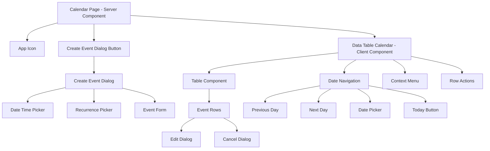
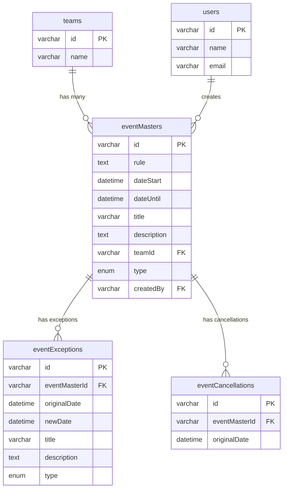

# Calendar SubApp - Architecture Documentation

<!-- AI-METADATA:
category: architecture
complexity: advanced
updated: 2025-07-13
claude-ready: true
priority: high
token-optimized: true
audience: developers
ai-context-weight: important
-->

<!-- AI-CONTEXT-BOUNDARY: start -->

> **Status**: ✅ Production Ready & Actively Maintained  
> **Last Updated**: July 2025  
> **Related Documents**: [Features](./features.md) | [API Reference](./api.md)

## 🔍 1. Overview

<!-- AI-COMPRESS: strategy="summary" max-tokens="150" -->
**Quick Summary**: Calendar SubApp architecture implements sophisticated event management with RRule-compliant recurrence, exception handling, and team isolation. Features single-page modal-based UI with composite event resolution and optimistic updates.
<!-- /AI-COMPRESS -->

The Calendar SubApp architecture is designed around **enterprise-grade event management** with sophisticated features:

- **RRule Integration**: RFC 5545 compliant recurrence patterns
- **Exception Handling**: Individual occurrence modifications without breaking series
- **Composite Resolution**: Merge masters, exceptions, and cancellations into unified view
- **Team Isolation**: Multi-tenant architecture with complete data separation
- **Optimistic Updates**: Immediate UI feedback with background synchronization

## 🏗️ 2. Component Hierarchy

### Application Structure



### Component Breakdown

#### Calendar Page (Server Component)
**Location**: `apps/kdx/src/app/[locale]/(authed)/apps/calendar/page.tsx`

```typescript
export default async function CalendarPage() {
  return (
    <div className="flex h-full flex-col gap-4">
      <div className="flex items-center gap-2">
        <IconKodixApp size="sm" />
        <CreateEventDialogButton />
      </div>
      <DataTableCalendar />
    </div>
  );
}
```

**Responsibilities**:
- Server-side rendering of static layout
- App icon display
- Event creation entry point
- Data table container

#### DataTableCalendar (Client Component)
**Location**: `apps/kdx/src/app/[locale]/(authed)/apps/calendar/_components/data-table-calendar.tsx`

**Key Features**:
- Date navigation with keyboard shortcuts
- Event data fetching and caching
- TanStack Table integration
- Context menu and dropdown actions
- Modal management for edit/cancel operations

**State Management**:
```typescript
interface CalendarState {
  selectedDate: Date;           // Current viewing date
  events: CompositeEvent[];     // Resolved events for current date
  isLoading: boolean;           // Data fetch status
  editingEvent: Event | null;   // Currently editing event
  cancelingEvent: Event | null; // Currently canceling event
}
```

#### Event Dialog Components

**Create Event Dialog**:
- Form with title, description, date/time, and type
- Recurrence pattern picker
- Zod validation with React Hook Form
- Optimistic creation with TanStack Query

**Edit Event Dialog**:
- Pre-populated form with event data
- Scope selection (Single, This and Future, All)
- Exception creation for recurring events
- Series modification handling

**Cancel Event Dialog**:
- Scope selection for cancellation
- Cancellation reason (optional)
- Multiple cancellation strategies

## 🗄️ 3. Database Schema

### Core Tables

#### eventMasters Table
**Purpose**: Store recurring event definitions and single events

```sql
CREATE TABLE eventMasters (
  id VARCHAR(21) PRIMARY KEY,        -- nanoid
  rule TEXT,                         -- RRule format (nullable for single events)
  dateStart DATETIME NOT NULL,       -- Event start date/time
  dateUntil DATETIME,                -- End date for recurring series
  title VARCHAR(255),                -- Event title
  description TEXT,                  -- Event description
  teamId VARCHAR(36) NOT NULL,       -- Team isolation
  type ENUM('NORMAL', 'CRITICAL') DEFAULT 'NORMAL',
  createdBy VARCHAR(36) NOT NULL,    -- User who created event
  createdAt DATETIME DEFAULT CURRENT_TIMESTAMP,
  updatedAt DATETIME DEFAULT CURRENT_TIMESTAMP ON UPDATE CURRENT_TIMESTAMP,
  
  INDEX idx_team_date (teamId, dateStart),
  INDEX idx_team_until (teamId, dateUntil),
  FOREIGN KEY (teamId) REFERENCES teams(id) ON DELETE CASCADE,
  FOREIGN KEY (createdBy) REFERENCES users(id)
);
```

#### eventExceptions Table
**Purpose**: Store modified occurrences of recurring events

```sql
CREATE TABLE eventExceptions (
  id VARCHAR(21) PRIMARY KEY,        -- nanoid
  eventMasterId VARCHAR(21) NOT NULL, -- Reference to master event
  originalDate DATETIME NOT NULL,    -- Original occurrence date
  newDate DATETIME NOT NULL,         -- Modified occurrence date
  title VARCHAR(255),                -- Modified title (if changed)
  description TEXT,                  -- Modified description (if changed)
  type ENUM('NORMAL', 'CRITICAL'),   -- Modified type (if changed)
  createdAt DATETIME DEFAULT CURRENT_TIMESTAMP,
  updatedAt DATETIME DEFAULT CURRENT_TIMESTAMP ON UPDATE CURRENT_TIMESTAMP,
  
  UNIQUE KEY unique_exception (eventMasterId, originalDate),
  INDEX idx_master_original (eventMasterId, originalDate),
  INDEX idx_new_date (newDate),
  FOREIGN KEY (eventMasterId) REFERENCES eventMasters(id) ON DELETE CASCADE
);
```

#### eventCancellations Table
**Purpose**: Track cancelled occurrences of recurring events

```sql
CREATE TABLE eventCancellations (
  id VARCHAR(21) PRIMARY KEY,        -- nanoid
  eventMasterId VARCHAR(21) NOT NULL, -- Reference to master event
  originalDate DATETIME NOT NULL,    -- Cancelled occurrence date
  createdAt DATETIME DEFAULT CURRENT_TIMESTAMP,
  
  UNIQUE KEY unique_cancellation (eventMasterId, originalDate),
  INDEX idx_master_date (eventMasterId, originalDate),
  FOREIGN KEY (eventMasterId) REFERENCES eventMasters(id) ON DELETE CASCADE
);
```

### Data Model Relationships



## 🔄 4. Event Resolution Logic

### Composite Event System

The calendar implements a sophisticated **composite event resolution** system that combines:

1. **Event Masters**: Base recurring patterns or single events
2. **Event Exceptions**: Modified individual occurrences
3. **Event Cancellations**: Deleted individual occurrences

### Resolution Algorithm

```typescript
async function resolveEventsForDateRange(
  teamId: string,
  dateStart: Date,
  dateEnd: Date
): Promise<CompositeEvent[]> {
  // 1. Fetch all relevant event masters
  const masters = await getEventMastersInRange(teamId, dateStart, dateEnd);
  
  // 2. Generate all occurrences from RRule patterns
  const allOccurrences = masters.flatMap(master => 
    generateOccurrencesFromRule(master, dateStart, dateEnd)
  );
  
  // 3. Fetch exceptions for these masters
  const exceptions = await getEventExceptions(
    masters.map(m => m.id),
    dateStart,
    dateEnd
  );
  
  // 4. Fetch cancellations for these masters
  const cancellations = await getEventCancellations(
    masters.map(m => m.id),
    dateStart,
    dateEnd
  );
  
  // 5. Apply exceptions and cancellations
  const resolvedEvents = allOccurrences
    .filter(occurrence => !isCancelled(occurrence, cancellations))
    .map(occurrence => applyException(occurrence, exceptions));
  
  return resolvedEvents.sort((a, b) => a.dateStart.getTime() - b.dateStart.getTime());
}
```

### RRule Integration

**RRule Generation**:
```typescript
function generateRRule(pattern: RecurrencePattern): string {
  const parts = [`FREQ=${pattern.frequency}`];
  
  if (pattern.interval > 1) {
    parts.push(`INTERVAL=${pattern.interval}`);
  }
  
  if (pattern.byweekday?.length) {
    parts.push(`BYDAY=${pattern.byweekday.join(',')}`);
  }
  
  if (pattern.until) {
    parts.push(`UNTIL=${formatDateForRRule(pattern.until)}`);
  } else if (pattern.count) {
    parts.push(`COUNT=${pattern.count}`);
  }
  
  return parts.join(';');
}
```

**Occurrence Generation**:
```typescript
function generateOccurrencesFromRule(
  master: EventMaster,
  start: Date,
  end: Date
): CalendarEvent[] {
  if (!master.rule) {
    // Single event
    return isDateInRange(master.dateStart, start, end) 
      ? [{ ...master, dateStart: master.dateStart }] 
      : [];
  }
  
  // Recurring event
  const rule = new RRule(RRule.fromString(master.rule), {
    dtstart: master.dateStart
  });
  
  return rule.between(start, end, true).map(date => ({
    ...master,
    dateStart: date,
    isRecurrence: true,
    originalDate: date
  }));
}
```

## 🔧 5. API Architecture

### tRPC Router Structure

```typescript
export const calendarRouter = createTRPCRouter({
  // Query endpoints
  getAll: protectedProcedure
    .input(GetCalendarEventsSchema)
    .query(async ({ ctx, input }) => {
      return await calendarService.getEventsForTeam(
        ctx.session.user.activeTeamId,
        input.dateStart,
        input.dateEnd
      );
    }),

  // Mutation endpoints
  create: protectedProcedure
    .input(CreateCalendarEventSchema)
    .mutation(async ({ ctx, input }) => {
      return await calendarService.createEvent({
        ...input,
        teamId: ctx.session.user.activeTeamId,
        createdBy: ctx.session.user.id
      });
    }),

  edit: protectedProcedure
    .input(EditCalendarEventSchema)
    .mutation(async ({ ctx, input }) => {
      return await calendarService.editEvent(
        input.id,
        input.updates,
        input.scope,
        ctx.session.user.activeTeamId
      );
    }),

  cancel: protectedProcedure
    .input(CancelCalendarEventSchema)
    .mutation(async ({ ctx, input }) => {
      return await calendarService.cancelEvent(
        input.id,
        input.originalDate,
        input.scope,
        ctx.session.user.activeTeamId
      );
    })
});
```

### Service Layer Architecture

```typescript
export class CalendarService {
  async createEvent(data: CreateEventData): Promise<EventMaster> {
    // 1. Validate RRule if provided
    if (data.rule) {
      validateRRule(data.rule);
    }
    
    // 2. Create event master
    const eventMaster = await db.insert(eventMasters).values({
      id: nanoid(),
      ...data
    }).returning();
    
    // 3. Invalidate relevant caches
    await this.invalidateEventCaches(data.teamId);
    
    return eventMaster[0];
  }

  async editEvent(
    id: string,
    updates: EventUpdates,
    scope: EditScope,
    teamId: string
  ): Promise<void> {
    switch (scope) {
      case 'single':
        await this.createException(id, updates, teamId);
        break;
      case 'thisAndFuture':
        await this.splitSeries(id, updates.originalDate, updates, teamId);
        break;
      case 'all':
        await this.updateMaster(id, updates, teamId);
        break;
    }
  }

  async cancelEvent(
    id: string,
    originalDate: Date,
    scope: CancelScope,
    teamId: string
  ): Promise<void> {
    switch (scope) {
      case 'single':
        await this.createCancellation(id, originalDate);
        break;
      case 'thisAndFuture':
        await this.cancelFutureOccurrences(id, originalDate, teamId);
        break;
      case 'all':
        await this.deleteMaster(id, teamId);
        break;
    }
  }
}
```

## 🔄 6. State Management

### Client State Architecture

#### TanStack Query Integration

```typescript
// Event queries with caching
export function useCalendarEvents(dateStart: Date, dateEnd: Date) {
  return api.app.calendar.getAll.useQuery(
    { dateStart, dateEnd },
    {
      staleTime: 10 * 1000, // 10 seconds
      cacheTime: 5 * 60 * 1000, // 5 minutes
      refetchOnWindowFocus: false,
      select: (data) => data.sort((a, b) => 
        a.dateStart.getTime() - b.dateStart.getTime()
      )
    }
  );
}

// Optimistic mutations
export function useCreateEvent() {
  const utils = api.useUtils();
  
  return api.app.calendar.create.useMutation({
    onMutate: async (newEvent) => {
      // Cancel outgoing refetches
      await utils.app.calendar.getAll.cancel();
      
      // Snapshot previous value
      const previous = utils.app.calendar.getAll.getData();
      
      // Optimistically update cache
      utils.app.calendar.getAll.setData(
        { dateStart: newEvent.dateStart, dateEnd: newEvent.dateStart },
        (old) => old ? [...old, { ...newEvent, id: 'temp' }] : [{ ...newEvent, id: 'temp' }]
      );
      
      return { previous };
    },
    onError: (err, variables, context) => {
      // Rollback on error
      if (context?.previous) {
        utils.app.calendar.getAll.setData(variables, context.previous);
      }
    },
    onSettled: () => {
      // Always refetch after error or success
      utils.app.calendar.getAll.invalidate();
    }
  });
}
```

#### Local Component State

```typescript
function DataTableCalendar() {
  // Date navigation state
  const [selectedDate, setSelectedDate] = useState(new Date());
  
  // Modal state management
  const [editingEvent, setEditingEvent] = useState<CalendarEvent | null>(null);
  const [cancelingEvent, setCancelingEvent] = useState<CalendarEvent | null>(null);
  
  // Table state
  const [sorting, setSorting] = useState<SortingState>([]);
  const [columnFilters, setColumnFilters] = useState<ColumnFiltersState>([]);
  
  // Keyboard navigation
  useEffect(() => {
    const handleKeyDown = (e: KeyboardEvent) => {
      if (e.key === 'ArrowLeft') {
        setSelectedDate(date => subDays(date, 1));
      } else if (e.key === 'ArrowRight') {
        setSelectedDate(date => addDays(date, 1));
      }
    };
    
    window.addEventListener('keydown', handleKeyDown);
    return () => window.removeEventListener('keydown', handleKeyDown);
  }, []);
}
```

### Cache Invalidation Strategy

```typescript
// Selective cache invalidation
async function invalidateRelevantCaches(
  teamId: string,
  affectedDates: Date[]
) {
  const utils = api.useUtils();
  
  // Invalidate calendar queries that overlap with affected dates
  for (const date of affectedDates) {
    const startOfDay = startOfDay(date);
    const endOfDay = endOfDay(date);
    
    // Invalidate all queries that include this date
    await utils.app.calendar.getAll.invalidate(
      (query) => {
        const { dateStart, dateEnd } = query;
        return dateStart <= endOfDay && dateEnd >= startOfDay;
      }
    );
  }
  
  // Also invalidate Kodix Care queries if calendar events affect care tasks
  await utils.kodixCare.careTask.getCareTasks.invalidate();
}
```

## 🎯 7. Performance Optimizations

### Database Query Optimization

```sql
-- Optimized query for event retrieval
SELECT 
  em.*,
  ee.id as exception_id,
  ee.originalDate as exception_original,
  ee.newDate as exception_new,
  ee.title as exception_title,
  ee.description as exception_description,
  ee.type as exception_type,
  ec.originalDate as cancelled_date
FROM eventMasters em
LEFT JOIN eventExceptions ee ON em.id = ee.eventMasterId
LEFT JOIN eventCancellations ec ON em.id = ec.eventMasterId
WHERE em.teamId = ?
  AND (
    (em.rule IS NULL AND em.dateStart BETWEEN ? AND ?) OR
    (em.rule IS NOT NULL AND (em.dateUntil IS NULL OR em.dateUntil >= ?))
  )
ORDER BY em.dateStart ASC;
```

### Frontend Performance

#### Memoization Strategies

```typescript
// Memoized event resolution
const resolvedEvents = useMemo(() => {
  if (!events) return [];
  
  return resolveCompositeEvents(
    events.masters,
    events.exceptions,
    events.cancellations,
    selectedDate
  );
}, [events, selectedDate]);

// Memoized table columns
const columns = useMemo<ColumnDef<CalendarEvent>[]>(() => [
  {
    accessorKey: 'title',
    header: ({ column }) => (
      <DataTableColumnHeader column={column} title="Title" />
    ),
    cell: ({ row }) => {
      const event = row.original;
      return (
        <div className="flex items-center gap-2">
          {event.type === 'CRITICAL' && (
            <AlertTriangle className="h-4 w-4 text-orange-500" />
          )}
          <span className="font-medium">{event.title}</span>
        </div>
      );
    }
  }
  // ... more columns
], []);
```

#### Virtual Scrolling (Future Enhancement)

```typescript
// For large event datasets
function VirtualizedEventTable({ events }: { events: CalendarEvent[] }) {
  return (
    <FixedSizeList
      height={600}
      itemCount={events.length}
      itemSize={50}
      itemData={events}
    >
      {({ index, style, data }) => (
        <div style={style}>
          <EventRow event={data[index]} />
        </div>
      )}
    </FixedSizeList>
  );
}
```

## 🔒 8. Security & Data Protection

### Team Isolation Implementation

```typescript
// Middleware for team isolation
export const teamIsolationMiddleware = t.middleware(async ({ ctx, next }) => {
  const result = await next();
  
  // Ensure all returned data belongs to user's team
  if (result.ok && result.data) {
    validateTeamAccess(result.data, ctx.session.user.activeTeamId);
  }
  
  return result;
});

// Service-level team filtering
async function getEventsForTeam(
  teamId: string,
  dateStart: Date,
  dateEnd: Date
): Promise<CalendarEvent[]> {
  return await db.query.eventMasters.findMany({
    where: and(
      eq(eventMasters.teamId, teamId), // Always filter by team
      // ... date range conditions
    ),
    with: {
      exceptions: true,
      cancellations: true
    }
  });
}
```

### Input Validation

```typescript
// Comprehensive Zod schemas
export const CreateCalendarEventSchema = z.object({
  title: z.string().min(1).max(255),
  description: z.string().max(1000).optional(),
  dateStart: z.date(),
  type: z.enum(['NORMAL', 'CRITICAL']).default('NORMAL'),
  rule: z.string().refine(validateRRule, {
    message: 'Invalid recurrence rule format'
  }).optional()
});

export const EditCalendarEventSchema = z.object({
  id: z.string(),
  originalDate: z.date(),
  scope: z.enum(['single', 'thisAndFuture', 'all']),
  updates: z.object({
    title: z.string().min(1).max(255).optional(),
    description: z.string().max(1000).optional(),
    newDate: z.date().optional(),
    type: z.enum(['NORMAL', 'CRITICAL']).optional()
  })
});
```

<!-- AI-CONTEXT-BOUNDARY: end -->

---

**Architecture Pattern**: Event Sourcing with Composite Resolution  
**Database**: MySQL with Drizzle ORM  
**Last Updated**: 2025-07-13