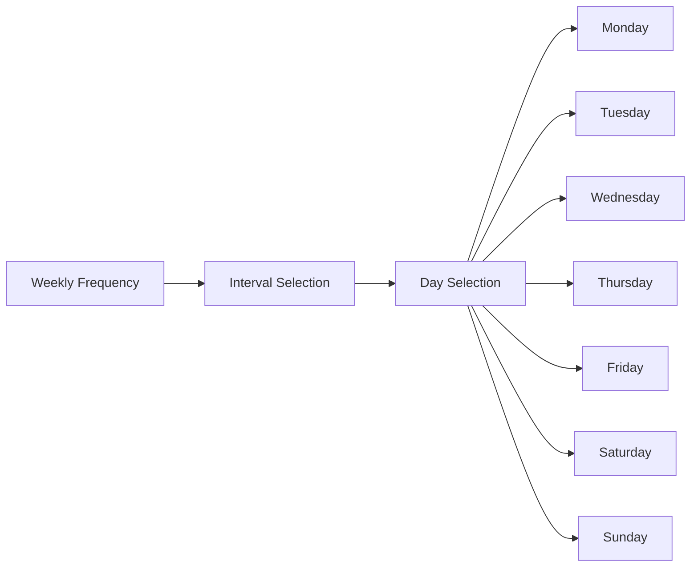
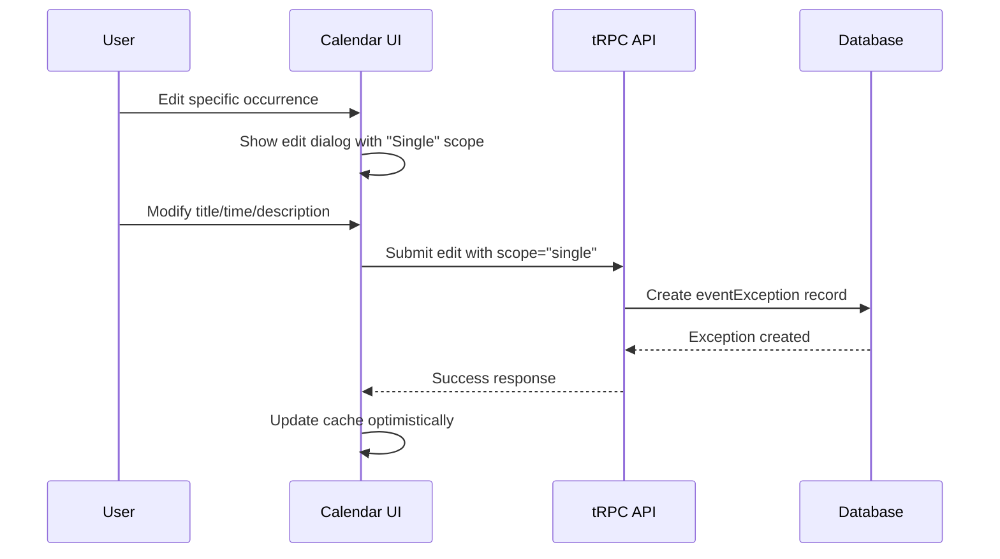
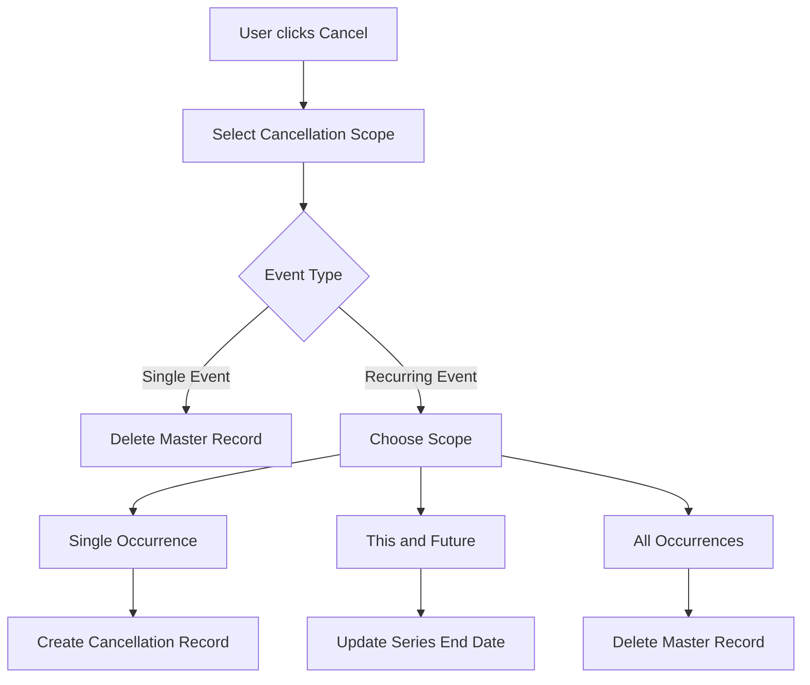

# Calendar SubApp - Features Documentation

<!-- AI-METADATA:
category: features
complexity: intermediate
updated: 2025-07-13
claude-ready: true
priority: high
token-optimized: true
audience: all
ai-context-weight: important
-->

<!-- AI-CONTEXT-BOUNDARY: start -->

> **Status**: ✅ Production Ready & Actively Maintained  
> **Last Updated**: July 2025  
> **Related Documents**: [Architecture](./architecture.md) | [API Reference](./api.md)

## 🔍 1. Overview

<!-- AI-COMPRESS: strategy="summary" max-tokens="150" -->
**Quick Summary**: Calendar SubApp features include RFC 5545 compliant recurring events, sophisticated exception handling, flexible event cancellation, critical event management, and seamless team-based collaboration with keyboard navigation and responsive design.
<!-- /AI-COMPRESS -->

The Calendar SubApp provides **enterprise-grade event management** with advanced features designed for team collaboration and complex scheduling scenarios. Built around industry standards with modern UX patterns.

## 🔄 2. Recurring Events

### RRule Compliance

The calendar implements **RFC 5545 compliant recurrence patterns** using the RRule library for maximum compatibility and flexibility.

#### Supported Frequencies

```typescript
// Frequency options with examples
const frequencies = {
  DAILY: "Every day",
  WEEKLY: "Every week", 
  MONTHLY: "Every month",
  YEARLY: "Every year"
};

// Example patterns
const examples = {
  "FREQ=DAILY": "Every day",
  "FREQ=DAILY;INTERVAL=2": "Every 2 days",
  "FREQ=WEEKLY;BYDAY=MO,WE,FR": "Every Monday, Wednesday, Friday",
  "FREQ=MONTHLY;BYMONTHDAY=15": "15th of every month",
  "FREQ=YEARLY;BYMONTH=12;BYMONTHDAY=25": "Every December 25th"
};
```

#### Recurrence Picker Component

The **RecurrencePicker** component provides an intuitive interface for creating complex patterns:

```typescript
interface RecurrencePattern {
  frequency: 'DAILY' | 'WEEKLY' | 'MONTHLY' | 'YEARLY';
  interval: number;              // Every N frequency units
  byweekday?: string[];         // Days of week for WEEKLY
  until?: Date;                 // End date for series
  count?: number;               // Number of occurrences
}

// Usage example
<RecurrencePicker
  value={recurrencePattern}
  onChange={setRecurrencePattern}
  startDate={eventStartDate}
/>
```

#### Weekly Pattern Configuration

For weekly events, users can select specific days:



**UI Example**:
```typescript
// Weekly recurrence with day selection
function WeeklyDaySelector({ 
  selectedDays, 
  onDaysChange 
}: {
  selectedDays: string[];
  onDaysChange: (days: string[]) => void;
}) {
  const weekdays = [
    { key: 'MO', label: 'Mon' },
    { key: 'TU', label: 'Tue' },
    { key: 'WE', label: 'Wed' },
    { key: 'TH', label: 'Thu' },
    { key: 'FR', label: 'Fri' },
    { key: 'SA', label: 'Sat' },
    { key: 'SU', label: 'Sun' }
  ];
  
  return (
    <div className="flex gap-1">
      {weekdays.map(day => (
        <Toggle
          key={day.key}
          pressed={selectedDays.includes(day.key)}
          onPressedChange={(pressed) => {
            if (pressed) {
              onDaysChange([...selectedDays, day.key]);
            } else {
              onDaysChange(selectedDays.filter(d => d !== day.key));
            }
          }}
        >
          {day.label}
        </Toggle>
      ))}
    </div>
  );
}
```

#### End Conditions

Recurring events can end in multiple ways:

1. **No End Date**: Continues indefinitely
2. **End Date**: Series ends on specific date
3. **Occurrence Count**: Ends after N occurrences

```typescript
// End condition configuration
interface EndCondition {
  type: 'never' | 'until' | 'count';
  until?: Date;
  count?: number;
}

// RRule generation with end conditions
function generateRRule(pattern: RecurrencePattern): string {
  const parts = [`FREQ=${pattern.frequency}`];
  
  if (pattern.interval > 1) {
    parts.push(`INTERVAL=${pattern.interval}`);
  }
  
  if (pattern.until) {
    parts.push(`UNTIL=${formatDateForRRule(pattern.until)}`);
  } else if (pattern.count) {
    parts.push(`COUNT=${pattern.count}`);
  }
  
  return parts.join(';');
}
```

## ⚠️ 3. Exception Handling

### Individual Occurrence Modification

The calendar allows **modifying individual occurrences** of recurring events without breaking the entire series. This creates an "exception" record that overrides the master pattern for specific dates.

#### Exception Creation Workflow



#### Exception Data Structure

```typescript
interface EventException {
  id: string;
  eventMasterId: string;    // Reference to original recurring event
  originalDate: Date;       // Date being modified
  newDate: Date;           // New date/time for this occurrence
  title?: string;          // New title (if changed)
  description?: string;    // New description (if changed)
  type?: 'NORMAL' | 'CRITICAL'; // New type (if changed)
}

// Example: Moving a weekly meeting from Monday to Tuesday
const exception: EventException = {
  id: "exc_123",
  eventMasterId: "evt_456", 
  originalDate: new Date("2025-07-14T09:00:00"), // Monday 9 AM
  newDate: new Date("2025-07-15T10:00:00"),      // Tuesday 10 AM
  title: "Team Meeting (Rescheduled)"             // Optional title change
};
```

#### Exception Resolution

When displaying events, the system **merges exceptions with master patterns**:

```typescript
function resolveEventOccurrences(
  master: EventMaster,
  exceptions: EventException[],
  dateRange: { start: Date; end: Date }
): CalendarEvent[] {
  // 1. Generate all occurrences from RRule
  const allOccurrences = generateOccurrencesFromRule(master, dateRange);
  
  // 2. Apply exceptions
  return allOccurrences.map(occurrence => {
    const exception = exceptions.find(exc => 
      exc.originalDate.getTime() === occurrence.dateStart.getTime()
    );
    
    if (exception) {
      // Override with exception data
      return {
        ...occurrence,
        dateStart: exception.newDate,
        title: exception.title ?? occurrence.title,
        description: exception.description ?? occurrence.description,
        type: exception.type ?? occurrence.type,
        isException: true,
        exceptionId: exception.id
      };
    }
    
    return occurrence;
  });
}
```

### Exception Edit Scopes

When editing recurring events, users can choose the scope of changes:

#### Single Occurrence
- **Scope**: `single`
- **Action**: Create exception record
- **Effect**: Only selected occurrence is modified
- **Use Case**: Reschedule one meeting in a series

#### This and Future Occurrences
- **Scope**: `thisAndFuture`
- **Action**: Split the series at selected date
- **Effect**: Creates new master for future occurrences
- **Use Case**: Change meeting time from specific date forward

#### All Occurrences
- **Scope**: `all`
- **Action**: Update master event
- **Effect**: All occurrences reflect changes
- **Use Case**: Change meeting title for entire series

```typescript
// Edit scope selection UI
function EditScopeSelector({ 
  onScopeChange, 
  isRecurring 
}: {
  onScopeChange: (scope: EditScope) => void;
  isRecurring: boolean;
}) {
  if (!isRecurring) {
    return null; // No scope selection for single events
  }
  
  return (
    <RadioGroup onValueChange={onScopeChange}>
      <RadioGroupItem value="single">
        <span>This occurrence only</span>
        <span className="text-muted-foreground text-sm">
          Create exception for this date
        </span>
      </RadioGroupItem>
      
      <RadioGroupItem value="thisAndFuture">
        <span>This and future occurrences</span>
        <span className="text-muted-foreground text-sm">
          Split series at this date
        </span>
      </RadioGroupItem>
      
      <RadioGroupItem value="all">
        <span>All occurrences</span>
        <span className="text-muted-foreground text-sm">
          Update the entire series
        </span>
      </RadioGroupItem>
    </RadioGroup>
  );
}
```

## 🚫 4. Event Cancellation

### Flexible Cancellation Scopes

The calendar provides **flexible cancellation options** for both single events and recurring series with multiple scope options.

#### Cancellation Workflow



#### Cancellation Scopes

**Single Occurrence**:
```typescript
// Cancel only selected occurrence
async function cancelSingleOccurrence(
  eventId: string, 
  originalDate: Date
): Promise<void> {
  await db.insert(eventCancellations).values({
    id: nanoid(),
    eventMasterId: eventId,
    originalDate: originalDate
  });
}
```

**This and Future Occurrences**:
```typescript
// End series at selected date
async function cancelThisAndFuture(
  eventId: string,
  cutoffDate: Date
): Promise<void> {
  const dayBefore = subDays(cutoffDate, 1);
  
  await db.update(eventMasters)
    .set({ dateUntil: dayBefore })
    .where(eq(eventMasters.id, eventId));
}
```

**All Occurrences**:
```typescript
// Delete entire series
async function cancelAllOccurrences(eventId: string): Promise<void> {
  // Delete master (cascades to exceptions and cancellations)
  await db.delete(eventMasters)
    .where(eq(eventMasters.id, eventId));
}
```

#### Cancellation UI Component

```typescript
function CancelEventDialog({ 
  event, 
  open, 
  onOpenChange 
}: {
  event: CalendarEvent;
  open: boolean;
  onOpenChange: (open: boolean) => void;
}) {
  const [scope, setScope] = useState<CancelScope>('single');
  const cancelMutation = api.app.calendar.cancel.useMutation();
  
  const handleCancel = () => {
    cancelMutation.mutate({
      id: event.id,
      originalDate: event.isRecurrence ? event.originalDate : event.dateStart,
      scope
    });
  };
  
  return (
    <AlertDialog open={open} onOpenChange={onOpenChange}>
      <AlertDialogContent>
        <AlertDialogHeader>
          <AlertDialogTitle>Cancel Event</AlertDialogTitle>
          <AlertDialogDescription>
            Are you sure you want to cancel "{event.title}"?
          </AlertDialogDescription>
        </AlertDialogHeader>
        
        {event.isRecurrence && (
          <CancelScopeSelector 
            scope={scope} 
            onScopeChange={setScope} 
          />
        )}
        
        <AlertDialogFooter>
          <AlertDialogCancel>Cancel</AlertDialogCancel>
          <AlertDialogAction 
            onClick={handleCancel}
            disabled={cancelMutation.isPending}
          >
            {cancelMutation.isPending ? 'Cancelling...' : 'Confirm'}
          </AlertDialogAction>
        </AlertDialogFooter>
      </AlertDialogContent>
    </AlertDialog>
  );
}
```

### Cancellation Resolution

Cancelled occurrences are **filtered out** during event resolution:

```typescript
function filterCancelledOccurrences(
  occurrences: CalendarEvent[],
  cancellations: EventCancellation[]
): CalendarEvent[] {
  return occurrences.filter(occurrence => {
    return !cancellations.some(cancellation =>
      cancellation.eventMasterId === occurrence.id &&
      cancellation.originalDate.getTime() === occurrence.originalDate?.getTime()
    );
  });
}
```

## 🎯 5. Critical Events

### Priority Management

Events can be flagged as **CRITICAL** for priority management and visual distinction in the interface.

#### Critical Event Features

```typescript
interface EventType {
  NORMAL: 'NORMAL';
  CRITICAL: 'CRITICAL';
}

// Critical event creation
const criticalEvent = {
  title: "Emergency System Maintenance",
  description: "Critical system update - all hands required",
  dateStart: new Date("2025-07-15T02:00:00"),
  type: "CRITICAL" as const,
  rule: null // Single critical event
};
```

#### Visual Indicators

Critical events are **visually distinguished** in the interface:

```typescript
function EventTypeIndicator({ type }: { type: 'NORMAL' | 'CRITICAL' }) {
  if (type === 'CRITICAL') {
    return (
      <div className="flex items-center gap-1 text-orange-600">
        <AlertTriangle className="h-4 w-4" />
        <span className="text-xs font-medium">CRITICAL</span>
      </div>
    );
  }
  
  return null;
}

// Table cell rendering with type indicator
function EventTitleCell({ event }: { event: CalendarEvent }) {
  return (
    <div className="flex items-center gap-2">
      {event.type === 'CRITICAL' && (
        <AlertTriangle className="h-4 w-4 text-orange-500" />
      )}
      <span className={cn(
        "font-medium",
        event.type === 'CRITICAL' && "text-orange-900"
      )}>
        {event.title}
      </span>
    </div>
  );
}
```

#### Critical Event Workflows

**Emergency Scheduling**:
- Quick creation with minimal form fields
- Default to CRITICAL type for urgent events
- Immediate notification to team members

**Priority Filtering**:
```typescript
// Filter to show only critical events
function useCriticalEventsOnly(events: CalendarEvent[]) {
  return useMemo(() => 
    events.filter(event => event.type === 'CRITICAL'),
    [events]
  );
}
```

## 📅 6. Date Navigation

### Keyboard Shortcuts

The calendar provides **efficient keyboard navigation** for power users:

```typescript
// Keyboard shortcut implementation
useEffect(() => {
  const handleKeyDown = (e: KeyboardEvent) => {
    // Ignore if user is typing in input fields
    if (e.target instanceof HTMLInputElement || e.target instanceof HTMLTextAreaElement) {
      return;
    }
    
    switch (e.key) {
      case 'ArrowLeft':
        e.preventDefault();
        setSelectedDate(date => subDays(date, 1));
        break;
        
      case 'ArrowRight':
        e.preventDefault();
        setSelectedDate(date => addDays(date, 1));
        break;
        
      case 't': // Today
        e.preventDefault();
        setSelectedDate(new Date());
        break;
        
      case 'n': // New event
        e.preventDefault();
        setShowCreateDialog(true);
        break;
    }
  };
  
  window.addEventListener('keydown', handleKeyDown);
  return () => window.removeEventListener('keydown', handleKeyDown);
}, []);
```

### Navigation Controls

#### Date Picker Integration

```typescript
function DateNavigationControls({
  selectedDate,
  onDateChange
}: {
  selectedDate: Date;
  onDateChange: (date: Date) => void;
}) {
  return (
    <div className="flex items-center gap-2">
      <Button
        variant="outline"
        size="sm"
        onClick={() => onDateChange(subDays(selectedDate, 1))}
      >
        <ChevronLeft className="h-4 w-4" />
      </Button>
      
      <Popover>
        <PopoverTrigger asChild>
          <Button variant="outline" className="min-w-[200px]">
            <CalendarIcon className="mr-2 h-4 w-4" />
            {format(selectedDate, 'PPP')}
          </Button>
        </PopoverTrigger>
        <PopoverContent className="w-auto p-0" align="start">
          <Calendar
            mode="single"
            selected={selectedDate}
            onSelect={(date) => date && onDateChange(date)}
            initialFocus
          />
        </PopoverContent>
      </Popover>
      
      <Button
        variant="outline"
        size="sm"
        onClick={() => onDateChange(addDays(selectedDate, 1))}
      >
        <ChevronRight className="h-4 w-4" />
      </Button>
      
      <Button
        variant="outline"
        size="sm"
        onClick={() => onDateChange(new Date())}
      >
        Today
      </Button>
    </div>
  );
}
```

#### Quick Date Selection

Pre-defined date shortcuts for common navigation patterns:

```typescript
const dateShortcuts = [
  { label: 'Today', date: () => new Date() },
  { label: 'Tomorrow', date: () => addDays(new Date(), 1) },
  { label: 'Next Monday', date: () => nextMonday(new Date()) },
  { label: 'Next Week', date: () => addWeeks(new Date(), 1) },
  { label: 'Next Month', date: () => addMonths(new Date(), 1) }
];

function QuickDateMenu({ onDateSelect }: { onDateSelect: (date: Date) => void }) {
  return (
    <DropdownMenu>
      <DropdownMenuTrigger asChild>
        <Button variant="outline" size="sm">
          Quick Select <ChevronDown className="ml-1 h-3 w-3" />
        </Button>
      </DropdownMenuTrigger>
      <DropdownMenuContent>
        {dateShortcuts.map(shortcut => (
          <DropdownMenuItem
            key={shortcut.label}
            onClick={() => onDateSelect(shortcut.date())}
          >
            {shortcut.label}
          </DropdownMenuItem>
        ))}
      </DropdownMenuContent>
    </DropdownMenu>
  );
}
```

## 🔗 7. Integration Features

### Kodix Care Integration

The calendar **seamlessly integrates** with Kodix Care to generate care tasks from calendar events:

```typescript
// Care task generation from calendar events
async function syncCalendarEventsToCareTasks(
  teamId: string,
  dateRange: { start: Date; end: Date }
): Promise<void> {
  // 1. Get calendar events for date range
  const calendarEvents = await getEventsForTeam(teamId, dateRange.start, dateRange.end);
  
  // 2. Filter events that should generate care tasks
  const careRelevantEvents = calendarEvents.filter(event => 
    event.type === 'CRITICAL' || 
    event.title.toLowerCase().includes('medication') ||
    event.title.toLowerCase().includes('treatment')
  );
  
  // 3. Create corresponding care tasks
  for (const event of careRelevantEvents) {
    await createCareTask({
      title: event.title,
      description: event.description || `Generated from calendar event: ${event.title}`,
      date: event.dateStart,
      type: event.type === 'CRITICAL' ? 'CRITICAL' : 'NORMAL',
      eventMasterId: event.id,
      teamId,
      createdFromCalendar: true
    });
  }
}
```

### Cross-SubApp Event Sharing

Calendar events are **accessible to other SubApps** through shared API patterns:

```typescript
// Shared calendar service for cross-SubApp access
export class SharedCalendarService {
  async getEventsForIntegration(
    teamId: string,
    filters: EventFilters
  ): Promise<CalendarEvent[]> {
    return await this.getEventsForTeam(teamId, filters.dateStart, filters.dateEnd)
      .then(events => events.filter(event => {
        if (filters.types) {
          return filters.types.includes(event.type);
        }
        return true;
      }));
  }
  
  async createEventFromExternal(
    data: ExternalEventData,
    source: string
  ): Promise<EventMaster> {
    return await this.createEvent({
      ...data,
      description: `${data.description}\n\nCreated from: ${source}`
    });
  }
}
```

## 📱 8. Responsive Design

### Mobile-First Interface

The calendar is designed with **mobile-first principles** while optimizing for desktop usage:

#### Responsive Data Table

```typescript
function ResponsiveEventTable({ events }: { events: CalendarEvent[] }) {
  return (
    <div className="w-full">
      {/* Desktop view */}
      <div className="hidden md:block">
        <DataTable
          columns={desktopColumns}
          data={events}
          className="min-w-full"
        />
      </div>
      
      {/* Mobile view */}
      <div className="md:hidden space-y-2">
        {events.map(event => (
          <MobileEventCard key={event.id} event={event} />
        ))}
      </div>
    </div>
  );
}

function MobileEventCard({ event }: { event: CalendarEvent }) {
  return (
    <Card className="p-4">
      <div className="flex items-start justify-between">
        <div className="flex-1 min-w-0">
          <div className="flex items-center gap-2">
            {event.type === 'CRITICAL' && (
              <AlertTriangle className="h-4 w-4 text-orange-500 flex-shrink-0" />
            )}
            <h3 className="font-medium truncate">{event.title}</h3>
          </div>
          
          <p className="text-sm text-muted-foreground mt-1">
            {format(event.dateStart, 'h:mm a')}
          </p>
          
          {event.description && (
            <p className="text-sm text-muted-foreground mt-2 line-clamp-2">
              {event.description}
            </p>
          )}
        </div>
        
        <DropdownMenu>
          <DropdownMenuTrigger asChild>
            <Button variant="ghost" size="sm">
              <MoreHorizontal className="h-4 w-4" />
            </Button>
          </DropdownMenuTrigger>
          <DropdownMenuContent align="end">
            <DropdownMenuItem>Edit</DropdownMenuItem>
            <DropdownMenuItem className="text-red-600">Cancel</DropdownMenuItem>
          </DropdownMenuContent>
        </DropdownMenu>
      </div>
    </Card>
  );
}
```

#### Touch-Friendly Interactions

```css
/* Touch-friendly button sizing */
.calendar-button {
  @apply min-h-[44px] min-w-[44px]; /* iOS recommended minimum */
}

/* Improved touch targets for mobile */
.mobile-event-row {
  @apply p-4 min-h-[60px]; /* Adequate spacing for finger taps */
}

/* Gesture support */
.swipe-enabled {
  touch-action: pan-y; /* Allow vertical scrolling, enable horizontal swipes */
}
```

## 🔍 9. Search and Filtering

### Event Search Capabilities

While the current implementation focuses on date-based navigation, the architecture supports advanced search capabilities:

```typescript
// Future search implementation
interface EventSearchFilters {
  query?: string;           // Text search in title/description
  type?: EventType[];       // Filter by event type
  dateRange?: {             // Date range filter
    start: Date;
    end: Date;
  };
  recurring?: boolean;      // Show only recurring events
  hasExceptions?: boolean;  // Events with modifications
}

function EventSearchBar({ 
  onFiltersChange 
}: { 
  onFiltersChange: (filters: EventSearchFilters) => void; 
}) {
  const [query, setQuery] = useState('');
  const [filters, setFilters] = useState<EventSearchFilters>({});
  
  return (
    <div className="flex gap-2">
      <div className="relative flex-1">
        <Search className="absolute left-2 top-2.5 h-4 w-4 text-muted-foreground" />
        <Input
          placeholder="Search events..."
          value={query}
          onChange={(e) => setQuery(e.target.value)}
          className="pl-8"
        />
      </div>
      
      <DropdownMenu>
        <DropdownMenuTrigger asChild>
          <Button variant="outline">
            <Filter className="h-4 w-4 mr-2" />
            Filters
          </Button>
        </DropdownMenuTrigger>
        <DropdownMenuContent>
          <DropdownMenuCheckboxItem
            checked={filters.recurring}
            onCheckedChange={(checked) => 
              setFilters(prev => ({ ...prev, recurring: checked }))
            }
          >
            Recurring Events Only
          </DropdownMenuCheckboxItem>
          
          <DropdownMenuCheckboxItem
            checked={filters.type?.includes('CRITICAL')}
            onCheckedChange={(checked) => {
              const types = filters.type || [];
              setFilters(prev => ({
                ...prev,
                type: checked 
                  ? [...types, 'CRITICAL']
                  : types.filter(t => t !== 'CRITICAL')
              }));
            }}
          >
            Critical Events Only
          </DropdownMenuCheckboxItem>
        </DropdownMenuContent>
      </DropdownMenu>
    </div>
  );
}
```

<!-- AI-CONTEXT-BOUNDARY: end -->

---

**Feature Compliance**: RFC 5545 (RRule Standard)  
**UI Framework**: React with shadcn/ui components  
**Last Updated**: 2025-07-13